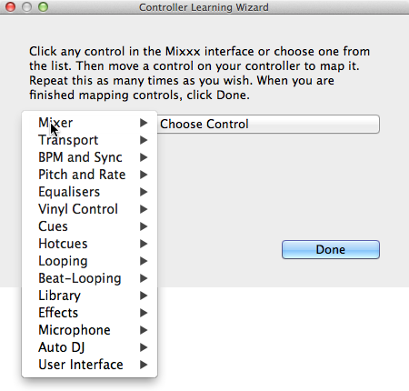
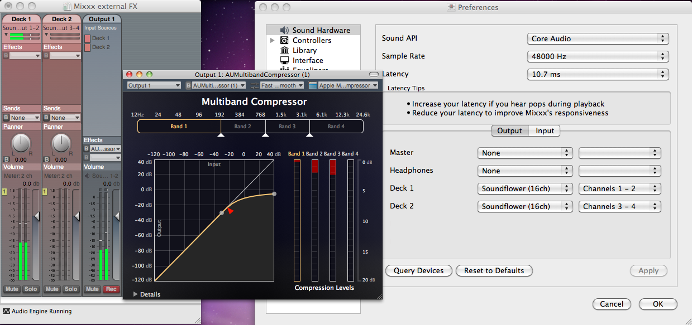

.. include:: /shortcuts.rstext

Advanced Topics
***************

.. _advanced-controller:

Adding support for your MIDI/HID Controller
===========================================

With several dozens of DJ controllers supported out-of-the-box, Mixxx gives you
comprehensive hardware control for your DJ mixes, see :ref:`control-midi`.

Support for additional devices can be added to Mixxx by creating a new preset
file. This file tells Mixxx how to translate, or map, :term:`MIDI`/:term:`HID`
messages from a controller into commands that Mixxx understands.

You can download and share custom controller presets in the
`Mixxx User customizations forums <https://mixxx.org/forums/viewforum.php?f=6>`_.

.. _advanced-controller-wizard:

Controller Wizard
-----------------

   Mixxx Controller Wizard -  Mapping a control

By far, the easiest way to create a new MIDI preset is by using the Controller
Wizard.

#. Connect your controller(s) to your computer
#. Start Mixxx
#. Go to :menuselection:`Preferences --> Controllers`
#. Select your device from the list of available devices on the left, and the
   right pane will change
#. Activate the :guilabel:`Enabled` checkbox
#. Click on :guilabel:`Learning Wizard` to open the selection dialog
#. Click any control in the Mixxx :term:`GUI`
#. Alternatively, click the :guilabel:`Choose Control` button and choose one
   from the selection list
#. Push :guilabel:`Learn` and then move a control or push a button on your
   controller to map it.  You can also move a control without pushing the
   :guilabel:`Learn` button if you are learning many controls.
#. If you are learning a button, just push it once.  If you are learning a knob
   or a slider, try to move it throughout its range.
#. After Mixxx detects the control, you may click :guilabel:`Learn Another` or
   you can click on another button in the Mixxx :term:`GUI` to learn another
   control.
#. When you are finished mapping controls, click :guilabel:`Done`

There are also some advanced options in the Midi Wizard you may need to use:

* Soft Takeover: Use this option for knobs or sliders to avoid sudden jumps in
  when the knob in the :term:`GUI` doesn't match the physical knob. If you
  select this option, you won't be able to perform super-fast motions as easily.
  (Recommended off)
* Invert: Use this option for controls that you want to work backwards from how
  they were detected.
* Switch Mode: Use this option on controllers that have controls that act like
  switches and emit one value on the first press, and a different value on the
  next press. (Think an actual hardware toggle switch, or a button that lights
  up on the first press and turns off on the second press).
* Jog Wheel / Select Knob:  Use this for knobs that don't have a beginning or an
  end, but spin continuously.

The Controller wizard saves the new preset to the following file paths:

* Linux: :file:`/home/<username>/.mixxx/controllers`
* macOS: :file:`/Users/<username>/Library/Application\\ Support/Mixxx/controllers`
* Windows: :file:`%LOCALAPPDATA%\\Mixxx\\controllers`

You can then modify the XML file it creates (or any of the ones that
ship with Mixxx) if you'd like to fine-tune it or add more presets. For more
information, go to
`<https://mixxx.org/wiki/doku.php/midi_controller_mapping_file_format>`_.

The Controller Wizard works only for :term:`MIDI` devices. Currently you can't
map modifier (shift) keys and platter rotations. Use :ref:`MIDI Scripting
<advanced-controller-midiscript>` instead.

.. _advanced-controller-midiscript:

MIDI Scripting
--------------

In order to support the advanced features of many :term:`MIDI`/:term:`HID`
controllers, Mixxx offers what we call MIDI Scripting.

It enables MIDI controls to be mapped to `QtScript
<https://en.wikipedia.org/wiki/QtScript>`_ (aka Javascript/EMCAScript) functions
stored in function library files, freeing Mixxx from a one-to-one MIDI mapping
ideology. These user-created functions can then do anything desired with the
MIDI event such as have a single controller button simultaneously affect
two or more Mixxx properties (“controls”), adjust incoming control values to
work better with Mixxx (scratching), display a complex LED sequence, or even
send messages to text displays on the controller.

For more information, go to `<https://mixxx.org/wiki/doku.php/midi_scripting>`_
and `<https://mixxx.org/wiki/doku.php/hid_mapping_format>`_.

Mixxx Controls
--------------

Nearly every knob, button, or fader you see in Mixxx's interface is
controllable via Mixxx's "control" system. The control system allows
skins, :term:`MIDI` controllers, :term:`HID` controllers and keyboards
to control Mixxx via a single interface.

A control is identified by a "group" (which is used for grouping
associated controls) and a "key" (the name of the individual control).

For example, the volume fader for Deck 1 is identified by the group
:mixxx:cogroupref:`[Channel1] <[ChannelN]>` and key :mixxx:coref:`volume <[Channel1],volume>`.
Similarly, the volume fader for Sampler 1 is identified by the group
:mixxx:cogroupref:`[Sampler1] <[SamplerN]>` and key :mixxx:coref:`volume <[Sampler1],volume>`.

The group is used to collect all the controls that affect one component
of Mixxx into one collection. Some groups have a high overlap of
controls in common (e.g. samplers, decks, and the preview deck all share
the same control keys).

In addition to controlling Mixxx, the control system can be used to
inspect Mixxx's state. For example, the sample rate of the track loaded
in Deck 1 can be accessed via the :mixxx:coref:`[Channel1],track_samplerate`
control. You can read the :mixxx:coref:`[Channel3],play` control to determine
whether Deck 3 is playing.

The default value range is 0.0 to 1.0, unless otherwise noted. Binary means
that it is either 'ON' (non-zero) or 'OFF' (zero).

.. hint:: Discovering Controls used in Skins

   You can view the control connected to any part of a skin by running
   Mixxx with the ``--developer`` command line option and hovering your mouse
   cursor over part of the skin. If no tooltip appears, enable tooltips for
   the Library and Skin in :menuselection:`Options --> Preferences --> Interface`.

.. hint:: Changing any control from the GUI in Developer Mode

   When running Mixxx in Developer Mode (with the ``--developer`` command
   line option), you can view and manually set the state of any control in
   Mixxx by going to :menuselection:`Developer --> Developer Tools`.

.. seealso:: See :ref:`controlindex` for a full list.

ControlPotMeter controls
~~~~~~~~~~~~~~~~~~~~~~~~

The following extensions add some features to ``ControlPotMeter`` controls
(volume, crossfader, ...). Use in conjunction with ``[ChannelN]``,
``[SamplerN]``, ``[Master]``, ... groups.

================== ============================================================
Control Suffix     Description
================== ============================================================
``_up``            Increases the value, e.g. :mixxx:coref:`[ChannelN],rate_perm_up` sets the speed one step higher (4 % default)
``_down``          Decreases the value, sets the speed one step lower (4 % default)
``_up_small``      Increases the value by smaller step, sets the speed one small step higher (1 % default)
``_down_small``    Decreases the value by smaller step, sets the speed one small step lower (1 % default)
``_set_one``       Sets the value to 1.0, sets the channel volume to full
``_set_minus_one`` Sets the value to -1.0, sets the channel volume to zero
``_set_default``   Sets the control to its default, return to default waveform zoom level
``_set_zero``      Sets the value to 0.0, put the crossfader in the middle again
``_toggle``        Sets the value to 0.0 if the value was > 0.0, and to 1.0 if the value was 0.0, will cut off/on a track while you're playing
``_minus_toggle``  Sets the value to -1.0 if the value was > -1.0, and to 1.0 if the value was -1.0, can tilt the crossfader from left to right
================== ============================================================

These controls can be used in JavaScript files like this:

.. code-block:: javascript

   // This won't work:
   engine.setValue(group, "pitch_up_small", 1.0);

   // Use this instead:
   script.triggerControl(group, "pitch_up_small", 50);

To use ``*_toggle`` the respective shortcut for scripts is:

.. code-block:: javascript

   script.toggleControl(group, "keylock_toggle", 100);

The ``[Master]`` group
~~~~~~~~~~~~~~~~~~~~~~

The :mixxx:cogroupref:`[Master]` group generally corresponds to controls that affect the mixing engine.
This will bear some similarity to what you will find on a DJ mixer (e.g. crossfader controls, headphone cueing controls, etc.).

.. mixxx:control:: [Master],audio_latency_usage

   Reflects fraction of latency, given by the audio buffer size, spend for audio processing inside Mixxx. At value near 25 % there is a high risk of buffer underflows

   :range: 0 .. 25 %
   :feedback: latency meter

   .. versionadded:: v2.0.0

.. mixxx:control:: [Master],audio_latency_overload

   Indicates a buffer under or over-flow. Resets after 500 ms

   :range: binary
   :feedback: Overload indicator

   .. versionadded:: v2.0.0

.. mixxx:control:: [Master],audio_latency_overload_count

   Counts buffer over and under-flows. Max one per 500 ms

   :range: 0 .. n
   :feedback: Counter in hardware preferences

   .. versionadded:: v2.0.0

.. mixxx:control:: [Master],balance

   Adjusts the left/right channel balance on the Master output

   :range: -1.0..1.0
   :feedback: Center Balance knob

.. mixxx:control:: [Master],booth_enabled

   Indicates whether a Booth output is configured in the Sound Hardware Preferences

   :range: binary
   :feedback: Booth gain knob shown or hidden

   .. versionadded:: v2.1.0

.. mixxx:control:: [Master],booth_gain

   Adjusts the gain of the Booth output

   :range: 0.0...1.0...5.0
   :feedback: Booth gain knob

   .. versionadded:: v2.1.0

.. mixxx:control:: [Master],crossfader

   Adjusts the crossfader between players/decks (-1.0 is all the way left, Deck 1)

   :range: -1.0..1.0
   :feedback: Crossfader slider

.. mixxx:control:: [Master],crossfader_down

   Moves the crossfader left by 1/10th

   :range: binary
   :feedback: Crossfader slider

.. mixxx:control:: [Master],crossfader_down_small

   Moves the crossfader left by 1/100th

   :range: binary
   :feedback: Crossfader slider

   .. versionadded:: v1.10.0

.. mixxx:control:: [Master],crossfader_up

   Moves the crossfader right by 1/10th

   :range: binary
   :feedback: Crossfader slider

.. mixxx:control:: [Master],crossfader_up_small

   Moves the crossfader right by 1/100th

   :range: binary
   :feedback: Crossfader slider

   .. versionadded:: v1.10.0

.. mixxx:control:: [Master],duckStrength

   Microphone ducking strength

   :range: 0.0..1.0
   :feedback: Strength knob

   .. versionadded:: v2.0.0

.. mixxx:control:: [Master],enabled

   Indicator that the master mix is processed

   :range: binary
   :feedback: N/A

   .. versionadded:: v2.0.0

.. mixxx:control:: [Master],gain

   Adjusts the gain for the master output as well as recording and broadcasting signal

   :range: 0.0..1.0..5.0
   :feedback: Master volume knob

   .. versionadded:: v2.0.0

.. mixxx:control:: [Master],headEnabled

   Indicator that the headphone mix is processed

   :range: binary
   :feedback: N/A

   .. versionadded:: v2.0.0

.. mixxx:control:: [Master],headGain

   Adjusts the headphone output gain

   :range: 0.0..1.0..5.0
   :feedback: Headphone volume knob

   .. versionadded:: v2.0.0

.. mixxx:control:: [Master],headMix

   Adjusts the cue/main mix in the headphone output

   :range: default
   :feedback: Pre/Main knob

.. mixxx:control:: [Master],headSplit

   Splits headphone cueing into right = master mono and left = pfl mono.

   :range: binary
   :feedback: Split Cue button

   .. versionadded:: v2.0.0

.. mixxx:control:: [Master],latency

   Latency setting (sound buffer size) in milliseconds (default 64)

   :range: >=0 (absolute value)
   :feedback: Latency slider in the prefs

.. mixxx:control:: [Master],maximize_library

   Toggle maximized view of library

   :range: binary
   :feedback: Toggle maximized view of library

   .. versionadded:: v2.0.0

.. mixxx:control:: [Master],num_decks

   The number of decks currently enabled.

   :range: integer
   :feedback: N/A

   .. versionadded:: v1.9.0

.. mixxx:control:: [Master],num_effectsavailable

   The number of available effects that can be selected in an effect slot.

   :range: integer, read-only
   :feedback: N/A

   .. versionadded:: v2.1.0

.. mixxx:control:: [Master],num_samplers

   The number of samplers currently enabled.

   :range: integer
   :feedback: N/A

   .. versionadded:: v1.9.0

.. mixxx:control:: [Master],num_preview_decks

   The number of preview decks currently enabled.

   :range: integer
   :feedback: N/A

   .. versionadded:: v1.11.0

.. mixxx:control:: [Master],PeakIndicator

   Indicates when the signal is clipping (too loud for the hardware and is being distorted) (composite)

   :range: binary
   :feedback: Clip light (mono)

.. mixxx:control:: [Master],PeakIndicatorL

   Indicates when the signal is clipping (too loud for the hardware and is being distorted) for the left channel

   :range: binary
   :feedback: Clip light (left)

.. mixxx:control:: [Master],PeakIndicatorR

   Indicates when the signal is clipping (too loud for the hardware and is being distorted) for the right channel

   :range: binary
   :feedback: Clip light (right)

.. mixxx:control:: [Master],samplerate

   The current output sample rate in Hz (default 44100)

   :range: absolute value
   :feedback: (none)

.. mixxx:control:: [Master],talkoverDucking

   Toggle microphone ducking mode (OFF, AUTO, MANUAL)

   :range: FIXME
   :feedback: Ducking mode button

   .. versionadded:: v2.0.0

.. mixxx:control:: [Master],VuMeter

   Outputs the current instantaneous master volume (composite)

   :range: default
   :feedback: Master meter (mono)

.. mixxx:control:: [Master],VuMeterL

   Outputs the current instantaneous master volume for the left channel

   :range: default
   :feedback: Master meter L

.. mixxx:control:: [Master],VuMeterR

   Outputs the current instantaneous master volume for the right channel

   :range: default
   :feedback: Master meter R

.. mixxx:control:: [Master],headVolume
    :range: 0.0..1.0..5.0
    :feedback: Headphone Gain knob

    Adjust headphone volume.

    .. deprecated:: 2.0.0
       Use :mixxx:coref:`[Master],headGain` instead.

.. mixxx:control:: [Master],volume
    :range: 0.0..1.0..5.0
    :feedback: Master Gain knob

    Adjust master volume.

    .. deprecated:: 2.0.0
       Use :mixxx:coref:`[Master],gain` instead.

.. _advanced-mixxxcontrols-decks:

Decks, Preview Decks and Samplers
~~~~~~~~~~~~~~~~~~~~~~~~~~~~~~~~~

Each deck in Mixxx corresponds to a :mixxx:cogroupref:`[ChannelN]` group.
Whenever you see :mixxx:cogroupref:`[ChannelN]`, think "Deck N".
N can range from 1 to the number of active decks in Mixxx.

Preview decks and Sample decks ("samplers") in Mixxx are identical to regular decks, they simply have a different purpose (previewing tracks or playing samples, respectively).
Any control listed above for :mixxx:cogroupref:`[ChannelN]` will work for a samplers and preview decks, just replace :mixxx:cogroupref:`[ChannelN]` with :mixxx:cogroupref:`[PreviewDeckN]` or :mixxx:cogroupref:`[SamplerN]`.

.. seealso:: There are some :ref:`additional global controls for samplers <advanced-mixxxcontrols-samplers>`.

.. mixxx:control:: [ChannelN],back
                   [PreviewDeckN],back
                   [SamplerN],back

   Fast rewind (REW)

   :range: binary
   :feedback: < button

.. mixxx:control:: [ChannelN],beat_active
                   [PreviewDeckN],beat_active
                   [SamplerN],beat_active

   Indicates whether the player is currently positioned within 50 milliseconds of a beat or not.

   :range: binary
   :feedback: N/A

   .. versionadded:: v1.10.0

.. mixxx:control:: [ChannelN],beatjump
                   [PreviewDeckN],beatjump
                   [SamplerN],beatjump

   Jump forward by X beats (positive) or backward by X beats (negative). If a loop is active, the loop is moved by X beats.

   :range: real number
   :feedback: Player jumps forward or backward by X beats.

   .. versionadded:: v2.0.0

.. mixxx:control:: [ChannelN],beatjump_size
                   [PreviewDeckN],beatjump_size
                   [SamplerN],beatjump_size

   Set the number of beats to jump with beatjump\_forward/backward.

   :range: positive real number
   :feedback: Beatjump size spinbox

   .. versionadded:: v2.1.0

.. mixxx:control:: [ChannelN],beatjump_forward
                   [PreviewDeckN],beatjump_forward
                   [SamplerN],beatjump_forward

   Jump forward by beatjump\_size. If a loop is active, the loop is moved forward by X beats.

   :range: binary
   :feedback: Player jumps forward by beatjump\_size.

   .. versionadded:: v2.1.0

.. mixxx:control:: [ChannelN],beatjump_backward
                   [PreviewDeckN],beatjump_backward
                   [SamplerN],beatjump_backward

   Jump backward by beatjump\_size. If a loop is active, the loop is moved backward by X beats.

   :range: binary
   :feedback: Player jumps backward by beatjump\_size.

   .. versionadded:: v2.1.0

.. mixxx:control:: [ChannelN],beatjump_X_forward
                   [PreviewDeckN],beatjump_X_forward
                   [SamplerN],beatjump_X_forward

   Jump forward by X beats. A control exists for X = 0.03125, 0.0625, 0.125, 0.25, 0.5, 1, 2, 4, 8, 16, 32, 64. If a loop is active, the loop is moved forward by X betas.

   :range: binary
   :feedback: Player jumps forward by X beats.

   .. versionadded:: v2.0.0

.. mixxx:control:: [ChannelN],beatjump_X_backward
                   [PreviewDeckN],beatjump_X_backward
                   [SamplerN],beatjump_X_backward

   Jump backward by X beats. A control exists for X = 0.03125, 0.0625, 0.125, 0.25, 0.5, 1, 2, 4, 8, 16, 32, 64. If a loop is active, the loop is moved backward by X beats.

   :range: binary
   :feedback: Player jumps backward by X beats.

   .. versionadded:: v2.0.0

.. mixxx:control:: [ChannelN],beatloop_activate
                   [PreviewDeckN],beatloop_activate
                   [SamplerN],beatloop_activate

   Set a loop that is beatloop\_size beats long and enables the loop

   :range: binary
   :feedback: A loop is shown over beatloop\_size beats

   .. versionadded:: v2.1.0

.. mixxx:control:: [ChannelN],beatloop_X_activate
                   [PreviewDeckN],beatloop_X_activate
                   [SamplerN],beatloop_X_activate

   Activates a loop over X beats. A control exists for X = 0.03125, 0.0625, 0.125, 0.25, 0.5, 1, 2, 4, 8, 16, 32, 64

   :range: binary
   :feedback: A loop is shown over X beats.

   .. versionadded:: v1.10.0

.. mixxx:control:: [ChannelN],beatloop_size
                   [PreviewDeckN],beatloop_size
                   [SamplerN],beatloop_size

   Set the length of the loop in beats that will get set with beatloop\_activate and beatlooproll\_activate. Changing this will resize an existing loop if the length of the loop matches beatloop\_size.

   :range: positive real number
   :feedback: Beatloop size spinbox and possibly loop section on waveform

   .. versionadded:: v2.1.0

.. mixxx:control:: [ChannelN],beatloop_X_toggle
                   [PreviewDeckN],beatloop_X_toggle
                   [SamplerN],beatloop_X_toggle

   Toggles a loop over X beats. A control exists for X = 0.03125, 0.0625, 0.125, 0.25, 0.5, 1, 2, 4, 8, 16, 32, 64

   :range: binary
   :feedback: A loop is shown over X beats.

   .. versionadded:: v1.10.0

.. mixxx:control:: [ChannelN],beatloop_X_enabled
                   [PreviewDeckN],beatloop_X_enabled
                   [SamplerN],beatloop_X_enabled

   1 if beatloop X is enabled, 0 if not.

   :range: binary
   :feedback: Beatloop X button in skin is lit.

   .. versionadded:: v1.10.0

.. mixxx:control:: [ChannelN],beatlooproll_activate
                   [PreviewDeckN],beatlooproll_activate
                   [SamplerN],beatlooproll_activate

   Activates a rolling loop over beatloop\_size beats. Once disabled, playback will resume where the track would have been if it had not entered the loop.

   :range: binary
   :feedback: A loop overlay is shown over beatloop\_size beats on waveform.

   .. versionadded:: v2.1.0

.. mixxx:control:: [ChannelN],beatlooproll_X_activate
                   [PreviewDeckN],beatlooproll_X_activate
                   [SamplerN],beatlooproll_X_activate

   Activates a rolling loop over X beats. Once disabled, playback will resume where the track would have been if it had not entered the loop. A control exists for X = 0.03125, 0.0625, 0.125, 0.25, 0.5, 1, 2, 4, 8, 16, 32, 64

   :range: binary
   :feedback: Beatloop X button in skin is lit. A loop overlay is shown over X beats on waveform.

   .. versionadded:: v1.11.0

.. mixxx:control:: [ChannelN],beats_adjust_faster
                   [PreviewDeckN],beats_adjust_faster
                   [SamplerN],beats_adjust_faster

   Adjust the average BPM up by +0.01

   :range: binary
   :feedback: Beatgrid lines move closer to each other.

   .. versionadded:: v2.0.0

.. mixxx:control:: [ChannelN],beats_adjust_slower
                   [PreviewDeckN],beats_adjust_slower
                   [SamplerN],beats_adjust_slower

   Adjust the average BPM down by -0.01.

   :range: binary
   :feedback: Beatgrid lines move further apart from each other.

   .. versionadded:: v2.0.0

.. mixxx:control:: [ChannelN],beats_translate_curpos
                   [PreviewDeckN],beats_translate_curpos
                   [SamplerN],beats_translate_curpos

   Adjust beatgrid so closest beat is aligned with the current playposition.

   :range: binary
   :feedback: Beatgrid moves to align with current playposition.

   .. versionadded:: v1.10.0

.. mixxx:control:: [ChannelN],beats_translate_match_alignment
                   [PreviewDeckN],beats_translate_match_alignment
                   [SamplerN],beats_translate_match_alignment

   Adjust beatgrid to match another playing deck.

   :range: binary
   :feedback: Instead of syncing the beatgrid to the current playposition, sync the beatgrid so the nearest beat lines up with the other track's nearest beat.

   .. versionadded:: v2.0.0

.. mixxx:control:: [ChannelN],beats_translate_earlier
                   [PreviewDeckN],beats_translate_earlier
                   [SamplerN],beats_translate_earlier

   Move Beatgrid earlier

   :range: binary
   :feedback: Beatgrid moves left by a small amount.

   .. versionadded:: v2.0.0

.. mixxx:control:: [ChannelN],beats_translate_later
                   [PreviewDeckN],beats_translate_later
                   [SamplerN],beats_translate_later

   Move Beatgrid later

   :range: binary
   :feedback: Beatgrid moves right by a small amount.

   .. versionadded:: v2.0.0

.. mixxx:control:: [ChannelN],beatsync
                   [PreviewDeckN],beatsync
                   [SamplerN],beatsync

   :range: binary
   :feedback: SYNC button & Speed slider snaps to the appropriate value

   .. versionchanged:: v1.10.0
      Syncs the BPM and phase (depending on quantize) to that of the other track (if BPM is detected on both).

.. mixxx:control:: [ChannelN],beatsync_phase
                   [PreviewDeckN],beatsync_phase
                   [SamplerN],beatsync_phase

   Syncs the phase to that of the other track (if BPM is detected on both)

   :range: binary
   :feedback: SYNC button & Speed slider snaps to the appropriate value

   .. versionadded:: v1.10.0

.. mixxx:control:: [ChannelN],beatsync_tempo
                   [PreviewDeckN],beatsync_tempo
                   [SamplerN],beatsync_tempo

   Syncs the BPM to that of the other track (if BPM is detected on both)

   :range: binary
   :feedback: SYNC button & Speed slider snaps to the appropriate value

   .. versionadded:: v1.10.0

.. mixxx:control:: [ChannelN],bpm
                   [PreviewDeckN],bpm
                   [SamplerN],bpm

   bpm reflects the perceived (rate-adjusted) BPM of the file loaded in ChannelN

   :range: real-valued
   :feedback: BPM value display

   .. versionchanged:: v1.10.0

.. mixxx:control:: [ChannelN],bpm_tap
                   [PreviewDeckN],bpm_tap
                   [SamplerN],bpm_tap

   When tapped repeatedly, adjusts the BPM of ChannelN to match the tapped BPM

   :range: binary
   :feedback: BPM value display (play speed doesn't change)

   .. versionadded:: v1.9.2

.. mixxx:control:: [ChannelN],CloneFromDeck
                   [PreviewDeckN],CloneFromDeck
                   [SamplerN],CloneFromDeck

   Clone the given deck number, copying the play state, position, rate, and key. If 0 or a negative number is given, Mixxx will attempt to select the first playing deck as the source for the clone.

   :range: integer
   :feedback: The channel will start playing at the rate and position of the source deck.

   .. versionadded:: v2.3.0

.. mixxx:control:: [ChannelN],cue_default
                   [PreviewDeckN],cue_default
                   [SamplerN],cue_default

   In CDJ mode, when playing, returns to the cue point & pauses. If stopped, sets a cue point at the current location. If stopped and at a cue point, plays from that point until released (set to 0.)

   :range: binary
   :feedback: CUE button

.. mixxx:control:: [ChannelN],cue_gotoandplay
                   [PreviewDeckN],cue_gotoandplay
                   [SamplerN],cue_gotoandplay

   If the Cue point is set, seeks the player to it and starts playback.

   :range: binary
   :feedback: Player may change position and start playing.

   .. versionadded:: v1.11.0

.. mixxx:control:: [ChannelN],cue_gotoandstop
                   [PreviewDeckN],cue_gotoandstop
                   [SamplerN],cue_gotoandstop

   If the Cue point is set, seeks the player to it and stops.

   :range: binary
   :feedback: Player may change position.

   .. versionadded:: v1.11.0

.. mixxx:control:: [ChannelN],cue_indicator
                   [PreviewDeckN],cue_indicator
                   [SamplerN],cue_indicator

   Provides information to be bound to the Cue Button e.g. blinking when next press will move the cue point

   :range: binary
   :feedback: Cue button

   .. versionadded:: v2.0.0

.. mixxx:control:: [ChannelN],cue_cdj
                   [PreviewDeckN],cue_cdj
                   [SamplerN],cue_cdj

   Cue button, always in CDJ mode

   :range: binary
   :feedback: N/A

   .. versionadded:: v1.10.0

.. mixxx:control:: [ChannelN],cue_play
                   [PreviewDeckN],cue_play
                   [SamplerN],cue_play

   CUP button, Go to cue point and play after release. If stopped, sets a cue point at the current location.

   :range: binary
   :feedback: N/A

   .. versionadded:: v2.1.0

.. mixxx:control:: [ChannelN],cue_point
                   [PreviewDeckN],cue_point
                   [SamplerN],cue_point

   The current position of the cue point in samples

   :range: absolute value
   :feedback: Cue point marker

.. mixxx:control:: [ChannelN],cue_preview
                   [PreviewDeckN],cue_preview
                   [SamplerN],cue_preview

   Plays from the current cue point

   :range: binary
   :feedback: CUE button lights & waveform moves

.. mixxx:control:: [ChannelN],cue_set
                   [PreviewDeckN],cue_set
                   [SamplerN],cue_set

   Sets a cue point at the current location

   :range: binary
   :feedback: Cue mark appears on the waveform

.. mixxx:control:: [ChannelN],cue_simple
                   [PreviewDeckN],cue_simple
                   [SamplerN],cue_simple

   If the player is not playing, set the cue point at the current location otherwise seek to the cue point.

   :range: binary
   :feedback: CUE button

.. mixxx:control:: [ChannelN],duration
                   [PreviewDeckN],duration
                   [SamplerN],duration

   Outputs the length of the current song in seconds

   :range: absolute value
   :feedback: (none)

.. mixxx:control:: [ChannelN],eject
                   [PreviewDeckN],eject
                   [SamplerN],eject

   Eject currently loaded track

   :range: binary
   :feedback: Eject button is lit. Be sure to set back to 0 with scripts so the button does not stay lit.

   .. versionadded:: v1.9.0

.. mixxx:control:: [ChannelN],end
                   [PreviewDeckN],end
                   [SamplerN],end

   Jump to end of track

   :range: binary
   :feedback: Track jumps to end

.. mixxx:control:: [ChannelN],end_of_track
                   [PreviewDeckN],end_of_track
                   [SamplerN],end_of_track

   Switches to "1" if the play osition is within the 'end' range defined in Preferences > Waveforms > "End of track warning"

   :range: binary, read-only
   :feedback: Waveform and Overview widgets show a flashing border

.. mixxx:control:: [ChannelN],file_bpm
                   [PreviewDeckN],file_bpm
                   [SamplerN],file_bpm

   the detected BPM of the loaded track

   :range: positive value, read-only
   :feedback: N/A

.. mixxx:control:: [ChannelN],file_key
                   [PreviewDeckN],file_key
                   [SamplerN],file_key

   the detected key of the loaded track

   :range: ?, read-only
   :feedback: N/A

   .. versionadded:: v2.0.0

.. mixxx:control:: [ChannelN],fwd
                   [PreviewDeckN],fwd
                   [SamplerN],fwd

   Fast forward (FF)

   :range: binary
   :feedback: > button

.. mixxx:control:: [ChannelN],hotcue_X_activate
                   [PreviewDeckN],hotcue_X_activate
                   [SamplerN],hotcue_X_activate

   If hotcue X is set, seeks the player to hotcue X's position. If hotcue X is not set, sets hotcue X to the current play position. To continue playing while any hotcues are activated, play must be set to 0, not 1.

   :range: binary
   :feedback: Player may change position. Hotcue X marker may change on waveform.

   .. versionadded:: v1.8.0

.. mixxx:control:: [ChannelN],hotcue_X_clear
                   [PreviewDeckN],hotcue_X_clear
                   [SamplerN],hotcue_X_clear

   If hotcue X is set, clears its hotcue status.

   :range: binary
   :feedback: Hotcue X marker changes on waveform.

   .. versionadded:: v1.8.0

.. mixxx:control:: [ChannelN],hotcue_X_color
                   [PreviewDeckN],hotcue_X_color
                   [SamplerN],hotcue_X_color

   Color of hotcue X or -1 if the hotcue is not set.

   :range: 3-Byte RGB color code (or -1)
   :feedback: Color of Hotcue X button and waveform marker changes.

   .. versionadded:: v2.3.0

.. mixxx:control:: [ChannelN],hotcue_X_enabled
                   [PreviewDeckN],hotcue_X_enabled
                   [SamplerN],hotcue_X_enabled

   1 if hotcue X is active, (position is not -1), 0 otherwise.

   :range: binary, read-only

   .. versionadded:: v1.8.0

.. mixxx:control:: [ChannelN],hotcue_X_goto
                   [PreviewDeckN],hotcue_X_goto
                   [SamplerN],hotcue_X_goto

   If hotcue X is set, seeks the player to hotcue X's position.

   :range: binary
   :feedback: Player may change position.

   .. versionadded:: v1.8.0

.. mixxx:control:: [ChannelN],hotcue_X_gotoandplay
                   [PreviewDeckN],hotcue_X_gotoandplay
                   [SamplerN],hotcue_X_gotoandplay

   If hotcue X is set, seeks the player to hotcue X's position and starts playback.

   :range: binary
   :feedback: Player may change position.

   .. versionadded:: v1.11.0

.. mixxx:control:: [ChannelN],hotcue_X_gotoandstop
                   [PreviewDeckN],hotcue_X_gotoandstop
                   [SamplerN],hotcue_X_gotoandstop

   If hotcue X is set, seeks the player to hotcue X's position and stops.

   :range: binary
   :feedback: Player may change position.

   .. versionadded:: v1.8.0

.. mixxx:control:: [ChannelN],hotcue_X_position
                   [PreviewDeckN],hotcue_X_position
                   [SamplerN],hotcue_X_position

   The position of hotcue X in samples, -1 if not set.

   :range: positive integer
   :feedback: Hotcue X marker changes on waveform.

   .. versionadded:: v1.8.0

.. mixxx:control:: [ChannelN],hotcue_X_set
                   [PreviewDeckN],hotcue_X_set
                   [SamplerN],hotcue_X_set

   Set hotcue X to the current play position. If hotcue X was previously set, clears its hotcue status.

   :range: binary
   :feedback: Hotcue X marker changes on waveform.

   .. versionadded:: v1.8.0

.. mixxx:control:: [ChannelN],hotcue_focus
                   [PreviewDeckN],hotcue_focus
                   [SamplerN],hotcue_focus

   Contains the number of the most recentlly used hotcue (or -1 if no hotcue was used)

   :range: positive integer (or -1)
   :feedback: N/A

   .. versionadded:: v2.3.0

.. mixxx:control:: [ChannelN],hotcue_focus_color_prev
                   [PreviewDeckN],hotcue_focus_color_prev
                   [SamplerN],hotcue_focus_color_prev

   If there is a focused hotcue, sets its color to the previous color in the palette.

   :range: binary
   :feedback: Color of focused hotcue button and waveform marker changes.

   .. versionadded:: v2.3.0

.. mixxx:control:: [ChannelN],hotcue_focus_color_next
                   [PreviewDeckN],hotcue_focus_color_next
                   [SamplerN],hotcue_focus_color_next

   If there is a focused hotcue, sets its color to the next color in the palette.

   :range: binary
   :feedback: Color of focused hotcue button and waveform marker changes.

   .. versionadded:: v2.3.0

.. mixxx:control:: [ChannelN],intro_end_activate
                   [PreviewDeckN],intro_end_activate
                   [SamplerN],intro_end_activate

   If the intro end cue is set, seeks the player to the intro end position. If the intro end is not set, sets the intro end to the current play position.

   :range: binary
   :feedback: Player may change position. Intro end marker may change on waveform.

   .. versionadded:: v2.3.0

.. mixxx:control:: [ChannelN],intro_end_clear
                   [PreviewDeckN],intro_end_clear
                   [SamplerN],intro_end_clear

   If the intro end cue is set, clears its status.

   :range: binary
   :feedback: Intro end marker changes on waveform.

   .. versionadded:: v2.3.0

.. mixxx:control:: [ChannelN],intro_end_enabled
                   [PreviewDeckN],intro_end_enabled
                   [SamplerN],intro_end_enabled

   1 if intro end cue is set, (position is not -1), 0 otherwise.

   :range: binary, read-only
   :feedback: Intro end button lights up.

   .. versionadded:: v2.3.0

.. mixxx:control:: [ChannelN],intro_end_position
                   [PreviewDeckN],intro_end_position
                   [SamplerN],intro_end_position

   The position of the intro end in samples, -1 if not set.

   :range: positive integer
   :feedback: Intro end marker changes on waveform.

   .. versionadded:: v2.3.0

.. mixxx:control:: [ChannelN],intro_end_set
                   [PreviewDeckN],intro_end_set
                   [SamplerN],intro_end_set

   Set intro end to the current play position. If intro end was previously set, it is moved to the new position.

   :range: binary
   :feedback: Intro end marker changes on waveform.

   .. versionadded:: v2.3.0

.. mixxx:control:: [ChannelN],intro_start_activate
                   [PreviewDeckN],intro_start_activate
                   [SamplerN],intro_start_activate

   If the intro start cue is set, seeks the player to the intro start position. If the intro start is not set, sets the intro start to the current play position.

   :range: binary
   :feedback: Player may change position. Intro start marker may change on waveform.

   .. versionadded:: v2.3.0

.. mixxx:control:: [ChannelN],intro_start_clear
                   [PreviewDeckN],intro_start_clear
                   [SamplerN],intro_start_clear

   If the intro start cue is set, clears its status.

   :range: binary
   :feedback: Intro start marker changes on waveform.

   .. versionadded:: v2.3.0

.. mixxx:control:: [ChannelN],intro_start_enabled
                   [PreviewDeckN],intro_start_enabled
                   [SamplerN],intro_start_enabled

   1 if intro start cue is set, (position is not -1), 0 otherwise.

   :range: binary, read-only
   :feedback: Intro start button lights up.

   .. versionadded:: v2.3.0

.. mixxx:control:: [ChannelN],intro_start_position
                   [PreviewDeckN],intro_start_position
                   [SamplerN],intro_start_position

   The position of the intro start in samples, -1 if not set.

   :range: positive integer
   :feedback: Intro start marker changes on waveform.

   .. versionadded:: v2.3.0

.. mixxx:control:: [ChannelN],intro_start_set
                   [PreviewDeckN],intro_start_set
                   [SamplerN],intro_start_set

   Set intro start to the current play position. If intro start was previously set, it is moved to the new position.

   :range: binary
   :feedback: Intro start marker changes on waveform.

   .. versionadded:: v2.3.0

.. mixxx:control:: [ChannelN],key
                   [PreviewDeckN],key
                   [SamplerN],key

   Current key of the track

   :range: real-valued

   .. versionadded:: v2.0.0

.. mixxx:control:: [ChannelN],keylock
                   [PreviewDeckN],keylock
                   [SamplerN],keylock

   Enable key-lock for the specified deck (rate changes only affect tempo, not key)

   :range: binary
   :feedback: key-lock button activates

   .. versionadded:: v1.9.0

.. mixxx:control:: [ChannelN],LoadSelectedTrack
                   [PreviewDeckN],LoadSelectedTrack
                   [SamplerN],LoadSelectedTrack

   Loads the currently highlighted track into the deck

   :range: binary
   :feedback: Track name & waveform change

.. mixxx:control:: [ChannelN],LoadSelectedTrackAndPlay
                   [PreviewDeckN],LoadSelectedTrackAndPlay
                   [SamplerN],LoadSelectedTrackAndPlay

   Loads the currently highlighted track into the deck and starts playing

   :range: binary
   :feedback: Track name & waveform change & Play/pause button

   .. versionadded:: v1.11.0

.. mixxx:control:: [ChannelN],loop_double
                   [PreviewDeckN],loop_double
                   [SamplerN],loop_double

   Doubles beatloop_size. If beatloop_size equals the size of the loop, the loop is resized.

   :range: binary
   :feedback: beatloop\_size spinbox changes

   .. versionadded:: v1.10.0
   .. versionchanged:: v2.1.0

.. mixxx:control:: [ChannelN],loop_enabled
                   [PreviewDeckN],loop_enabled
                   [SamplerN],loop_enabled

   Indicates whether or not a loop is enabled.

   :range: binary, read-only
   :feedback: Loop in waveform is active.

   .. versionadded:: v1.8.0

.. mixxx:control:: [ChannelN],loop_end_position
                   [PreviewDeckN],loop_end_position
                   [SamplerN],loop_end_position

   The player loop-out position in samples, -1 if not set.

   :range: positive integer
   :feedback: Loop-out marker shows on waveform.

   .. versionadded:: v1.8.0

.. mixxx:control:: [ChannelN],loop_halve
                   [PreviewDeckN],loop_halve
                   [SamplerN],loop_halve

   Halves beatloop_size. If beatloop\_size equals the size of the loop, the loop is resized.

   :range: binary
   :feedback: beatloop\_size spinbox changes

   .. versionadded:: v1.10.0
   .. versionchanged:: v2.1.0

.. mixxx:control:: [ChannelN],loop_in
                   [PreviewDeckN],loop_in
                   [SamplerN],loop_in

   If loop is disabled, sets the player loop in position to the current play position. If loop is enabled, press and hold to move loop in position to the current play position. If quantize is enabled, beatloop\_size will be updated to reflect the new loop size.

   :range: binary
   :feedback: Loop-in marker changes on waveform.

   .. versionadded:: v1.8.0
   .. versionchanged:: v2.1.0

.. mixxx:control:: [ChannelN],loop_in_goto
                   [PreviewDeckN],loop_in_goto
                   [SamplerN],loop_in_goto

   Seek to the loop in point.

   :range: binary
   :feedback: Waveform position jumps

   .. versionadded:: v2.1.0

.. mixxx:control:: [ChannelN],loop_out
                   [PreviewDeckN],loop_out
                   [SamplerN],loop_out

   If loop is disabled, sets the player loop out position to the current play position. If loop is enabled, press and hold to move loop out position to the current play position. If quantize is enabled, beatloop\_size will be updated to reflect the new loop size.

   :range: binary
   :feedback: Loop-out marker changes on waveform.

   .. versionadded:: v1.8.0
   .. versionchanged:: v2.1.0

.. mixxx:control:: [ChannelN],loop_out_goto
                   [PreviewDeckN],loop_out_goto
                   [SamplerN],loop_out_goto

   Seek to the loop out point.

   :range: binary
   :feedback: Waveform position jumps

   .. versionadded:: v2.1.0

.. mixxx:control:: [ChannelN],loop_move
                   [PreviewDeckN],loop_move
                   [SamplerN],loop_move

   Move loop forward by X beats (positive) or backward by X beats (negative).

   :range: real number
   :feedback: Loop moves forward or backward by X beats.

   .. versionadded:: v2.0.0

.. mixxx:control:: [ChannelN],loop_move_X_forward
                   [PreviewDeckN],loop_move_X_forward
                   [SamplerN],loop_move_X_forward

   Moves the loop in and out points forward by X beats. A control exists for X = 0.03125, 0.0625, 0.125, 0.25, 0.5, 1, 2, 4, 8, 16, 32, 64

   :range: binary
   :feedback: Loop moves forward by X beats.

   .. versionadded:: v2.0.0

.. mixxx:control:: [ChannelN],loop_move_X_backward
                   [PreviewDeckN],loop_move_X_backward
                   [SamplerN],loop_move_X_backward

   Loop moves by X beats. A control exists for X = 0.03125, 0.0625, 0.125, 0.25, 0.5, 1, 2, 4, 8, 16, 32, 64

   :range: binary
   :feedback: Loop moves backward by X beats.

   .. versionadded:: v2.0.0

.. mixxx:control:: [ChannelN],loop_scale
                   [PreviewDeckN],loop_scale
                   [SamplerN],loop_scale

   Scale the loop length by the value scale is set to by moving the end marker. beatloop\_size is not updated to reflect the change.

   :range: 0.0 - infinity
   :feedback: Loop length is scaled by given amount on waveform.

   .. versionadded:: v1.10.0

.. mixxx:control:: [ChannelN],loop_start_position
                   [PreviewDeckN],loop_start_position
                   [SamplerN],loop_start_position

   The player loop-in position in samples, -1 if not set.

   :range: positive integer
   :feedback: Loop-in marker changes on waveform.

   .. versionadded:: v1.8.0

.. mixxx:control:: [ChannelN],orientation
                   [PreviewDeckN],orientation
                   [SamplerN],orientation

   Crossfader assignment.

   :range:
      ===== ===================================
      Value Meaning
      ===== ===================================
      0     Left side of crossfader
      1     Center (not affected by crossfader)
      2     Right side of crossfader
      ===== ===================================
   :feedback: N/A

   .. versionadded:: v1.9.0

.. mixxx:control:: [ChannelN],outro_end_activate
                   [PreviewDeckN],outro_end_activate
                   [SamplerN],outro_end_activate

   If the outro end cue is set, seeks the player to the outro end position. If the outro end is not set, sets the outro end to the current play position.

   :range: binary
   :feedback: Player may change position. Outro end marker may change on waveform.

   .. versionadded:: v2.3.0

.. mixxx:control:: [ChannelN],outro_end_clear
                   [PreviewDeckN],outro_end_clear
                   [SamplerN],outro_end_clear

   If the outro end cue is set, clears its status.

   :range: binary
   :feedback: Outro end marker changes on waveform.

   .. versionadded:: v2.3.0

.. mixxx:control:: [ChannelN],outro_end_enabled
                   [PreviewDeckN],outro_end_enabled
                   [SamplerN],outro_end_enabled

   1 if outro end cue is set, (position is not -1), 0 otherwise.

   :range: binary, read-only
   :feedback: Outro end button lights up.

   .. versionadded:: v2.3.0

.. mixxx:control:: [ChannelN],outro_end_position
                   [PreviewDeckN],outro_end_position
                   [SamplerN],outro_end_position

   The position of the outro end in samples, -1 if not set.

   :range: positive integer
   :feedback: Outro end marker changes on waveform.

   .. versionadded:: v2.3.0

.. mixxx:control:: [ChannelN],outro_end_set
                   [PreviewDeckN],outro_end_set
                   [SamplerN],outro_end_set

   Set outro end to the current play position. If outro end was previously set, it is moved to the new position.

   :range: binary
   :feedback: Outro end marker changes on waveform.

   .. versionadded:: v2.3.0

.. mixxx:control:: [ChannelN],outro_start_activate
                   [PreviewDeckN],outro_start_activate
                   [SamplerN],outro_start_activate

   If the outro start cue is set, seeks the player to the outro start position. If the outro start is not set, sets the outro start to the current play position.

   :range: binary
   :feedback: Player may change position. Outro start marker may change on waveform.

   .. versionadded:: v2.3.0

.. mixxx:control:: [ChannelN],outro_start_clear
                   [PreviewDeckN],outro_start_clear
                   [SamplerN],outro_start_clear

   If the outro start cue is set, clears its status.

   :range: binary
   :feedback: Outro start marker changes on waveform.

   .. versionadded:: v2.3.0

.. mixxx:control:: [ChannelN],outro_start_enabled
                   [PreviewDeckN],outro_start_enabled
                   [SamplerN],outro_start_enabled

   1 if outro start cue is set, (position is not -1), 0 otherwise.

   :range: binary, read-only
   :feedback: Outro start button lights up.

   .. versionadded:: v2.3.0

.. mixxx:control:: [ChannelN],outro_start_position
                   [PreviewDeckN],outro_start_position
                   [SamplerN],outro_start_position

   The position of the outro start in samples, -1 if not set.

   :range: positive integer
   :feedback: Outro start marker changes on waveform.

   .. versionadded:: v2.3.0

.. mixxx:control:: [ChannelN],outro_start_set
                   [PreviewDeckN],outro_start_set
                   [SamplerN],outro_start_set

   Set outro start to the current play position. If outro start was previously set, it is moved to the new position.

   :range: binary
   :feedback: Outro start marker changes on waveform.

   .. versionadded:: v2.3.0

.. mixxx:control:: [ChannelN],passthrough
                   [PreviewDeckN],passthrough
                   [SamplerN],passthrough

   Connects the vinyl control input for vinyl control on that deck to the channel output. Allows to mix external media into DJ sets.

   :range: binary
   :feedback: Passthrough label in the track overview and passthrough button

   .. versionadded:: v2.0.0

.. mixxx:control:: [ChannelN],PeakIndicator
                   [PreviewDeckN],PeakIndicator
                   [SamplerN],PeakIndicator

   Indicates when the signal is clipping (too loud for the hardware and is being distorted)

   :range: binary
   :feedback: Clip light

.. mixxx:control:: [ChannelN],PeakIndicatorL
                   [PreviewDeckN],PeakIndicatorL
                   [SamplerN],PeakIndicatorL

   Indicates when the signal is clipping (too loud for the hardware and is being distorted) for the left channel

   :range: binary
   :feedback: Clip light (left)

   .. versionadded:: v2.0.0

.. mixxx:control:: [ChannelN],PeakIndicatorR
                   [PreviewDeckN],PeakIndicatorR
                   [SamplerN],PeakIndicatorR

   Indicates when the signal is clipping (too loud for the hardware and is being distorted) for the right channel

   :range: binary
   :feedback: Clip light (right)

   .. versionadded:: v2.0.0

.. mixxx:control:: [ChannelN],pfl
                   [PreviewDeckN],pfl
                   [SamplerN],pfl

   Toggles headphone cueing

   :range: binary
   :feedback: Headphone button

.. mixxx:control:: [ChannelN],pitch
                   [PreviewDeckN],pitch
                   [SamplerN],pitch

   The total adjustment to the track's pitch, including changes from the rate slider if keylock is off as well as pitch\_adjust. Do not map this to knobs or sliders on controllers; map pitch\_adjust instead.

   :range: -6.0..6.0
   :feedback: Key display

   .. versionadded:: v2.0.0

.. mixxx:control:: [ChannelN],pitch_up
                   [PreviewDeckN],pitch_up
                   [SamplerN],pitch_up

   Changes the track pitch up one half step, independent of the tempo.

   :range: binary
   :feedback: Key display

   .. versionadded:: v2.0.0

.. mixxx:control:: [ChannelN],pitch_down
                   [PreviewDeckN],pitch_down
                   [SamplerN],pitch_down

   Changes the track pitch down one half step, independent of the tempo.

   :range: binary
   :feedback: Key display

   .. versionadded:: v2.0.0

.. mixxx:control:: [ChannelN],pitch_adjust
                   [PreviewDeckN],pitch_adjust
                   [SamplerN],pitch_adjust

   Adjust the pitch in addition to the speed slider pitch.

   :range: -3.0..3.0
   :feedback: Key display

   .. versionadded:: v2.0.0

.. mixxx:control:: [ChannelN],play
                   [PreviewDeckN],play
                   [SamplerN],play

   Toggles playing or pausing the track.

   :range: binary, 1.0 if track is playing or play command is adopted and track will be played after loading
   :feedback: Play/pause button

.. mixxx:control:: [ChannelN],play_indicator
                   [PreviewDeckN],play_indicator
                   [SamplerN],play_indicator

   Provides information to be bound with the a Play/Pause button e.g blinking when play is possible

   :range: binary
   :feedback: Play/pause button

   .. versionadded:: v2.0.0

.. mixxx:control:: [ChannelN],play_stutter
                   [PreviewDeckN],play_stutter
                   [SamplerN],play_stutter

   A play button without pause. Pushing while playing, starts play at cue point again (Stutter).

   :range: binary
   :feedback: Play/Stutter button

   .. versionadded:: v2.0.0

.. mixxx:control:: [ChannelN],playposition
                   [PreviewDeckN],playposition
                   [SamplerN],playposition

   Sets the absolute position in the track. The Range is -0.14 to 1.14 (0 = beginning -> Midi 14, 1 = end -> Midi 114)

   :range: default
   :feedback: Waveform

.. mixxx:control:: [ChannelN],pregain
                   [PreviewDeckN],pregain
                   [SamplerN],pregain

   Adjusts the pre-fader gain of the track (to avoid clipping)

   :range: 0.0..1.0..4.0
   :feedback: GAIN knob

.. mixxx:control:: [ChannelN],quantize
                   [PreviewDeckN],quantize
                   [SamplerN],quantize

   Aligns Hot-cues and Loop In & Out to the next beat from the current position.

   :range: binary
   :feedback: Hot-cues or Loop In/Out markers

   .. versionadded:: v1.10.0

.. mixxx:control:: [ChannelN],rate
                   [PreviewDeckN],rate
                   [SamplerN],rate

   Speed control

   :range: -1.0..1.0
   :feedback: Speed slider

.. mixxx:control:: [ChannelN],rate_dir
                   [PreviewDeckN],rate_dir
                   [SamplerN],rate_dir

   Indicates orientation of speed slider.

   :range: -1 or 1

.. mixxx:control:: [ChannelN],rate_perm_down
                   [PreviewDeckN],rate_perm_down
                   [SamplerN],rate_perm_down

   Sets the speed one step lower (4 % default) lower

   :range: binary
   :feedback: Perm down button & Speed slider

.. mixxx:control:: [ChannelN],rate_perm_down_small
                   [PreviewDeckN],rate_perm_down_small
                   [SamplerN],rate_perm_down_small

   Sets the speed one small step lower (1 % default)

   :range: binary
   :feedback: Perm down button & Speed slider

.. mixxx:control:: [ChannelN],rate_perm_up
                   [PreviewDeckN],rate_perm_up
                   [SamplerN],rate_perm_up

   Sets the speed one step higher (4 % default)

   :range: binary
   :feedback: Perm up button & Speed slider

.. mixxx:control:: [ChannelN],rate_perm_up_small
                   [PreviewDeckN],rate_perm_up_small
                   [SamplerN],rate_perm_up_small

   Sets the speed one small step higher (1 % default)

   :range: binary
   :feedback: Perm up button & Speed slider

.. mixxx:control:: [ChannelN],rate_temp_down
                   [PreviewDeckN],rate_temp_down
                   [SamplerN],rate_temp_down

   Holds the speed one step lower while active

   :range: binary
   :feedback: Temp down button & Speed slider

.. mixxx:control:: [ChannelN],rate_temp_down_small
                   [PreviewDeckN],rate_temp_down_small
                   [SamplerN],rate_temp_down_small

   Holds the speed one small step lower while active

   :range: binary
   :feedback: Temp down button & Speed slider

.. mixxx:control:: [ChannelN],rate_temp_up
                   [PreviewDeckN],rate_temp_up
                   [SamplerN],rate_temp_up

   Holds the speed one step higher while active

   :range: binary
   :feedback: Temp up button & Speed slider

.. mixxx:control:: [ChannelN],rate_temp_up_small
                   [PreviewDeckN],rate_temp_up_small
                   [SamplerN],rate_temp_up_small

   Holds the speed one small step higher while active

   :range: binary
   :feedback: Temp up button & Speed slider

.. mixxx:control:: [ChannelN],rateRange
                   [PreviewDeckN],rateRange
                   [SamplerN],rateRange

   Sets the range of the Speed slider (0.08 = 8%)

   :range: 0.0..3.0
   :feedback: none, until you move the Speed slider

.. mixxx:control:: [ChannelN],rateSearch
                   [PreviewDeckN],rateSearch
                   [SamplerN],rateSearch

   Seeks forward (positive values) or backward (negative values) at a speed determined by the value

   :range: -300..300
   :feedback: Deck seeks

.. mixxx:control:: [ChannelN],rateEngine
                   [PreviewDeckN],rateEngine
                   [SamplerN],rateEngine

   Actual rate (used in visuals, not for control)

.. mixxx:control:: [ChannelN],reloop_andstop
                   [PreviewDeckN],reloop_andstop
                   [SamplerN],reloop_andstop

   Activate current loop, jump to its loop in point, and stop playback.

   :range: binary
   :feedback: Loop range in waveform activates or deactivates and play position moves to loop in point.

   .. versionadded:: v2.1.0

.. mixxx:control:: [ChannelN],reloop_toggle
                   [PreviewDeckN],reloop_toggle
                   [SamplerN],reloop_toggle

   Toggles the current loop on or off. If the loop is ahead of the current play position, the track will keep playing normally until it reaches the loop.

   :range: binary
   :feedback: Loop range in waveform activates or deactivates.

   .. versionadded:: v2.1.0

.. mixxx:control:: [ChannelN],repeat
                   [PreviewDeckN],repeat
                   [SamplerN],repeat

   Enable repeat-mode for the specified deck

   :range: binary
   :feedback: when track finishes, song loops to beginning

   .. versionadded:: v1.9.0

.. mixxx:control:: [ChannelN],reset_key
                   [PreviewDeckN],reset_key
                   [SamplerN],reset_key

   Resets the key to the original track key.

   :range: binary

   .. versionadded:: v2.0.0

.. mixxx:control:: [ChannelN],reverse
                   [PreviewDeckN],reverse
                   [SamplerN],reverse

   Toggles playing the track backwards

   :range: binary
   :feedback: REV button

.. mixxx:control:: [ChannelN],reverseroll
                   [PreviewDeckN],reverseroll
                   [SamplerN],reverseroll

   Enables reverse and slip mode while held (Censor)

   :range: binary
   :feedback: REV button

   .. versionadded:: v2.0.0

.. mixxx:control:: [ChannelN],scratch2
                   [PreviewDeckN],scratch2
                   [SamplerN],scratch2

   Affects absolute play speed & direction whether currently playing or not when :mixxx:coref:`[ChannelN],scratch2_enabled` is active. (multiplicative). Use JavaScript ``engine.scratch`` functions to manipulate in controller mappings.

   :range: -3.0..3.0
   :feedback: Waveform

   .. versionadded:: v1.8.0

.. mixxx:control:: [ChannelN],scratch2_enabled
                   [PreviewDeckN],scratch2_enabled
                   [SamplerN],scratch2_enabled

   Takes over play speed & direction for :mixxx:coref:`[ChannelN],scratch2`.

   :range: binary
   :feedback: Waveform

   .. versionadded:: v1.8.0

.. mixxx:control:: [ChannelN],slip_enabled
                   [PreviewDeckN],slip_enabled
                   [SamplerN],slip_enabled

   Toggles slip mode. When active, the playback continues muted in the background during a loop, scratch etc. Once disabled, the audible playback will resume where the track would have been.

   :range: binary
   :feedback: Slip mode button

   .. versionadded:: v1.11.0

.. mixxx:control:: [ChannelN],stars_up
                   [PreviewDeckN],stars_up
                   [SamplerN],stars_up

   Increase the rating of the currently loaded track (if the skin has star widgets in the decks section).

   :range: binary
   :feedback: Star count is increased in the deck's star widget and in the library table.

   .. versionadded:: v2.3.0

.. mixxx:control:: [ChannelN],stars_down
                   [PreviewDeckN],stars_down
                   [SamplerN],stars_down

   Decrease the rating of the currently loaded track (if the skin has star widgets in the decks section).

   :range: binary
   :feedback: Star count is decreased in the deck's star widget and in the library table.

   .. versionadded:: v2.3.0

.. mixxx:control:: [ChannelN],start
                   [PreviewDeckN],start
                   [SamplerN],start

   Jump to start of track

   :range: binary
   :feedback: Track jumps to start

.. mixxx:control:: [ChannelN],start_play
                   [PreviewDeckN],start_play
                   [SamplerN],start_play

   Start playback from the beginning of the deck.

   :range: binary
   :feedback: Deck plays from beginning

   .. versionadded:: v1.10.0

.. mixxx:control:: [ChannelN],start_stop
                   [PreviewDeckN],start_stop
                   [SamplerN],start_stop

   Seeks a player to the start and then stops it.

   :range: binary
   :feedback: Deck stops at the beginning.

   .. versionadded:: v1.10.0

.. mixxx:control:: [ChannelN],stop
                   [PreviewDeckN],stop
                   [SamplerN],stop

   Stops a player.

   :range: binary
   :feedback: Pause Button. Deck pauses at the current position.

   .. versionadded:: v1.10.0

.. mixxx:control:: [ChannelN],sync_enabled
                   [PreviewDeckN],sync_enabled
                   [SamplerN],sync_enabled

   Syncs the BPM and phase (depending on quantize) to that of the other track (if BPM is detected on both). Click & hold for at least one second activates Master sync on that deck.

   :range: binary
   :feedback: SYNC button & Speed slider snaps to the appropriate value. If pressed and held, SYNC button stays lit and slider adjustments are linked on all decks that have SYNC enabled.

   .. versionadded:: v2.0.0

.. mixxx:control:: [ChannelN],sync_master
                   [PreviewDeckN],sync_master
                   [SamplerN],sync_master

   Sets deck as master clock.

   :range: binary
   :feedback: SYNC button will light up and stay lit & Speed slider snaps to the appropriate value. SYNC button stays lit and slider adjustments are linked on all decks that have SYNC enabled.

   .. versionadded:: v2.0.0
   .. versionchanged:: v2.3.0
      This button just enables master sync mode (similar to :mixxx:coref:`[ChannelN],sync_enabled`), it does not actually guarantee the deck will be the sync leader. This will be fixed in a future version.

.. mixxx:control:: [ChannelN],sync_mode
                   [PreviewDeckN],sync_mode
                   [SamplerN],sync_mode

   .. versionadded:: v2.0.0

   :range:
      ===== =============================
      Value Meaning
      ===== =============================
      0     Sync disabled for that deck
      1     Deck is sync follower
      1     Deck is sync leader
      ===== =============================

.. mixxx:control:: [ChannelN],sync_key
                   [PreviewDeckN],sync_key
                   [SamplerN],sync_key

   :feedback: Key value widget

   Match musical key

   .. versionadded:: v2.0.0

.. mixxx:control:: [ChannelN],track_color
                   [PreviewDeckN],track_color
                   [SamplerN],track_color

   Color of the currently loaded track or -1 if no track is loaded or the track has no color.

   :range: 3-Byte RGB color code (or -1)
   :feedback: Track color changes in the library view.

   .. versionadded:: v2.3.0

.. mixxx:control:: [ChannelN],track_loaded
                   [PreviewDeckN],track_loaded
                   [SamplerN],track_loaded

   Whether a track is loaded in the specified deck

   :range: binary, read-only
   :feedback: Waveform and track metadata shown in deck

   .. versionadded:: v2.1.0

.. mixxx:control:: [ChannelN],track_samplerate
                   [PreviewDeckN],track_samplerate
                   [SamplerN],track_samplerate

   Sample rate of the track loaded on the specified deck

   :range: absolute value, read-only
   :feedback: N/A

   .. versionadded:: v1.9.0

.. mixxx:control:: [ChannelN],track_samples
                   [PreviewDeckN],track_samples
                   [SamplerN],track_samples

   Number of sound samples in the track loaded on the specified deck

   :range: absolute value, read-only
   :feedback: N/A

.. mixxx:control:: [ChannelN],volume
                   [PreviewDeckN],volume
                   [SamplerN],volume

   Adjusts the channel volume fader

   :range: default
   :feedback: Deck volume fader

.. mixxx:control:: [ChannelN],mute
                   [PreviewDeckN],mute
                   [SamplerN],mute

   Mutes the channel

   :range: binary
   :feedback: Mute button

   .. versionadded:: v2.0.0

.. mixxx:control:: [ChannelN],vinylcontrol_enabled
                   [PreviewDeckN],vinylcontrol_enabled
                   [SamplerN],vinylcontrol_enabled

   Toggles whether a deck is being controlled by digital vinyl

   :range: binary
   :feedback: When enabled, a vinyl indication should appear onscreen indicating green for Enabled

   .. versionadded:: v1.10.0

.. mixxx:control:: [ChannelN],vinylcontrol_cueing
                   [PreviewDeckN],vinylcontrol_cueing
                   [SamplerN],vinylcontrol_cueing

   Determines how cue points are treated in vinyl control Relative mode

   :range:
      ===== =============================
      Value Meaning
      ===== =============================
      0     Cue points ignored
      1     One Cue - If needle is dropped after the cue point, track will seek to that cue point
      2     Hot Cue - Track will seek to nearest previous hot cue point
      ===== =============================

   .. versionadded:: v1.10.0

.. mixxx:control:: [ChannelN],vinylcontrol_mode
                   [PreviewDeckN],vinylcontrol_mode
                   [SamplerN],vinylcontrol_mode

   Determines how vinyl control interprets needle information. absolute mode - track position equals needle position and speed; relative mode - track speed equals needle speed regardless of needle position; constant mode - track speed equals last known-steady speed regardless of needle input

   :range:
      ===== =============
      Value Meaning
      ===== =============
      0     Absolute Mode
      1     Relative Mode
      2     Constant Mode
      ===== =============

      See :ref:`Control Mode <vinyl-control-modes>` for details.

   :feedback: 3-way button indicates status

   .. versionadded:: v1.10.0

.. mixxx:control:: [ChannelN],vinylcontrol_status
                   [PreviewDeckN],vinylcontrol_status
                   [SamplerN],vinylcontrol_status

   Provides visual feedback with regards to vinyl control status

   :range: 0.0-3.0, read-only
   :feedback: Off for control disabled, green for control enabled, blinking yellow for when the needle reaches the end of the record, and red for needle skip detected

   .. versionadded:: v1.10.0

.. mixxx:control:: [ChannelN],visual_bpm
                   [PreviewDeckN],visual_bpm
                   [SamplerN],visual_bpm

   BPM to display in the UI (updated more slowly than the actual bpm)

   :range: ?
   :feedback: BPM value widget

   .. versionadded:: v2.0.0

.. mixxx:control:: [ChannelN],visual_key
                   [PreviewDeckN],visual_key
                   [SamplerN],visual_key

   Current musical key after pitch shifting to display in the UI using the notation selected in the preferences

   :range: ?
   :feedback: Key value widget

   .. versionadded:: v2.0.0

.. mixxx:control:: [ChannelN],visual_key_distance
                   [PreviewDeckN],visual_key_distance
                   [SamplerN],visual_key_distance

   The distance to the nearest key measured in cents

   :range: -0.5..0.5
   :feedback: Key value widget

   .. versionadded:: v2.0.0

.. mixxx:control:: [ChannelN],VuMeter
                   [PreviewDeckN],VuMeter
                   [SamplerN],VuMeter

   Outputs the current instantaneous deck volume

   :range: default
   :feedback: Deck VU meter

.. mixxx:control:: [ChannelN],VuMeterL
                   [PreviewDeckN],VuMeterL
                   [SamplerN],VuMeterL

   Outputs the current instantaneous deck volume for the left channel

   :range: default
   :feedback: Deck VU meter L

.. mixxx:control:: [ChannelN],VuMeterR
                   [PreviewDeckN],VuMeterR
                   [SamplerN],VuMeterR

   Outputs the current instantaneous deck volume for the right channel

   :range: default
   :feedback: Deck VU meter R

.. mixxx:control:: [ChannelN],waveform_zoom
                   [PreviewDeckN],waveform_zoom
                   [SamplerN],waveform_zoom

   Zooms the waveform to look ahead or back as needed.

   :range: 1.0 - 10.0
   :feedback: Waveform zoom buttons

   .. versionadded:: v1.11.0

.. mixxx:control:: [ChannelN],waveform_zoom_up
                   [PreviewDeckN],waveform_zoom_up
                   [SamplerN],waveform_zoom_up

   Waveform Zoom Out

   :range: ?
   :feedback: Waveform zoom buttons

   .. versionadded:: v1.11.0

.. mixxx:control:: [ChannelN],waveform_zoom_down
                   [PreviewDeckN],waveform_zoom_down
                   [SamplerN],waveform_zoom_down

   Waveform Zoom In

   :range: ?
   :feedback: Waveform zoom buttons

   .. versionadded:: v1.11.0

.. mixxx:control:: [ChannelN],waveform_zoom_set_default
                   [PreviewDeckN],waveform_zoom_set_default
                   [SamplerN],waveform_zoom_set_default

   Return to default waveform zoom level

   :range: ?
   :feedback: Waveform zoom buttons

   .. versionadded:: v1.11.0

.. mixxx:control:: [ChannelN],wheel
                   [PreviewDeckN],wheel
                   [SamplerN],wheel

   Affects relative play speed & direction persistently (additive offset & must manually be undone)

   :range: -3.0..3.0
   :feedback: Waveform

Deprecated controls
+++++++++++++++++++

These controls have been deprecated, new controller mappings should use the alternatives.

.. mixxx:control:: [ChannelN],beatloop
                   [PreviewDeckN],beatloop
                   [SamplerN],beatloop

    :range: positive real number
    :feedback: A loop is shown over the set number of beats.

    Setup a loop over the set number of beats.

    .. deprecated:: 2.1.0
       Use :mixxx:coref:`[ChannelN],beatloop_size` and `[ChannelN],beatloop_toggle` instead.

.. mixxx:control:: [ChannelN],reloop_exit
                   [PreviewDeckN],reloop_exit
                   [SamplerN],reloop_exit

    :range: binary
    :feedback: Loop range in waveform activates or deactivates.

    Toggles the current loop on or off. If the loop is ahead of the current play position, the track will keep playing normally until it reaches the loop.

    .. deprecated:: 2.1.0
       Use :mixxx:coref:`[ChannelN],reloop_toggle` instead.

.. mixxx:control:: [ChannelN],jog
                   [PreviewDeckN],jog
                   [SamplerN],jog

    :range: -3.0..3.0
    :feedback: waveform

    Affects relative play speed & direction for short instances (additive & is automatically reset to 0)

    .. deprecated:: ??
       Use the JavaScript ``engine.scratch`` functions instead.

.. mixxx:control:: [ChannelN],scratch
                   [PreviewDeckN],scratch
                   [SamplerN],scratch

    :range: -3.0..3.0
    :feedback: Waveform

    Affects play speed & direction ([differently whether currently playing or not](https://bugs.launchpad.net/mixxx/+bug/530281)) (multiplicative)

    .. deprecated:: ??
       Use the JavaScript ``engine.scratch`` functions instead.

.. mixxx:control:: [ChannelN],filter
                   [PreviewDeckN],filter
                   [SamplerN],filter

    :range: binary
    :feedback: Filter button

    Toggles the filter effect

    .. versionadded:: v2.0.0
    .. deprecated:: v2.0.0
       Use :mixxx:coref:`[QuickEffectRack1_[ChannelN]_Effect1],enabled <[QuickEffectRack1_[ChannelI]_Effect1],enabled>` instead.

.. mixxx:control:: [ChannelN],filterDepth
                   [PreviewDeckN],filterDepth
                   [SamplerN],filterDepth

    :range: default
    :feedback: Filter depth knob

    Adjusts the intensity of the filter effect

    .. versionadded:: v2.0.0
    .. deprecated:: v2.0.0
       Use :mixxx:coref:`[QuickEffectRack1_[ChannelN]],super1 <[QuickEffectRack1_[ChannelI]],super1>` instead.

.. mixxx:control:: [ChannelN],filterLow
                   [PreviewDeckN],filterLow
                   [SamplerN],filterLow

    :range: 0.0..1.0..4.0
    :feedback: LOW knob

    Adjusts the gain of the low EQ filter

    .. deprecated:: v2.0.0
       Use :mixxx:coref:`[EqualizerRack1_[ChannelN]_Effect1],parameter1 <[EqualizerRack1_[ChannelI]_Effect1],parameterK>` instead.

.. mixxx:control:: [ChannelN],filterLowKill
                   [PreviewDeckN],filterLowKill
                   [SamplerN],filterLowKill

    :range: binary
    :feedback: LOW kill knob

    Holds the gain of the low EQ to -inf while active

    .. deprecated:: v2.0.0
       Use :mixxx:coref:`[EqualizerRack1_[ChannelI]_Effect1],button_parameter1 <[EqualizerRack1_[ChannelI]_Effect1],button_parameterK>` instead.

.. mixxx:control:: [ChannelN],filterMid
                   [PreviewDeckN],filterMid
                   [SamplerN],filterMid

    :range: 0.0..1.0..4.0
    :feedback: MID knob

    Adjusts the gain of the mid EQ filter

    .. deprecated:: v2.0.0
       Use :mixxx:coref:`[EqualizerRack1_[ChannelI]_Effect1],parameter2 <[EqualizerRack1_[ChannelI]_Effect1],parameterK>` instead.

.. mixxx:control:: [ChannelN],filterMidKill
                   [PreviewDeckN],filterMidKill
                   [SamplerN],filterMidKill

    :range: binary
    :feedback: MID kill knob

    Holds the gain of the mid EQ to -inf while active

    .. deprecated:: v2.0.0
       Use :mixxx:coref:`[EqualizerRack1_[ChannelI]_Effect1],button_parameter2 <[EqualizerRack1_[ChannelI]_Effect1],button_parameterK>` instead.

.. mixxx:control:: [ChannelN],filterHigh
                   [PreviewDeckN],filterHigh
                   [SamplerN],filterHigh

    :range: 0.0..1.0..4.0
    :feedback: HIGH knob

    Adjusts the gain of the high EQ filter

    .. deprecated:: v2.0.0
       Use :mixxx:coref:`[EqualizerRack1_[ChannelI]_Effect1],parameter3 <[EqualizerRack1_[ChannelI]_Effect1],parameterK>` instead.

.. mixxx:control:: [ChannelN],filterHighKill
                   [PreviewDeckN],filterHighKill
                   [SamplerN],filterHighKill

    :range: binary
    :feedback: HIGH kill knob

    Holds the gain of the high EQ to -inf while active

    .. deprecated:: v2.0.0
       Use :mixxx:coref:`[EqualizerRack1_[ChannelI]_Effect1],button_parameter3 <[EqualizerRack1_[ChannelI]_Effect1],button_parameterK>` instead.

.. mixxx:control:: [ChannelN],beatloop_X
                   [PreviewDeckN],beatloop_X
                   [SamplerN],beatloop_X

    :range: toggle
    :feedback: A loop is shown over X beats.

    Setup a loop over X beats. A control exists for X = 0.03125, 0.0625, 0.125, 0.25, 0.5, 1, 2, 4, 8, 16, 32, 64

    .. versionadded:: v1.10.0
    .. deprecated:: v2.0.0
       Use :mixxx:coref:`[ChannelN],beatloop_X_activate` instead.

.. _advanced-mixxxcontrols-samplers:

Global Sampler controls
+++++++++++++++++++++++

These controls can be used to control all samplers.

.. mixxx:control:: [Samplers],show_samplers

   :range: binary
   :feedback: Shows Sampler bank(s)

.. mixxx:control:: [Sampler],SaveSamplerBank

   Save sampler configuration. Make currently loaded tracks in samplers instantly available at a later point.

   :range: binary
   :feedback: Opens file dialog. Configuration file can be named and saved.

   .. versionadded: 2.0.0

.. mixxx:control:: [Sampler],LoadSamplerBank

   Load saved sampler configuration file and add tracks to the available samplers.

   :range: binary
   :feedback: Opens file dialog. Select configuration file.

   .. versionadded: 2.0.0

.. _advanced-mixxxcontrols-aux:

Microphones and Auxiliary Channels
~~~~~~~~~~~~~~~~~~~~~~~~~~~~~~~~~~

In contrast to :ref:`decks, preview decks and samplers <advanced-mixxxcontrols-decks>`, microphones and auxiliary channels are input channels.
You can map audio interface's inputs to mixxx's auxiliary input channels and connect external audio source to it (cellphone, mp3 player).
Then you can use your :term:`MIDI` controller to control its volume and some other parameters (orientation, gain, :term:`volume`), apply effects and use the prelisten function.

.. note:: Although the first auxiliary group is named :mixxx:cogroupref:`[Auxiliary1]`, the group for the first microphone is just called :mixxx:cogroupref:`[Microphone] <[MicrophoneN]>`, not :mixxx:cogroupref:`[Microphone1] <[MicrophoneN]>`.

.. mixxx:control:: [MicrophoneN],enabled
                   [AuxiliaryN],enabled

   1 if a channel input is enabled, 0 if not.

   :range: binary
   :feedback: Microphone is enabled.

   .. versionadded:: v1.10.0

.. mixxx:control:: [MicrophoneN],input_configured
                   [AuxiliaryN],input_configured

   1 if there is input is configured for this channel, 0 if not.

   :range: binary, read-only
   :feedback: Configured channel in the sound preferences.

.. mixxx:control:: [MicrophoneN],master
                   [AuxiliaryN],master

|  Hold value at 1 to mix channel input into the master output.
|  For :mixxx:cogroupref:`[MicrophoneN]` use :mixxx:coref:`[MicrophoneN],talkover` instead.
|  Note that :mixxx:cogroupref:`[AuxiliaryN]` also take :mixxx:coref:`[AuxiliaryN],orientation` into account.

   :range: binary
   :feedback: Auxiliary: Play button
              Microphone: N/A

.. mixxx:control:: [AuxiliaryN],orientation

   Set channel orientation.

   :range:
      ===== ===================================
      Value Meaning
      ===== ===================================
      0     Left side of crossfader
      1     Center (not affected by crossfader)
      2     Right side of crossfader
      ===== ===================================
   :feedback: N/A

   .. versionadded:: v1.10.0

.. mixxx:control:: [MicrophoneN],orientation

   .. versionadded:: v1.10.0
   .. deprecated:: v1.10.0

      The control is not processed in the Mixer, which is also why there are no orientation controls for Microphones in the GUI.

.. mixxx:control:: [MicrophoneN],PeakIndicator
                   [AuxiliaryN],PeakIndicator

   Indicates when the signal is clipping (too loud for the hardware and is being distorted)

   :range: binary
   :feedback: Microphone Clip light

   .. versionadded:: v1.10.0

.. mixxx:control:: [MicrophoneN],PeakIndicatorL
                   [AuxiliaryN],PeakIndicatorL

   Indicates when the signal is clipping (too loud for the hardware and is being distorted) for the left channel

   :range: binary
   :feedback: Clip light (left)

   .. versionadded:: v2.0.0

.. mixxx:control:: [MicrophoneN],PeakIndicatorR
                   [AuxiliaryN],PeakIndicatorR

   Indicates when the signal is clipping (too loud for the hardware and is being distorted) for the right channel

   :range: binary
   :feedback: Clip light (right)

   .. versionadded:: v2.0.0

.. mixxx:control:: [MicrophoneN],pfl
                   [AuxiliaryN],pfl

   Toggles headphone cueing

   :range: binary
   :feedback: Headphone button

.. mixxx:control:: [MicrophoneN],talkover

   Hold value at 1 to mix channel input into the master output.

   :range: binary
   :feedback: Talk button

   .. versionadded:: v1.10.0

.. mixxx:control:: [MicrophoneN],volume
                   [AuxiliaryN],volume

   Adjusts the channel volume fader

   :range: default
   :feedback: Microphone volume fader changes

   .. versionadded:: v1.10.0

.. mixxx:control:: [MicrophoneN],pregain
                   [AuxiliaryN],pregain

   Adjusts the gain of the input

   :range: 0.0..1.0..4.0
   :feedback: Microphone gain knob

.. mixxx:control:: [MicrophoneN],mute
                   [AuxiliaryN],mute

   Mutes the channel

   :range: binary
   :feedback: Mute button

   .. versionadded:: v2.0.0

.. mixxx:control:: [MicrophoneN],VuMeter
                   [AuxiliaryN],VuMeter

   Outputs the current instantaneous channel volume

   :range: default
   :feedback: Microphone VU meter changes

   .. versionadded:: v1.10.0

.. mixxx:control:: [MicrophoneN],VuMeterL
                   [AuxiliaryN],VuMeterL

   Outputs the current instantaneous deck volume for the left channel

   :range: default
   :feedback: Deck VU meter L

   .. versionadded:: v2.0.0

.. mixxx:control:: [MicrophoneN],VuMeterR
                   [AuxiliaryN],VuMeterR

   Outputs the current instantaneous deck volume for the right channel

   :range: default
   :feedback: Deck VU meter R

   .. versionadded:: v2.0.0

The ``[VinylControl]`` group
~~~~~~~~~~~~~~~~~~~~~~~~~~~~

The :mixxx:cogroupref:`[VinylControl]` group can toggle the :ref:`vinyl control feature <vinyl-control>`.

.. mixxx:control:: [VinylControl],Toggle

   Moves control by a vinyl control signal from one deck to another if using the single deck vinyl control (VC) feature.

   :range: binary
   :feedback: If VC isn't enabled on any decks, enable it on the first one we're receiving samples for. If VC is enabled on a single (exclusive) deck, and another deck is setup to receive samples, disable it on the former deck and enable it on the next eligible deck (ordered by deck number). If VC is enabled on multiple decks, don't do anything.

   .. versionadded:: v1.10.0

.. mixxx:control:: [VinylControl],show_vinylcontrol

   Toggle the vinyl control section in skins.

   :range: binary
   :feedback: VC controls are shown

   .. versionadded:: v1.10.0

.. mixxx:control:: [VinylControl],gain

   Allows to amplify the "phono" level of attached turntables to "line" level.
   This is equivalent to setting the :ref:`turntable boost <vinyl-control-config-gain>` in :menuselection:`Options --> Preferences --> Vinyl Control`

   :range: binary
   :feedback: position of Boost slider in :menuselection:`Options --> Preferences --> Vinyl Control` (is not updated while viewing this Preferences page)

   .. versionadded:: v1.10.0

The ``[Recording]`` controls
~~~~~~~~~~~~~~~~~~~~~~~~~~~~

The controls in the :mixxx:cogroupref:`[Recording]` group can be used to query and control the :ref:`recording of your mix <djing-recording-your-mix>`.

.. mixxx:control:: [Recording],toggle_recording

   Turns recording on or off.

   :range: binary
   :feedback: Recording icon

.. mixxx:control:: [Recording],status

   Indicates whether Mixxx is currently recording.

   :range:
      ===== ====================
      Value Meaning
      ===== ====================
      0     Recording Stopped
      1     Initialize Recording
      2     Recording Active
      ===== ====================
   :feedback: Recording icon

AutoDJ controls
~~~~~~~~~~~~~~~

The :mixxx:cogroupref:`[AutoDJ]` controls allow interacting with :ref:`AutoDJ <library-auto-dj>`.

.. mixxx:control:: [AutoDJ],enabled

   Turns Auto DJ on or off.

   :range: binary
   :feedback: AutoDJ button

   .. versionadded:: v1.11.0

.. mixxx:control:: [AutoDJ],shuffle_playlist

   Shuffles the content of the Auto DJ playlist.

   :range: binary
   :feedback: Order of tracks in the AutoDJ playlist changes.

   .. versionadded:: v1.11.0

.. mixxx:control:: [AutoDJ],skip_next

   Skips the next track in the Auto DJ playlist.

   :range: binary
   :feedback: Skipped track is removed from the AutoDJ playlist.

   .. versionadded:: v1.11.0

.. mixxx:control:: [AutoDJ],fade_now

   Triggers the transition to the next track.

   :range: binary
   :feedback: Crossfader slider moves to the other side.

   .. versionadded:: v1.11.0

.. mixxx:control:: [AutoDJ],add_random_track

   Adds a random track to the Auto DJ queue.

   :range: binary
   :feedback: Track is added to AutoDJ queue.

   .. versionadded:: v2.3.0

The ``[Library]`` controls
~~~~~~~~~~~~~~~~~~~~~~~~~~

The controls in the :mixxx:cogroupref:`[Library]` group can be used to navigate the :ref:`library <library-interface>`.
Note that :mixxx:coref:`[Library],MoveUp` and other Move and Scroll controls emulate keypresses and therefore require the Mixxx window to be focused.

.. mixxx:control:: [Library],MoveUp

   Equivalent to pressing the :kbd:`Up` key on the keyboard

   :range: Binary
   :feedback: Currently selected item changes

   .. versionadded:: v2.1.0

.. mixxx:control:: [Library],MoveDown

   Equivalent to pressing the :kbd:`Down` key on the keyboard

   :range: Binary
   :feedback: Currently selected item changes

   .. versionadded:: v2.1.0

.. mixxx:control:: [Library],MoveVertical

   Move the specified number of locations up or down. Intended to be mapped to an encoder knob.

   :range: Relative (positive values move down, negative values move up)
   :feedback: Currently selected item changes

   .. versionadded:: v2.1.0

.. mixxx:control:: [Library],ScrollUp

   Equivalent to pressing the :kbd:`PageUp` key on the keyboard

   :range: Binary
   :feedback: Currently selected item changes

   .. versionadded:: v2.1.0

.. mixxx:control:: [Library],ScrollDown

   Equivalent to pressing the :kbd:`PageDown` key on the keyboard

   :range: Binary
   :feedback: Currently selected item changes

   .. versionadded:: v2.1.0

.. mixxx:control:: [Library],ScrollVertical

   Scroll the specified number of pages up or down. Intended to be mapped to an encoder knob.

   :range: Relative (positive values move down, negative values move up)
   :feedback: Currently selected item changes

   .. versionadded:: v2.1.0

.. mixxx:control:: [Library],MoveLeft

   Equivalent to pressing the :kbd:`Left` key on the keyboard

   :range: Binary
   :feedback: Currently selected item changes

   .. versionadded:: v2.1.0

.. mixxx:control:: [Library],MoveRight

   Equivalent to pressing the :kbd:`Right` key on the keyboard

   :range: Binary
   :feedback: Currently selected item changes

   .. versionadded:: v2.1.0

.. mixxx:control:: [Library],MoveHorizontal

   Move the specified number of locations left or right. Intended to be mapped to an encoder knob.

   :range: Relative (positive values move right, negative values move left)
   :feedback: Currently selected item changes

   .. versionadded:: v2.1.0

.. mixxx:control:: [Library],MoveFocusForward

   Equivalent to pressing the :kbd:`Tab` key on the keyboard

   :range: Binary
   :feedback: Currently focused pane changes

   .. versionadded:: v2.1.0

.. mixxx:control:: [Library],MoveFocusBackward

   Equivalent to pressing the :kbd:`Shift` + :kbd:`Tab` key on the keyboard

   :range: Binary
   :feedback: Currently focused pane changes

   .. versionadded:: v2.1.0

.. mixxx:control:: [Library],MoveFocus

   Move focus the specified number of panes forward or backwards. Intended to be mapped to an encoder knob.

   :range: Relative (positive values move forward, negative values move backward)
   :feedback: Currently focused pane changes

   .. versionadded:: v2.1.0

.. mixxx:control:: [Library],GoToItem

   Equivalent to double clicking the currently selected item

   :range: Binary
   :feedback: Context dependent

   .. versionadded:: v2.1.0

.. mixxx:control:: [Library],AutoDjAddBottom
                   [Playlist],AutoDjAddBottom

   Add selected track(s) to Auto DJ Queue (bottom).

   :range: Binary
   :feedback: Append track(s) to Auto DJ playlist

   .. versionadded:: v2.0.0

.. mixxx:control:: [Library],AutoDjAddTop
                   [Playlist],AutoDjAddTop

   Add selected track(s) to Auto DJ Queue (top).

   :range: Binary
   :feedback: Prepend track(s) to Auto DJ playlist

   .. versionadded:: v2.0.0

.. mixxx:control:: [Library],show_coverart

   Toggle the Cover Art in Library

   :range: Binary

.. mixxx:control:: [Library],font_size_increment

   Increase the size of the library font. If the row height is smaller than the font-size the larger of the two is used.

   :range: Binary
   :feedback: Library view

   .. versionadded:: v2.0.0

.. mixxx:control:: [Library],font_size_decrement

   Decrease the size of the library font

   .. versionadded:: v2.0.0

   :range: Binary
   :feedback: Library view

.. mixxx:control:: [Library],font_size_knob

   Increase or decrease the size of the library font

   .. versionadded:: v2.0.0

   :range: Relative
   :feedback: Library view

.. mixxx:control:: [Library],sort_column

   Indicates the sorting column the track table

   :range:
     ===== ================== ============ ======== ===== ======
     Value Description        Library      Playlist Crate Browse
     ===== ================== ============ ======== ===== ======
     0     Artist             X            X        X     X
     1     Title              X            X        X     X
     2     Album              X            X        X     X
     3     Albumartist        X            X        X     X
     4     Year               X            X        X     X
     5     Genre              X            X        X     X
     6     Composer           X            X        X     X
     7     Grouping           X            X        X     X
     8     Tracknumber        X            X        X     X
     9     Filetype           X            X        X     X
     10    Native Location    X            X        X     X
     11    Comment            X            X        X     X
     12    Duration           X            X        X     X
     13    Bitrate            X            X        X     X
     14    BPM                X            X        X     X
     15    ReplayGain         X            X        X     X
     16    Datetime Added     X            X        X     X
     17    Times Played       X            X        X     X
     18    Rating             X            X        X     X
     19    Key                X            X        X     X
     20    Preview            X            X        X     X
     21    Coverart           X            X        X
     22    Position                        X
     23    Playlist ID                     X
     24    Location                        X
     25    Filename                                       X
     26    File Modified Time                             X
     27    File Creation Time                             X
     ===== ================== ============ ======== ===== ======

   :feedback: Sorting indicator in the column headers of the track table

   .. versionadded:: v2.3.0

.. mixxx:control:: [Library],sort_column_toggle

   Equivalent to clicking on column headers. A new value sets :mixxx:coref:`[Library],sort_column` to that value and :mixxx:coref:`[Library],sort_order` to 0, setting the same value again will toggle :mixxx:coref:`[Library],sort_order`.

   :range: Same as for :mixxx:coref:`[Library],sort_column`
   :feedback: Sorting indicator in the column headers of the track table

   .. versionadded:: v2.3.0

.. mixxx:control:: [Library],sort_order

   Indicate the sort order of the track tables.

   :range: Binary (0 for ascending, 1 for descending)
   :feedback: Sorting indicator in the column headers of the track table

   .. versionadded:: v2.3.0

.. mixxx:control:: [Library],track_color_prev

   Set color of selected track to previous color in palette.

   :range: Binary
   :feedback: Track color changes in the library view.

   .. versionadded:: v2.3.0

.. mixxx:control:: [Library],track_color_next

   Set color of selected track to next color in palette.

   :range: Binary
   :feedback: Track color changes in the library view.

   .. versionadded:: v2.3.0

The ``[Playlist]`` controls
~~~~~~~~~~~~~~~~~~~~~~~~~~~

:mixxx:cogroupref:`[Playlist]` controls allow navigating the sidebar and tracks table directly without considering
the currently focused widget. This is helpful when another application's window is focused.
This group is going to be deprecated at some point, with its controls added to ``[Library]`` above.

.. seealso::
   See `bug \#1772184 <https://bugs.launchpad.net/mixxx/+bug/1772184>`__ for the current status.

.. mixxx:control:: [Playlist],SelectPlaylist

   Scrolls the given number of items (view, playlist, crate, etc.) in the side pane (can be negative for reverse direction).

   :range: relative value
   :feedback: Library sidebar highlight

.. mixxx:control:: [Playlist],SelectTrackKnob

   Scrolls the given number of tracks in the track table (can be negative for reverse direction).

   :range: relative value
   :feedback: Library track table highlight

.. mixxx:control:: [Playlist],LoadSelectedIntoFirstStopped
    :range: binary
    :feedback: Waveform view

    Loads the currently highlighted song into the first stopped deck

    .. deprecated:: 2.1.0
       Use :mixxx:coref:`[Library],GoToItem` instead.

.. mixxx:control:: [Playlist],SelectNextPlaylist
    :range: binary
    :feedback: Library sidebar

    Switches to the next view (Library, Queue, etc.)

    .. deprecated:: 2.1.0
       Use :mixxx:coref:`[Library],MoveDown` instead.

.. mixxx:control:: [Playlist],SelectPrevPlaylist
    :range: binary
    :feedback: Library sidebar

    Switches to the previous view (Library, Queue, etc.)

    .. deprecated:: 2.1.0
       Use :mixxx:coref:`[Library],MoveUp` instead.

.. mixxx:control:: [Playlist],ToggleSelectedSidebarItem
    :range: binary
    :feedback: Library sidebar

    Toggles (expands/collapses) the currently selected sidebar item.

    .. versionadded:: v1.11.0
    .. deprecated:: 2.1.0
       Use :mixxx:coref:`[Library],GoToItem` instead.

.. mixxx:control:: [Playlist],SelectNextTrack
    :range: binary
    :feedback: Library track table highlight

    Scrolls to the next track in the track table.

    .. deprecated:: 2.1.0
       Use :mixxx:coref:`[Library],MoveDown` instead.

.. mixxx:control:: [Playlist],SelectPrevTrack
    :range: binary
    :feedback: Library track table highlight

    Scrolls to the previous track in the track table.

    .. deprecated:: 2.1.0
       Use :mixxx:coref:`[Library],MoveUp` instead.

The ``[Controls]`` controls
~~~~~~~~~~~~~~~~~~~~~~~~~~~

The :mixxx:cogroupref:`[Controls]` group contains controls that didn't fit in any other group.

.. mixxx:control:: [Controls],touch_shift

   Once enabled, all touch tab events are interpreted as right click. This control has been added to provide touchscreen compatibility in 2.0 and might be replaced by a general modifier solution in the future.

   :range: binary
   :feedback: All Widgets

   .. versionadded:: v2.0.0

.. mixxx:control:: [Controls],AutoHotcueColors

   If enabled, colors will be assigned to newly created hot cue points automatically.

   :range: binary
   :feedback: N/A

   .. versionadded:: v2.3.0

.. _advanced-mixxxcontrols-effects:

The Effects Framework
~~~~~~~~~~~~~~~~~~~~~

In the list below,

 *  EffectRack1 leaves room for future expansion to multiple EffectRacks.
 *  N ranges from 1 to ``[EffectRack1],num_effectunits``, inclusive.
 *  M ranges from 1 to ``[EffectRack1_EffectUnitN],num_effectslots``, inclusive. (For a given value of N)
 *  K ranges from 1 to ``[EffectRack1_EffectUnitN_EffectM],num_parameters``, inclusive.  (For given values of N and M)
 *  I ranges from 1 to ``[Master],num_decks``, inclusive.
 *  J ranges from 1 to ``[Master],num_samplers``, inclusive.

.. versionadded:: v2.0.0

Linking Values
++++++++++++++

Effect parameters can be linked to the effect's metaknob.
This linkage can be user-controlled by changing the ``link_type`` and the ``link_inverse`` control of the parameter.
The default link type is loaded from the effect parameter's manifest's ``linkHint`` property.

=================  =============  ============================================
Link Type          Integer Value  Intepretation
=================  =============  ============================================
None               0              Not controlled by the metaknob
Linked             1              Controlled by the metaknob as it is
Linked Left        2              Controlled by the left side of the metaknob
Linked Right       3              Controlled by the right side of the metaknob
Linked Left Right  4              Controlled by both sides of the metaknob
=================  =============  ============================================

============  =============  ==============================
Link Inverse  Integer Value  Intepretation
============  =============  ==============================
Normal        0              Linked in equal relation
Inverse       1              Linked in an inverse relation.
============  =============  ==============================

EQs and Filters
+++++++++++++++

Equalizers and filters are special effects units.
The EQs are controlled by :mixxx:cogroupref:`[EqualizerRack1_[ChannelI]_Effect1]` and the filter knob is controlled by :mixxx:coref:`[QuickEffectRack1_[ChannelI]],super1` and :mixxx:coref:`[QuickEffectRack1_[ChannelI]_Effect1],enabled`.
Users can choose between several options for the effects loaded in these racks in the Equalizers section of the Preferences window.

Controls
++++++++

.. mixxx:control:: [EffectRack1],show

   Show the Effect Rack

   :range: binary

.. mixxx:control:: [EffectRack1],num_effectunits
                   [EqualizerRack1],num_effectunits
                   [QuickEffectRack1],num_effectunits

   The number of EffectUnits in this rack

   :range: integer, read-only

.. mixxx:control:: [EffectRack1],clear
                   [EqualizerRack1],clear
                   [QuickEffectRack1],clear

   Clear the Effect Rack

   :range: binary

.. mixxx:control:: [EffectRack1_EffectUnitN],chain_selector
                   [EqualizerRack1_[ChannelI]],chain_selector
                   [QuickEffectRack1_[ChannelI]],chain_selector

   Select EffectChain preset. \> 0 goes one forward; \< 0 goes one backward.

   :range: +1/-1

.. mixxx:control:: [EffectRack1_EffectUnitN],clear
                   [EqualizerRack1_[ChannelI]],clear
                   [QuickEffectRack1_[ChannelI]],clear

   Clear the currently loaded EffectChain in this EffectUnit.

   :range: binary

.. mixxx:control:: [EffectRack1_EffectUnitN],enabled
                   [EqualizerRack1_[ChannelI]],enabled
                   [QuickEffectRack1_[ChannelI]],enabled

   If true, the EffectChain in this EffectUnit will be processed. Meant to allow the user a quick toggle for the effect unit.

   :range: binary, default true

.. mixxx:control:: [EffectRack1_EffectUnitN],focused_effect
                   [EqualizerRack1_[ChannelI]],focused_effect
                   [QuickEffectRack1_[ChannelI]],focused_effect

   0 indicates no effect is focused; \> 0 indicates the index of the focused effect. Focusing an effect only does something if a controller mapping changes how it behaves when an effect is focused.

   :range: 0..num_effects

.. mixxx:control:: [EffectRack1_EffectUnitN],group_[ChannelI]_enable
                   [EqualizerRack1_[ChannelI]],group_[ChannelI]_enable
                   [QuickEffectRack1_[ChannelI]],group_[ChannelI]_enable

   Whether or not this EffectChain applies to Deck I

   :range: binary

.. mixxx:control:: [EffectRack1_EffectUnitN],group_[Headphone]_enable

   Whether or not this EffectChain applies to the Headphone output

   :range: binary

.. mixxx:control:: [EffectRack1_EffectUnitN],group_[Master]_enable

   Whether or not this EffectChain applies to the Master output

   :range: binary

.. mixxx:control:: [EffectRack1_EffectUnitN],group_[SamplerJ]_enable

   Whether or not this EffectChain applies to Sampler J

   :range: binary

.. mixxx:control:: [EffectRack1_EffectUnitN],loaded
                   [EqualizerRack1_[ChannelI]],loaded
                   [QuickEffectRack1_[ChannelI]],loaded

   Whether an EffectChain is loaded into the EffectUnit

   :range: binary, read-only

.. mixxx:control:: [EffectRack1_EffectUnitN],mix
                   [EqualizerRack1_[ChannelI]],mix
                   [QuickEffectRack1_[ChannelI]],mix

   The dry/wet mixing ratio for this EffectChain with the EngineChannels it is mixed with

   :range: 0.0..1.0

.. mixxx:control:: [EffectRack1_EffectUnitN],next_chain
                   [EqualizerRack1_[ChannelI]],next_chain
                   [QuickEffectRack1_[ChannelI]],next_chain

   Cycle to the next EffectChain preset after the currently loaded preset.

   :range: binary

.. mixxx:control:: [EffectRack1_EffectUnitN],num_effects
                   [EqualizerRack1_[ChannelI]],num_effects
                   [QuickEffectRack1_[ChannelI]],num_effects

   The number of Effects that this EffectChain has

   :range: integer, read-only

.. mixxx:control:: [EffectRack1_EffectUnitN],num_effectslots
                   [EqualizerRack1_[ChannelI]],num_effectslots
                   [QuickEffectRack1_[ChannelI]],num_effectslots

   The number of effect slots available in this EffectUnit.

   :range: integer, read-only

.. mixxx:control:: [EffectRack1_EffectUnitN],prev_chain
                   [EqualizerRack1_[ChannelI]],prev_chain
                   [QuickEffectRack1_[ChannelI]],prev_chain

   Cycle to the previous EffectChain preset before the currently loaded preset.

   :range: binary

.. mixxx:control:: [EffectRack1_EffectUnitN],show_focus
                   [EqualizerRack1_[ChannelI]],show_focus
                   [QuickEffectRack1_[ChannelI]],show_focus

   Whether to show focus buttons and draw a border around the focused effect in skins. This should not be manipulated by skins; it should only be changed by controller mappings.

   :range: binary

.. mixxx:control:: [EffectRack1_EffectUnitN],show_parameters
                   [EqualizerRack1_[ChannelI]],show_parameters
                   [QuickEffectRack1_[ChannelI]],show_parameters

   :range: binary

   Whether to show all the parameters of each effect in skins or only show metaknobs.

.. mixxx:control:: [EffectRack1_EffectUnitN],super1
                   [EqualizerRack1_[ChannelI]],super1
                   [QuickEffectRack1_[ChannelI]],super1

   The EffectChain superknob. Moves the metaknobs for each effect in the chain.

   :range: 0.0..1.0

.. mixxx:control:: [EffectRack1_EffectUnitN_EffectM],clear
                   [EqualizerRack1_[ChannelI]_Effect1],clear
                   [QuickEffectRack1_[ChannelI]_Effect1],clear

   Clear the currently loaded Effect in this Effect slot from the EffectUnit.

   :range: binary

.. mixxx:control:: [EffectRack1_EffectUnitN_EffectM],effect_selector
                   [EqualizerRack1_[ChannelI]_Effect1],effect_selector
                   [QuickEffectRack1_[ChannelI]_Effect1],effect_selector

   Select Effect -- \>0 goes one forward, \<0 goes one backward.

   :range: +1/-1

.. mixxx:control:: [EffectRack1_EffectUnitN_EffectM],enabled
                   [EqualizerRack1_[ChannelI]_Effect1],enabled
                   [QuickEffectRack1_[ChannelI]_Effect1],enabled

   If true, the effect in this slot will be processed. Meant to allow the user a quick toggle for this effect.

   :range: binary, default true

.. mixxx:control:: [EffectRack1_EffectUnitN_EffectM],loaded
                   [EqualizerRack1_[ChannelI]_Effect1],loaded
                   [QuickEffectRack1_[ChannelI]_Effect1],loaded

   Whether an Effect is loaded into this EffectSlot

   :range: binary, read-only

.. mixxx:control:: [EffectRack1_EffectUnitN_EffectM],next_effect
                   [EqualizerRack1_[ChannelI]_Effect1],next_effect
                   [QuickEffectRack1_[ChannelI]_Effect1],next_effect

   Cycle to the next effect after the currently loaded effect.

   :range: binary

.. mixxx:control:: [EffectRack1_EffectUnitN_EffectM],num_parameters
                   [EqualizerRack1_[ChannelI]_Effect1],num_parameters
                   [QuickEffectRack1_[ChannelI]_Effect1],num_parameters

   The number of parameters the currently loaded effect has.

   :range: integer, read-only,  0 if no effect is loaded

.. mixxx:control:: [EffectRack1_EffectUnitN_EffectM],num_parameterslots
                   [EqualizerRack1_[ChannelI]_Effect1],num_parameterslots
                   [QuickEffectRack1_[ChannelI]_Effect1],num_parameterslots

   The number of parameter slots available.

   :range: integer, read-only

.. mixxx:control:: [EffectRack1_EffectUnitN_EffectM],num_button_parameters
                   [EqualizerRack1_[ChannelI]_Effect1],num_button_parameters
                   [QuickEffectRack1_[ChannelI]_Effect1],num_button_parameters

   The number of button parameters the currently loaded effect has.

   :range: integer, read-only, 0 if no effect is loaded

.. mixxx:control:: [EffectRack1_EffectUnitN_EffectM],num_button_parameterslots
                   [EqualizerRack1_[ChannelI]_Effect1],num_button_parameterslots
                   [QuickEffectRack1_[ChannelI]_Effect1],num_button_parameterslots

   The number of button parameter slots available.

   :range: integer, read-only

.. mixxx:control:: [EffectRack1_EffectUnitN_EffectM],meta
                   [EqualizerRack1_[ChannelI]_Effect1],meta
                   [QuickEffectRack1_[ChannelI]_Effect1],meta

   Controls the parameters that are linked to the metaknob.

   :range: 0..1

.. mixxx:control:: [EffectRack1_EffectUnitN_EffectM],prev_effect
                   [EqualizerRack1_[ChannelI]_Effect1],prev_effect
                   [QuickEffectRack1_[ChannelI]_Effect1],prev_effect

   Cycle to the previous effect before the currently loaded effect.

   :range: binary

.. mixxx:control:: [EffectRack1_EffectUnitN_EffectM],parameterK
                   [EqualizerRack1_[ChannelI]_Effect1],parameterK
                   [QuickEffectRack1_[ChannelI]_Effect1],parameterK

   The scaled value of the Kth parameter.
   See the `Parameter Values <https://github.com/mixxxdj/mixxx/wiki/Effects-Framework#parameter-values>`__ section for more information.

   :range: double

.. mixxx:control:: [EffectRack1_EffectUnitN_EffectM],parameterK_link_inverse
                   [EqualizerRack1_[ChannelI]_Effect1],parameterK_link_inverse
                   [QuickEffectRack1_[ChannelI]_Effect1],parameterK_link_inverse

   The link direction of the Kth parameter to the effect's metaknob.

   :range: bool

.. mixxx:control:: [EffectRack1_EffectUnitN_EffectM],parameterK_link_type
                   [EqualizerRack1_[ChannelI]_Effect1],parameterK_link_type
                   [QuickEffectRack1_[ChannelI]_Effect1],parameterK_link_type

   The link type of the Kth parameter to the effects's metaknob.

   :range: enum

.. mixxx:control:: [EffectRack1_EffectUnitN_EffectM],parameterK_loaded
                   [EqualizerRack1_[ChannelI]_Effect1],parameterK_loaded
                   [QuickEffectRack1_[ChannelI]_Effect1],parameterK_loaded

   Whether or not the Kth parameter slot has an effect parameter loaded into it.

   :range: binary, read-only

.. mixxx:control:: [EffectRack1_EffectUnitN_EffectM],parameterK_type
                   [EqualizerRack1_[ChannelI]_Effect1],parameterK_type
                   [QuickEffectRack1_[ChannelI]_Effect1],parameterK_type

   The type of the Kth parameter value. See the Parameter Value Types table.

   :range: integer, read-only

.. mixxx:control:: [EffectRack1_EffectUnitN_EffectM],button_parameterK
                   [EqualizerRack1_[ChannelI]_Effect1],button_parameterK
                   [QuickEffectRack1_[ChannelI]_Effect1],button_parameterK

   The value of the Kth parameter. See the Parameter Values section for more information.

   :range: double

.. mixxx:control:: [EffectRack1_EffectUnitN_EffectM],button_parameterK_loaded
                   [EqualizerRack1_[ChannelI]_Effect1],button_parameterK_loaded
                   [QuickEffectRack1_[ChannelI]_Effect1],button_parameterK_loaded

   Whether or not the Kth parameter slot has an effect parameter loaded into it.

   :range: binary, read-only

.. mixxx:control:: [EffectRack1_EffectUnitN_EffectM],button_parameterK_type
                   [EqualizerRack1_[ChannelI]_Effect1],button_parameterK_type
                   [QuickEffectRack1_[ChannelI]_Effect1],button_parameterK_type

   The type of the Kth parameter value. See the Parameter Value Types table.

   :range: integer, read-only

Removed controls
~~~~~~~~~~~~~~~~

These controls have been removed from Mixxx. Skins and controller mappings that attempt to use them will not work correctly.

.. mixxx:control:: [ChannelN],flanger
    :range: binary
    :feedback: Flanger button

    Toggles the flanger effect.

    .. deprecated:: v2.0.0
       This control has been **removed** without a direct replacement. Use the :ref:`effects framework <advanced-mixxxcontrols-effects>` instead.

.. mixxx:control:: [ChannelN],Hercules1
                   [ChannelN],Hercules2
                   [ChannelN],Hercules3
                   [ChannelN],Hercules4

    .. deprecated:: ??
       This control has been **removed**.

.. mixxx:control:: [ChannelN],NextTask

    .. deprecated:: ??
       This control has been **removed**.

.. mixxx:control:: [ChannelN],NextTrack

    .. deprecated:: ??
       This control has been **removed**.

.. mixxx:control:: [ChannelN],PrevTask

    .. deprecated:: ??
       This control has been **removed**.

.. mixxx:control:: [ChannelN],PrevTrack

    .. deprecated:: ??
       This control has been **removed**.

.. mixxx:control:: [ChannelN],transform

    .. deprecated:: ??
       This control has been **removed**.

.. mixxx:control:: [Flanger],lfoDepth
    :range: default
    :feedback: Depth knob

    Adjusts the intensity of the flange effect

    .. deprecated:: v2.0.0
       This control has been **removed** without a direct replacement. Use the :ref:`effects framework <advanced-mixxxcontrols-effects>` instead.

.. mixxx:control:: [Flanger],lfoDelay
    :range: 50..10000
    :feedback: Delay knob

    Adjusts the phase delay of the flange effect in microseconds

    .. deprecated:: v2.0.0
       This control has been **removed** without a direct replacement. Use the :ref:`effects framework <advanced-mixxxcontrols-effects>` instead.

.. mixxx:control:: [Flanger],lfoPeriod
    :range: 50000..2000000
    :feedback: LFO knob

    Adjusts the wavelength of the flange effect in microseconds

    .. deprecated:: v2.0.0
       This control has been **removed** without a direct replacement. Use the :ref:`effects framework <advanced-mixxxcontrols-effects>` instead.

.. _advanced-keyboard:

Making a Custom Keyboard Mapping
================================

The :ref:`default keyboard mappings<appendix-keyboard>` are defined in a text
file which can be found at the following location:

* Linux: :file:`/usr/local/share/mixxx/keyboard/en_US.kbd.cfg`
* macOS: :file:`/Applications/Mixxx.app/Contents/Resources/keyboard/en_US.kbd.cfg`
* Windows: :file:`<Mixxx installation directory>\\keyboard\\en_US.kbd.cfg`

Depending on your system's language settings, Mixxx might use a different
file as default, e.g. :file:`de_DE.kbd.cfg` for German or :file:`es_ES.kbd.cfg`
for Spanish.

It is not recommended that you modify the system-wide keyboard mapping file
because all your changes may be lost if you uninstall or upgrade Mixxx.
Instead, copy the default mapping file to the following location:

* Linux: :file:`~/.mixxx/Custom.kbd.cfg`
* macOS: :file:`~/Library/Application\\ Support/Mixxx/Custom.kbd.cfg`
* Windows: :file:`%LOCALAPPDATA%\\Mixxx\\Custom.kbd.cfg`

Then edit this file and save the changes. On the next startup, Mixxx will check
if :file:`Custom.kbd.cfg` is present and load that file instead of the default
mapping file. This has the advantage that you can always revert back to the
default mapping by deleting :file:`Custom.kbd.cfg`.

For a list of controls that can be used in a keyboard mapping, see
`<https://mixxx.org/wiki/doku.php/mixxxcontrols>`_.

You can download and share custom keyboard mappings in the
`Mixxx User customizations forums <https://mixxx.org/forums/viewforum.php?f=6>`_.

.. _advanced-external-fx:

Additional Effects via external Mixer Mode
==========================================

Mixxx comes with a set of :ref:`native effects <effects>`.
Additionally, using the :ref:`external mixer mode <intro-how-mixxx-works>` you
can route each deck directly to 3rd party effect hosts.

The following examples are only intended to encourage experimentation, they are
not definitive guidance.

Effects via AU Lab on macOS
-------------------------------

   The Au Lab routing for external effects on macOS

On macOS there is a simple and free way to give Mixxx access to the
collection of AU/VST/MAS plugins that are installed on your system.

* Install the free `Soundflower <https://github.com/RogueAmoeba/Soundflower-Original/releases/>`_,
  a system extension for inter-application audio routing.
* Install the free digital audio mixing application
  `AU Lab <https://www.apple.com/itunes/mastered-for-itunes/docs/au_lab.zip>`_.

.. hint:: macOS 10.15 (Catalina) introduces additional restrictions on running
          non-Apple software. Make sure to grant permission in
          `System Preferences --> Security & Privacy --> Microphone --> AU Lab`.

Alternatively, try `Blackhole <https://github.com/ExistentialAudio/BlackHole>`_,
a modern virtual audio driver that allows applications to pass audio to other
applications with zero additional latency, and
`Hosting AU <http://ju-x.com/hostingau.html>`_, a free micro-sized
:term:`DAW` that hosts Audio Unit instruments and effect plugins.

**In Mixxx**

* Go to :menuselection:`Preferences --> Sound Hardware--> Output`
* Select for :guilabel:`Deck 1` the :guilabel:`Soundflower 16` device with
  :guilabel:`Channel 1-2`
* Select for :guilabel:`Deck 2` the :guilabel:`Soundflower 16` device with
  :guilabel:`Channel 3-4`
* Click the :guilabel:`Apply` button

**In AU Lab**

* Click on the :guilabel:`+` button to create a new configuration
* Add 2 stereo input tracks in the :guilabel:`Audio Input Tab`
* Add 2 stereo output tracks in the :guilabel:`Audio Output Tab`
* Click :guilabel:`OK`
* Change the audio input device to :guilabel:`Soundflower 16`
* Change the audio output device for example to :guilabel:`Built-in Output`
* Click :guilabel:`Create document`
* In the :guilabel:`Output 1` channel, select an effect from the drop-down
  menu, for example :guilabel:`Apple > AUCompressor`

The effect should now react if you play a track in Mixxx.

Effects via JACK Rack on GNU/Linux
----------------------------------

.. figure:: ../_static/Mixxx-111-external-fx-jackrack-setup.png
   :align: center
   :width: 90%
   :figwidth: 100%
   :alt: The Jack routing for external effects
   :figclass: pretty-figures

   The Jack routing for external effects on GNU/Linux

Use `Jack <https://en.wikipedia.org/wiki/JACK_Audio_Connection_Kit>`_ to route
each deck directly through `JACK Rack <http://jack-rack.sourceforge.net/>`_
effect racks, or for more control you can use Ardour (or another :term:`DAW`)
using sends for effects. This gives Mixxx access to the extensive collection of
:term:`LADSPA` plugins.

Make sure the correct multichannel audio interface has been selected in Jack
(Jack settings visible bottom left). Note that Mixxx possibly labels its Jack
ports as :guilabel:`Portaudio`.

Deleting Your Library
=====================

The library file is stored in the following places depending on your
:term:`operating system`:

**Windows**
  The Mixxx library is stored in the
  :file:`%USERPROFILE%\\Local Settings\\Application Data\\Mixxx\\` folder.
  To delete your library on Windows, delete the :file:`mixxxdb.sqlite` file in
  this folder.

**macOS**
  The Mixxx library is stored in the :file:`Library/Application Support/Mixxx`
  folder in your home directory. To delete your library on macOS type the
  following command into a terminal: ::

       rm ~/Library/Application\ Support/Mixxx/mixxxdb.sqlite

**GNU/Linux**
  The Mixxx library is stored in the ``.mixxx`` folder in your home directory.
  To delete your library on GNU/Linux type the following command into a terminal: ::

       rm ~/.mixxx/mixxxdb.sqlite

.. warning:: Deleting your library will lose all of your :term:`metadata`. This
             includes saved hotcues, loops, comments, ratings, and other library
             related metadata. Only delete your library if you are fine with
             losing these.
