.. include:: /shortcuts.rstext

DJing With Mixxx
****************

Mixxx was designed to be easy to learn for both novice and experienced DJs.

This part of the manual provides you with directions for using Mixxx's features
to create your own mixes.

.. _djing-gain-staging:

Setting Your Levels Properly (Gain Staging)
===========================================
.. sectionauthor::
   Be <be.0@gmx.com>

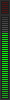
         of a track
   :figclass: pretty-figures

Setting your levels properly, also known as gain staging, is essential for
getting the best sound quality out of the equipment you are using. At every link
in your signal chain, from Mixxx's channel gains to the power amplifier, the
level should be well above the noise floor, but lower than the maximum level
before the signal clips. The :term:`level meters <level meter>` should mostly be
around the top of their green region. The level meter pictured to the left shows
where Mixxx's level meters should average at the loudest parts of tracks. The
average level should not be in the yellow region. Use the yellow region to leave
headroom, or available level above the average before the signal clips. The
loudest parts of the music (the transients) should briefly go into the yellow
region.

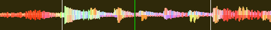

   A waveform at a good level. Note that the example waveforms in this section
   were made by adjusting the visual gain of the waveform display in Mixxx to
   illustrate the concepts. Adjusting the visual gain of the waveform display
   does not change the level of the audio.

         down!
   :figclass: pretty-figures

**If a level meter is in its red region, the signal is clipping and the gain
should be turned down.** Some equipment doesn't have a level meter and only has
an LED that turns on when the signal clips. Clipping means that the peaks of the
waveform are flattened because the equipment has reached the maximum level that
it can amplify the signal to. This distorts sound in an unpleasant way and can
damage equipment by driving it with more power than it is designed to handle.
Increasing the gain past the point where clipping begins (further into the red
on a meter) will distort the signal more. If you want to make the sound louder
when every part of the signal chain is at its maximum without clipping, use more
speakers or use speakers that are more sensitive and convert electrical energy
into acoustic energy more efficiently.

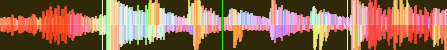

   A clipping waveform

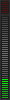

On the other hand, the signal should not be too low. This is because every audio
device generates a little noise at a level referred to as its noise floor.
Additionally, analog signals pick up noise as they travel along wires. The signal
measured by the meter on the left is relatively close to the noise floor. When a
device is turned up, the noise floor does not go up; only the signal does.
However, every time the signal is amplified by the gain of another piece
of equipment, both the noise and the signal from previous devices in the signal
chain are amplified. For example, if your sound card is turned down and you turn
the gain up on your mixer to compensate, the signal-to-noise ratio (SNR) of the
sound card output will be low and the mixer's gain will amplify the signal and
the noise from the sound card, plus the noise picked up along the wire. The end
result will have more noise than if the output of the sound card was turned up
before the signal reached the mixer and the mixer's gain did not have to be
turned up.

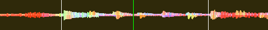

   A waveform that is too close to the noise floor

   .. note:: To adjust the output volume of a sound system while maintaining a
             high signal-to-noise ratio, the gain should be adjusted as close to
             the speakers as possible. Refer to the
             :ref:`Gain Knob <interface-gain-knob>` section for details.

.. _beatmatching-and-mixing:

Beatmatching and Mixing
=======================

:term:`Beatmatching<beatmatching>` is the process of adjusting the playback rate of a track so
that it matches the tempo of another track. Beatmatching also involves adjusting
the :term:`phase` of the beats in a track so that they are aligned with the
beats in the other track. Matching the :term:`tempo` and aligning the beats are
the two things a DJ must do to beatmatch.

Mixxx can match the tempo and align the beats for you but this requires an
accurately detected BPM value and a correct beat grid for both tracks. To enable
this feature, tap the :guilabel:`SYNC` button. To beatmatch manually, the tempo
of the two tracks must be synchronized by adjusting the playback rate
sliders. You can adjust the phase of the beats by right-clicking and dragging on
either waveform display to temporarily speed up or slow down one of the tracks
until the beats are aligned. The temporary pitch bend buttons can also be used
to momentarily adjust the playback rate, allowing you to “shuffle” the beats in
a track forwards or backwards, so they can be aligned with another track. See
the chapter :ref:`interface-rate`.

Two tracks are beatmatched once their tempos are matched and their beats are
aligned. A “perfect” beatmatch is nearly impossible - there will always be a
tiny difference in the playback rates. A keen DJ will keep his or her ears open
and listen for the beats drifting out of alignment. This has a distinct “double
bass kick” sound which is often preceded by the kick weakening in intensity as
the two kicks drift out of phase. When this happens, the beats can be realigned
by simply tapping one of the temporary pitch bend buttons a few times in the
appropriate direction.

.. _sync-lock:

Sync Lock
=========

:term:`Sync Lock<sync lock>` is an intelligent assistant that allows you to
leave the beatmatching to Mixxx so you can focus on track selection, effects
manipulation, looping, 4 deck mixing, and other advanced DJing techniques.

To activate Sync Lock on a deck, push and hold (or click and hold) the
:guilabel:`SYNC` button. You'll know Sync Lock is on because the sync button
will remain lit.  Changing the rate of any deck that has Sync lit will change
the rates of all other decks that also have the Sync button lit.  There is no
need to set specific decks to be a leader or followers.  You can play, stop,
eject, load, and queue any track with sync lock and it won't interrupt the
playback of the other decks.  However, changing the rate of a stopped deck will
change the rate of playing decks.

Sync Lock will also notice if one of your tracks is double the BPM of another
track and match them correctly.  So if you want to mix a 140 BPM drum & bass
track with a 70 bpm dubstep track, Sync Lock will make sure they are lined up
properly.

.. hint:: Usually, Sync Lock will only make sure the rate sliders are set
          correctly.  If you also want to make sure your beats are perfectly in
          sync, turn on the :guilabel:`QUANTIZE` button.  When activated,
          Quantize will ensure that the beats are perfectly lined up as well.

Sync Lock with Dynamic Tempo
============================

If you're working with dynamic tempo tracks that have a variable BPM beat grid, you have
precise control over the sync lock behavior via the following Sync Leader
buttons (available in the LateNight and Deere skins only).

.. |nbsp| unicode:: 0xA0
   :trim:

|follower| Follower |nbsp| |nbsp| |nbsp| |nbsp| |nbsp| |softleader| Soft Leader

You can create a variable BPM beat grids for single tracks by using the :guilabel:`Analyze`
library context menu and :guilabel:`Reanalyze (variable BPM)` command. Alternatively you may
create variable BPM beat grids for all tracks to be (re)analyzed later on by unchecking :guilabel:`Assume constant tempo`
in the :guilabel:`Beat Detection` preferences.

When such a track is playing in a Leader deck, the follower decks closely follow the tempo.
It's important to note that the track follows the "detected" leader tempo unconditionally,
even if there are sections with unstable tempos during bridges or in the outro regions where
the actual played tempo wasn't detected correctly.

If a soft leader deck stops or is silenced, Mixxx automatically selects the next
best deck as Leader. By clicking the Leader button, you can choose between Soft
Leader and Follower mode. A Soft Leader is not sticky, and will automatically
move if the current leader becomes invalid.

By default the "Sync Lock with Dynamic Tempo" feature is enabled and Mixxx picks the
first Sync Lock enabled track as Soft Leader, using the tempo from its outro during
the following transition. If you'd like to use the the tempo from the intro of the next
track instead, click the Leader (Crown) button of its deck.
The deck then becomes the soft leader, and Mixxx will use that deck's tempo instead.

The only case when a stopped deck can be a Leader is if no other deck is
playing. Once a deck starts playing, Mixxx will pick that as the leader instead.
If another deck starts playing, then you will be able to pick which one you want
to be the leader again.

If you'd prefer a steady tempo during transitions like in Mixxx before Version 2.4,
you may select :guilabel:`Use steady Tempo` for :guilabel:`Sync mode` in the
:guilabel:`Decks` preferences. In this mode all decks become a follower during a
transition and you may pick a dynamic track as a leader by clicking the
Leader (Crown) button if desired.

A leader plays always the original recorded tempo changes. A follower changes its
tempo matching the leader which may result in a notable pitch change.
Engaging keylock helps mitigate this pitch issue.

.. _harmonic-mixing:

Harmonic Mixing
===============

Harmonic mixing is a technique to mix songs with matching melodies and
harmonies. To learn more about harmonic mixing you might want to check out `the
mixshare archive`_.

.. _the mixshare archive: https://web.archive.org/web/20161123191234/http://www.mixshare.com/wiki/doku.php?id=harmonic_mixing

Mixxx has two features to help you with harmonic mixing. The first is a
:term:`key lock`. When it is active changing the speed of a track won't affect
the key. To enable :term:`key lock`, click the :guilabel:`key lock` button in
the :ref:`interface-button-grid`. The second is that Mixxx can automatically
detect the key of a track and will display it in the library and the decks. The
notation which is used to display a key can be changed in :ref:`Key Detection
Preferences <configuration-key-detection>`.

.. _djing-recording-your-mix:

Recording Your Mix
==================

.. sectionauthor::
   S.Brandt <s.brandt@mixxx.org>

With the integrated recording feature you can record your mix as an audio file
and listen to it later, distribute it as a :term:`Podcast<podcast>` or burn it to CD.

By default, Mixxx records the :term:`main output`. Alternatively, Mixxx can record
the output of an external mixer if you have an audio interface configured for
the :guilabel:`Record/Broadcast` input in :menuselection:`Preferences --> Sound
Hardware`. Refer to :ref:`microphones-record-broadcast-external-mixer` for
details.

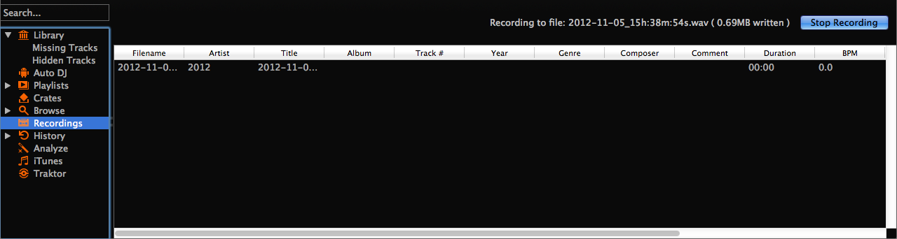

   Mixxx library - Recordings view

Mixxx can record your mix in various audio formats and quality settings. You can
split your recordings, generate :term:`cue files <cue sheet>`, choose a custom
recording directory and even set your own :term:`metadata`. By default, Mixxx
saves your recordings as lossless :term:`WAV` files to a
:file:`Mixxx/Recordings` sub-folder in the Mixxx music directory. Before you
start recording, we recommend that you adjust the settings in
:menuselection:`Preferences --> Recording`.

If you click on the *Recordings* icon in the sidebar of the Mixxx library, the
track table to the right displays the content of your recordings directory. New
recordings are automatically saved to this directory as well as CUE files if you
choose to create them in the preferences.

.. hint:: Recording your mixes and listening to them later to critique
          yourself is a great tool for improving your DJing skills. Sending
          your mixes to other DJs for feedback can also be helpful.

Record your mix to disk
-----------------------

Click on the recording icon on top of the application window to start,
and stop the recording session. The duration of the running recording is
displayed next to the icon.

.. note:: The recording widget might not be available in some skins.

Alternatively:

* Click on the *Recordings* icon in the sidebar to switch to the
  :guilabel:`Recordings` view
* Click the :guilabel:`Start Recording` button or click
  :menuselection:`Options --> Record Mix` in the menu on top of the Mixxx
  application window.
* The display above the track table shows how much data has already been
  recorded, as well as the duration of the recording.
* Perform your mix
* Click the :guilabel:`Stop Recording` button to stop the recording when the mix
  has finished.

.. hint:: You can instantly play your recording as a track in Mixxx. Simply
          drag-and-drop the track to a deck.

.. _djing-intro-outro-cues:

Intro and Outro Cues
====================

Intro/Outro cues are used to mix in and out of tracks and they can also be :ref:`used with Auto DJ <djing-auto-dj-intro-outro>` to mix in and out at those points. Unlike :term:`hotcues<hotcue>`, they do not mark only one point.
The into and outro are sections and each section is defined by two points.

Mixxx detects where the first and last sounds are when analyzing a track making it easy to stop playing
silent parts at the beginning and at the end of the track. The analyzer places the intro start
point at the first sound and the outro end point at the last sound.
The first and last sounds are determined by the first time the signal rises above -60 dBFS and the
last time it goes below -60 dBFS.

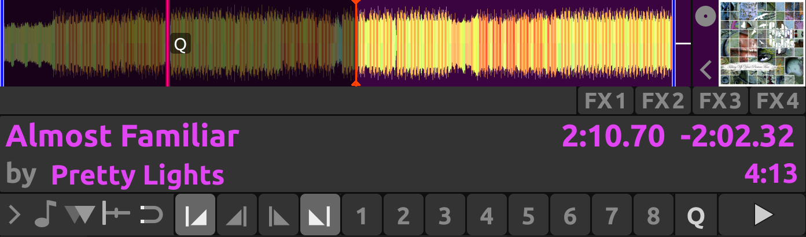

   Intro start and outro end cues placed at the first and last sound of a track respectively by the analyzer

You can decide where to place the intro end and the outro start points.
Marking the whole intro and outro allows Mixxx to calculate how long each section is and
show it on the overview waveform. This information can help you know when to press play on the next track.
:ref:`Auto DJ can also use this information <djing-auto-dj-intro-outro>` to line up tracks and determine how long to crossfade.

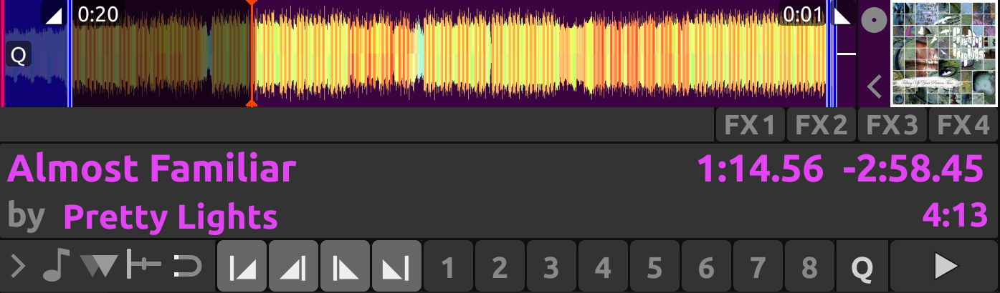

   Intro end and outro start markers placed on the track alongside the intro start and the outro end markers to make sections

.. _djing-intro-outro-mixing:

Mixing With Intro & Outro Cues
------------------------------

You can line up the ends of the intro and outro so the energy of the new song picks up
right as the old track ends.

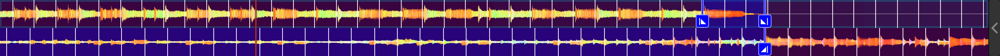

   Intro and outro end markers aligned showing on the waveform

If the intro and outro are short enough to fit on the waveform at the same time, you can simply watch the
waveforms and press play when the markers align. Otherwise, you can watch the time remaining on the deck and hover
your mouse cursor over the outro end line on the overview waveform. Mixxx will show you how much time is left
until that point. When that time equals the length of the intro, press play to precisely line up the end of the
intro. If you have changed the tempo of the track, the time remaining scales to show the real time remaining at the
adjusted tempo.

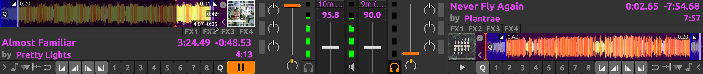

Alternatively, you can line up the start of the intro & outro. In this case, watch the scrolling waveform when the
outro start point is coming up on the old track. Then, press play on the new track when the old track reaches the outro start.

   .. note:: There are no rules on which method should be used. The method you decide to use is an artistic judgement based
             on the musical content of each track, what the vibe of the crowd is at that moment, and what you want to do with the mix.

If you do not have the intro end and outro start points marked when loading a track, you can find and
mark these in headphones before you mix in the track. Then seek back to the intro start to get the track ready. If you don't
have time to find the outro end point before mixing in the track, you can use the deck cloning feature to drag and drop to a new deck,
then seek ahead on the new deck and listen in headphones to mark the outro start point. If you don't have time to do that either,
you can right click on the overview waveform where you think the outro starts. Then look for how far that is from the end of the track to
compare it to the length of the intro of the next track.

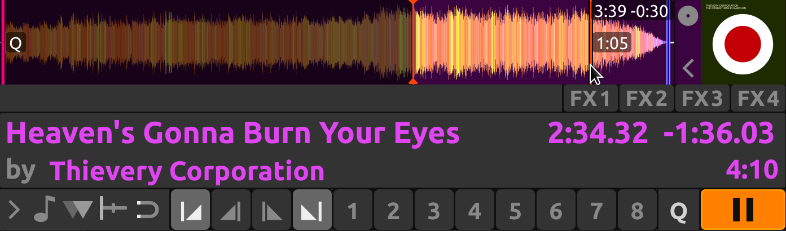

   Here the outro is approximately 30 seconds long. However, the analyzer placed the outro end point before the end of the track,
   so the outro is actually a little bit shorter than 30 seconds. Without marking the outro start point, you would have to do some
   math in your head to find exactly how long the outro is.

.. _djing-auto-dj:

Auto DJ
=======

.. sectionauthor::
   S.Brandt <s.brandt@mixxx.org>

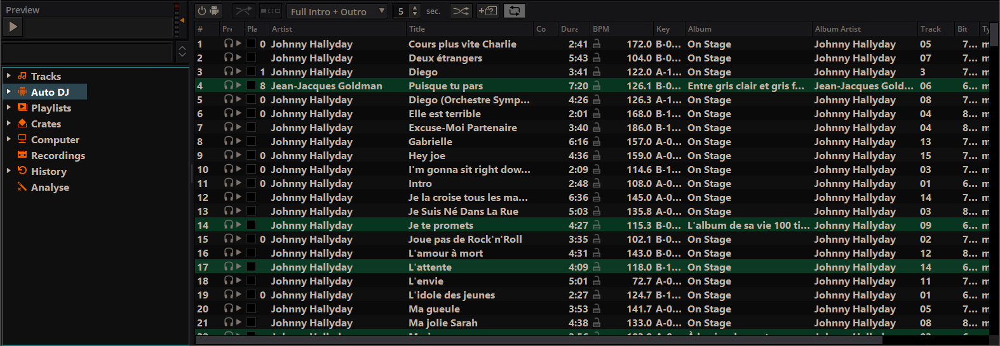

   Mixxx library - Auto DJ view

Auto DJ automatically loads tracks in the decks and mixes them.
Tracks can be manually added to the Auto DJ playlist, or automatically from assigned source crates or from the entire library.

Auto DJ does not take into account the volume of each track, nor the frequency content, nor the rhythms, so it's not intended to be a replacement for a human DJ. However, it is good enough to give a human DJ a break without a major disruption to the mix.

For mixing, Auto DJ takes control of the :ref:`crossfader <interface-crossfader>`.
Auto DJ requires at least one deck to be assigned to the left and right side of the crossfader. This can be done with the deck orientation switches next to the crossfader. If a deck's orientation is centered, the crossfader can't affect it. Note that in the official Tango skin, these switches are in the decks' transport controls row, and in Shade skin they don't exist because decks are statically assigned to the left and right side (bus).

When Auto DJ is toggled on, it will use the first two opposing decks it finds. With default settings these would be decks 1 and 2, but depending on how the orientation switches are set, this could be any configuration, for example deck 4 on the left and deck 1 on the right. If no opposing decks are found Auto DJ won't start.

.. note:: Note that Auto DJ is currently not aware which decks are currently visible,
          i.e. it might pick currently hidden decks 3 and/or 4. Refer to the
          :ref:`skin settings <interface-skin-settings>` for how to toggle 4 decks.

When you toggle Auto DJ off, the crossfader will stay on its last position.

Each official Mixxx skin has an Auto DJ indicator icon, located either in the top toolbar or in the mixer. In some skins the crossfader is highlighted, too.

Loading tracks into Auto DJ
---------------------------

To play tracks automatically, they must first be loaded into the Auto DJ
playlist. The Auto DJ playlist is empty by default.

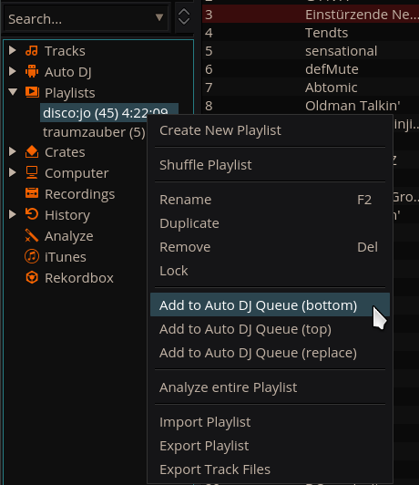

   Mixxx library - Adding a playlist to Auto DJ

There are several ways to load tracks into the Auto DJ playlist:

* Select single or multiple tracks from the library, a regular playlist or crate
  and drag them to the Auto DJ icon on the left.
* Select a regular playlist or crate, right-click with the mouse and select
  :guilabel:`Add to Auto DJ` from the mouse menu. This adds all tracks to Auto DJ.
* While in the Auto DJ view of the library, drag tracks from external file
  managers to the Auto DJ icon in the sidebar or to the Auto DJ track table on
  the right.

.. _djing-auto-dj-crates:

Automatically adding tracks from crates
---------------------------------------

Instead of inserting the contents of the crates directly into the Auto DJ
playlist, :ref:`Auto DJ crates <library-auto-dj-crates>` are associated
crates that become a source of random track selections.

* **Add a crate to the Auto DJ track sources**:  Expand the :guilabel:`Auto DJ`
  item in the sidebar, and right-click on the :guilabel:`Crates` sub-item.
  Select one of the existing crates from the list. This makes the content of the
  crate available for random selection into the :ref:`Auto DJ <library-auto-dj>`
  queue for automatic mixing. The name of the crate is now listed as sub-item
  below.

  If you do not have any crates available for selection in the list, go
  and create a crate first and add some tracks, see :ref:`library-crates`.

* **Manually add tracks from track sources to Auto DJ**: Click the
  :guilabel:`Auto DJ` item in the sidebar and switch to the Auto DJ view of the
  library. Click the :guilabel:`Add random` button to add one track at the time
  from Auto DJ track sources to the bottom of the Auto DJ playlist.

  .. note:: If you did not set any crates as an Auto DJ track source, clicking
            the :guilabel:`Add Random` button will add a randomly selected track
            from the whole library instead.

* **Automatically add tracks from track sources to Auto DJ**: Mixxx can randomly
  add tracks to the Auto DJ playlist from track sources as soon as a
  specified minimum number of tracks remain. Select
  :menuselection:`Preferences --> Auto DJ --> Enable random track addition to
  queue --> On`. Set :menuselection:`Minimum allowed tracks before addition` to
  change the minimum number of tracks after which random tracks may be added.

  .. note:: If you did not set any crates as an Auto DJ track source, tracks are
            selected from the whole library instead.

* **Remove a crate from the Auto DJ track sources**: Expand the :guilabel:`Auto DJ`
  item in the sidebar, and right-click on one of the crates listed below the
  :guilabel:`Crates` sub-item. Select :guilabel:`Remove Crate as Track
  Source` to remove the crate from the Auto DJ track sources.

Playing tracks in Auto DJ
-------------------------

Now that you have loaded tracks into the Auto DJ playlist, you can activate Auto
DJ as follows:

* Click on the *Auto DJ* icon in the sidebar to switch to the :guilabel:`Auto
  DJ` view of the library.
* Click the :guilabel:`Enable Auto DJ` button.
* The first tracks from your list are loaded into the decks and the playback
  starts.
* Mixxx will continue to automatically mix until the Auto DJ playlist is empty.
* Click the :guilabel:`Disable Auto DJ` button to stop the automatic mixing

.. hint:: You can add a track to the end of the Auto DJ playlist once it is
          played instead of removing it. Set :menuselection:`Preferences -->
          Auto DJ --> Re-queue tracks after playback --> On`.

.. _djing-auto-dj-modes:

Auto DJ Mix Modes
-----------------
Auto DJ has several modes it can use to mix tracks:

* Full Intro + Outro
* Fade At Outro Start
* Full Track
* Skip Silence

The Full Intro + Outro and Fade At Outro Start modes both use the intro and outro cues but the Full Track and Skip Silence cues do not.

.. _djing-auto-dj-intro-outro:

Full Intro + Outro and Fade At Outro Start
~~~~~~~~~~~~~~~~~~~~~~~~~~~~~~~~~~~~~~~~~~
The Full Intro + Outro and Fade At Outro start Auto DJ modes use the :ref:`intro & outro cues <djing-intro-outro-cues>` to determine how long to crossfade and how to align the tracks in time. In both modes, Auto DJ compares the duration of the outro of the old track and the intro of the new track. Auto DJ picks the time of the shorter section as the crossfade time.

In both modes, if the outro is shorter than the intro, Auto DJ will align the start of the outro with the start of the intro.

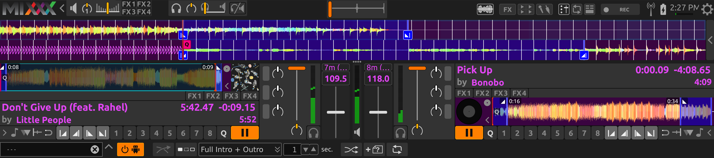

   Intro and outro start markers aligned by Auto DJ

The two modes work differently when the outro is longer than the intro.

**Full Intro + Outro Mode**
   The full length of both the intro and the outro are always played. When the outro is longer than the intro, Auto DJ aligns the end of the intro and outro by starting the next track during the outro of the previous track. This mode is the most likely to sound good with the widest variety of tracks. Therefore, it is the default mode.

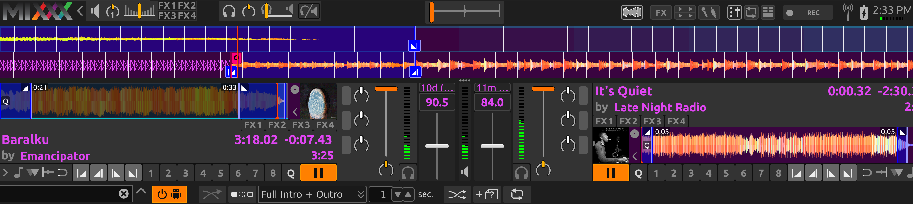

   Intro and outro start cues aligned by Auto DJ in Full Intro + Outro mode

**Fade At Outro Start**
  Auto DJ always aligns the start of the intro and outro. When the outro is longer than the intro, Auto DJ cuts off the end of the outro. This can be helpful if you want to prevent the energy of the mix from declining during a long outro. However, the transition may sound abrupt if the intro is short.

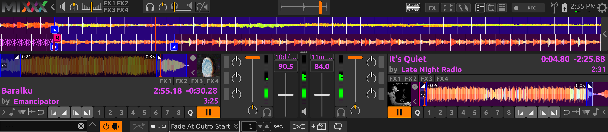

   Intro and outro start cues aligned by Auto DJ in Fade At Outro mode

Full Track and Skip Silence
~~~~~~~~~~~~~~~~~~~~~~~~~~~
The Full Track and Skip Silence Auto DJ modes do not use the intro and outro cues. They crossfade tracks over a number of seconds that you specify in the box next to the mode selection menu. The Full Track mode plays the entire length of every file. The Skip Silence mode works the same way but automatically cuts out silence at the beginning and ends of tracks (defined as when the signal first goes above or below -60 dBFS).

.. hint:: If you still want to use Auto DJ like a normal music player application, use one of these modes with a transition time of 0 seconds.
