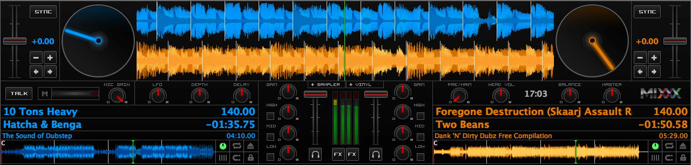
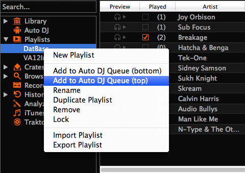

.. include:: /shortcuts.rstext

DJing With Mixxx
****************

Mixxx was designed to be easy to learn for both novice and experienced DJs.

This part of the manual provides you with directions for importing and managing
you music collection and playing your tracks.

.. _djing-open:

Opening Mixxx
=============
|logo| Once you've :ref:`installed Mixxx <installing-mixxx>`, start by opening
Mixxx and import your music to the Mixxx library.

**Windows**
  Double-click the Mixxx icon on the Desktop. Alternatively, browse your Windows
  start menu and click the Mixxx icon, or perform a search for :file:`Mixxx.exe`.

**Mac OSX**
  Double-click the Mixxx icon in the :file:`Applications` folder. Alternatively,
  drag the Mixxx icon to the dock and double-click it there, or perform a search
  for :file:`Mixxx.app`.

**GNU/Linux**
  Simply type :command:`mixxx` into the terminal, then hit :kbd:`Return`. With
  some distributions like Ubuntu you can also double-click the Mixxx icon in the
  launcher. Alternatively, perform a search for :file:`mixxx`.

.. _djing-import:

Importing your audio files
==========================

.. sectionauthor::
   S.Brandt <s.brandt@mixxx.org>

.. figure:: ../_static/Mixxx-111-1st-run-choose-library-directory-win.png
   :align: center
   :width: 50%
   :figwidth: 100%
   :alt: Mixxx 1st run - Choose music library directory dialog
   :figclass: pretty-figures

   Mixxx running on Windows 8 - Choose music library directory dialog

**Setup the music library**
  The first time you run Mixxx, you are asked to select a directory where your
  music is stored. By default, the dialog points to a location where music files
  are typically held.

  Click :guilabel:`Select Folder` and Mixxx will scan your music library.
  Depending on the size of your library this could take some time. All the
  supported music files Mixxx detects will be listed in the :ref:`library-root`.

  Mixxx automatically detects newly added tracks on each subsequent run. If you
  want to manually refresh your library without exiting (for example because you
  added or moved files), you can do this with :menuselection:`Library --> Rescan
  Library` in the menu. If you want to rescan at every launch, select
  :menuselection:`Preferences --> Library --> Rescan on startup`.

  .. warning :: On Windows 7 and 8 the import dialog points to your Windows
                “Music“ Library, a special-purpose virtual folder. You can
                **not** use these virtual folders. Select a regular folder
                instead, usually “My Music“, like pictured above.

**Compatible files**

  .. versionadded:: 1.12
     Support for the Opus audio format.

  Mixxx supports a variety of audio file formats: :term:`Wave <WAV>` (wav),
  :term:`Aiff <AIFF>` (aiff, aif), :term:`MP3` (mp3), :term:`Ogg Vorbis` (ogg),
  :term:`FLAC` (flac), :term:`OPUS` (opus), and :term:`AAC` (aac, m4a) if
  supported by your :term:`OS <Operating System>`. :term:`DRM` protected files,
  such as m4p files purchased in the iTunes Store, are not supported.

  AAC (M4A) is supported on Windows Vista and Mac OSX 10.5 onwards. The
  `Platform Update Supplement <http://support.microsoft.com/kb/2117917>`_ is
  required for Windows Vista.

  On Linux, AAC playback is disabled by default due to licensing restrictions.
  To enable the playback of AAC files, `build Mixxx from source with m4a files support
  <http://www.mixxx.org/wiki/doku.php/compiling_on_linux#build_with_m4a_file_support>`_.

**Import external libraries**
  If you have iTunes, Traktor, Rhythmbox, or Banshee installed, Mixxx allows you
  to access your tracks and playlists in the Mixxx library,
  see :ref:`library-3rd-party`.

**Import remote files**
  To import audio files which are not in your music library directory, drag them
  directly from an external :term:`file manager` or from the :ref:`Browse section
  <library-browse>` to the track list. Importing files into Mixxx does not
  change the location of the files on the hard disk.

  .. note :: You can not drag complete folders to the library because currently
             Mixxx can not recursively scan folders for compatible music files.

**Import playlists**
  You can import existing :file:`m3u`, :file:`pls` , :file:`m3u8`, :file:`pls`
  playlist files from products other than Mixxx, see :ref:`library-playlists`.

**Import music from CDs**
  Mixxx can not play music from Audio CDs. Convert the content to compatible
  files in good quality and add them to the Mixxx library. See
  `<https://en.wikipedia.org/wiki/Ripping>`_

.. _djing-changing-music-directories:

Changing music directories
==========================

.. versionadded:: 1.12
   Handles multiple music library folders and adds an option to move them to
   another location without data loss.

You can manually add, relink, and remove Mixxx music directories in
:menuselection:`Preferences --> Library`.

**Add a new music directory**
  Mixxx handles multiple music library folders. Click :guilabel:`Add` to
  browse to a directory where your music is stored. Mixxx will watch this
  directory and its subdirectories for new tracks.

  If you add a directory that is already in your library, or you are currently
  :ref:`rescanning your library <library-root>`, the operation is canceled.

  Directories can also be added from the :ref:`Browse <library-browse>` sidebar
  item inside the library.

**Relink a existing music directory**
  If an existing music directory is moved, Mixxx doesn't know where to find the
  audio files in it. Click :guilabel:`Relink` to select the music directory
  in its new location. This will re-establish the links to the audio files in
  the Mixxx library.

**Remove a music directory**
  Click :guilabel:`Remove`, and Mixxx will no longer watch a directory and
  its subdirectories for new tracks, and asks what would you like to do with the
  tracks from these directories.

  * Select :guilabel:`Hide Tracks` to hide all tracks from this directory and
    subdirectories.
  * Select :guilabel:`Delete Track Metadata` to delete all metadata for these
    tracks from Mixxx permanently
  * Select :guilabel:`Leave Tracks Unchanged` to leave the tracks unchanged in
    your library.

  Hiding tracks saves their metadata in case you re-add them in the future.

  Metadata means all track details (artist, title, playcount, etc.) as well as
  beatgrids, hotcues, and loops. This choice only affects the Mixxx library.
  No files on disk will be changed or deleted.

.. hint:: When changing music directories, you might want to run a library
          rescan afterwards. Select :menuselection:`Library --> Rescan Library`
          in the menu.

.. _djing-loading-tracks:

Loading Tracks
==============

.. versionadded:: 1.12
   Supports dragging tracks from deck to deck.

Tracks can be loaded into a deck in several ways:

* Right-click the :ref:`library track table <interface-library>`: Right-clicking
  on a track in the table will present the options :guilabel:`Load in Deck 1`
  and :guilabel:`Load in Deck 2`, among others. Making either selection will
  load a track into a deck.
* By :ref:`control-keyboard` to load the selected track from library track table.
* Drag-and-drop from library track table: Dragging-and-dropping a track from the
  track table onto a waveform display will load a track into a deck.
* Drag-and-drop from deck to deck: Once you've loaded a track to deck, sampler,
  or preview deck, click on the :ref:`track title <interface-track-info>` and
  drag it to a deck or sampler.
* Drag-and-drop from external file browser: Dragging-and-dropping a track from
  an external file browser directly onto a waveform display in Mixxx will load
  that track. This function also works with some other applications. For
  example, on Mac OS X, dragging-and-dropping a track from iTunes onto one of
  Mixxx's waveform displays will load that track into a deck.

.. _djing-finding-tracks:

Finding Tracks (Search)
=======================

.. sectionauthor::
   RJ Ryan <rryan@mixxx.org>
   S.Brandt <s.brandt@mixxx.org>

The :ref:`search function <library-search>` searches for a match only in the
current selected list (e.g. a playlist, a crate or even the whole library).

* Activate the search input field by pressing :kbd:`CTRL` + :kbd:`F`
  (Windows/Linux) or :kbd:`CMD` + :kbd:`F` (Mac). Alternatively click into the
  :ref:`search box <library-search>`.
* Type your search term. Mixxx filters the tracks and retains only the ones that
  match the search term. Search terms can include an artist's name, a song
  title, BPM, etc.
* To clear the search string hit :kbd:`ESC` or click the clear button right next
  to the input field.
* Hit :kbd:`TAB` to cycle between the search and the list of results in the
  library. Use the :kbd:`ARROW UP` and :kbd:`ARROW DOWN` keys to scroll in the
  list of results.

.. note:: If the search input field has focus, the Mixxx keyboard shortcuts are
          disabled, see :ref:`control-keyboard`.

Using search operators
----------------------

Search operators allow you to form more complex search queries. They allow you
to limit certain search terms to particular properties of your tracks.

.. versionadded:: 1.12
   Adds *location*, *album_artist*, and *key* search keywords. Supports
   human-readable time suffixes in time-based search query filters, e.g.
   ``1:30``, ``1m30s``, ``1m30``, ``90``, ``90s``. Supports negative search
   filters.

Mixxx supports the following filters:

* **Text filtering**: artist, album, album_artist, genre, title, composer,
  comment, key, location

* **Numeric filtering**: year, track, bpm, played, rating, bitrate, duration

* **Special filtering**:

  * Supports fuzzy matching of key searches. The following example list tracks
    with harmonically compatible keys to C# minor.

    ::

       ~key:c#m

    You can combine operators but there's no way to do an “OR” search right now.
    The following example list all tracks by “Danger” over 5 minutes long that
    are rated 4 or 5.

    ::

     artist:Danger duration:>3m rating:>=4

  * Negative search filters. Use the ``-`` prefix as negation operator. The
    following example would find “hip-hop“ from any year but 1990.

    ::

       genre:hip-hop -year:1990

+--------------------------------------+---------------------------------------+---------------------------------------+
| Examples for text filtering          | Examples for numeric filtering        | Examples for duration filtering       |
+======================================+=======================================+=======================================+
| artist: “com truise”                 | bpm:140                               | duration:2m10                         |
+--------------------------------------+---------------------------------------+---------------------------------------+
| album:Danger                         | bpm: >140                             | duration:<2:10                        |
+--------------------------------------+---------------------------------------+---------------------------------------+
| genre: Trance                        | year: <2010                           | duration:>1m35s                       |
+--------------------------------------+---------------------------------------+---------------------------------------+
| title: foo                           | bpm: >=140                            | duration:>62                          |
+--------------------------------------+---------------------------------------+---------------------------------------+
| composer: foo                        | rating: <=4                           |                                       |
+--------------------------------------+---------------------------------------+---------------------------------------+
| comment: foo                         | bpm: 140-150                          |                                       |
+--------------------------------------+---------------------------------------+---------------------------------------+
|                                      | played: >10                           |                                       |
+--------------------------------------+---------------------------------------+---------------------------------------+
| Note it doesn't matter if you have   | Note that you can put a space between | Note that you can put a space between |
| space between the colon and the      | the colon but currently there must be | the colon but currently there must be |
| argument or not. Quotes must be used | no space between the operator and the | no space between the operator and the |
| for multi-word text arguments.       | number.                               | number.                               |
+--------------------------------------+---------------------------------------+---------------------------------------+

.. _djing-previewing-tracks:

Previewing Tracks
=================

.. sectionauthor::
   M.Linke <kain88@mixxx.org>
   S.Brandt <s.brandt@mixxx.org>

To pre-listen to a track, activate the :guilabel:`Preview` column in a library
view. Clicking the |ic_lib_preview_play| icon in the library's
:guilabel:`Preview` column loads the selected track in a special :ref:`Preview
Deck <interface-preview-deck>` that will only output sound in the
:ref:`headphones <interface-head-master>` channel. Click the
|ic_lib_preview_pause| icon to stop the playback.

Alternatively, select a track from the track list of the Mixxx library, drag the
track to the waveform view of the :ref:`Preview Deck <interface-preview-deck>`
and click the :guilabel:`Play` button next to the waveform.

To display the Preview deck, press :kbd:`CTRL` + :kbd:`4` (Windows/Linux) or
:kbd:`CMD` + :kbd:`4` (Mac).

.. _djing-edit-metadata:

Edit metadata of audio files
============================

.. sectionauthor::
   S.Brandt <s.brandt@mixxx.org>

Mixxx reads relevant :term:`metadata` from the tracks and displays them in the
library columns. You are free to edit most metadata, and Mixxx offers a number
of different ways to do so. Note that some information can not be edited, such
as bitrate, size, length, type, filename, and location.

.. note:: Mixxx does not support editing the metadata of many tracks at a time
          (bulk editing).

.. warning:: Changes to a track's metadata will be saved to the Mixxx library,
             but **not** to the track itself. Mixxx wont touch your audio files
             to prevent data loss.

Manual Edit
-----------

**Track Inline editing**:
  Double-click on a field in the :ref:`library <library-root>`. If the field is
  editable, it will become an editable text box. Enter a value and hit
  :kbd:`Enter` when you are done.

  .. figure:: ../_static/Mixxx-112-Library-Inline-edit.png
     :align: center
     :width: 100%
     :figwidth: 100%
     :alt: Mixxx library - Inline editing
     :figclass: pretty-figures

     Mixxx library - Inline editing

**Properties editor**:
  Click on a **single track** in the library and select :guilabel:`Properties`
  to open the editor. Add or change values in the editable fields, and save your
  changes as explained below.

  .. figure:: ../_static/Mixxx-112-Library-Properties-Editor.png
     :align: center
     :width: 100%
     :figwidth: 50%
     :alt: Mixxx library - Properties editor
     :figclass: pretty-figures

     Mixxx library - Properties editor

  * **OK**: Accept the changes and close the editor.
  * **Apply**: Accept the changes you made into the metadata.
  * **Cancel**: Discard the changes and close the editor.
  * **Previous/Next**: Load the previous or next track in the current library
    view.
  * **Reload Track Metadata from File**: Prompts Mixxx to re-read the metadata
    of the selected track if you have modified metadata in 3rd-party software,
  * **Reload Track Metadata from MusicBrainz**:
    Lookup metadata online by searching the :term:`MusicBrainz` database, see
    below.

Using the MusicBrainz online database
-------------------------------------

`Musicbrainz <http://musicbrainz.org/>`_ is an :term:`open-source` music
encyclopedia that collects music :term:`metadata` and makes it available to the
public.

  .. figure:: ../_static/Mixxx-112-Library-MusicBrainz-Wizard.png
     :align: center
     :width: 100%
     :figwidth: 66%
     :alt: Mixxx library - MusicBrainz Wizard
     :figclass: pretty-figures

     Mixxx library - MusicBrainz Wizard

The MusicBrainz wizard in Mixxx allows to search the MusicBrainz database and
apply the search results to your tracks.

Click on a **single track** in the library and select :guilabel:`Get Metadata
from MusicBrainz`. Mixxx fetches track data from the MusicBrainz database and
displays the search results.

Select the best possible match from the search results by clicking on it in the
list.

  * **Apply**: Apply the selected MusicBrainz metadata to the track.
  * **Close**: Close the wizard.
  * **Previous/Next**: Load the previous or next track in the current library
    view and perform a MusicBrainz lookup on them as well.

Fetching track metadata from MusicBrainz can possibly fail if Mixxx could not
find the requested track in the MusicBrainz database, could not connect to the
MusicBrainz servers, or because you are not connected to the Internet.

.. hint:: The MusicBrainz service has been designed for identifying full audio
   files. Is a track less then 2 minutes long, identifying the file will likely
   fail. Identifying a layered mix-track or mash-up may produce false positives
   in the result list.

Using 3rd-party software
------------------------

If you have modified file metadata in 3rd-party software, select
:menuselection:`Library --> Rescan Library` in the menu on top of the
application window. This prompts Mixxx to re-read the metadata from **all**
tracks in the library.

Popular software to edit metadata of audio files include:
  * `Mp3tag <http://www.mp3tag.de/en/index.html>`_ (Windows)
  * `Kid3 <http://kid3.sourceforge.net/>`_ (Linux)
  * `Picard <http://musicbrainz.org/doc/Picard_Tagger>`_ (Mac, Windows, Linux)

.. _waveform-displays:

Waveform displays
=================

There are two main waveform displays in Mixxx that are used to display the
waveform of the tracks you are mixing. These are useful because they allow you
to see features in a track (like a breakdown) before you hear them.

Depending on the skin Mixxx displays either separate waveforms (default) or
parallel waveforms. Select your preferred appearance in
:menuselection:`Preferences --> Interface --> Skin`.

.. figure:: ../_static/Mixxx-111-Deere-separate-waveform.png
   :align: center
   :width: 100%
   :figwidth: 100%
   :alt: Mixxx default skin (Deere) - Separate waveforms
   :figclass: pretty-figures

   Mixxx default skin (Deere) - Separate waveforms

With some skins the waveform displays are aligned parallel to each other in
order to make :term:`beatmatching` easier, as it is possible to beatmatch
visually by aligning the beats that appear in each waveform.

   Mixxx alternative skin (Latenight) - Parallel waveforms

The mouse can be used on the waveforms to scratch, spin-back or throw the
tracks.  Right-clicking and dragging on the waveforms allows you to nudge the
track and make temporary pitch adjustments. Using the mouse-wheel on the
waveform zooms the waveform in or out. You can choose whether to synchronize the
zoom level between the decks in :menuselection:`Preferences --> Interface -->
Waveform Display --> Synchronize`. The waveform display is updated in real time
upon seeking.

There are two smaller waveform summary displays located adjacent to the main
waveform displays. Clicking on a waveform summary allows you to seek through the
track. These smaller displays show the waveform envelope of the entire track,
and are useful because they allow DJs to see breakdowns far in advance. Vinyl
DJs will find this familiar because quiet sections of tracks can be visually
distinguished when looking at a vinyl record. This is a useful tool when
planning your mixes on-the-fly.

.. _beatmatching-and-mixing:

Beatmatching and Mixing
=======================

:term:`Beatmatching` is the process of adjusting the playback rate of a track so
that it matches the tempo of another track. Beatmatching also involves adjusting
the :term:`phase` of the beats in a track so that they are aligned with the
beats in the other track. Matching the :term:`tempo` and aligning the beats are
the two things a DJ must do to beatmatch.

Mixxx can match the tempo and align the beats for you but this requires an
accurately detected BPM value and a correct beat grid for both tracks. To enable
this feature, tap the :guilabel:`SYNC` button. To beatmatch manually, the tempo
of the two tracks must be synchronized by adjusting the playback rate
sliders. You can adjust the phase of the beats by right-clicking and dragging on
either waveform display to temporarily speed up or slow down one of the tracks
until the beats are aligned. The temporary pitch bend buttons can also be used
to momentarily adjust the playback rate, allowing you to “shuffle” the beats in
a track forwards or backwards, so they can be aligned with another track. See
the chapter :ref:`interface-rate`.

Two tracks are beatmatched once their tempos are matched and their beats are
aligned. A “perfect” beatmatch is nearly impossible - there will always be a
tiny difference in the playback rates. A keen DJ will keep his or her ears open
and listen for the beats drifting out of alignment. This has a distinct “double
bass kick” sound which is often preceded by the kick weakening in intensity as
the two kicks drift out of phase. When this happens, the beats can be realigned
by simply tapping one of the temporary pitch bend buttons a few times in the
appropriate direction.

.. _djing-with-effects:

Use Effects
===========

.. _effects-flanger:

Flanger
-------

.. figure:: ../_static/Mixxx-111-Deere-Mixer-FX.png
   :align: center
   :width: 321px
   :figwidth: 100%
   :alt: The effect control section of the mixer
   :figclass: pretty-figures

   Flanger controlls

This effect applies a “sweeping” sound to the channel and can add extra depth to
a mix when used tactfully.

**FX Button**
  The FX (“Effects”) button enables a built-in flanger effect on the selected
  channel.

**Delay/Depth/LFO Knobs**
  Adjusts the phase delay, intensity and the wavelength of the flange effect.

.. hint :: For the most noticeable effect, enable the FX button and turn the
           Depth knob completely to the right.

.. _effects-bitcrusher:

BitCrusher
----------

.. figure:: ../_static/Mixxx-112-LateNight-Effects-BitCrusher.png
   :align: center
   :width: 321px
   :figwidth: 100%
   :alt: The effect control section of the mixer
   :figclass: pretty-figures

   BitCrusher controlls

The BitCrusher is an effect that adds quantisation noise to the signal
by the reduction of the resolution or bandwidth of the samples

**Bit Depth**
  Adjusts the bit depth of the samples.

**Downsampling**
  Adjusts the sample rate, to which the signal is downsampled.

.. _effects-filter:

Filter
------

.. figure:: ../_static/Mixxx-112-LateNight-Effects-Filter.png
   :align: center
   :width: 321px
   :figwidth: 100%
   :alt: The effect control section of the mixer
   :figclass: pretty-figures

   Filter controlls

The filter changes the tone of the music by allowing only high or low
frequencies to pass through.

**LPF**
  Corner frequency ratio of the low pass filter

**Q**
  Resonance of the filters, default = Flat top

**HPF**
  Corner frequency ratio of the high pass filter

.. _effects-reverb:

Reverb
------
.. figure:: ../_static/Mixxx-112-LateNight-Effects-Reverb.png
   :align: center
   :width: 321px
   :figwidth: 100%
   :alt: The effect control section of the mixer
   :figclass: pretty-figures

   Reverb controlls

This is a port of the GPL'ed CAPS Reverb plugin, which has the following
description: This is based on some of the famous Stanford CCRMA reverbs (NRev,
KipRev) all based on the Chowning/Moorer/Schroeder reverberators, which use
networks of simple allpass and comb delay filters.

**Bandwidth**
  Higher bandwidth values cause more bright (high-frequency) tones to be
  included

**Damping**
  Higher damping values cause reverberations to die out more quickly.

.. _effects-echo:

Echo
----

.. figure:: ../_static/Mixxx-112-LateNight-Effects-Echo.png
   :align: center
   :width: 321px
   :figwidth: 100%
   :alt: The effect control section of the mixer
   :figclass: pretty-figures

   Echo controlls

Simple Echo with pingpong

**Send**
  How much of the signal to send into the delay buffer

**Delay**
  Delay time (seconds)

**Feedback**
  Amount the echo fades each time it loops

**PingPong**
  As the ping-pong amount increases, increasing amounts of the echoed signal is
  bounced between the left and right speakers.

.. _master-sync:

Master Sync
===========

:term:`Master Sync` is an intelligent assistant that allows you to leave the
beatmatching to Mixxx so you can focus on track selection, effects manipulation,
looping, 4 deck mixing, and other advanced DJing techniques.

To activate Master Sync on a deck, push and hold (or click and hold) the :guilabel:`SYNC` button.
You'll know Master Sync is on because the sync button will remain lit.  Changing
the rate of any deck that has Sync lit will change the rates of all other
decks that also have the Sync button lit.  There is no need to set specific decks
to be a master or followers.  You can play, stop, eject, load, and queue any track
with master sync and it won't interrupt the playback of the other decks.  Changing
the rate of stopped deck will change the rate of playing decks, however.

Usually, Master Sync will only make sure the rate sliders are set correctly.  If you
also want to make sure your beats are perfectly in sync, turn on the :guilabel:`QUANTIZE`
button.  When activated, Quantize will ensure that the beats are perfectly lined
up as well.

Master Sync will also notice if one of your tracks is double the BPM of another track
and match them correctly.  So if you want to mix a 140 BPM drum & bass track with a
70 bpm dubstep track, Master Sync will make sure they are lined up properly.

.. _headphone-cueing:

Headphone Cueing
================

Headphone cueing is a technique DJs use to listen to the next track they want to
play in their headphones before playing it on the main speakers. Headphone
cueing is useful because it allows a DJ to beatmatch the next track in their
headphones before bringing it into their mix by sliding the crossfader.

Mixxx allows a DJ to route audio from either deck to their headphones by
toggling either of the :guilabel:`Headphone` buttons in the mixer section of
Mixxx's interface. See the chapter :ref:`interface-mixer`.

.. _djing-bpm-detection:

BPM and Beat Detection
======================

.. sectionauthor::
   T.Rafreider <trafreider@mixxx.org>
   S.Brandt <s.brandt@mixxx.org>

Previous versions of Mixxx were able to detect BPM values but unable to
determine where the beats are. Consequently, the beat grids often looked
unaligned. The DJ had to adjust the beat grid manually in order to make use of
auto-beatmatching via :guilabel:`SYNC` button.

Now Mixxx comes with a new ultra-precise BPM and beat detector.
The beat grid is adjusted after track analysis is finished. Manual adjustments
are redundant in many cases because Mixxx knows where the beats are.

Analyzer Settings
-----------------

BPM and beat detection is a complex operation. Depending on your computer and
the track's bitrate and duration this may take some time. By default Mixxx
analyzes the complete track. To accelerate beat detection on slower computers, a
“Fast Analysis” option is available. If enabled, the BPM is computed by
analyzing the first minute of the track. In most cases this does not affect the
beat detection negatively because most of today's dance music is written in a
4/4 signature with a fixed tempo.

.. figure:: ../_static/Mixxx-111-Preferences-Beatdetection.png
   :align: center
   :width: 75%
   :figwidth: 100%
   :alt: Mixxx preferences - BPM settings
   :figclass: pretty-figures

   Mixxx preferences - BPM settings

The table below summarizes the beat detection settings:

+---------------------------------------+--------------------------------------+
| Option                                | Description                          |
+=======================================+======================================+
| Enable Fast Analysis                  | If enabled, BPM detection results    |
|                                       | from the first minute of audio.      |
+---------------------------------------+--------------------------------------+
| Assume constant tempo                 | If enabled, Mixxx assumes that the   |
|                                       | distances between the beats are      |
|                                       | constant. If disabled, the raw beat  |
|                                       | grid obtained by the analyzer is     |
|                                       | presented. The latter is appropriate |
|                                       | for tracks with variable tempo.      |
+---------------------------------------+--------------------------------------+
| Enable Offset Correction              | Prevents beat markers from being     |
|                                       | placed incorrectly.                  |
+---------------------------------------+--------------------------------------+
| Re-analyze beats when settings        | If enabled, Mixxx over-writes old    |
| change or beat detection data is      | beat grids from Mixxx before v1.11.  |
| outdated                              | Moreover, it will re-analyze the BPM |
|                                       | if your beat detection preferences   |
|                                       | change or BPM data from 3rd party    |
|                                       | programs are present.                |
+---------------------------------------+--------------------------------------+

Correcting Beat Grids
---------------------

There may be situations where BPM and beat detection do not result in a proper
beat grid.

Typically, the detected BPM is correct but the analyzer has failed to detect the
location of the first beat. Consequently, the beat markers are shifted, i.e.
the beat markers are always a fixed distance from the true beat. To adjust the
beat grid, cue the track before a real beat and click the :guilabel:`Beat-grid
Adjust` button in the :ref:`interface-button-grid`.

If the detected BPM is not accurate, the corresponding beat grid will also be
inaccurate. A deviation of 0.02 BPM units from the correct BPM will cause
beatgrid alignment issues on long tracks (e.g. a club mix). If this happens,
your beatgrid may look aligned for the few minutes but you will notice a slight
drift as the song goes on. Finding the correct BPM is easy in many cases - just
follow the note below.

.. note:: If the detected BPM value is not sufficiently accurate but very close
          to an integer value, try to set the BPM value manually to the integer.

.. _djing-recording-your-mix:

Recording your Mix
==================

.. sectionauthor::
   S.Brandt <s.brandt@mixxx.org>

With the integrated recording feature you can record your mix as an audio file
and listen to it later, distribute it as :term:`Podcast` or burn it to CD.
Mixxx records the master output - the audio you hear from the speakers including
the microphone.

.. figure:: ../_static/Mixxx-111-Library-Recordings.png
   :align: center
   :width: 100%
   :figwidth: 100%
   :alt: Mixxx library - Recordings view
   :figclass: pretty-figures

   Mixxx library - Recordings view

Mixxx can record your mix in various audio formats and quality settings. You can
split your recordings, generate :term:`cue files <cue sheet>`, choose a custom
recording directory and even set your own :term:`metadata`. By default, Mixxx
saves your recordings as lossless :term:`wav` files to a
:file:`Mixxx/Recordings` sub-folder in the Mixxx music directory. Before you
start recording, we recommend that you adjust the settings in
:menuselection:`Preferences --> Recording`.

If you click on the *Recordings* icon in the sidebar of the Mixxx library, the
track table to the right displays the content of your recordings directory. New
recordings are automatically saved to this directory as well as CUE files if you
choose to create them in the preferences.

Record your mix to disk
-----------------------

.. versionadded:: 1.12
   Displays the duration of the recording.

* Click on the *Recordings* icon in the sidebar to switch to the
  :guilabel:`Recordings` view
* Click the :guilabel:`Start Recording` button or click
  :menuselection:`Options --> Record Mix` in the menu on top of the Mixxx
  application window.
* The display above the track table shows how many data has already been
  recorded, as well as the duration of the recording.
* Perform your mix
* Click the :guilabel:`Stop Recording` button to stop the recording when the mix
  has finished.

.. hint:: You can instantly play your recording as track in Mixxx. Simply
          drag-and-drop the track to a deck.

Burn your recorded mix to a CD/DVD
----------------------------------

* Select your recording in the :guilabel:`Recordings` view
* Right-click and select :guilabel:`Open in File Browser` to locate the file on
  your disk
* Now burn the recording to a CD/DVD using a 3rd-party program, for example
  `CDBurnerXP <http://www.cdburnerxp.se/>`_ for Windows or
  `Burn <http://burn-osx.sourceforge.net/>`_ for Mac OS X.

.. note:: Due to licensing restrictions, :term:`MP3` recording is not enabled
          per default. In order to enable MP3 streaming you must install the
          :term:`LAME` MP3 :term:`codec` yourself. Go to the chapter
          :ref:`MP3 Streaming` for more information.

.. _djing-auto-dj:

Using Auto DJ for automatic mixing
==================================

.. sectionauthor::
   S.Brandt <s.brandt@mixxx.org>

.. figure:: ../_static/Mixxx-111-Library-Auto-DJ.png
   :align: center
   :width: 100%
   :figwidth: 100%
   :alt: Mixxx library - Auto DJ view
   :figclass: pretty-figures

   Mixxx library - Auto DJ view

Auto DJ allows you to automatically load tracks from the Auto DJ playlist when
the current track is nearly finished, and crossfade into it.  See
:ref:`library-auto-dj`.

Loading tracks into Auto DJ
---------------------------

To play tracks automatically, they must first be loaded into the Auto DJ
playlist. The Auto DJ playlist is empty by default.

   Mixxx library - Adding a playlist to Auto DJ

There are several ways to load tracks into the Auto DJ playlist:

* Select single or multiple tracks from the library, a regular playlist or crate
  and drag them to the Auto DJ icon on the left.
* Select a regular playlist or crate, right-click with the mouse and select
  :guilabel:`Add to Auto DJ` from the mouse menu. This adds all tracks to Auto DJ.
* While in the Auto DJ view of the library, drag tracks from external file
  managers to the Auto DJ icon in the sidebar or to the Auto DJ track table on
  the right.

Playing tracks in Auto DJ
-------------------------

Now that you have loaded tracks into the Auto DJ playlist, you can activate Auto
DJ as follows:

* Click on the *Auto DJ* icon in the sidebar to switch to the :guilabel:`Auto
  DJ` view of the library.
* Click the :guilabel:`Enable Auto DJ` button.
* The first tracks from your list are loaded into the decks and the playback
  starts.
* Mixxx will continue to automatically mix until the Auto DJ playlist is empty.
* Click the :guilabel:`Disable Auto DJ` button to stop the automatic mixing
