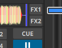

.. include:: /shortcuts.rstext

.. _effects:

Effects
*******

Mixxx has a powerful sound effects system. Understanding how it works can open
you up to a wide variety of mixing techniques.

.. _effects-effect-unit:

Effect Units
============
Mixxx has 4 effect units. By default, only 2 of them are shown. The other 2
effect units can be shown by toggling the setting in the skin settings menu.

.. figure:: ../_static/effect-unit-collapsed.png
   :align: center
   :alt: An effect unit
   :figclass: pretty-figures

   An effect unit

Each effect unit can load up to 3 effects in a chain. These effects are
processed one after the other in series. You will hear different sounds
depending on the order of effects within the chain. Each effect in the chain
has its own button to toggle it on and off.

Effect units can process sound from:
  * decks
  * microphones
  * auxiliary inputs
  * the main mix
  * the :term:`PFL` (headphone) mix
  * left/middle/right crossfader buses

The buttons to route effect units to decks, microphones, and auxiliary inputs
are located in the deck, microphone, and auxiliary sections of the skin. The
buttons for routing other inputs to effect units are in different locations
depending on the skin.

   The effect unit buttons located in the deck.

If a channel is assigned to multiple effect units, those effect units are
chained together. This allows you to chain more than 3 effects at a time.

To route deck 1 to effect unit 1, click the :guilabel:`FX1` button on deck 1 to turn it on.
To route deck 2 to effect unit 2, click the :guilabel:`FX2` button on deck 2, and so on.
It's also possible to route a single deck to multiple effect units, or multiple decks to a single effect unit.

The mix knob adjusts the mix between the dry signal (input to the unit) and the
wet signal (output of the last effect in the unit). It changes the level of
all 3 effects in the unit together. Refer to the :ref:`effects-mix-mode` section
below for details.

Effects are processed after the deck faders and crossfader. This allows effects
like Echo and Reverb to continue outputting sound after their input has been
cut off by lowering the fader. Unlike other DJ software and hardware, effects
can also be heard in headphones even though they are processed after the faders
for the :term:`main output`. Refer to the :ref:`effects-in-headphones` section below
for details.

Note that equalizer and filter effects create a phase shift. If the mix knob is
anywhere in the middle between dry and wet and any of these effects are enabled
in the unit, there will be comb filtering which is probably not desired. For
more background information, read `Equalizers and Phase Shift
<http://ethanwiner.com/EQPhase.html>`_.

Effect Parameters & Metaknobs
=============================
Every effect within an :ref:`Effect Unit <effects-effect-unit>` has its own set
of parameters. By default, these are hidden. Instead, there is a single knob
called a "metaknob" for each effect which is linked to the different
parameters. The metaknob allows you to easily control the effects in a unit
without having to manipulate every parameter individually.

If you want more detailed control of effects, press the expansion button on the
effect unit to reveal the effect parameters:

.. figure:: ../_static/effect-unit-expanded.png
   :align: center
   :alt: An effect unit with parameters showing
   :figclass: pretty-figures

   An effect unit with parameters showing

You can customize how the metaknob is linked to the parameters by clicking the
buttons below the parameter knobs. The button under the parameter name
controls the metaknob link mode:

  * Inactive: parameter not linked
  * Active: parameter moves with metaknob
  * Left side active: parameter moves with left half of metaknob turn
  * Right side active: parameter moves with right half of metaknob turn
  * Left and right side active: parameter moves across range with half of
    metaknob turn and back with the other half

The button below the metaknob link button inverts the parameter's relationship
to the metaknob.

For information about specific effects and their parameters, hover your mouse
over them to show the tooltip. If you do not see tooltips, check that you have
them enabled for the skin in :menuselection:`Preferences --> Interface`.

Effects (except for Reverb) that have a length of time as a parameter are
synchronized to the tempo of decks.

.. _effects-mix-mode:

Effect Unit Mix Modes
==================================
The effect unit mix knob controls the level of all 3 effects in the unit
together. It can be toggled between two different modes with the mix mode
button adjacent to it.

.. figure:: ../_static/effect-unit-dry-slash-wet-mode.png
   :align: center
   :alt: An effect unit in Dry/Wet mode
   :figclass: pretty-figures

   An effect unit in Dry/Wet mode

In the default Dry/Wet mode, the mix knob crossfades between the dry signal
(input to the first effect in the unit) and the wet signal (output of the last
effect in the unit). When the knob is fully left, no sound will be heard from
the effect unit. When the knob is fully right, only the output of the effect
unit will be heard without any of the dry input signal.

.. figure:: ../_static/effect-unit-dry-plus-wet-mode.png
   :align: center
   :alt: An effect unit in Dry+Wet mode
   :figclass: pretty-figures

   An effect unit in Dry+Wet mode

In Dry+Wet mode, the dry signal is always at full volume. The mix knob controls
how much of the wet signal is added to the dry signal. A useful example for
Dry+Wet mode is loading a filter or equalizer effect before the Echo effect. With
this setup, the filter or equalizer can remove bass frequencies from the echoed
signal without removing them from the unechoed signal. If the effect unit is
switched to Dry/Wet mode with the same effects in the same order, the bass
frequencies will be taken out of the echoed signal, but they will also be
removed from the unechoed signal.

.. _effects-in-headphones:

Effects In Headphones
=====================
To preview how a track will sound with effects before you mix in the track,
simply assign the deck to an effect unit and enable the headphone button for
the deck. Note that this will increase CPU compared to assigning an effect
unit to a deck without the headphone button enabled. This is because effects
are processed in parallel for the :term:`headphone output` (prefader) and
:term:`main output` (postfader).

Effects can also be previewed in headphones on decks that are playing to the
audience, but this requires a few more steps:

  #. Disable the effect unit for the deck
  #. Enable the headphone button for the deck
  #. Enable the headphone button for the effect unit
  #. Enable effects and adjust their metaknobs and parameters for how you want
     the effects to sound.
  #. When you are ready to mix in the effect, turn the mix knob fully left (dry)
  #. Enable the effect unit for the deck
  #. Turn the mix knob right so the effects are heard in the main output
  #. Disable the headphone button for the effect unit so you do not forget to
     turn it off later

Controller Effects Mapping
==========================
This section describes how to use the standard Mixxx mapping for effects sections on controllers with the typical layout of 4 knobs (or 3 knobs + 1 encoder) and 4 buttons for effects. It allows you to switch between controlling all 3 effects of a chain or controlling each parameter of one effect.

By default, 3 knobs are used for controlling effect metaknobs and the buttons under them toggle each effect on/off. To temporarily toggle an effect on/off, press and hold an effect enable button. The 4th knob is used for the mix (dry/wet) knob of the whole chain. On controllers designed for Serato, the :guilabel:`Beats` encoder is used as the mix knob.

The button next to the mix knob is used for focusing effects. On controllers designed for Serato, this button is labeled :guilabel:`Tap`. While holding this button pressed, the enable buttons for each effect switch to choosing which effect is focused. When an effect is focused:

   * the knobs switch to controlling the first 3 parameters of that effect instead of the metaknobs of each effect in the chain;
   * the buttons switch to controlling the first 3 button parameters of the effect; and

The LED of the focus button indicates whether any effect is focused. When its LED is on, you can hold the button down to see which effect is focused without having to look at the computer screen. To unfocus the effect, you can short press the focus button. The focused effect is remembered, so when you short press the focus button again, the previously focused effect will be refocused (it is not remembered when you shut down Mixxx though).

Alternatively, if you want to keep all the parameters showing on screen, you can press and hold the focus button, then press the button of the focused effect to unfocus it. Showing all the parameters without having an effect focused is helpful for experimenting with different ways of linking parameters to the metaknob.

When the focus button is pressed with shift, it toggles the Effect Unit between controlling different :ref:`Effect Units <effects-effect-unit>` in Mixxx. Typically this is used to toggle between :ref:`Effect Units <effects-effect-unit>` 1 & 3 or 2 & 4, like deck toggle buttons.

To load different effects, hold shift and turn the knob for an effect.

To load chain presets 1-4, press the buttons with shift (new in Mixxx 2.4).
