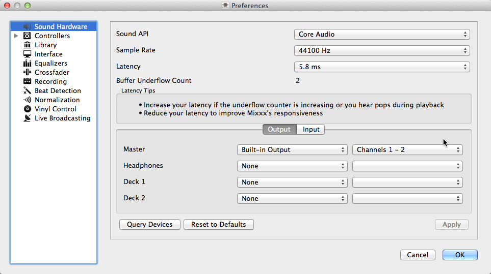
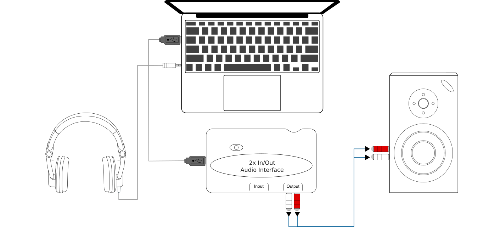
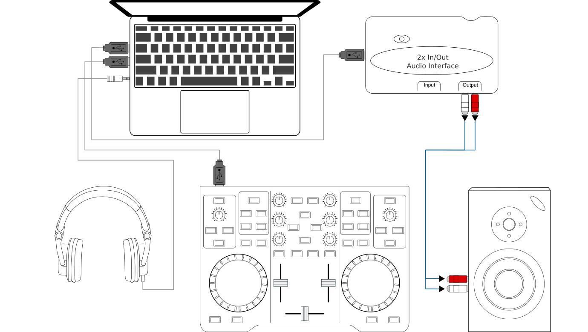
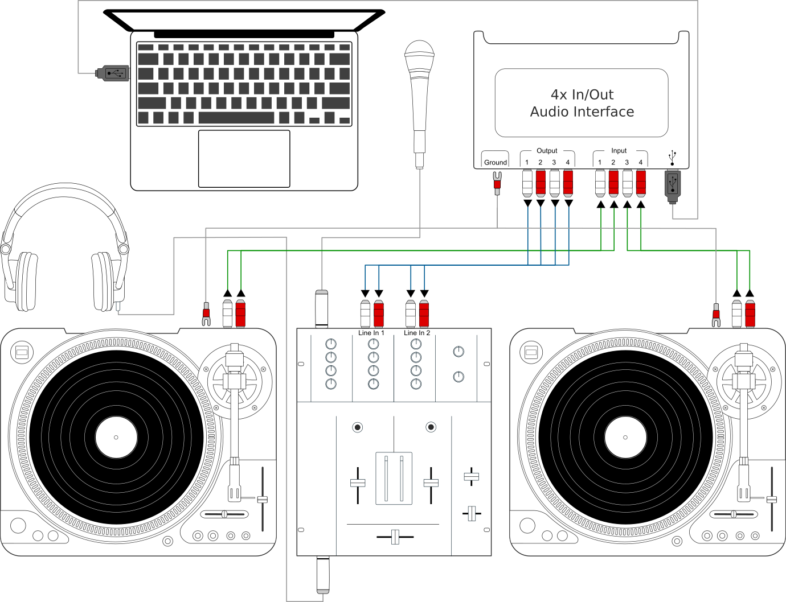

.. include:: /shortcuts.rstext

.. _setup:

Example Setups
**************
This chapter presents some example hardware setups with instructions for how to
configure Mixxx to work with them.

.. seealso:: * :ref:`hardware`: background information about different types of
               equipment.
             * :ref:`getting-started-sound-io`: details about each available
               input and output option.
             * :ref:`microphones`: details for configuring Mixxx to work with
               microphones.
             * `DJ Hardware Guide
               <https://mixxx.org/wiki/doku.php/hardware_compatibility>`_
               lists specific devices with information about their prices,
               features, and compatibility with Mixxx.

.. _setup-laptop-only:

Computer Only
=============
The built-in audio interface on most computers comes with a single stereo
line-out and a microphone input. This can be set up with Mixxx in two ways:

Practicing Mixing / Broadcasting
--------------------------------
This setup can be used with a single audio output for speakers or headphones to
practice DJing without investing in any equipment other than a computer and a
set of speakers or headphones. With this configuration, use the :ref:`Pre/Main
Knob <interface-head-master>` to switch back and forth between the Master mix
and :term:`PFL` signal. This setup cannot be used to play for a live audience
because the Master mix is not sent to an audio interface output. However, it can
be used by radio DJs who only need to send the Master mix to a broadcast
audience.

#. Open :menuselection:`Preferences --> Sound Hardware`
#. Select the :guilabel:`Output` tab
#. From the :guilabel:`Headphones` drop-down menu, select your built-in audio
   interface, then :guilabel:`Channels 1-2`. Although this is labeled
   :guilabel:`Headphones`, you can also plug speakers into the output jack of
   your computer.
#. Depending on your audio interface, you can specify a
   :ref:`microphone <microphones>`

   a. Use your built-in microphone or connect a microphone to your computer
   b. Check that your microphone is detected by your :term:`OS <operating
      system>`
   c. Open the :guilabel:`Input` tab
   d. From the :guilabel:`Microphone` drop-down menu, select the input your
      microphone is connected to
#. Click :guilabel:`Apply` to save the changes.

Playing for an Audience
-----------------------
This setup allows for playing to an audience without headphone :term:`cueing`.

   Using Mixxx with your built-in sound card

#. Open :menuselection:`Preferences --> Sound Hardware`
#. Select the :guilabel:`Output` tab
#. From the :guilabel:`Master` drop-down menu, select your built-in audio
   interface, then :guilabel:`Channels 1-2`
#. Depending on your audio interface, you can specify a
   :ref:`microphone <interface-mic>`

   a. Use your built-in microphone or connect a microphone to your computer
   b. Check that your microphone is detected by your :term:`OS <operating
      system>`
   c. Open the :guilabel:`Input` tab
   d. From the :guilabel:`Microphone` drop-down menu, select the input your
      microphone is connected to
#. Click :guilabel:`Apply` to save the changes.

.. _setup-laptop-with-splitter:

Laptop and Splitter Cable
=========================

.. TODO: Uncomment when this diagram is added.
  .. figure:: ../_static/mixxx_setup_splitter_adaptors.png
     :align: center
     :width: 75%
     :figwidth: 100%
     :alt: Using Mixxx with your built-in sound card and a DJ splitter cable
     :figclass: pretty-figures

The cheapest way to DJ and :term:`cue` with headphones uses a stereo-to-mono DJ
splitter cable (also known as a “Y cable”) plugged into the headphone jack of a
laptop or other computer. This cable divides the stereo output from a single
jack into two separate mono singals.

This setup allows you to start DJing without having to invest in expensive
equipment. However, because the signals are in mono, you and your audience will
not be able to enjoy music producers' positioning of sound in space (although
many club PA systems are wired in mono anyway). Furthermore, audio interfaces
built into computers are usually low quality and often pick up interface from
other components of the computer.

**Using a built-in audio interface and a stereo-to-mono splitter**

#. Open :menuselection:`Preferences --> Sound Hardware`
#. Select the :guilabel:`Output` tab
#. Check that your headphones are plugged into the side of the cable with a
   headphones symbol and that the speakers are plugged into the side of the
   cable with a speaker symbol.
#. From the :guilabel:`Master` drop-down menu, select your built-in audio
   interface, then :guilabel:`Channel 1`
#. From the :guilabel:`Headphones` drop-down menu, select your built-in
   audio interface, then :guilabel:`Channel 2`
#. Click :guilabel:`Apply` to save the changes.

.. warning:: Most splitter cables, particularly those marketed as headphone
             splitter cables, output the same stereo signal to two headphone
             jacks and will not work for this DJ setup. Also, if you use a
             generic stereo-to-mono splitter adapter, you may only be able to
             hear out of one side of your speakers and headphones. DJ splitter
             cables allow you to hear the same mono signal on both sides of your
             headphones and speakers.

.. _setup-laptop-and-external-card:

Laptop and External USB Audio Interface
=======================================

   Using Mixxx together with an external audio interface

**Using two audio interfaces (built-in + external)**

#. Open :menuselection:`Preferences --> Sound Hardware`
#. Select the :guilabel:`Output` tab
#. From the :guilabel:`Master` drop-down menu, select the external audio
   interface, then :guilabel:`Channels 1-2`
#. From the :guilabel:`Headphones` drop-down menu, select the built-in
   audio interface, then :guilabel:`Channels 1-2`

**Using an external multi-channel audio interface**

#. Open :menuselection:`Preferences --> Sound Hardware`
#. Select the :guilabel:`Output` tab
#. From the :guilabel:`Master` drop-down menu, select the external
   audio interface, then :guilabel:`Channels 1-2`
#. From the :guilabel:`Headphones` drop-down menu, select the external
   audio interface, then :guilabel:`Channels 3-4`
#. Click :guilabel:`Apply` to save the changes.

.. _setup-controller-and-external-card:

Laptop and MIDI or HID Controller
=================================

.. seealso:: The :ref:`hardware-controllers` section of the :ref:`hardware`
             chapter has background information about controllers.

Controllers with an integrated audio interface
-----------------------------------------------

Many DJ controllers include an integrated *multi-channel* audio interface.
A setup with this kind of controller may look like the diagram below:

.. figure:: ../_static/mixxx_setup_midi_integrated_audio_interface.png
   :align: center
   :width: 75%
   :figwidth: 100%
   :alt: Using Mixxx together with a DJ controller and integrated audio
         interface
   :figclass: pretty-figures

   Using Mixxx together with a DJ controller and integrated audio interface

**Using a controller with an integrated multi-channel audio interface**

#. Open :menuselection:`Preferences --> Sound Hardware`
#. Select the :guilabel:`Output` tab
#. From the :guilabel:`Master` drop-down menu, select your controller's
   audio interface, then :guilabel:`Channels 1-2`
#. From the :guilabel:`Headphones` drop-down menu, select your controller's
   audio interface, then :guilabel:`Channels 3-4`
#. Click :guilabel:`Apply` to save the changes.

Controllers without an integrated audio interface
-------------------------------------------------

Controllers without an integrated audio interface can be used together with a
USB audio interface as depicted in the diagram below:

   Using Mixxx together with a DJ controller and external audio interface

**Using a controller without an integrated audio interface**

#. Open :menuselection:`Preferences --> Sound Hardware`
#. Select the :guilabel:`Output` tab
#. From the :guilabel:`Master` drop-down menu, select the external audio
   interface, then :guilabel:`Channels 1-2`
#. From the :guilabel:`Headphones` drop-down menu, select the built-in
   audio interface, then :guilabel:`Channels 1-2`
#. Click :guilabel:`Apply` to save the changes.

.. raw:: pdf

   PageBreak

.. _setup-vinyl-control:

Laptop, External Hardware Mixer and Vinyl Control
=================================================

   Using Mixxx together with turntables and external mixer

This setup allows DJs to use the techniques of DJing with vinyl record
turntables combined with the portability and flexibility of a laptop computer.
Instead of carrying crates of records or CDs, DJs can carry their entire music
collection on their laptop. In addition to a laptop and headphones, this setup
requires an audio interface with at least two pairs of stereo inputs and outputs
as well as a pair of :term:`timecode` records.

.. seealso:: Go to the chapter :ref:`vinyl-control` for detailed information.
