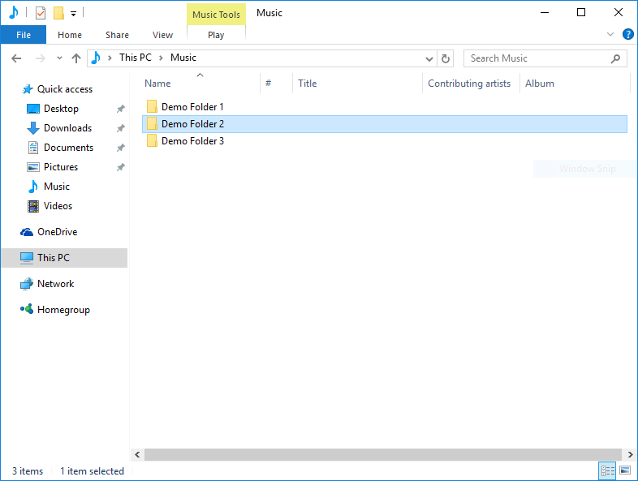

.. include:: /shortcuts.rstext

.. _getting-started-mixxx:

Getting Started
***************

Opening Mixxx
=============
|logo| Once you've :ref:`installed Mixxx <installing-mixxx>`, start by opening
Mixxx and importing your music to the Mixxx library.

**Windows**
  Double-click the Mixxx icon on the Desktop. Alternatively, browse your Windows
  start menu and click the Mixxx icon, or perform a search for
  :file:`Mixxx.exe`.

**Mac OSX**
  Double-click the Mixxx icon in the :file:`Applications` folder. Alternatively,
  drag the Mixxx icon to the dock and double-click it there or search for
  :command:`mixxx` in Spotlight.

**GNU/Linux**
  Click the Mixxx icon in the applications menu or launcher of your desktop
  environment or perform a search for :file:`mixxx`. Alternatively type
  :command:`mixxx` into the terminal, then hit :kbd:`Return`.
  If your :term:`audio interface` is not accessible from Mixxx because it is 
  used by other applications via PulseAudio, you may close and restart Mixxx 
  using :command:`pasuspender mixxx`. See :ref:`appendix-command-line-options` 
  for an overview of Mixxx's command line options.

.. _getting-started-import-audio-files:

Importing your audio files
==========================

.. sectionauthor::
   S.Brandt <s.brandt@mixxx.org>

   Mixxx running on Windows 10 - Choose music library directory dialog

The first time you run Mixxx, you are asked to select a directory where your
music is stored. By default, the dialog points to a location where music files
are typically held, but you can select any location on your computer.

Click :guilabel:`Select Folder` and Mixxx will scan your music library.
Depending on the size of your library this could take some time. All the
supported music files Mixxx detects will be listed in the :ref:`library-root`.

If you want to refresh your library (for example because you added or moved
files), you can do this with :menuselection:`Library --> Rescan Library` in
the menu. If you want to rescan at every launch, select
:menuselection:`Preferences --> Library --> Rescan on startup`.

.. warning :: On Windows 7 and 8 the import dialog points to your Windows
              “Music“ Library, a special-purpose virtual folder. You can
              **not** use these virtual folders. Select a regular folder
              instead, usually “My Music“, like pictured above.

.. _getting-started-analyze-library:

Analyze your library
====================

.. sectionauthor::
   RJ Ryan <rryan@mixxx.org>
   S.Brandt <s.brandt@mixxx.org>

|ic_lib_prepare| Mixxx automatically analyzes tracks the first time you load
them in a deck, nevertheless it is recommended that you analyze them before
playing live to ensure the beatgrids are correct. Furthermore, track
analysis takes considerable CPU power and might cause skips in the audio ---
things you surely don't need while performing.

Once you have
:ref:`imported your music library<getting-started-import-audio-files>`, press 
:guilabel:`OK` on the Preferences window. Go to the Analyze view on the left 
side panel of the library. This allows you to run :term:`beatgrid`, 
:term:`key`, and :term:`ReplayGain` detection on tracks in advance. While 
analyzing, the progress in percentage and total queue length are shown.

.. seealso:: For more information, go to :ref:`configuration-bpm-detection`.

.. _getting-started-sound-io:

Configuring sound input and output
==================================

Before you can start using Mixxx, you need to configure Mixxx to use your
sound hardware in :menuselection:`Preferences --> Sound Hardware`. You do not 
need to configure all inputs and outputs.

The :ref:`hardware` chapter explains different types of DJ hardware and how to
set them up with the the input and output options. For Mixxx to perform the best
it can on your system, configure the other :ref:`preferences-sound-hardware`
preferences in addition to the inputs and outputs.

.. figure:: ../_static/Mixxx-200-Preferences-Soundhardware.png
   :align: center
   :width: 80%
   :figwidth: 100%
   :alt: Mixxx Sound Hardware Preferences
   :figclass: pretty-figures

   Mixxx Sound Hardware Preferences

Output Options
--------------

**Internal mixing**:

Use these outputs if you are not using an :ref:`external hardware mixer 
<hardware-mixers>`. If you are using a controller with a built-in audio 
interface, use these outputs.

* *Master*: all decks, samplers, microphones, and auxiliary inputs mixed
  together. This output is sent to the speakers for the audience.
* *Headphones*: all decks, samplers, microphones, and auxiliary inputs
  assigned to :term:`pre-fader listening <PFL>`
* *Booth*: same as Master output, but has a separate gain control

**External mixing**:

* *Decks 1-4*: the individual unmixed decks to send to an external mixer
* *Bus Left/Center/Right*: all decks, samplers, and auxiliary inputs
  assigned to each side of Mixxx's crossfader

Input Options
-------------
**Internal mixing**:

Use these inputs if you are not using an external hardware mixer. If you are
using a controller with a built in audio interface, use these inputs.

* *Microphone 1-4*: live microphone or musical instrument inputs
* *Auxiliary 1-4*: other sound sources

**External mixing**:

* *Record/Broadcast*: When this is configured, Mixxx will record and
  broadcast from this audio interface input instead of the internal master 
  mix. If you have a microphone plugged into the mixer, do not configure the 
  Microphone 1-4 inputs.

**Either internal or external mixing**:

* *Vinyl Control 1-4*: timecode input from turntables or CDJs for
  manipulating decks 1-4
  
.. seealso:: :ref:`microphones`

