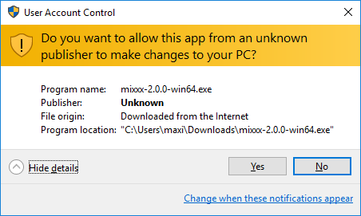
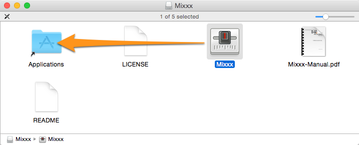
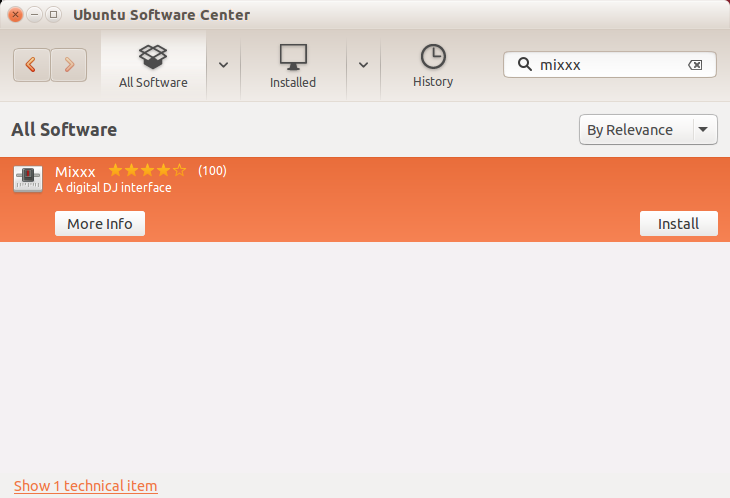

.. include:: /shortcuts.rstext

.. _installing-mixxx:

Installing Mixxx
****************

This part of the manual provides step-by-step directions for installing Mixxx on
your computer.

System Requirements
===================

Mixxx is available for Windows, Mac OS X and GNU/Linux. Mixxx is designed to
use very few system resources, but the Mixxx Development Team suggests these
minimum requirements for having a great experience with Mixxx:

* A 2GHz or faster CPU
* At least 1GB of RAM
* A soundcard with 2 stereo audio outputs (4 mono output channels)

.. hint:: The equalizerss can be disabled to save CPU usage. Using this feature,
          Mixxx can be used with an external mixer and a less powerful computer
          such as a netbook.

Installation on Windows
=======================
.. figure:: ../_static/Mixxx-200-Installation-Windows.png
   :align: center
   :width: 50%
   :figwidth: 100%
   :alt: Mixxx Installation on Windows 10 - Ready to install the application
   :figclass: pretty-figures

   Mixxx Installation on Windows 10 - Ready to install the application

* Download Mixxx for Windows from `<http://mixxx.org/download/>`_ .
* Using :file:`Windows Explorer` browse to the location where the Mixxx download
  was saved, usually the :file:`Desktop` or :file:`Downloads` folder.
* Double-click the Mixxx installer .EXE to open it up.
* Follow the step-by-step instructions in the installer.
* If the installation is complete, a confirmation screen will appear.
* Close the installer screen.

Mixxx is supported on Windows 10 / 8.1 / 8 / 7 / Vista / XP, with native 32 and
64-bit versions.

.. note:: If you are not sure about 32-bit versus 64-bit, pick the 32-bit
          version when downloading the Mixxx installer.

   Mixxx Installation on Windows 10 - User Account Control (UAC) warning message

.. warning:: You may encounter a warning message similar to “Do you want to
             allow this app to make changes to your PC”. This is a Windows
             security feature to prevent anything from running with elevated
             rights without you approving first. The Mixxx installer is not
             digitally signed. It does not indicate a security risk, if you can
             trust the source website such as `www.mixxx.org
             <http://mixxx.org/download/>`_ . In this case, ignore the message
             and continue the installation.

Installation on Mac OS X
========================

         folder
   :figclass: pretty-figures

   Mixxx Installation - Ready to drop the Mixxx icon to the Applications folder

* Download Mixxx for Mac OS X from `<http://mixxx.org/download/>`_ .
* Using :file:`Finder` browse to the location where the Mixxx download
  was saved, usually the :file:`Desktop` or :file:`Downloads` folder.
* Double-click the Mixxx installer .DMG file, a new Finder window appears.
* Locate the *Mixxx* icon within this new Finder window. Drag-and-drop it into
  your :file:`Applications` folder.
* Eject the Mixxx installation volume from the Finder by clicking on the icon
  right next to *Mixxx* volume name.

Mixxx requires an Intel Mac running Mac OS X 10.5 or newer.

Installation on GNU/Linux
=========================

Official packages of Mixxx are only offered for Ubuntu Linux. However, Mixxx can
build on almost any Linux distribution.

Installation on Ubuntu
----------------------

Method A: Personal Package Archive (ppa)
^^^^^^^^^^^^^^^^^^^^^^^^^^^^^^^^^^^^^^^^
* Open a terminal and type the following commands. Type in your administrator
  password if asked for. ::

    sudo apt-add-repository ppa:mixxx/mixxx
    sudo apt-get update
    sudo apt-get install mixxx

* Start Mixxx by simply typing :file:`mixxx` into the terminal, then hit
  :kbd:`Return` .

Method B: The Ubuntu Software Center
^^^^^^^^^^^^^^^^^^^^^^^^^^^^^^^^^^^^

   Mixxx Installation from the Ubuntu Software Center

The Ubuntu Software Center provides the easiest and safest way to install
software on Ubuntu.

* Start the :file:`Ubuntu Software Center` on your computer.
* Search for *mixxx* in the Software center.
* Select Mixxx and click the :guilabel:`Install` button.
* Type in your administrator password if asked for.
* Mixxx will be installed and an icon is added to the frequently-used program
  icons on the launcher.

The Software Center version of Mixxx is under some circumstances out of date,
therefore using `Method A: Personal Package Archive (ppa)`_ is preferable.

Installation on Other Distributions
-----------------------------------

Your distribution may maintain a non-official build that you may use.
Alternatively, you can build Mixxx from source. This should be a pretty
straightforward process, and it's certainly easiest on GNU/Linux. For more
information, go to:

* `<http://mixxx.org/wiki/doku.php/compiling_on_linux>`_

Building Mixxx from Source
==========================

If your operating system isn't listed here, then it's likely you're going to
have to build Mixxx from the source code. For more information, go to:

* `<http://mixxx.org/wiki/doku.php/start#compile_mixxx_from_source_code>`_

Where to go from here?
======================

* :ref:`Open Mixxx and start importing your audio files <configuration-open>`
* :doc:`Set up your audio devices and controllers <setup>`
* :doc:`Get familiar with the Mixxx user interface <user_interface>`
