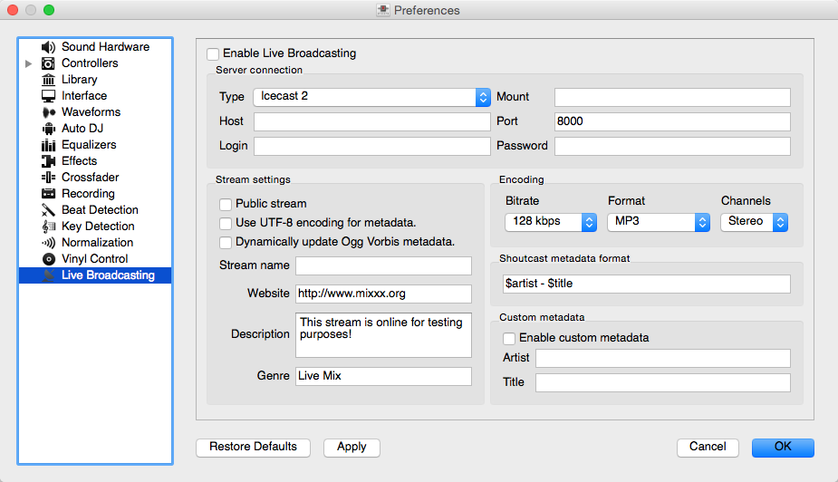

.. include:: /shortcuts.rstext

.. _live-broadcasting:

Live Broadcasting - Start your own Internet radio
*************************************************

.. sectionauthor::
   S.Brandt <s.brandt@mixxx.org>

Live Broadcasting in Mixxx allow you to stream your mix over the Internet to
listeners around the world.

.. seealso:: The :ref:`microphones` chapter has detailed instructions for
             including input from microphones in your broadcasted mixes.

Streaming Servers
=================

**Remote streaming server**
  Mixxx allows you to feed your audio stream directly to
  :term:`Shoutcast <shoutcast>` and :term:`Icecast <icecast>` streaming servers.
  Depending on the number of listeners, streaming audio requires a significant
  amount of bandwidth. Streaming servers provide the required bandwidth and
  broadcast the stream to your listeners. A popular free streaming service is
  `Caster.fm <http://www.caster.fm>`_. A review of several free and paid stream
  hosts is available at
  `broadcastingworld.net <http://www.broadcastingworld.com/reviews/category-stream-hosting>`_.

  .. digraph:: remote_streaming
     :caption: Mixxx as client-side streaming source broadcasting to an
               remote streaming server
     :alt: Mixxx as client-side streaming source broadcasting to an
           remote streaming server

     rankdir=LR;
     size="6,6";
     StreamingServer [shape = rectangle, style=filled, fillcolor=gainsboro];
     Router [shape = box, style=dashed] ;
     node [shape = box];
     Mixxx -> Router [ label = "Lan" ];
     Router -> StreamingServer [ label = "Internet" ];
     StreamingServer -> Listener1 [ dir=left, label = "Internet" ];
     StreamingServer -> Listener2 [ dir=left, label = "Internet" ];
     StreamingServer -> Listener3 [ dir=left, label = "Internet" ];

**Local streaming server**
  For experienced users, it may be interesting to set up your own local streaming
  server. This turns your personal computer into a radio station and listeners
  connect directly to your server. Mixxx as a streaming source does not need to
  run on the same computer as your streaming server. However, professional
  stations often run the streaming source on the same computer as the streaming
  server for stability and reliability reasons. Keep in mind that if want to
  stream audio to a significant number of listeners, you'll need enough
  bandwidth. Read the
  `Shoutcast documentation <http://wiki.winamp.com/wiki/SHOUTcast_Getting_Started_Guide>`_
  or
  `Icecast documentation <http://www.icecast.org/docs/>`_ for server setup
  instructions.

  .. digraph:: local_streaming
     :caption: Mixxx as client-side streaming source broadcasting to an
               local streaming server
     :alt: Mixxx as client-side streaming source broadcasting to an
           remote streaming server

     rankdir=LR;
     size="5.5,6";
     Router [shape = box, style=dashed] ;
     StreamingServer [shape = rectangle, style=filled, fillcolor=gainsboro];
     node [shape = box];
     Mixxx -> StreamingServer [ label = "" ];
     StreamingServer -> Router [ dir=left, label = "Lan" ];
     Router -> Listener1 [ dir=left, label = "Internet" ];
     Router -> Listener2 [ dir=left, label = "Internet" ];
     Router -> Listener3 [ dir=left, label = "Internet" ];

Configuring Mixxx
=================

Start by supplying Mixxx with all information needed to establish a connection
to the streaming server:

* Open :menuselection:`Preferences --> Live Broadcasting`.
* Insert the settings following the descriptions in the
  :ref:`live-broadcasting-preferences`
* Click :guilabel:`OK`
* Go to :menuselection:`Options --> Enable Live Broadcasting` or use
  the :ref:`appendix-shortcuts` to start broadcasting.

.. _live-broadcasting-preferences:

Live Broadcasting Preferences
=============================

   Mixxx preferences - Setting up live broadcasting

**Server Connection**

* **Type**: Select the type of streaming server you want to connect with.
  :term:`Shoutcast 1<shoutcast>`, :term:`Icecast 1 <icecast>`, and
  :term:`Icecast 2<icecast>` servers are supported.

  Mixxx works with Shoutcast 2 using the Shoutcast 1 protocol if you provide a
  stream name in :menuselection:`Preferences --> Live Broadcasting -->
  Stream Settings`. If you don't provide a stream name, Shoutcast 2 rejects the
  connection (where Shoutcast 1 would accept this case).
* **Host**: You can enter the host as either a host name or an IP address.
* **Login**: As provided by your streaming server provider. Without this, you
  will not connect successfully to the server. The default login for
  *Icecast* is ``source`` while the default login for Shoutcast is ``admin``.
* **Mount**: A mount point is a unique name identifying a particular stream.
  For *Shoutcast* it is not necessary to specify a mount point. The setting must
  not be blank if you are using *Icecast*. Try the default ``/mount`` or
  ``/live``. If you haven't been given a specific mount point you can usually
  make one up. It always begins with a ``/`` (slash) followed by a text without
  any special characters in it.
* **Port**: As provided by your streaming server provider. Most servers use the
  default port 8000.
* **Password**: As provided by your streaming server provider, unless you run
  your own radio server. It is required to establish the connection to the
  server and to start the broadcast.

.. warning:: Do not enter a :term:`URL` as the host! ``http://example.com:8000``
             does not work. Use ``example.com`` in the :guilabel:`Host` field
             and ``8000`` in the :guilabel:`Port` field instead.

**Stream Setting**

* **Public stream**: If enabled, this option adds your radio station to the
  Shoutcast/Icecast directory.
* **Enable UTF-8 metadata**: If enabled, this option fixes broken accented and
  foreign language symbols in :term:`metadata`, assuming the streaming provider
  has configured the server to support UTF-8 metadata.
* **Dynamically update Ogg Vorbis metadata**: Due to flaws in some streaming
  clients, updating Ogg Vorbis metadata dynamically can cause listener glitches
  and disconnections. Check this box to update the metadata anyway. Some players
  that listeners can use have bugs that can cause audio glitches or
  disconnections when the Ogg Vorbis metadata is updated dynamically. If this is
  not a problem, you can enable this checkbox.
* **Stream name**: So, what's the name of your show?
* **Website**: The website you would like your listeners to visit.
* **Description**: Enter your DJ name and a short tagline.
* **Genre**: List the main genres you play. This attracts search hits on stream
  directories. Genre must not be blank.

**Encoding**

* **Bitrate**: Selecting a :term:`bitrate` of 128 or 160 :term:`kbps` is common
  and provides sufficient quality to your listeners. Higher bitrates will use a
  larger chunk in your Internet connection bandwidth to stream and for your
  listeners to receive the stream.
* **Format**: Mixxx supports streaming to Icecast servers either in :term:`MP3`
  or :term:`Ogg Vorbis` format, streaming to Shoutcast servers is supported in
  :term:`MP3` format.

**Shoutcast metadata format**

  This allows to set custom metatdata formats for the Shoutcast title field.
  Previously only ``artist - title`` was allowed. For example if you were
  broadcasting as part of a station, you could add the station's name or the
  presenter's name in the title: ``MyStation | $artist - $title``.
  Or if you were doing a live mix with several artists, you could have:
  ``Live mix by MyName - currently playing: $artist``. Or even if you wanted a
  very unusual format: ``Hey, I like $artist, here is $title by $artist``.

  The changes **do not** affect the case for the combination of OGG/Icecast2.

**Custom metadata**

 By default, Mixxx broadcasts artist and title information of the files that you
 play to your listeners. You can disable this feature and use your own custom
 metadata.

* **Enable custom metadata**: Toggles custom metadata on and off.
* **Artist**: Insert your custom artist metadata here, your DJ name for example.
* **Title**: Insert your custom title metadata here.

.. note:: Due to licensing restrictions, MP3 streaming is not enabled by
          default. For information on how to enable MP3 streaming, go to
          the chapter :ref:`MP3 streaming`.

Icecast vs. Shoutcast
---------------------

Both essentially serve the same purpose. An Icecast server can stream either
:term:`MP3` or :term:`Ogg Vorbis`. However, although Ogg is more efficient and
effective (you get higher-fidelity sound than MP3 at lower data rates) not all
players can play Ogg streams. As a result MP3 is probably a safe choice unless
you know your listeners can hear an Ogg stream successfully.

Broadcast directories
---------------------

Generally your streaming server host adds your radio station to the
Shoutcast/Icecast directory, if you enable the :guilabel:`Public Stream` option
in :menuselection:`Preferences --> Live Broadcasting --> Stream Settings`.

* **Shoutcast radio directory**: `www.shoutcast.com <http://www.shoutcast.com/>`_
* **Icecast radio directory**: `dir.xiph.org <http://dir.xiph.org/>`_

Often streaming hosts will run their own directories. Check your host's FAQ to
find out. If you want to promote your streaming radio station even more,
register at services like `streamfinder.com <https://www.streamfinder.com/>`_.
An overview of different internet radio directories is available at
`shoutcheap.com <https://www.shoutcheap.com/internet-radio-directories-submitting-and-promoting/>`_

Troubleshooting
===============

* If you have trouble connecting to your streaming server, check the
  configuration in the :ref:`live-broadcasting-preferences`.
* You may need the :term:`LAME` libraries to stream in MP3. See
  :ref:`MP3 Streaming`.
* You may have selected the :term:`Ogg Vorbis` format that is unsupported by
  Shoutcast servers.
* You may need to check your firewall settings. Both Icecast and Shoutcast use
  two ports. If you are streaming on a port (for example, port 8000) then you
  need to open up the next port (port 8001) as well.
* You may need to configure port forwarding if you are behind a router or your
  router will block requests to your streaming port (for example, port 8000)

.. _MP3 Streaming:

Activate MP3 streaming support
==============================

Due to licensing restrictions, :term:`MP3` streaming is not enabled by default.
In order to enable MP3 streaming you must install the :term:`LAME` MP3
:term:`codec` yourself. The following section explains how you can do that.

.. hint:: If you have activated MP3 streaming support, you'll be also able to
          record your mixes in MP3 format. Go to the chapter
          :ref:`djing-recording-your-mix` for more information.

Activate MP3 streaming support on Windows
-----------------------------------------

.. sectionauthor::
   RJ Ryan <rryan@mixxx.org>
   S.Brandt <s.brandt@mixxx.org>
   Owen Williams <owilliams@mixxx.org>

To activate MP3 streaming on Windows, follow these steps:

  1. Download LAME 3.98.4 :term:`binaries` from
     http://www.rarewares.org/mp3-lame-libraries.php.

     .. hint:: The download page includes 32-bit and 64-bit versions. Make sure
               the version you download matches the version of Mixxx that you
               use, not the version of Windows. If you are on 64bit Windows but
               are using 32bit Mixxx, you need the 32bit (“x86”) version of the
               LAME binaries.

  #. Unpack the downloaded archive. You need a utility for manipulating archives
     like the free `7zip <https://www.7-zip.org/>`_.
  #. Copy :file:`libmp3lame.dll` to the location you have installed Mixxx,
     probably :file:`C:\\Program Files\\Mixxx\\`.
  #. **Only** if you are running Mixxx 1.11 or earlier, you **must** also rename
     :file:`libmp3lame.dll` to :file:`lame_enc.dll` in the folder where you have
     installed Mixxx. Select :menuselection:`Help --> About` to find out your
     version of Mixxx.

  #. Restart Mixxx

Windows Troubleshooting
^^^^^^^^^^^^^^^^^^^^^^^

* Double check that the version of LAME you use (“x86” = 32-bit vs. “x64” =
  64-bit) matches the version of Mixxx you use.
* If you are running Mixxx 1.11 or earlier, did you rename the
  :file:`libmp3lame.dll` to :file:`lame_enc.dll`?
* Make sure you put the correct LAME :file:`*.dll` file in the same folder that
  contains the installation of Mixxx you are using.

.. warning:: Some websites like `Audacity <https://www.audacityteam.org/>`_
             provide lame :term:`binaries` too. Do not use these versions or
             Mixxx will show an error when activating live broadcasting and your
             stream will fail.

Activate MP3 streaming support on macOS
------------------------------------------

Method A: Download
^^^^^^^^^^^^^^^^^^
To activate MP3 streaming on macOS, follow these steps:

  1. Download
     `LAME 3.98.4 <https://mega.nz/#!WdwHHTzA!UkdJwUQiihwHb0ShdOBTYj8noSwXluxiKjdWvFQRgOU>`_
     Intel (macOS 10.8+ 64-bit)
  #. Double-click on the downloaded zip file to unpack the file and you'll get
     an installer package file
  #. Double-click on the installer package file and follow the step-by-step
     instructions in the installer
  #. Restart Mixxx

Method B: Package manager
^^^^^^^^^^^^^^^^^^^^^^^^^
Another easy way to activate MP3 streaming is to use `Homebrew <https://brew.sh/>`_
or `MacPorts <https://www.macports.org/>`_, which are package managers like
`apt <https://en.wikipedia.org/wiki/Advanced_Packaging_Tool>`_ on Debian/Ubuntu
Linux. They provide a convenient way to install many Open Source packages.
Once Homebrew or Macports is installed, adding MP3 support to Mixxx is rather
simple.

**Homebrew**:

  1. Open a terminal and type the following commands::

      brew install lame

  #. Restart Mixxx

**Macports**:

  1. Open a terminal and type the following commands::

      sudo port install lame

  #. Restart Mixxx

Activate MP3 streaming support on Linux
---------------------------------------

On Ubuntu and GNU/Linux-based operating systems MP3 streams can be activated by
installing the package :file:`libmp3lame`. Dependent on your Linux distribution
the package might be slightly named different such as :file:`lame`.

  1. Open a terminal and type the following commands::

       sudo apt-get install libmp3lame0

  #. Restart Mixxx
