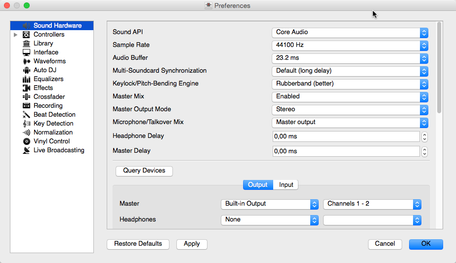
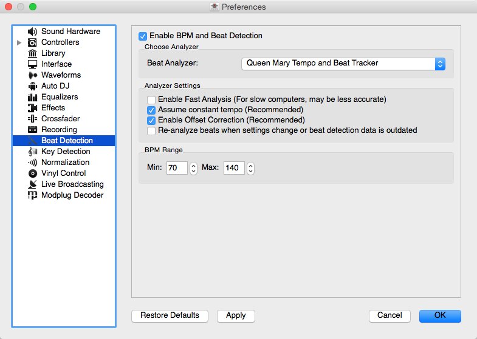
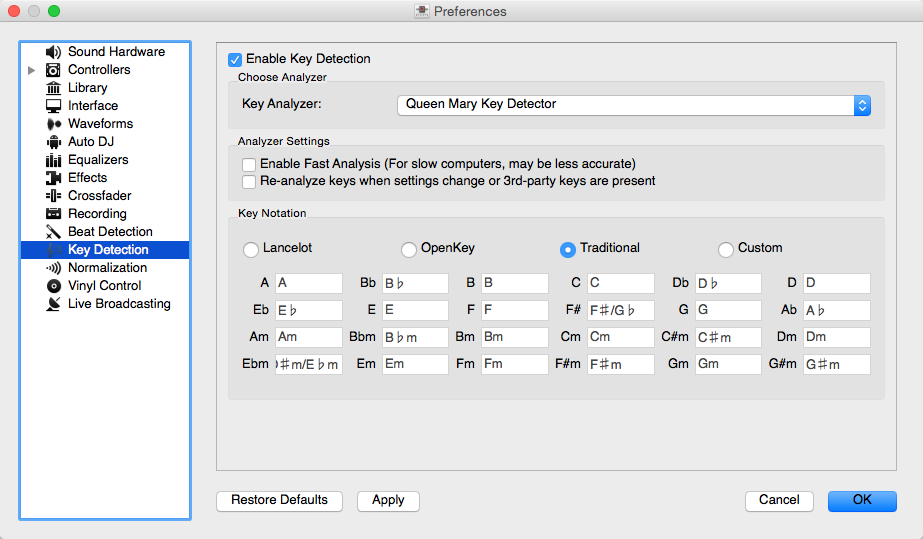
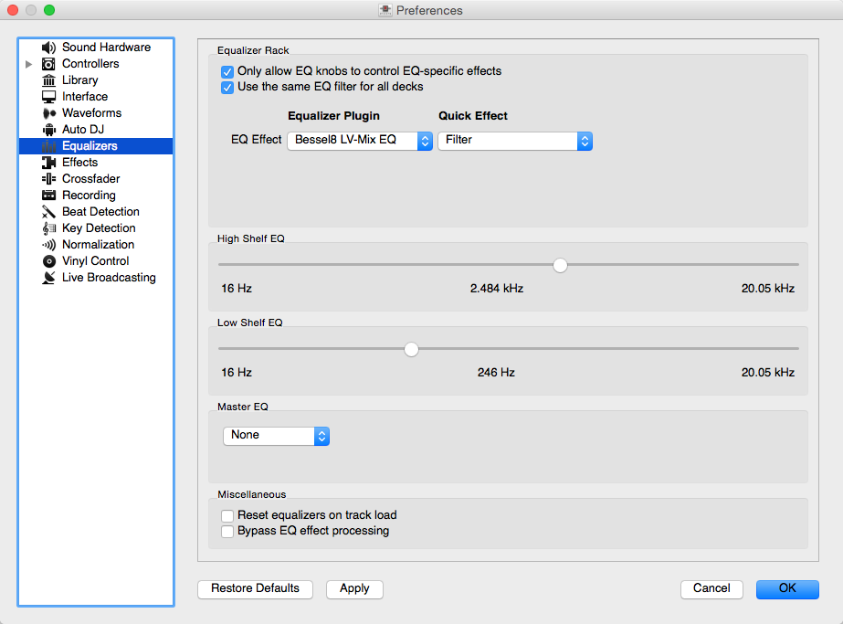

.. include:: /shortcuts.rstext

.. _preferences:

Preferences
***********
Mixxx has many options to customize in :menuselection:`Options --> Preferences`.

.. _preferences-sound-hardware:

Sound Hardware
==============

   Mixxx Sound Hardware Preferences

To achieve the best performance with Mixxx it is essential to configure your
*audio buffer*, *sample rate*, and *audio API*. These three factors largely
determine Mixxx's responsiveness and reliability. The optimal settings
will vary based on your computer and hardware quality.

For information about the different input and output options, refer to
:ref:`getting-started-sound-io`. The :ref:`hardware` chapter explains different
types of DJ hardware and how to set them up with the input and output
options. If you are using a microphone, refer to the :ref:`microphones` chapter.

.. _preferences-audio-buffer:

Audio Buffer
------------

The audio buffer is the amount of audio in milliseconds that Mixxx processes at
a time. This is a major factor that determines the latency between changing
controls in Mixxx such as moving the crossfader or pressing the play button and
hearing the audio change. For example, with an audio buffer of 23 ms, it will
take approximately 23 milliseconds for Mixxx to stop the audio after you toggle
the play button. The actual latency will be longer depending on a variety of
factors.

The audio buffer setting determines how quickly your :term:`operating system`
expects Mixxx to react. A smaller audio buffer means Mixxx will be more
responsive, but requires a faster CPU and quality audio interface. Setting your
audio buffer too small may be too much for your computer and audio interface to
handle. In this situation, Mixxx playback will be choppy and very clearly
distorted as your system will not be able to keep up with how frequently Mixxx
is trying to process audio. It is recommended to set your audio buffer as
small as your system can handle reliably without glitches. Experiment with
different audio buffer sizes to find what works for your system.

An audio buffer between 23-64 ms is acceptable if you are using Mixxx with a
keyboard/mouse or a controller. An audio buffer below 10 ms is recommended
when vinyl control is used because Mixxx will feel unresponsive otherwise.

The `Adjusting Audio Latency <https://github.com/mixxxdj/mixxx/wiki/Adjusting-Audio-Latency>`_
page on the Mixxx Wiki has tips for different operating systems
that may help you use a smaller audio buffer reliably.

.. warning:: Your system may glitch only occasionally if you have your audio
             buffer set a little too low. This will happen at unpredictable
             times and you may not notice if you are only doing brief tests of
             each audio buffer size. When you think you have found a good
             buffer size for your system, play with Mixxx for at least a half
             hour before performing to ensure no glitches happen.

.. _preferences-sample-rate:

Sample Rate
-----------

The sample rate setting in Mixxx controls how many samples (chunks of audio)
per second are produced by Mixxx. This determines the maximum frequency in
Mixxx's signal, which is half the sample rate. Humans can only hear up to 20
kHz, so there is generally no need to use more than a 44.1 kHz (44100 Hz)
sample rate for playback. Most music is published with a 44100 Hz sample rate,
and playing music in a different sample rate than the audio file slightly
reduces sound quality.

.. warning:: A sample rate of 96 kHz gives your computer less than half the time
             to as to do the same processing. Increasing the sample
             rate will increase CPU usage and likely raise the minimum audio
             buffer size you can use reliably.

.. _preferences-sound-api:

Sound API
---------

The Sound :term:`API` that Mixxx uses is the method by which Mixxx talks to your
:term:`operating system` in order to deliver audio to your audio interface. Your
choice of Sound API can drastically affect Mixxx's performance on your
computer. **Therefore it is important to take care to choose the best Sound API
available to you.**

Windows
^^^^^^^
The following Sound APIs are available on Windows:

  * **ASIO**: Good
  * **WDM-KS**: Good
  * **WASAPI**: Acceptable
  * **DirectSound**: Poor
  * **MME**: Poor

It is best to use the ASIO Sound API that bypassses the sound processing of the
Windows kernel. Using ASIO requires a driver for your audio interface from
the manufacturer. Check the manufacturer's website to see if a driver download
is available. Soundcards designed for musicians almost always have an ASIO
driver available, but audio interfaces built into computers and very cheap
audio interfaces typically do not have an ASIO driver. If there is no ASIO
driver available for your audio interface, use the WDM-KS API. There is
generally no advantage to using `ASIO4ALL <http://www.asio4all.org>`_, a wrapper
around the WDM-KS API.

GNU/Linux
^^^^^^^^^
The following Sound APIs are available on GNU/Linux:

  * **ALSA**: Good
  * **JACK**: Good
  * **OSS**: Acceptable

ALSA is the simplest sound API to configure. Using ALSA will prevent any other
programs from using the audio interface(s) that Mixxx is using.

JACK allows you to route audio between JACK-compatible applications in flexible
ways and output sound from multiple programs at the same time. However, JACK can
be complicated to set up. Unless you will be connecting Mixxx to other
JACK-compatible applications, JACK offers no advantages over ALSA. To use JACK,
start the JACK daemon *before* running Mixxx. Otherwise JACK will not appear as
a Sound API in the preferences.

Most modern GNU/Linux distributions use PulseAudio by default. When
launched from a GUI menu entry or icon, Mixxx suspends PulseAudio while it is
running so that Mixxx can use ALSA directly. Like JACK, PulseAudio allows
multiple programs to access one audio interface, but PulseAudio and JACK have
opposite design goals. PulseAudio is designed to make ordinary computer usage
such as watching videos online and listening to music easy whereas JACK is
designed for demanding low latency audio programs like Mixxx. It can be
difficult to setup JACK and PulseAudio to work well together. So, unless you
already use JACK, it is easiest to let Mixxx suspend PulseAudio and use ALSA.

If the PulseAudio plugin for alsalibs is installed on GNU/Linux, you can
choose the virtual device ``pulse``. This allows Mixxx to share the default
system audio interface with other media players. This only works if you start
Mixxx without pasuspender, which you can do by running :command:`mixxx` from a
console rather than clicking the launcher icon in a menu or on your desktop.
Since the sound stream is routed from ALSA to Pulse and back to ALSA, this adds
an additional latency of ~2 x the selected audio buffer size.

OSS is an Sound API that predates ALSA. Few modern audio interfaces have OSS
drivers.

macOS
^^^^^
CoreAudio is the only Sound API on macOS.

Other Sound Hardware options
----------------------------
* **Multi-Soundcard Synchronization**: Mixxx is able to use two or more
  :term:`audio interface <audio interface>` at a time, each with its own clock. When multiple
  audio interfaces are in use, the Mixxx engine is driven by the Master
  audio interface. Here you can select the synchronization used for the other
  audio interfaces to avoid buffer overflows or underflows.

* **Keylock/Pitch-Bending Engine**: This allows you to select the engine used
  for independent tempo and pitch changes (e.g. :term:`key lock`). Use
  :menuselection:`Soundtouch` on lower power machines (such as netbooks) or if
  you experience buffer underflows while using :term:`key lock`.

* **Master Mix**: You may disable the master mix to reduce Mixxx's CPU usage if
  you do not use the Master output, recording or live broadcasting.

* **Master Output Mode**: In Mono mode, the left and right channel are combined
  into a mono signal which is passed to both channels of your master audio
  interface. This is useful for setups where the audience cannot hear your mix
  in stereo because of speaker placement or playing in a space with lots of
  reverberation.

* **Buffer Underflow Count**: Underflows (data is not available when needed)
  indicate that some of the subsystems in Mixxx can't keep up with real-time
  deadlines imposed by the current audio buffer size. This is useful to tune the
  latency settings. If the counter increases, then increase your audio buffer
  size, decrease the sample rate setting or change the sound API setting if
  available.

Library
=======

.. _configuration-import:

Changing music directories
--------------------------

You can manually add, relink, and remove Mixxx music directories in
:menuselection:`Preferences --> Library`.

**Add a new music directory**
  Mixxx handles multiple music library folders. Click :guilabel:`Add` to
  browse to a directory where your music is stored. Mixxx will watch this
  directory and its subdirectories for new tracks.

  If you add a directory that is already in your library, or you are currently
  :ref:`rescanning your library <library-tracks>`, the operation is canceled.

  Directories can also be added from the :ref:`Computer <library-computer>`
  sidebar item inside the library.

**Relink a existing music directory**
  If an existing music directory is moved or renamed, Mixxx doesn't know where to
  find the audio files in it. The tracks will still show in library but they can't
  be loaded on decks and the tracks will become missing after the library is rescanned.

  To relink the music directory, go to :menuselection:`Preferences --> Library`,
  click :guilabel:`Relink` to select the music directory in its new location. This will
  re-establish the links to the audio files in the Mixxx library.

  Click :menuselection:`Library --> Rescan Library`, this will update the tracks and
  cause them to show up again in the library, check the location column in the library
  and you should see that it now points to the new music directory.

  The playlists, crates, history and all track data like cue points, rating, comments etc.
  are preserved after relinking the library, the tracks are also not re-analyzed as the cached
  analysis is reused. You can confirm this by checking the :term:`Key <key>` and :term:`BPM <BPM>`
  columns to see if there is a key and BPM for every track.

.. note:: It is recommended to take a backup of your Mixxx configuration files before moving or renaming music directories used in Mixxx.
          For locations in each supported :term:`OS <operating system>` as well as detailed descriptions of all settings files, go to :ref:`appendix-settings-files`.

**Remove a music directory**
  Click :guilabel:`Remove`, and Mixxx will no longer watch a directory and
  its subdirectories for new tracks, and asks what would you like to do with the
  tracks from these directories.

  * Select :guilabel:`Hide Tracks` to hide all tracks from this directory and
    subdirectories.
  * Select :guilabel:`Delete Track Metadata` to delete all metadata for these
    tracks from Mixxx permanently
  * Select :guilabel:`Leave Tracks Unchanged` to leave the tracks unchanged in
    your library.

  Hiding tracks saves their metadata in case you re-add them in the future.

  Metadata means all track details (artist, title, playcount, etc.) as well as
  beatgrids, hotcues, and loops. This choice only affects the Mixxx library.
  No files on disk will be changed or deleted.

.. hint:: When changing music directories, you might want to run a library
          rescan afterwards. Select :menuselection:`Library --> Rescan Library`
          in the menu.

.. _configuration-colors:

Colors
======

.. _configuration-colors-palette:

Selecting Palettes and Default Colors
-------------------------------------

**Track/Hotcue Palette**
  It is possible to assign colors to tracks and :ref:`hotcues <interface-hotcues>`
  to highlight them. Mixxx offers a selection of different palettes that you can
  choose colors from.

  You can also make your own palette by clicking the :guilabel:`Edit` button next
  to the palette name. This will open a the :ref:`palette editor <configuration-colors-editor>`.

**Default Hotcue Color**
  It is possible to either select a single color from the current hotcue palette
  that will be assigned to all newly created hotcue colors, or select the
  :guilabel:`By hotcue number` option. The latter will automatically assign a
  color from the palette to new hotcues based on the hotcue number.

.. _configuration-colors-editor:

Editing Palettes
----------------

The palette editor allows you add, modify, reorder and remove colors in a color
palette and save it under a new name. You can also delete custom palettes.

To modify a color, double-click it to open the color picker window.

When editing the hotcue palette, the palette editor also allows assigning a
specific default color to a hotcue number. This setting is honored when
:guilabel:`Hotcue default color` is set to `By hotcue number`.

That makes it possible to assign just a few distinct colors to your hotcues
automatically, but still have more colors available in the palette in case you
want to override the color manually.

For example, if you have a color palette consisting of 4 colors, and you
configure the palette to assign the first color to hotcue 1 and the third color
to hotcue 2, then hotcue 1 will use the first color and hotcue 2 will be
assigned the third color. The colors will repeat when setting a hotcue with a
number greater than those used in the palette. In the example above, hotcue 3
will use the first color and hotcue 4 the second color, and so on.

You can also assign the same color to more than one hotcue. For example by
separating the hotcue numbers with a comma (“2, 4, 7”), expressing a range
of numbers (“1 - 3”) or any combination of that (“6, 1 - 3, 7”).

If no color in the palette has a hotcue number assigned to it, new hotcues will
use the color at the same index from the palette (i.e. hotcue 1 will be
assigned the first color in the palette, hotcue 2 uses the second color in the
palette, etc.).

.. _configuration-colors-replace:

Replacing Hotcue Colors
-----------------------

Sometimes it's necessary to bulk replace colors of existing hotcues in your library.
Instead of changing the color of every single hotcue manually, you can
:guilabel:`Replace` to open the cue color replace dialog.

In addition to selecting the new color, you may set conditions that determine
which hotcues the new color will be assigned to.
If you tick both checkboxes, the new color will only applied if both conditions match.

.. _configuration-bpm-detection:

Beat Detection
==============

.. sectionauthor::
   T.Rafreider <trafreider@mixxx.org>
   S.Brandt <s.brandt@mixxx.org>

..
  .. TODO:: Update this section to explain the differences between the beatgrid
            and beatmap options.

Mixxx uses an ultra-precise BPM and beat detector. Manual adjustments
are redundant in many cases because Mixxx knows where the beats are.

BPM and beat detection is a complex operation. Depending on your computer and
the track's bitrate and duration this may take some time. By default Mixxx
analyzes the complete track. To accelerate beat detection on slower computers, a
“Fast Analysis” option is available. If enabled, the BPM is computed by
analyzing the first minute of the track. In most cases this does not affect the
beat detection negatively because most of today's dance music is written in a
4/4 signature with a fixed tempo.

   Mixxx preferences - BPM settings

The table below summarizes the beat detection settings:

+---------------------------------------+--------------------------------------+
| Option                                | Description                          |
+=======================================+======================================+
| Enable Fast Analysis                  | If enabled, BPM will be detected by  |
|                                       | only using the first minute of audio.|
+---------------------------------------+--------------------------------------+
| Assume constant tempo                 | If enabled, Mixxx assumes that the   |
|                                       | distances between the beats are      |
|                                       | constant. If disabled, the raw beat  |
|                                       | grid obtained by the analyzer is     |
|                                       | presented. The latter is appropriate |
|                                       | for tracks with variable tempo.      |
+---------------------------------------+--------------------------------------+
| Enable Offset Correction              | Prevents beat markers from being     |
|                                       | placed incorrectly.                  |
+---------------------------------------+--------------------------------------+
| Re-analyze beats when settings        | If enabled, Mixxx over-writes old    |
| change or beat detection data is      | beat grids from prior versions.      |
| outdated                              | Moreover, it will re-analyze the BPM |
|                                       | if your beat detection preferences   |
|                                       | change or BPM data from 3rd party    |
|                                       | programs are present.                |
+---------------------------------------+--------------------------------------+

Correcting Beat Grids
---------------------

There may be situations where BPM and beat detection do not result in a proper
beat grid.

Typically, the detected BPM is correct but the analyzer has failed to detect the
location of the first beat. Consequently, the beat markers are shifted, i.e.
the beat markers are a fixed distance from the true beat. To adjust the
beat grid, cue the track before a real beat and click the :guilabel:`Beat-grid
Adjust` button in the :ref:`interface-button-grid`.

If the detected BPM is not accurate, the corresponding beat grid will also be
inaccurate. A deviation of 0.02 BPM units from the correct BPM will cause
beatgrid alignment issues on long tracks (e.g. a club mix). If this happens,
your beatgrid may look aligned for the few minutes but you will notice a slight
drift as the song goes on. Finding the correct BPM is easy in many cases - just
follow the note below.

.. note:: If the detected BPM value is not sufficiently accurate but very close
          to an integer value, try to set the BPM value manually to the integer.

.. _configuration-key-detection:

Key Detection
=============

Mixxx comes with a high precision musical key detector to help you make smooth
mixes by ensuring that your tracks are musically compatible.

Analyzer Settings
-----------------

Key detection is a complex operation. Depending on your computer and the track's
bitrate and duration this may take some time. By default Mixxx analyzes the
complete track. To accelerate key detection on slower computers, a “Fast
Analysis” option is available. If enabled, the key is computed by analyzing the
first minute of the track.

   Mixxx preferences - Key settings

The table below summarizes the Key detection settings:

+---------------------------------------+--------------------------------------+
| Option                                | Description                          |
+=======================================+======================================+
| Enable Fast Analysis                  | If enabled, the key will be detected |
|                                       | by using only the first minute of    |
|                                       | audio.                               |
+---------------------------------------+--------------------------------------+
| Re-analyze key when settings          | If enabled, Mixxx will re-analyse    |
| change or Key detection data is       | tracks if you select a different key |
| outdated                              | detection plugin or the key was      |
|                                       | generated by a program other than    |
|                                       | Mixxx.                               |
+---------------------------------------+--------------------------------------+
| Key Notation                          | Change the way keys are displayed    |
|                                       | in the library.                      |
+---------------------------------------+--------------------------------------+

.. _preferences-equalizers:

Equalizers
==========

.. sectionauthor::
   Daniel Schürmann <daschuer@mixxx.org>

    Equalizer Preferences

:menuselection:`Preferences --> Equalizer` allows you to setup the equalizers.

* **Equalizer Rack**: The Equalizer Rack is a special effect rack that is
  connected to the deck's equalizer and filter controls.

  In this section you can select the equalizers and quick effects that are used
  with the decks.

* **Equalizer Plugin**: Here you can select the effect that is used as the
  mixing EQ in each deck. By default only built-in equalizers are
  displayed. Unchecking :menuselection:`Only allow EQ knobs to control EQ
  specific effects` allows you to select any other effect.

* **Quick Effect**: Here you can select the effect that is controlled by the
  dedicated filter knob in each deck. By default only built-in filter effects
  are selected for all decks, but that can be changed as above.

* **High/Low Shelf EQ**: This slider sets the crossover frequencies of the
  mixing EQ. It controls which frequency range is affected by the low, mid, and
  high channel EQ knobs. By default the low knob controls the bass and sub bass
  range up to 246 Hz. The mid knob controls the mid range up to 2.5 kHz.
  The remaining treble range is controlled by the high knob.

* **Master EQ**: This section allows you to setup an EQ that affects the master
  output.

Mixing Equalizers
-----------------

Mixxx offers three types of mixing equalizers with a full kill option. These
equalizers are "isolators", adapted from analog crossover networks. Each EQ is
combination of a high shelf filter, a band pass filter, and a low shelf filter.
Each EQ type has a unique sound, so try them out to find out which one you
prefer.

The Bessel EQs with Lipshitz and Vanderkooy Mix (LV-Mix) do not alter the sound
or take any processing time when their knobs are in the center position. They
activate once you adjust an EQ knob.

The Linkwitz-Riley EQ on the other hand always applies a minimum, natural
sounding phase shift to the sound. Their processing time does not change when
you adjust the EQ knobs.

The following table compares some technical parameters:

+----------------+--------+------------+-------------+-------------+-----------+
| Type           | cut    | roll-off   | phase shift | bit perfect | CPU usage |
+================+========+============+=============+=============+===========+
| Bessel4 LV-Mix | soft   | -24 db/Oct | linear      | yes         | low       |
+----------------+--------+------------+-------------+-------------+-----------+
| Bessel8 LV-Mix | medium | -48 db/Oct | linear      | yes         | medium    |
+----------------+--------+------------+-------------+-------------+-----------+
| Linkwitz-Riley | sharp  | -48 db/Oct | minimum     | no          | high      |
+----------------+--------+------------+-------------+-------------+-----------+

 * cut: the frequency response (curve form) at the cross over frequency.
 * roll-off: The steepness of the EQ bands.
 * linear phase: No phase distortion, all frequencies are processed with the
   same group delay.
 * minimum phase: A natural phase distortion, the group delay changes by the
   frequency.
 * bit perfect: Whether the EQ leaves the original samples untouched when the EQ
   is at unity.
 * CPU usage: Processing time needed to calculate the EQ output.
