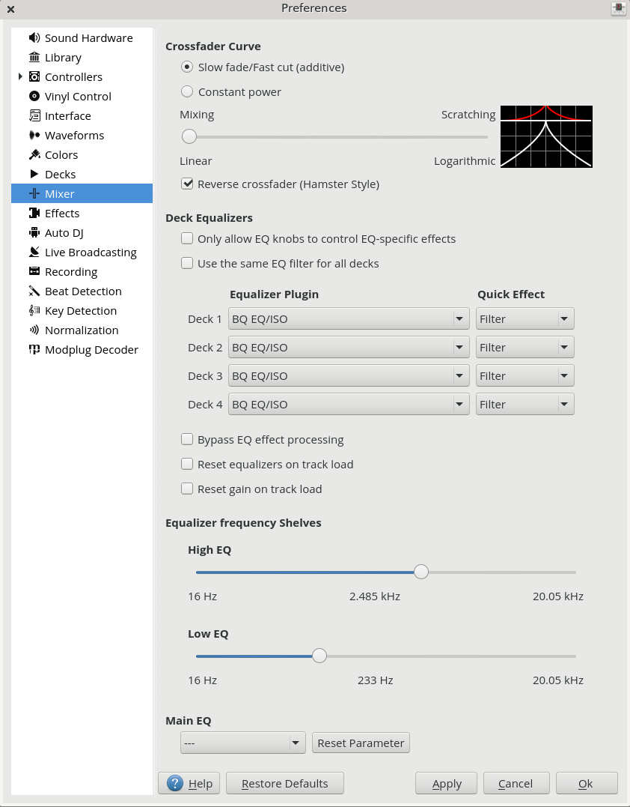

.. include:: /shortcuts.rstext

.. _preferences-mixer:

Mixer
=====

.. sectionauthor::
   Daniel Schürmann <daschuer@mixxx.org>

    Mixer Preferences

:menuselection:`Preferences --> Mixer` allows you to adjust the crossfader curve,
setup the equalizers and Quick Effects for each deck and select and adjust the
equalizer effect for the main output.

* **Crossfader Curve**: Adjust how decks assigned to the left and right side of the
  crossfader are blended.

* **Deck Equalizers**: In this section you can select the equalizers and
  quick effects that are used with the decks.

* **Equalizer Plugin**: Here you can select the effect that is used as the
  mixing EQ in each deck. By default only built-in equalizers are
  displayed. Unchecking :menuselection:`Only allow EQ knobs to control EQ
  specific effects` allows you to select any other effect.

* **Quick Effect**: Here you can select the effect that is controlled by the
  dedicated filter knob in each deck. By default only built-in filter effects
  are selected for all decks, but that can be changed as above.

* **High/Low Shelf EQ**: This slider sets the crossover frequencies of the
  mixing EQ. It controls which frequency range is affected by the low, mid, and
  high channel EQ knobs. By default the low knob controls the bass and sub bass
  range up to 246 Hz. The mid knob controls the mid range up to 2.5 kHz.
  The remaining treble range is controlled by the high knob.

* **Main EQ**: This section allows you to setup an EQ that affects the
  term:`main output`.

Mixing Equalizers
-----------------

Mixxx offers three types of mixing equalizers with a full kill option. These
equalizers are "isolators", adapted from analog crossover networks. Each EQ is
combination of a high shelf filter, a band pass filter, and a low shelf filter.
Each EQ type has a unique sound, so try them out to find out which one you
prefer.

The Bessel EQs with Lipshitz and Vanderkooy Mix (LV-Mix) do not alter the sound
or take any processing time when their knobs are in the center position. They
activate once you adjust an EQ knob.

The Linkwitz-Riley EQ on the other hand always applies a minimum, natural
sounding phase shift to the sound. Their processing time does not change when
you adjust the EQ knobs.

The following table compares some technical parameters:

+----------------+--------+------------+-------------+-------------+-----------+
| Type           | cut    | roll-off   | phase shift | bit perfect | CPU usage |
+================+========+============+=============+=============+===========+
| Bessel4 LV-Mix | soft   | -24 db/Oct | linear      | yes         | low       |
+----------------+--------+------------+-------------+-------------+-----------+
| Bessel8 LV-Mix | medium | -48 db/Oct | linear      | yes         | medium    |
+----------------+--------+------------+-------------+-------------+-----------+
| Linkwitz-Riley | sharp  | -48 db/Oct | minimum     | no          | high      |
+----------------+--------+------------+-------------+-------------+-----------+

 * cut: the frequency response (curve form) at the cross over frequency.
 * roll-off: The steepness of the EQ bands.
 * linear phase: No phase distortion, all frequencies are processed with the
   same group delay.
 * minimum phase: A natural phase distortion, the group delay changes by the
   frequency.
 * bit perfect: Whether the EQ leaves the original samples untouched when the EQ
   is at unity.
 * CPU usage: Processing time needed to calculate the EQ output.
