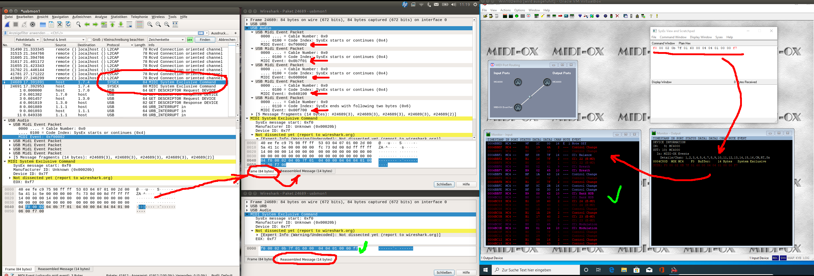
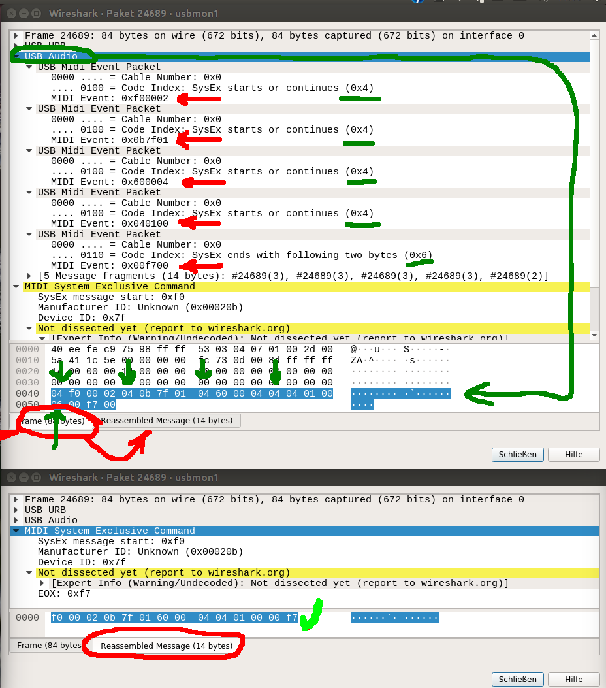

.. include:: /shortcuts.rstext

.. _reverse-engineering:

Reverse Engineering DJ Hardware
*******************************

For most controllers, watching the incoming MIDI messages sent to Mixxx
and referring to the manufacturer’s documentation is enough to find all
you need to map a controller to Mixxx. Unfortunately, it is common for
manufacturers’ documentation to be incomplete (for example, not
documenting the MIDI message to request the position of all the knobs
and faders when the DJ application starts) or completely missing. In
these cases, you’ll need to reverse engineer how the hardware
communicates with other DJ software to get it working with Mixxx.

.. seealso:: :ref:`midi-crash-course` for more background information about
   interpreting MIDI messages.

Observing MIDI/HID messages with Mixxx
--------------------------------------

1. Start Mixxx from a command prompt using the ``--controllerDebug``
   option like so:

   - Linux: ``user@machine:~$ mixxx --controllerDebug``
   - Windows: ``C:\Program Files\Mixxx>mixxx --controllerDebug``
   - macOS: ``$ open -a mixxx --args --controllerDebug``

2. Look at the output

   - Watch the console output or look at the
     :ref:`Mixxx.log <appendix-settings-files>` file which will contain all of
     the MIDI messages Mixxx receives.
     As you manipulate the controller, the MIDI commands it sends will be printed
     to the screen/logged to the file. Compare the status (first) byte in each line
     with the table above and note which button/slider/control sends what message.
   - For example, when you move a slider, you might
     see: ::

         Debug: [...]: "MIDI ch 1: opcode: B0, ctrl: 2, val: 3D"
         Debug: [...]: "MIDI ch 1: opcode: B0, ctrl: 2, val: 3A"
         Debug: [...]: "MIDI ch 1: opcode: B0, ctrl: 2, val: 3D"
         Debug: [...]: "MIDI ch 1: opcode: B0, ctrl: 2, val: 3B"
         Debug: [...]: "MIDI ch 1: opcode: B0, ctrl: 2, val: 3C"``

     In this instance, it’s sending 0xB0 (which when we look at the
     :ref:`table <midi-crash-course>`, we see that it’s a Control Change message on
     channel 1).
     We also see that the second byte, 0x02 in this case, is the control number
     that was moved, and the third is the value or position of that control, which
     you can ignore for the purposes of mapping.

3. Add the byte values to a ``<control>`` block in the XML file
   Plug the first two bytes into a ``<control>`` XML block for ``<status>`` and
   ``<midino>`` respectively.
   This is detailed on the :ref:`midi-mapping-file-format` page.

Denon Engine DJ Hardware
------------------------

`Geoffrey Huntley <https://github.com/ghuntley>`__ has been able to
`extract the EngineOS <https://github.com/ghuntley/denon-prime4>`__
running on the Denon PRIME 4 controller. Along with EngineOS, a bunch of
`controller mapping definitions have been
“leaked” <https://github.com/ghuntley/denon-prime4/tree/trunk/engineos/usr/Engine/AssignmentFiles/PresetAssignmentFiles>`__.
This includes the following Denon hardware:

========= =============
Denon ID  Consumer name
========= =============
JC11      PRIME 4
JC16      PRIME 2
JC20      LC6000
JP07      SC5000
JP07      SE1000
JP08      SC5000M
JP11      PRIME GO
JP13      SC6000
JP14      SC6000M
JP20      SCX-2
JP21      SCX-4
NH08/NH10 MIXSTREAM PRO
NH09      MIXSTREAM
========= =============

The information contained in these files can significantly speed up the
tedious parts of Reverse-Engineering hardware. For example, the `Prime
GO
Mapping <https://github.com/ghuntley/denon-prime4/blob/dfb7c339a2f6c29909d4bd24abadf858ae7c6b9e/engineos/usr/Engine/AssignmentFiles/PresetAssignmentFiles/JP11/JP11_Controller_Assignments.qml>`__
contains this QML snippet:

.. code:: qml

   BrowseEncoder {
       pushNote: 6
       turnCC: 5
       ledType: LedType.Simple
   }

You can easily read from this, that the controller likely sends a midi
message with the “address” 6 (the second byte in the three midi bytes),
when the browse encoder is being pressed and a midi CC message with
“address”/“control number” 6 when its being turned. Unfortunately, not
all required information can be read from these files. How do you
interpret the values coming from the hardware? What values do you need
to send to which “address” to control the LED ring around the encoder?
You probably need to do some guesswork from here. Its plausible that the
address of the LED ring is the same as its related input controls (5 or
6). We know the ``ledType`` is ``Simple``, but what does that mean
exactly? We can see from looking at the actual controller that its a
single-color led, but is it just on-off or can it be dimmed? Figuring
that out involves guesswork where you have to find out what works by
plain trial-and-error. The sections below explain some more tools how
you can make this easier.

Before starting work on these controllers, you should consider
researching whether something is known about the other controllers in
the family above have already been reverse engineered as many things are
likely shared between them (how to interpret LED values and so forth).

Observing MIDI/HID messages with other DJ software
--------------------------------------------------

`Wireshark <https://wireshark.org/>`__ is an excellent, free, cross
platform program to record and analyze computer communication data. It
is most known for analyzing network traffic, but it can also be used for
USB traffic. Wireshark has a `USB Audio
filter <https://www.wireshark.org/docs/dfref/u/usbaudio.html>`__ that
can be used to analyze traffic for USB Audio and MIDI devices (MIDI is
part of the USB Audio Class standard). Wireshark also has a `USB HID
filter <https://www.wireshark.org/docs/dfref/u/usbhid.html>`__.

Use ``usbaudio.midi.event`` as the filter in Wireshark to separate audio
signals from MIDI. The ``usbaudio.sysex.reassembled.data`` filter shows
only system exclusive (sysex) messages.

Running VMs on a Linux host
~~~~~~~~~~~~~~~~~~~~~~~~~~~

If you are using Linux, you can run other DJ software in a Windows
virtual machine and record the USB traffic with Wireshark (macOS is a
hassle to run in a VM but Windows is easy). You can run Wireshark on the
Linux host or inside the virtual machine, but if you run Wireshark in
Linux you don’t need to bother transferring the captured traffic files
out of the VM.

Microsoft makes the `ISO image
installer <https://www.microsoft.com/en-us/software-download/windows10ISO>`__
available for no cost. When Windows asks for a product key during
installation, you can mark that you don’t have one. Windows 10 will not
use multiple CPUs on different sockets, so if you want to use multiple
CPU cores, configure the VM to use a single CPU socket with multiple
cores. Configure this before installing Windows so the installation goes
faster.

You need to redirect the USB device to the VM for the VM to use it.

Make sure you have Intel VT-x or AMD-V enabled in your EFI/BIOS
settings.

It is recommended to use at least 35 GB for the disk image to allow room
for Windows, the DJ software, and a bit of music to test with (Traktor
requires at least 3 GB of free space).

QEMU/KVM
^^^^^^^^

Install the `SPICE guest
tools <https://www.spice-space.org/download/windows/spice-guest-tools/spice-guest-tools-latest.exe>`__
in the VM after installing Windows for seamless integration with the
host mouse and keyboard.

There are various options for display drivers as detailed in this `blog
post <https://www.kraxel.org/blog/2019/09/display-devices-in-qemu/>`__
and the `Arch Linux
wiki <https://wiki.archlinux.org/index.php/QEMU/Guest_graphics_acceleration>`__.
Traktor seems to work best with VirtIO, even though there is no usable
virtio-gpu driver for Windows that supports OpenGL (this was started as
a `GSOC project in
2017 <https://gist.github.com/Keenuts/199184f9a6d7a68d9a62cf0011147c0b>`__
but `remains
incomplete <https://gitlab.freedesktop.org/spice/win32/virtio-gpu-wddm-dod/-/issues/1>`__
as of February 2022). Traktor does not seem to work well with Intel
GVT-g (tested with Intel UHD Graphics 620 on a Core i7 8550U, Linux
kernel 5.6.19-300.rt10.2.fc32.ccrma.x86_64+rt). If you have a discrete
GPU, passing that through as a PCI device to the VM may be worth
a try. If that is not an option and you want to run an application that
requires OpenGL, you can use this `Mesa3D build for
Windows <https://fdossena.com/?p=mesa/index.frag>`__ which renders
OpenGL on the CPU by copying the DLL to the same directory as the .exe
file you are running.

Audio works best with WASAPI Exclusive Mode. Adjust the audio buffer to
the largest it can be. Audio will crackle frequently, but not so much
that it’s unusable for reverse engineering. ASIO crackles so much that
it is unusable. Curiously, the option for using WASAPI disappears from
Traktor when the ASIO driver for the Kontrol S4 Mk3 is installed, so
don’t install the ASIO drivers for Native Instruments devices.

VirtualBox
^^^^^^^^^^

Install the VirtualBox guest extensions with experimental 3D
acceleration.

Wireshark CLI
~~~~~~~~~~~~~

First, you need to load the kernel module that allows monitoring the USB
connection:

::

   $ sudo modprobe usbmon

Now run ``lsusb`` to find out with USB bus your controller is connected
to, e.g.:

::

   $ lsusb
   [...]
   Bus 001 Device 016: ID 0582:0208 Roland Corp. DJ-505

The controller in the example is connected to Bus 001, which means that
you need to use the ``usbmon1`` interface for capturing data.

Next, you can start monitoring the outgoing USB packets by using
``tshark`` or ``Wireshark``. If you’re using the former, just run:

::

   $ tshark -i usbmon1 -Y 'usb.capdata && usb.src == host' -e usb.capdata -Tfields
   Capturing on 'usbmon1'

This will print all outgoing USB packets on interface ``usbmon1`` that
have a ``usb.capdata`` field (that contains the MIDI messages).

The captured data will start with an extra byte which you’ll have to
ignore, e.g.:

================= ============
Captured USB data MIDI message
================= ============
``0990007f``      ``90 00 7f``
``0bbf6400``      ``bf 64 00``
``09900100``      ``90 01 00``
================= ============

For HID, run:

::

   tshark -i usbmon1 -Y '(usb.capdata && usb.transfer_type == 1) || usbhid.data' -e usb.capdata -e usbhid.data -Tfields

The ``usb.capdata`` filter only matches input and
``usb.transfer_type == 1`` filters for USB interrupt transfers.
``usbhid.data`` only matches HID output packets. To filter for specific
input reports, use ``usb.capdata[0] == REPORTID``. To filter for
specific output reports, use ``usbhid.data.report_id == REPORTID``.

Wireshark GUI example
~~~~~~~~~~~~~~~~~~~~~

Here you can find a Wireshark example running wireshark-gtk (for KDE you
may want use wireshark-qt) GUI on Ubuntu using the left screen and Win10
with MIDI-OX and Serato in VirtualBox on the right screen. We wanna
check for the Serato communication with Denon MC4000 and MC7000 to find
out what information the Software and controllers exchange during
startup of Serato.

To set up Wireshark I recommend you to check the `Wireshark
WIKI <https://wiki.wireshark.org/>`__ and your distribution specific
documentation. Another source you need to look at is the `MIDI
Manufacturer ID numbers <https://midi.org/sysexidtable>`__.

To keep analyzing as simple as possible it is recommended to capture USB
data only for a few seconds while you do one specific action. Capturing
30 seconds while starting Serato can easily record 70-100MB of data.

Denon MC4000 example
^^^^^^^^^^^^^^^^^^^^

Starting with the Denon MC4000 to learn something about the USB traffic
signals and how to find the SysEx messages that Serato exchange with the
MC4000 during start …

Analyzing the Wireshark record from left to right side of the picture
above.

1) left side window called “\*usbmon1”: inside either you use the filter
or sort column “Protocol” and look for “SYSEX”. The example shows 2
lines where we check the first one in more detail by double click the
line so the details window will open with all information about that
package and brings us to ….

2) the 2nd window called “Wireshark - Packet 24689 - usbmon1”. In there
you gonna find the sections “Frame”, “USB URB” and “USB Audio”. The
later one we are interested in so open that section by clicking on the
triangle. Several MIDI signals are present indicated by the red arrows.
Here a more detailed view:

The raw signal shows blocks of 3 MIDI signals (red arrows) always
starting with a 04 to indicate that another MIDI packet is coming (green
underline and arrows). The last packet is indicated by either 05 or 06
(here 06). Changing the TAB in that window to “Reassembled Message” will
show the MIDI signal only. Wireshark just deletes the control bytes 04
and 06 and assembles the SysEx message from the 5 Event Packets.

3) So when checking and sending that SysEx message (see right side of
the first picture)

::

   f0 00 02 0b 7f 01 60 00 04 04 01 00 00 f7

from MIDI-OX to the controller then the MC4000 replies back with the
current status of all knobs. This message can now be used on the MC4000
MIDI script file inside the init section as following:

::

   var byteArray = [ 0xF0, 0x00, 0x02, 0x0B, 0x7F, 0x01, 0x60, 0x00, 0x04, 0x04, 0x01, 0x00, 0x00, 0xF7 ];
   midi.sendSysexMsg(byteArray,byteArray.length);

and Mixxx also will recognise the knobs positions during start.

Denon MC7000 example
^^^^^^^^^^^^^^^^^^^^

Now the MC7000 is not that straight forward as Denon hides all the
specifications including MIDI signals.

Looking to the USB traffic, there is no Protocol SysEx that we can
search for. But we know the manufacturer is Denon and so we can look for
the `MIDI Manufacturer
ID <https://www.midi.org/specifications/item/manufacturer-id-numbers>`__.
Searching for Denon gives the Midi ID “00 02 0B”. Searching that string
does not give any result though.

What we have learned from the MC4000 is important now …

- The SysEx message always starts with f0 and ends with f7
- There are control bytes grouping 3 MIDI bytes: 04 to start/continue a
  message and 05 or 06 to indicate the last package.

So for Denon MC7000 a better HEX search is

::

   04 f0 00 02 04 0B

- 04 -> Control Byte to start a MIDI message block
- f0 -> SysEx message start
- 00 02 -> Denon Manufacturer ID
- 04 -> Control Byte to continue the next 3 MIDI bytes
- 0b -> Denon Manufacturer ID

Unfortunately, there is no result either.

We know that Denon partnered with Serato selling the bundle of Hard- and
Software. So maybe we are more lucky with the MIDI Manufacturer ID of
Serato which would be:

::

   00 20 7F

Searching HEX Value inside the USB dump would look like this:

::

   04 f0 00 20 04 7f

and we get several results that look like MIDI SysEx messages. They are
stored in “Leftover Capture Data”. Now some manual work is needed as
Wireshark cannot re-assemble the MIDI bytes as they are not declared as
such.

[[/media/sysex4.png\|]]

1) So this means to copy all Messages found starting with f0 and Serato
Manufacturer ID and end with f7 to a text file.

2) Manually delete all control bytes. The first byte 04 the 5th byte 04
the 9th byte 04 and so on. Remember that the last 3 MIDI bytes are
indicated by a 05 or 06 that must be deleted as well.

3) Send all SysEx messages to the controller using MIDI-OX and look for
the response. In this example the 3rd message seems to be the right one
as there are many answers coming back from the controller.

This is exactly the SysEx message that Serato uses for other controllers
in order to receive feedback.

So in the MIDI script file it can be used like:

::

   var byteArray = [ 0xF0, 0x00, 0x20, 0x7F, 0x03, 0x01, 0xF7 ];
   midi.sendSysexMsg(byteArray,byteArray.length);

to set the knobs and sliders to the actual value of the hardware
controller.

Windows
~~~~~~~

1. explain software used
2. explain minimizing bus traffic
3. mention wsl as workflow accelerator
4. usb RE-workflows
5. timed captures
6. Explain the difference between real USB vs USB-capture

`MIDI OX <http://www.midiox.com/>`__ can intercept MIDI messages from
programs other than Mixxx.

macOS
~~~~~

`MIDI Monitor <http://www.snoize.com/MIDIMonitor/>`__ and
`MIDISimulator <http://www.macupdate.com/app/mac/35645/midisimulator>`__
are two different applications that can be used to observe MIDI signals
on macOS.

Linux alsa-utils MIDI tools
---------------------------

alsa-utils on Linux has a few tools helpful for working with MIDI
devices.

Open a console and issue ``amidi -l``. This will list the attached MIDI
device(s) like so:

::

   Dir Device    Name
   IO  hw:1,0,0  SCS.3d MIDI 1

Then, to dump the data, you just issue ``amidi -p hw:1,0,0 -d`` (Replace
hw:1,0,0 with whatever device ID your controller shows in the list.)
You’ll get output like this:

::

   B0 02 3D
   B0 02 3A
   B0 02 3D
   B0 02 3B
   B0 02 3C

See above for how to interpret this data.

amidi can also be used to send MIDI messages to your controller with the
-S option. Specify each byte as a hexadecimal number and separate the
bytes by spaces. For example:

::

   amidi -p hw:1,0,0 -S "b0 02 7f"

The program ``aseqdump`` works similarly, but is a bit more verbose than
a series of hexadecimal numbers:

::

   $ aseqdump -l
    Port    Client name                      Port name
     0:0    System                           Timer
     0:1    System                           Announce
    14:0    Midi Through                     Midi Through Port-0
    20:0    Tweaker                          Tweaker MIDI 1
    20:1    Tweaker                          Tweaker MIDI 2
   $ aseqdump -p 20:0
   Waiting for data. Press Ctrl+C to end.
   Source  Event                  Ch  Data
    20:0   Note on                 0, note 1, velocity 127
    20:0   Note off                0, note 1
    20:0   Note on                 0, note 2, velocity 127
    20:0   Note off                0, note 2
    20:0   Note on                 0, note 3, velocity 127
    20:0   Note off                0, note 3
