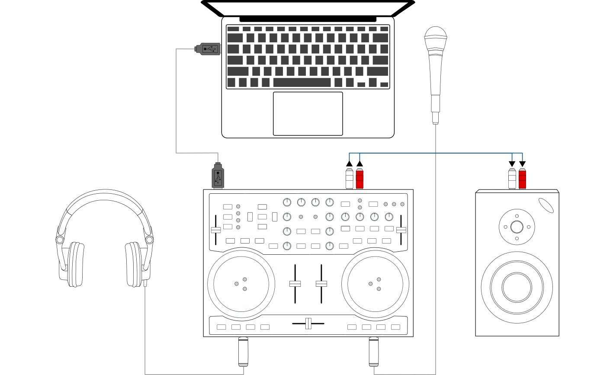

Hardware Setup
**************

.. sectionauthor::
   T.Rafreider <trafreider@mixxx.org>
   S.Brandt <s.brandt@mixxx.org>
   Be <be.0@gmx.com>

This chapter describes the most common hardware setups to serve as examples. We
will go over the setup of soundcards, controllers, and timecode records/CDs.

Headphone cueing, or just cueing, is a crucial aspect of DJing that separates
DJing from merely making a playlist. Headphone cueing allows you to preview the
next track you would like to mix in your headphones. The audience will not hear
what you are cueing in your headphones until you decide to mix it in.

In order to use headphone cueing, you will need at least 2 separate audio
outputs, typically provided by a USB soundcard (also known as an “audio
interface”). The headphone jack on most laptops is not a second audio output.
Rather, plugging headphones into the jack simply redirects the laptop's single
stereo output from its speakers to your headphones. A splitter cable can be used
to separate the stereo output of a headphone jack into two separate mono outputs
for headphone cueing, but it is recommended to use a sound card with at least
four mono outputs (for two stereo pairs). Such sound cards tend to be higher quality
than those built into laptops and allow your mix to be enjoyed in stereo by your
audience.

Unlike some proprietary DJ systems, Mixxx can use any soundcard and any
:term:`MIDI` or :term:`HID` controller that your
:term:`OS <operating system>` has drivers to use. Mixxx can use multiple audio
devices simultaneously. Depending on your budget and application area, your
sound setup and requirements may vary. This section provides useful information
for club, hobby, and radio DJs alike.

.. seealso:: The `Mixxx DJ Hardware Guide <http://mixxx.org/wiki/doku.php/hardware_compatibility>`_
             lists controllers and sound cards with information about
             their compatibility with Mixxx and different
             :term:`operating systems<operating system>`. It also has
             suggestions for what to consider when you are shopping for DJ
             equipment.

.. _setup-laptop-only:

Laptop Only
===========

.. figure:: ../_static/Mixxx-111-Preferences-Soundhardware.png
   :align: center
   :width: 75%
   :figwidth: 100%
   :alt: Using Mixxx with your built-in sound card
   :figclass: pretty-figures

   Using Mixxx with your built-in sound card

There is no need to buy any equipment other than a computer if you do not
require headphone :term:`cueing`. The built-in soundcard on most computers and
laptops comes with a single stereo line-out and a microphone input.

The figure above depicts how the sound configuration might look. The stereo
output of your soundcard (channels 1-2) will be connected to the **Master
out**.

#. Open :menuselection:`Preferences --> Sound Hardware`
#. Select the :guilabel:`Output` tab
#. From the :guilabel:`Master` drop-down menu, select your built-in soundcard,
   then :guilabel:`Channels 1-2`
#. Depending on your soundcard, you can specify a
   :ref:`microphone <interface-mic>`

   a. Use your built-in microphone or connect a microphone to your computer
   b. Check that your microphone is detected by your :term:`OS <operating system>`
   c. Open the :guilabel:`Input` tab
   d. From the :guilabel:`Microphone` drop-down menu, select the input your
      microphone is connected to
#. Click :guilabel:`Apply` to save the changes.

This minimal configuration may be suitable for **radio DJs** who do not need
headphone cueing.

.. _setup-laptop-with-splitter:

Laptop and Splitter Cable
=========================

.. figure:: ../_static/mixxx_setup_splitter_adaptors.png
   :align: center
   :width: 75%
   :figwidth: 100%
   :alt: Using Mixxx with your built-in sound card and a DJ splitter cable
   :figclass: pretty-figures

The cheapest way to DJ and :term:`cue` with headphones uses a
stereo-to-mono DJ splitter cable (also known as a “Y cable”) plugged
into the headphone jack of a laptop or other computer. This cable divides the
stereo output from a single jack into two separate mono singals.

This setup allows you to start DJing without having to invest in expensive
equipment. However, your audience will not be able to enjoy music producers'
artistic use of stereophonic sound (although many club PA systems are wired in
mono anyway). Furthermore, soundcards built into computers are usually low
quality.

**Using a built-in soundcard and a stereo-to-mono splitter**

#. Open :menuselection:`Preferences --> Sound Hardware`
#. Select the :guilabel:`Output` tab
#. Check that your headphones are plugged into the side of the cable with a
   headphones symbol and that the speakers are plugged into the side of the cable
   with a speaker symbol.
#. From the :guilabel:`Master` drop-down menu, select your built-in soundcard,
   then :guilabel:`Channel 1`
#. From the :guilabel:`Headphones` drop-down menu, select your built-in
   soundcard, then :guilabel:`Channel 2`
#. Click :guilabel:`Apply` to save the changes.

.. seealso:: See `the wiki <http://mixxx.org/wiki/doku.php/hardware_compatibility#splitter_cables>`_
             for a list of DJ splitter cables.

.. warning:: Most splitter cables, particularly those marketed as headphone
             splitter cables, output the same stereo signal to two headphone
             jacks and will not work for this DJ setup. Also, if you use a
             generic stereo-to-mono splitter adapter, you may only be able to
             hear out of one side of your speakers and headphones. DJ splitter
             cables allow you to hear the same mono signal on both sides of your
             headphones and speakers.

.. _setup-laptop-and-external-card:

Laptop and External USB Soundcard
=================================

.. figure:: ../_static/mixxx_setup_ext_soundcard.png
   :align: center
   :width: 75%
   :figwidth: 100%
   :alt: Using Mixxx together with an external soundcard
   :figclass: pretty-figures

   Using Mixxx together with an external soundcard

The most common setup for DJing is a laptop and a soundcard with 2 stereo
outputs (4 channels). The first stereo output (channels 1-2) is used as the
master output and supplies the main mix to the audience. With the second stereo
output (channels 3-4) you can :term:`cue <cueing>` and :ref:`preview
<library-previewing-tracks>` the next track in your headphones. If
your soundcard only has one stereo output, you can use multiple soundcards
to achieve a similar setup. Most DJ controllers above the most basic models
include a soundcard with 2 stereo outputs (see
:ref:`setup-controller-and-external-card` for details).

The configuration depicted above uses two soundcards. This setup is the bare
minimum for serious DJing. Without any extra gear, the DJ can control Mixxx via
mouse and keyboard. For more information see :ref:`controlling mixxx`.

**Using two soundcards (built-in + external)**

#. Open :menuselection:`Preferences --> Sound Hardware`
#. Select the :guilabel:`Output` tab
#. From the :guilabel:`Master` drop-down menu, select the external soundcard,
   then :guilabel:`Channels 1-2`
#. From the :guilabel:`Headphones` drop-down menu, select the built-in
   soundcard, then :guilabel:`Channels 1-2`
#. Click :guilabel:`Apply` to save the changes.

**Using an external multi-channel soundcard**

#. Open :menuselection:`Preferences --> Sound Hardware`
#. Select the :guilabel:`Output` tab
#. From the :guilabel:`Master` drop-down menu, select the external soundcard,
   then :guilabel:`Channels 1-2`
#. From the :guilabel:`Headphones` drop-down menu, select the external
   soundcard, then :guilabel:`Channels 3-4`
#. Click :guilabel:`Apply` to save the changes.

.. hint:: If you have technical difficulties with your external sound card, a
          :ref:`splitter cable<setup-laptop-with-splitter>` can be used as a
          portable, inexpensive backup.

.. note:: Soundcards designed and marketed for recording often have a knob that
          allows you to mix its input directly with its output. This function
          can be helpful when recording (to hear the input without the latency
          of going through the computer), but the master output level will be
          low even if there is no sound on the inputs. To get the maximum output
          level from these soundcards, you may need to set this knob to only
          send output from the computer and none from the input(s).

.. _setup-controller-and-external-card:

Laptop and MIDI or HID Controller
=================================

Most DJs prefer the tactile and intuitive control provided by DJ MIDI or HID
controllers over only a keyboard and mouse. Mixxx can work with any :term:`MIDI`
or :term:`HID` :term:`controller` as long as there is a mapping file
to tell Mixxx how to understand the controller's signals. Mixxx comes bundled
with a number of MIDI and HID mapping presets, which are listed in the
`Mixxx DJ Hardware Guide <http://mixxx.org/wiki/doku.php/hardware_compatibility>`_
on the wiki. For controllers that Mixxx does not yet support, you can `search
the forum <http://mixxx.org/forums/search.php?fid[]=7>`_ to see if anyone has
started a mapping. You can also start one yourself using the information in the
`Controller Mapping Documentation <http://mixxx.org/wiki/doku.php/start#controller_mapping_documentation>`_
on the wiki.

Controllers with an integrated soundcard
----------------------------------------

Many DJ controllers include an integrated *multi-channel* soundcard.
A setup with this kind of controller may look like the diagram below:

   Using Mixxx together with a DJ controller and integrated soundcard

**Using a controller with an integrated multi-channel soundcard**

#. Open :menuselection:`Preferences --> Sound Hardware`
#. Select the :guilabel:`Output` tab
#. From the :guilabel:`Master` drop-down menu, select your controller's
   soundcard, then :guilabel:`Channels 1-2`
#. From the :guilabel:`Headphones` drop-down menu, select your controller's
   soundcard, then :guilabel:`Channels 3-4`
#. Click :guilabel:`Apply` to save the changes.

Controllers without an integrated sound card
--------------------------------------------

Controllers without an integrated soundcard can be used together with a USB
soundcard as depicted in the diagram below:

.. figure:: ../_static/mixxx_setup_midi_with_ext_sound.png
   :align: center
   :width: 75%
   :figwidth: 100%
   :alt: Using Mixxx together with a DJ controller and external soundcard
   :figclass: pretty-figures

   Using Mixxx together with a DJ controller and external soundcard

**Using a controller without an integrated soundcard**

#. Open :menuselection:`Preferences --> Sound Hardware`
#. Select the :guilabel:`Output` tab
#. From the :guilabel:`Master` drop-down menu, select the external soundcard,
   then :guilabel:`Channels 1-2`
#. From the :guilabel:`Headphones` drop-down menu, select the built-in
   soundcard, then :guilabel:`Channels 1-2`
#. Click :guilabel:`Apply` to save the changes.

.. note:: You can connect as many controllers as you have ports on your
          computer. Just follow the steps in :ref:`control-midi` for each
          controller you want to use.

.. raw:: pdf

   PageBreak

.. _setup-vinyl-control:

Laptop, External Hardware Mixer and Vinyl Control
=================================================

.. figure:: ../_static/mixxx_setup_timecode_vc.png
   :align: center
   :width: 75%
   :figwidth: 100%
   :alt: Using Mixxx together with turntables and external mixer
   :figclass: pretty-figures

   Using Mixxx together with turntables and external mixer

This setup allows DJs to use the techniques of DJing with vinyl record
turntables combined with the portability and flexibility of a laptop computer.
Instead of carrying crates of records or CDs, DJs can carry their entire music
collection on their laptop. In addition to a laptop and headphones, this setup
requires a soundcard with at least two pairs of stereo inputs and outputs
as well as a pair of :term:`timecode` records.

.. seealso:: Go to the chapter :ref:`vinyl-control` for detailed information.
