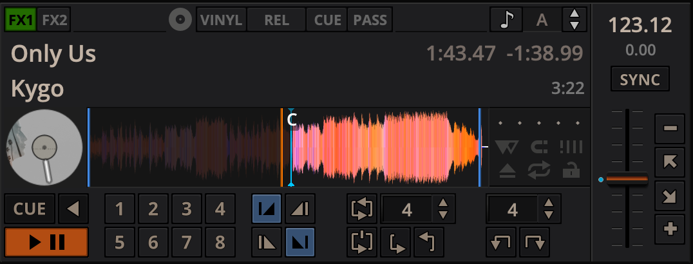

.. include:: /shortcuts.rstext

.. _interface-overview:

The Mixxx User Interface
**********************************

Welcome to the Mixxx interface. This is where the magic happens.
You are going to want to get very familiar with this interface because it is
the main way to use Mixxx. In this chapter, we present the default interface of
Mixxx and describe its elements, knobs and faders.

   The Mixxx interface - Latenight skin

This is the LateNight skin, PaleMoon color theme. It is the default skin supplied with Mixxx 2.3. There
are a variety of other skins included with Mixxx. You should explore them all
to figure out which one you prefer. This section will focus on LateNight only, though all Mixxx skins provide most of the controls described here.

.. _interface-skin-settings:

Skin Settings
=============
On top, and on the right side of the user interface are the section expansion buttons and options.

  .. figure:: ../_static/2.3/skin-settings-top.png
   :align: center
   :width: 500px
   :figwidth: 90%
   :alt: The section expansion buttons
   :figclass: pretty-figures

   The GUI section quick toggles buttons in the top tool bar

If you click on either :guilabel:`WAVEFORMS`, :guilabel:`4 DECKS`, :guilabel:`MIXER`, :guilabel:`EFFECTS`, :guilabel:`SAMPLERS` or :guilabel:`MICS & AUX` then you will enable control sections for interacting with:

* :ref:`interface-waveform`
* :ref:`interface-decks`
* :ref:`interface-mixer`
* :ref:`interface-effects`
* :ref:`interface-sampler`
* :ref:`interface-mic`

You can also use the specific :ref:`appendix-shortcuts`.

Click the :guilabel:`SETTINGS` button or gear icon (depending on the skin) to open the skin settings menu. This provides common basic controls as well as some skin-specific options.

  .. figure:: ../_static/2.3/skin-settings-right.png
    :align: center
    :width: 245px
    :figwidth: 90%
    :alt: The section expansion buttons
    :figclass: pretty-figures

    The Skin Settings menu on the right

.. _interface-decks:

Decks
=====

.. sectionauthor::
   RJ Ryan <rryan@mixxx.org>
   S.Brandt <s.brandt@mixxx.org>

   A deck with a track loaded

The deck section comes in three sizes: Full, Compact and Mini.
You can switch between any of the three sizes by clicking on the :guilabel:`Settings` button or the gear icon.  Under the :guilabel:`Decks` section, click on "hide mixer to select".
This will automatically select the Compact deck (underlined and bolded). If you wish to change to a different deck size, you can choose FULL or Mini.

  | The FULL deck (which is similar in all skins) will show the :ref:`interface-vc-mode` and Key controls at the top of the deck section and then the :ref:`interface-hotcues`, :ref:`interface-intro-outro`, :ref:`interface-looping` at the bottom.
  | The Compact deck has a reduced set of controls for when you don't need all of them on screen, for example when they're also accessible from your controller. Reverse is removed from the :ref:`interface-playback`, and the :ref:`interface-hotcues`, :ref:`interface-intro-outro`, :ref:`interface-looping` and rate adjust buttons are not shown.
  | The mini deck is of a much smaller size and shows only the waveform and the :ref:`interface-track-info`. You can also use minimal decks with the maximized library.

.. hint:: Hiding the mixer will by default switch to the compact decks.

The deck section allows you to control everything relating to a virtual
turntable :term:`deck`. We are going to break this down into sections.

.. _interface-track-info:

Track Information Display
-------------------------

   The track information section of the deck

**Track Title**
  The title of the track that was loaded into a deck is displayed on top. This
  is the same as the title listed under the :guilabel:`Title` column heading in the :ref:`Mixxx library <library-tracks>`. This information is initially loaded from the track's
  :term:`metadata`. If the metadata is missing, the title and artist are guessed
  from the filename.

**Track Artist**
  The artist of the track is listed below. It is the same as listed under the
  :guilabel:`Artist` column heading in the :ref:`Mixxx library <library-tracks>`.

**Time Elapsed/Remaining/Both**
  By default it displays the total elapsed time in the track up to the
  millisecond. Clicking on the display switches to the *Time Remaining* view,
  which indicates how much time is left before the track reaches the end.
  Clicking the display again, both the elapsed and remaining time are shown
  simultaneously in the format *elapsed time / remaining time*.
  You can change the default in :menuselection:`Preferences --> Decks --> Deck options`.

**BPM (Tempo)**
  The number at the top right is the effective :term:`BPM` of the track. This is
  the detected :term:`BPM` of the track, adjusted for the playback rate of the
  track. For example, if the track is normally 100 BPM, and it is playing at
  +5%, then the effective BPM will read 105 BPM.

  .. hint:: You can use a keyboard shortcut and tap with the beat to set the BPM
            to the speed you are tapping, go to :ref:`control-keyboard` for more
            information.

**Key**
  .. figure:: ../_static/2.3/key.png
    :align: center
    :width: 42%
    :figwidth: 80%
    :alt: The options displayed when you click on the Key
    :figclass: pretty-figures

    The Key options.

The key displays the current musical key of the loaded track after pitch shifting. The key is displayed below the BPM (Tempo). This is the same as the key that is shown under the :guilabel:`Key` column heading in the :ref:`Mixxx library <library-tracks>`.
Clicking the key will expand it to reveal more options:

  * **Pitch Control**: This changes the track pitch independent of the tempo. Left-clicking the :guilabel:`-` button decreases the pitch by one semitone. Right-clicking it decreases the pitch by 10 cents. Left-clicking the :guilabel:`+` button increases the pitch by one semitone. Right-clicking it increases the pitch by 10 cents.
  * **Sync and Reset Key**: Left-clicking the :guilabel:`MATCH` button sets the key to a pitch that allows harmonic transition from the other track. It requires a detected key on both involved decks. Right-clicking it resets the key to the original track key.

**Cover Art**
  The cover art of the track loaded into the deck is displayed on the left side of the track. This is the same as the cover art that is shown under the :guilabel:`Cover Art` column heading in the :ref:`Mixxx library <library-tracks>`.
  In Deere skin you can choose to enable or disable the cover art by clicking the gear icon in the upper right corner, then toggling the :menuselection:`Decks --> Cover Art` option. Clicking on the cover art will expand it into a full blown image.
  The cover art is also shown in the Vinyl Widget next to the :ref:`parallel waveforms <interface-waveform>`.

.. _interface-waveform:

Waveform Displays
-----------------

.. sectionauthor::
   RJ Ryan <rryan@mixxx.org>
   S.Brandt <s.brandt@mixxx.org>

The waveform section of a deck allows you to visualize the audio changes that
occur throughout the track, you can basically “see” your music.

By default the waveform displays are aligned parallel to each other in
order to make :term:`beatmatching` easier, as it is possible to beatmatch
visually by aligning the beats that appear in each waveform.

   Parallel waveforms in the default Mixxx skin (LateNight, PaleMoon theme)

Depending on the skin, Mixxx displays either parallel waveforms (default) or
separate waveforms. LateNight and Tango skins only have resizable parallel waveforms while
Shade skin provides only separate waveforms.
In Deere skin you can select your preferred appearance by clicking the gear icon in the upper right corner,
then toggling the :menuselection:`Skin Settings --> Parallel Waveforms` option.

.. warning :: If you have a slower computer and notice performance issues with
              Mixxx, try lowering the frame rate or changing the waveform type
              in :menuselection:`Preferences --> Waveforms`.

**Waveform summary**
  The big waveform summary shows the waveform envelope of the track near the
  current playback position and is updated in real time. The mouse can be used
  on the waveform to pause, scratch, spin-back or throw the tracks.
  Right-clicking on the waveforms allows you to drag with the mouse to make
  temporary pitch adjustments.

  .. hint :: You can select from different types of displays for the waveform,
             which differ primarily in the level of detail shown in the
             waveform, in :menuselection:`Preferences --> Waveforms --> Waveform type`.

**Waveform overview**
  The smaller, zoomed-out version of the waveform shows the various markers
  within the track as well as the waveform envelope of the entire track. This is
  useful because they allow DJs to see breakdowns far in advance. As visual aid,
  the part of the track that has already been played is darkened.

  Clicking somewhere on the waveform allows you to jump to an arbitrary position
  in the track. Like with the Waveform summary, you can select from different
  types of displays for the overview in
  :menuselection:`Preferences --> Waveforms --> Overview type`.

**Vinyl Widget**
  The line on the vinyl widget rotates if the track moves. It is similar to the
  position marker found on scratch records. Use the mouse on the vinyl widget to
  pause, scratch, spin-back or throw tracks - just like a real record.
  When performing :ref:`Loop rolls <interface-looping>` or right-clicking on the
  vinyl during playback, a “ghost” marker hints where the playback will continue.
  The Vinyl Widget is hidden by default and can be enabled in the
  :ref:`interface-button-grid`.

  If :term:`vinyl control` is enabled, it can optionally display the time-coded
  vinyl signal quality. Activate the option in :menuselection:`Preferences -->
  Vinyl Control --> Show Signal Quality in Skin`.

**Waveform Zoom**
  Using the mouse-wheel everywhere in the waveform summary will zoom the
  waveform in or out. You can choose whether to synchronize the zoom level
  between the decks in :menuselection:`Preferences --> Waveforms`.

**Waveform Marker**
  While mixing, various additional markers can appear on the waveforms:

* **Position marker**: The static vertical line in the center of the waveform
  summary indicates the playback point of the deck. The waveform overview
  includes a vertical line to show the current position within the track.
* **Beat marker**: The regular white lines on the waveform summary indicate the
  locations of beats in the audio, also called the :term:`beatgrid`.
* **Cue marker**: Indicates the position of the :term:`cue point <cue>`.
* **Hotcue marker**: Indicate the position and number of a :term:`hotcue`
  point if set.
* **Loop-in/Out marker**: Indicate the beginning and the end of a loop.
* **Loop overlay**: Is drawn between the Loop-in/Out markers and changes color
  depending on whether a loop is activated or not.
* **Track ending notification**: If the waveform overview flashes red, only 30
  seconds are left before the track reaches the end.

.. _interface-button-grid:

Deck Options Button Grid
------------------------

.. sectionauthor::
   RJ Ryan <rryan@mixxx.org>
   S.Brandt <s.brandt@mixxx.org>

   The Options Button Grid of the deck

The six buttons at the bottom right below the waveform allow you to configure
the deck. Starting from the top row (left to right) and the bottom row (left to right), the buttons are as
follows:

**Slip Mode Toggle**
  When active, the playback continues muted in the background during a loop, reverse, scratch, etc.
  Once disabled, the audible playback will resume where the track would have been.

**Quantize Mode Toggle**
  If enabled, all cues, hotcues, loops, and beatloops will be automatically
  :term:`quantized <quantization>` so that they begin on a beat.

**Beat-grid Adjust Button**
  Clicking this button adjusts the track beat-grid so that the current position
  is marked as a beat. This is useful if Mixxx was able to accurately detect the
  track's :term:`BPM` but failed to align the beat markers on the beats. For
  more information, go to the chapter :ref:`configuration-bpm-detection`.

**Eject Track Button**
  Clicking this button ejects the track from the deck. Alternatively you can use
  a keyboard shortcut, go to the chapter :ref:`control-keyboard` for more
  information.

**Repeat Mode Toggle**
  If enabled, the repeat mode will jump back to the beginning and continue
  playing when the track finishes.

**Keylock Toggle**
  :term:`Key lock <key lock>` locks the track's pitch so that adjustments to its
  tempo via the rate slider do not affect its pitch. This is useful if you would
  like to speed up or slow down a track and avoid the “chipmunk” effect that
  speeding up vocals has.

.. _interface-playback:

Playback/Cue Controls
---------------------

  The playback and cueing controls of the deck

.. _interface-play-pause:

**Play/Pause Button**
  Clicking the Play/Pause button starts and pauses the playback.

  .. seealso:: The actual behavior of the Play/Pause button depends on the
               selected :ref:`Cue mode <interface-cue-modes>`.

.. _interface-cue:

.. sectionauthor::
   Daniel Schürmann <daschuer@mixxx.org>
   S.Brandt <s.brandt@mixxx.org>

**Cue Button**
  If the button is pressed while the track is playing, the play position jumps to
  the :term:`Cue point <cue>` on the track and the track is paused. Once the track
  is paused at the Cue point, you can preview it by holding the Cue Button. If you
  have not moved the Cue point yet, the default point is at the track's beginning.

  .. seealso:: The actual behavior of the Cue button depends on the
               selected :ref:`Cue mode <interface-cue-modes>`.

**Reverse button**
  Press and hold this button to temporarily play the track backwards during regular playback.
  Right-click and hold for 'Censor' mode. This reverses the track while the playback continues
  muted in the background. On release playback is resumed where the track would have been
  if it had not been reversed.

Setting Cue points
^^^^^^^^^^^^^^^^^^

Every track has a Cue point, by default on its beginning. Unlike with
:ref:`Hotcues <interface-hotcues>`, you can't delete, but only move Cue points.

The Cue point is moved according to the selected Cue mode, as explained below.

Auto Cue
^^^^^^^^
Mixxx automatically seeks to the saved Cue point on track load. If none exists,
seeks to the beginning of the track.

Uncheck :menuselection:`Preferences --> Interface --> Auto Cue --> Jump to main
cue point on track load` to always seek to the beginning of the track.

.. _interface-cue-modes:

Using Cue Modes
^^^^^^^^^^^^^^^

Mixxx supports various Cue modes that adapt to fit other devices in your setup
or your personal preferences. The actual behavior of the Play, Pause, and Cue
buttons depends on the selected Cue mode. To change the Cue mode, go to
:menuselection:`Preferences --> Decks --> Cue mode`.

**Mixxx mode (default)**

* **While paused at Cue point (Cue button lit):**

  * Hold down the Cue button to play the track from the :term:`Cue point <cue>`,
    as long as the button is pressed. After releasing the Cue button, the track
    jumps back to the Cue point and pauses again.
  * Press Play/Pause before releasing the Cue button to continue playback normally.

* **While paused not at Cue point (Cue button flashing)**:

  * Tap the Cue button to store the current position as new :term:`Cue point <cue>`.

* **While playing:**

  * Tap the Cue button to jump to the :term:`Cue point <cue>` and pause playback.

**Mixxx mode (no blinking)**

* Same as the default Mixxx mode, but without blinking indicators.

**Pioneer mode**

* Same as Mixxx mode, but the buttons are more flashy matching a Pioneer CDJ player.

  * The Play/Pause button flashes once per second when a track is paused.
  * The Cue button flashes twice a second when the next push will move the :term:`Cue point <cue>`.

**Denon mode**

* **While paused at Cue point (Cue button lit) - same as Mixxx mode**:

  * Hold down the Cue button to play the track from the :term:`Cue point <cue>`,
    as long as the button is pressed. After releasing the Cue button, the track
    jumps back to the :term:`Cue point <cue>` and pauses again.
  * Press Play/Pause before releasing the Cue button to continue playback normally.

* **While paused not at Cue point (Play button flashing)**:

  * Tap the Cue button to move the track back to :term:`Cue point <cue>`.
  * Tap the Play/Pause button to move the :term:`Cue point <cue>` to the current
    position and start playback.

* **While playing - same as Mixxx mode**:

  * Tap the Cue button to jump to the :term:`Cue point <cue>` and pause playback.

**Numark mode**

* Same as Denon mode, but without a flashing Play/Pause button.
* This mode is useful if you want to implement a custom skin with 3-button decks,
  featuring a Cue button, a dedicated Pause button, and a Play/Stutter button.

**CUP (Cue + Play) mode**

* Press the Cue button to jump to the :term:`Cue point <cue>` and pause,
  continuing playback only when either the Cue button is released or Play/Pause
  is pressed.
* If the Cue button is pressed while paused, the :term:`Cue point <cue>` is
  first moved to the current position.

.. hint:: Use the :ref:`interface-hotcues` to place more reference points on a
          track.

.. seealso:: You can also use keyboard shortcuts for Cueing. Go to
             :ref:`control-keyboard` for more information.

.. _interface-intro-outro:

Intro/Outro Markers
-------------------

.. sectionauthor::
   Goodness Chris-Ugari <goodnesschrisugari@yahoo.com>

  The Intro/Outro End and Start Markers

You can use the Intro/Outro Markers with Auto DJ to mix in and out of points but unlike hotcues, they do not mark only one point.
The intro and outro are sections and each section is defined by two points. See :ref:`library-auto-dj`.

**Intro Start/End Markers**
 The analyzer places the intro start point at the first sound of a track and you can decide where to place the intro end point.
 Left-clicking on the marker when it is set jumps to the marker. When it is not set, clicking sets the marker to the current play position.
 Right-clicking on the marker when it is set clears the marker.

**Outro Start/End Markers**
 The analyzer places the outro end point at the last sound of a track and you can decide where to place the outro start point.
 Left-clicking on the marker when it is set jumps to the marker. When it is not set, clicking sets the marker to the current play position.
 Right-clicking on the marker when it is set clears the marker.

.. note:: If :term:`quantization` is enabled, left-clicking on any of the markers snaps to the nearest beat.

.. _interface-transport:

Transport Controls
------------------

.. sectionauthor::
   RJ Ryan <rryan@mixxx.org>
   S.Brandt <s.brandt@mixxx.org>

  The transport controls of the deck

**Beatjump/ Loop Move Size**
  You can type, use the arrow keys or scroll vertically in the input box to select the number of beats to jump or move, with the Beatjump Forward/ Backward buttons.

**Beatjump Backward button**
  Clicking this while the loop is inactive will make the track jump backward by the set number of beats (left click) or by one beat (right click).
  Clicking this while the loop is active will move the loop backward by the set number of beats (left click) or by one beat (right click).

**Beatjump Forward button**
  Clicking this while the loop is inactive will make the track jump forward by the set number of beats (left click) or by one beat (right click).
  Clicking this while the loop is active will move the loop forward by the set number of beats (left click) or by one beat (right click).

.. _interface-vc-mode:

Vinyl Control Mode and Cueing controls
--------------------------------------

.. sectionauthor::
   S.Brandt <s.brandt@mixxx.org>

   The Vinyl Control Mode and Cueing controls of a deck

The control above the waveforms relate to the :term:`vinyl control` feature in
Mixxx and is **hidden** in the default
:ref:`Mixxx user interface <interface-overview>`. Click the gear icon in the upper right corner, then toggle :menuselection:`Skin Settings --> Vinyl Control Options`, or use the specific :ref:`appendix-shortcuts` to show or hide the
section.

.. seealso :: For more information on how to use Vinyl control in your setup, go
              to the chapter :ref:`vinyl-control`.

**Vinyl button**

This button enables :term:`vinyl control`. When enabled in Mixxx, the track
on the Mixxx deck is controlled by the external vinyl control.

**Pass button**

This button enables passthrough. When enabled, audio from an external vinyl
can be played on the Mixxx deck.

**Abs/Rel/Const button**

* **Absolute mode**: The track position equals needle position and speed.
* **Relative mode**: The track speed equals needle speed regardless of needle
  position.
* **Constant mode**: The track speed equals last known-steady speed regardless
  of needle input.

**Cue/Hot button**

This button determines how :term:`cue points <cue>` are treated in vinyl
control relative mode:

* **Off**: Cue points are ignored.
* **Cue**: If the needle is dropped after the cue point, the track will seek
  to that cue point.
* **Hot**: The track will seek to the nearest previous :term:`hotcue` point.

.. _interface-rate:

Sync and Rate Controls
----------------------

.. sectionauthor::
   RJ Ryan <rryan@mixxx.org>
   S.Brandt <s.brandt@mixxx.org>

   Rate controls

The rate controls allow you to change the rate at which tracks are played. This
is very useful for :term:`beatmatching` two tracks together in a mix. You can
control rate changes also from your computer's keyboard, see the chapter
:ref:`control-keyboard` for more information.

**SYNC button**
  * **Left-Click**: Changes the :term:`rate` of the track so that the :term:`BPM`
    and :term:`phase` of the track matches the other deck.
  * **Right-Click**: Only changes the :term:`rate` of the track to match the other
    deck but does not adjust the :term:`phase`.

  Decks and samplers now pick which sync target to sync to on the fly. Decks can't
  sync to samplers and samplers can only sync to decks. The sync target for
  samplers is:

  * The first deck (in numerical order) that is playing a track with a detected
    beatgrid, and has a rate different than zero.
  * The first deck (in numerical order) that has a track loaded with a detected
    beatgrid, no matter if it is playing or stopped.

  So basically, if you sync a sampler and both deck 1 and deck 2 are playing a
  track with a beatgrid then deck 1 will win since numerically it is first. The
  sync targets for decks are chosen with the new master sync feature, see
  :ref:`master-sync` for more information.

**Pitch/Rate slider**
  The slider allows you to change the speed of the song, by default up to 10%
  from the tracks original tempos. The speed will increase as you move the
  slider up, opposite to the behavior found on DJ turntables and :term:`CDJ`.
  Right-clicking on the slider will reset the tempo to its original value.

**Pitch Rate Display**
  The percent that the track's rate is sped up or slowed down is noted here. Is
  the Pitch/Rate slider positioned at the center, the pitch rate display is at
  +0.0%, which indicates no change.

.. hint:: To make the rate and/or pitch automatically reset whenever a new
          track is loaded go to :menuselection:`Preferences --> Decks -->
          Speed (Tempo) and Key (Pitch) options --> Reset on track load`.

**Temporary Pitch/Rate buttons (Nudge)**
  Pushing the diagonal arrow buttons is like nudging the metal edge of
  a turntable, or the outer edge of a CD player. It will give the track a push
  or pull forwards or backwards. If the buttons are released the previous tempo
  is restored. The buttons can act as either a fixed :term:`pitch bend` or a
  :term:`ramping pitch bend`.

**Pitch/Rate buttons**
  Clicking the :guilabel:`-` button will set the pitch/rate lower while the :guilabel:`+` button will set the pitch/rate higher. This is like moving the pitch slider up or down by a fixed amount. Unlike using the temporary pitch/rate buttons, the change is permanent so these button s don't need to be held down.

.. seealso:: To customize the amount by which the buttons alter the pitch of
             the track, the slider range as well as the direction, go to
             :menuselection:`Preferences --> Interface -->
             Adjustment buttons --> Permanent / Temporary`.

.. hint:: If the tempo of a track changes, you'll notice that the tone changes
          based on the pitch used (e.g. playing at faster pitch gives a chipmunk
          sound). You can enable the :ref:`Keylock <interface-button-grid>`
          feature to maintain a constant tone.

.. _interface-looping:

Loop Controls
-------------

.. sectionauthor::
   RJ Ryan <rryan@mixxx.org>
   S.Brandt <s.brandt@mixxx.org>

   The beatloop and looping controls of the deck

In this section of the Mixxx interface you can control (beat-)loops and set the
loop points of a track.
You can also shift loops using the :ref:`beatjump / loop move controls <interface-transport>` shown at the right side of the looping controls.

**Beatloop size**
  The input box allows you to set the size of the loop in beats to set with the Beatloop button. Changing this resizes the loop if the loop already matches the size.
  If a loop is set, a loop overlay will be drawn on the
  :ref:`waveforms <interface-waveform>`.
**Beatloop**
  Left-clicking the Beatloop button starts a loop over the set number of beats. If quantize is enabled, it snaps to the nearest beat. This works for manually placed loops as well as automatic loops set by
  the beatlooping buttons. Depending on the current status of the loop, the
  loop overlay on the waveforms changes color. Right-clicking the Beatloop button temporarily enables a rolling loop over the set number of beats. Playback will resume where the track would have been if it had not entered the loop.
**Double loop**
  Clicking on the arrow pointing up will double the current loop's
  length up to 64 bars. The length of the loop overlay in the waveform will
  increase accordingly.
**Halve loop**
  Clicking on the arrow pointing down will halve the current loop's
  length down to 1/32 bars. The length of the loop overlay in the waveform will
  decrease accordingly.
**Loop-In**
  This button allows you to manually set the start point of a loop.
  A loop-in marker is placed on the waveform indicating the position.
  If clicked when a loop was already set, it moves the start point of a loop
  to a new position.
**Loop-Out**
  This button allows you to manually set the end point of a loop.
  A loop-out marker is placed on the waveform indicating the position. If
  clicked when a loop was already set, it moves the end point of a loop to a new
  position.
**Reloop**
  Left-clicking this button toggles the current loop on or off. If the loop is ahead of the current position, looping will start when the loop is reached. This works only if the Loop-in and Loop-Out marker are set.
  Right-clicking this button enables the loop, jumps to Loop-in marker and stops playback.

.. hint:: If you are playing inside a loop and want to move the end point
          beyond its current position in the track, click on the *Beatloop* button
          first and when the play position reaches the desired position, click
          on the Loop-Out button.

.. seealso:: If the :term:`Quantize <quantization>` mode is enabled, the loops
             will automatically snap to the nearest beat. This is disabled by
             default, click on the :ref:`Quantize Mode Toggle
             <interface-button-grid>` to enable it.

.. _interface-hotcues:

Hotcue Controls
---------------

.. sectionauthor::
   RJ Ryan <rryan@mixxx.org>
   S.Brandt <s.brandt@mixxx.org>

   The hotcue controls of the deck

To jump in between different parts of a track, you can use these numbered
buttons. You can also use keyboard shortcuts, go to :ref:`control-keyboard` for
more information.

Setting Hotcues
^^^^^^^^^^^^^^^

Clicking on a numbered button will set a :term:`hotcue` at the current play
position on the track. A marker with the corresponding number will appear in the
waveform and the button will light up to indicate that the hotcue is set.

Playing Hotcues
^^^^^^^^^^^^^^^

* **While playing**: Tap a hotcue button to cause the track to instantly jump to
  the location of the hotcue and continue playing. If you are playing inside a
  loop and tap a hotcue whose position is outside of the loop, then the track
  still instantly jumps to the hotcue but the loop will be deactivated.

* **While stopped**: Tap a hotcue button to cause the track to instantly jump to
  the location of the hotcue and start playing as long as the button is pressed.
  Press the :ref:`Play <control-keyboard>` keyboard shortcut while the hotcue
  button is pressed to continue playback, then release the hotcue button.

Highlighting Hotcues
^^^^^^^^^^^^^^^^^^^^

It's possible to add labels or colors to your hotcues to make them easier to
distinguish and make it possible to get their "meaning" at first glance.

Labels and colors can be assigned from the Hotcue context menu, which can be
opened by right-clicking either the hotcue button or the hotcue marker in the
waveform overview.

.. hint:: Mixxx allows :ref:`customizing the color palette <configuration-colors-palette>` and :ref:`bulk replacing hotcue colors <configuration-colors-replace>`.

Deleting Hotcues
^^^^^^^^^^^^^^^^

To delete a hotcue, right-click on the hotcue button or the waveform marker in
the overview waveform to open the context menu, then click the trash icon.

.. note:: Mixxx supports up to 36 hotcues per deck. By default, only some of
          them are visible in the user interface. You can customize your
          :ref:`keyboard <advanced-keyboard>` or :ref:`controller
          <advanced-controller>` mappings to use all of them.

.. seealso:: Just as with the loops (see above), if the
             :term:`quantize <quantization>` mode is enabled, the hotcues will
             automatically snap to the nearest beat. This is disabled by
             default, click on the :ref:`Quantize Mode Toggle
             <interface-button-grid>` to enable it.

.. _interface-mixer:

Mixer
=====

.. sectionauthor::
   RJ Ryan <rryan@mixxx.org>
   S.Brandt <s.brandt@mixxx.org>

   The mixer section

The mixer section of the :ref:`Mixxx user interface <interface-overview>` allows
you to control how the different decks and samplers are mixed together.

.. _interface-level-meter:

Channel Faders and Level Meters
-------------------------------

**Level meters**
  The left meter shows the volume level for the left deck,
  while the right meter shows the volume level for the right deck.
  The double meter at the center shows the current volume of the main output's left and right channel separately.
  These should stay at the top of the green region, with the loudest parts of the music
  (transients) briefly going into the yellow region. They should never be in
  the red region. Refer to
  :ref:`Setting your levels properly (gain staging) <djing-gain-staging>`
  for more details.

**Line faders**
  The two large faders on either side of the level meters are the deck volume
  faders, also known as Channel- or Line-faders. Adjusting these controls the
  volume of each deck.

  .. hint:: Some DJ's prefer to use the line faders over the crossfader for
            fading between tracks. Try it, you may like it.

.. _interface-eq-gain:

Equalizers and Gain Knobs
-------------------------

.. figure:: ../_static/2.3/equalizers-and-gain-knob.png
   :align: center
   :width: 300px
   :figwidth: 150px
   :alt: The EQ Controls of a deck in the mixer
   :figclass: pretty-figures

   EQ Controls

**Gain Knob**
  The gain knob (orange) above the volume fader allows you to adjust the gain applied to the deck.
  Use this to compensate for the differences in recording levels between tracks.
  In general, you should adjust this knob so that the track's :term:`level meter`
  stays around the top of the green region with the loudest parts of the track
  (the transients) briefly going into the yellow region. **Do NOT turn the
  Gain Knob up so much that the level meter is in the red region. At this point
  the track is clipping, which sounds bad and could damage equipment.**

  .. note:: By default, Mixxx automatically applies an additional ReplayGain so
            tracks have approximately equal loudness at unity gain. Your tracks
            must be :ref:`analyzed <getting-started-analyze-library>` to take
            advantage of this feature. When an unanalyzed track is
            loaded, Mixxx calculates its ReplayGain value, but will not apply a
            newly calculated ReplayGain value to a track after it has
            already started playing (to avoid a sudden change in the gain of a
            playing track).

  .. seealso:: For an explanation of why you should set your gains this way, see
               :ref:`Setting your levels properly (gain staging) <djing-gain-staging>`.

**EQ Knobs**
   The low, mid, and high EQ knobs allow you to change the filters of the audio.
   This allows you to selectively reduce or boost certain frequency ranges of the audio.

  .. warning:: Be careful not to raise the EQs so much that the signal clips,
               indicated by a :term:`level meter` being in the red region. See
               :ref:`Setting your levels properly (gain staging) <djing-gain-staging>`
               for a more detailed explanation.

**Kill Switches**
  The small boxes next to each EQ knob are called :term:`kills <kill switch>`.
  Hold these buttons to fully remove that frequency range. Short click on the
  buttons for latching. When in Latch mode, click again to restore the frequency
  range. If the Kill switches do not work as expected, check the high/low shelf
  EQ settings in the preferences.

**Quick Effect Super knob**
  This knob lets you control the Meta knob of the deck's Quick Effect. 'Filter' is the default.
  Right-click this knob to center it. This is equivalent to 'no audible effect' for the built-in
  filter effects only (Filter, Moog Ladder 4 Filter).
  The button next to the knob toggles the effect. It provides the same latching capabilities
  like the EQ Kill switches.

.. seealso:: You can customize the EQ settings in
             :menuselection:`Preferences --> Equalizer`.

.. _interface-pfl:

PFL/Headphone Button
--------------------

   The headphone buttons of both decks in the mixer

The headphone button is also known as the :term:`pre-fader listen or PFL <PFL>`
button and allows you to use headphone cueing. That is, it allows you to hear
the track you will play next in your headphones before your audience hears it.
This helps you plan when to start the next track and manipulate it to
make it blend better with the currently playing track (for example, by
synchronizing the beats, setting a loop, or using EQs). Pressing the PFL button
plays the track on the headphone output at full volume regardless of the
position of the crossfader or the deck’s line fader. To play a track in your
headphones but not have the audience hear it, press the PFL button and move the
crossfader all the way to the opposite side of the deck or turn the deck’s
volume fader all the way down.

.. note:: Headphone cueing is only available if you have configured a
          Headphone Output in :menuselection:`Preferences --> Sound Hardware`.

.. note:: If you use an external hardware mixer, plug your headphones into that
          rather than your sound card. Use the headphone buttons on the mixer
          rather than the buttons in Mixxx.

.. _interface-crossfader:

Crossfader
----------

   The crossfader section of the mixer

The :term:`crossfader` determines the actual volume of each deck when moving
the slider from left to right. If both decks are playing and the crossfader is
in its default center position, then you will hear both decks. Right-clicking on
the crossfader will reset the slider to its default position.

To move the crossfader left or right, you can use the :term:`keyboard shortcut <shortcut>` :kbd:`G` and :kbd:`H`.
To apply small crossfade left and small crossfade right, the :term:`shortcuts <shortcut>` are :kbd:`Shift` + :kbd:`G` and :kbd:`Shift` + :kbd:`H` respectively.

You can reverse the configuration of the crossfader, so that the right deck is
on the left end of the crossfader and vice versa. This is also known as
*Hamster Style*. To adjust the crossfader to your style of mixing, go to
:menuselection:`Preferences --> Crossfader`.

The :term:`crossfader` orientation switches determine to which side of the crossfader the deck is assigned.
It can be set to the left or right side, or to the center where it is unaffected by the crossfader knob.

.. hint :: Using the :ref:`AutoDJ <djing-auto-dj>` feature in Mixxx, you can
           automate the crossfade between the decks.

.. _interface-head-master:

Headphone and Main Mix Controls
---------------------------------

   The headphone and main mix knobs

**Headphone Mix knob**
  Allows you to control how much of the Main output you hear in the
  :guilabel:`Headphones` output. It works like a crossfader between the stereo
  Main and stereo :term:`PFL` signal. If the knob is set to the left, you
  only hear the PFL signal, which is the usual position for prelistening tracks.

  This can be used to practice DJing with only one stereo output and a set
  of either speakers or headphones.

  Additionally, this can be used to mix in headphones when you cannot hear the
  speakers connected to the :guilabel:`main` output and there are no booth
  monitor speakers. Some DJs prefer to use this knob to mix in headphones all
  the time, but many find it to be a difficult way to play. If there is only one
  set of speakers and no booth monitors, you can avoid the need to mix in
  headphones by setting up the speakers behind you so both you and your
  audience can hear them.

  .. note:: Don't forget to activate the :guilabel:`PFL` button on the deck you
            want to listen to in your headphones.

**Head knob (Headphone gain)**
  This knob controls the gain applied to the headphone output signal that Mixxx
  sends to your sound card. Generally, this knob should not be adjusted. To
  adjust the volume in your headphones, adjust your sound card's gain on the
  headphone output. Most external sound cards have a gain knob specifically for
  the headphone jack. If you use an onboard sound card for your headphones,
  adjust the gain control in your :term:`OS <operating system>` mixer program.
  If your sound card only has one gain knob that controls both the Main output
  and the headphone output, then adjust the :guilabel:`Head` knob in Mixxx
  to control the volume of your headphones without affecting your Main output.

 .. note:: Not all controls may be present in all skins anymore. However, these controls can be mapped to keyboards and MIDI controllers. See :ref:`appendix-mixxxcontrols` for detailed information.

**Headphone Split Cue button**
  If activated, two mono signals are sent to the headphone output instead of one
  stereo signal. The main signal plays in the right channel, while the cueing
  signal plays in the left channel. You can still adjust the
  :guilabel:`Head Mix` knob to control the mix of the Main and cue signals in
  the left channel.

**Balance Knob**
  This knob allows you to adjust the :term:`balance` (left/right orientation) of
  the Main output.

.. _interface-gain-knob:

**Main Knob**
  The Main Gain Knob controls the gain applied to the Main output signal that
  Mixxx sends to your sound card, Internet broadcasting servers, and recorded
  mixes. Generally, this knob should not be adjusted. To change the output
  volume, a gain control should be adjusted as close to the speakers as possible
  for the best signal-to-noise ratio throughout your signal chain. Ideally, the
  volume would only be adjusted by adjusting the gain on the power amplifier.
  On active speakers, including computer speakers, studio monitors, and PA
  systems that do not require a separate amplifier, this means adjusting the
  gain on the speakers (which may be labeled "Volume").

  As a DJ, you may not have access to the power amplifier. In that case,
  adjust the volume by adjusting the gain on the equipment closest to the power
  amplifier that you have access to. Typically, this is a DJ mixer. If you are
  not going through a mixer, adjust the gain of your sound card. If your sound
  card does not have any controls on it (for example, for sound cards built into
  computers), adjust the sound card settings with your :term:`OS <operating system>`
  mixer program. The Main Gain Knob in Mixxx should be a last resort for
  adjusting volume.

  .. warning:: **In no case should any part of the signal chain be clipping,
               indicated by a level meter going into its red region
               or an LED labeled "clipping" turning on.**

  .. seealso:: For an explanation of why you should set your gains this way, see
               :ref:`Setting your levels properly (gain staging) <djing-gain-staging>`.

.. _interface-sampler:

Samplers
========

   Sample decks

.. figure:: ../_static/2.3/sample-decks-expanded.png
   :align: center
   :width: 700px
   :figwidth: 100%
   :alt: A sample deck
   :figclass: pretty-figures

   Sample decks expanded

Samplers are miniature decks. They allow you to play short samples and jingles
but also additional tracks in your mix. They come with a small overview waveform
and a limited number of controls. All controls work just like on the regular
decks, see :ref:`interface-decks`.

The Sampler section can be **hidden** in the
:ref:`Mixxx user interface <interface-overview>`. Click the
:guilabel:`SAMPLERS` button at the top of the user interface, or use the specific
:ref:`appendix-shortcuts` to show or hide the section.

Waveform Display
----------------

**Waveform overview**
  The waveform shows the various markers within the track as well as the
  waveform envelope of the entire track. Clicking somewhere on the waveform
  allows you to jump to an arbitrary position in the track.

**Waveform Marker**
  While mixing, some additional markers can appear on the waveforms:

* **Position marker**: A vertical line indicates the playback point of the
  sample deck.
* **Hotcue marker**: Indicate the position and number of a :term:`hotcue`
  point if set.

Track Information Display
-------------------------

**Track Artist/Title**
  The artist and title of the track that was loaded into a sampler deck is
  displayed here.

**BPM (Tempo)**
  The number at the top right is the effective :term:`BPM` of the track. Tap the
  BPM to set the BPM to the speed you are tapping.

Sample Deck Options Button Grid
-------------------------------
The buttons grid next to the waveform overview allow you to configure the
sampler deck. Starting from the top row (left to right) and the bottom row (left to right), the buttons are as
follows:

**Repeat Mode Toggle**
  If enabled, the repeat mode will jump back to the beginning and continue
  playing when the track finishes.

**Eject Track Button**
  Clicking this button ejects the track from the deck.

**Keylock Toggle**
  :term:`Keylock <key lock>` locks the track's pitch so that adjustments to its
  tempo via the rate slider do not affect its pitch.

**Crossfader Orientation Toggle**
  The :term:`crossfader` orientation determines to which side of the crossfader the sampler is assigned.
  It can be set to the left or right side, or to the center where it is unaffected by the crossfader knob.

Sample Deck Controls
--------------------

**Play/Pause button**
  Clicking the button always starts playback from the :term:`cue point <cue>`.
  If playback is already enabled the play position will jump back to the
  :term:`cue point <cue>`. Right-clicking on the button will stop playback and
  seek the play position to the beginning of the sample.

**Sync Button**
  Syncs the Sampler deck to a regular deck, as described in :ref:`interface-rate`.

* **Left-Click**: Changes the :term:`rate` of the track so that the :term:`BPM`
  and :term:`phase` of the track matches the sync target.
* **Right-Click**: Only changes the :term:`rate` of the track to match the sync
  target but does not adjust the :term:`phase`.

**Hotcue Controls**
  To jump in between different parts of a sample, you can use these numbered
  hotcue buttons.

**PFL/Headphone Button**
  If active, the :term:`pre-fader listen or PFL <PFL>` button allows you to
  listen to the track in your headphones.

**Gain Knob**
  Allows you to adjust the gain applied to the track.

**Level Meter**
  Shows the level of the signal and can be adjusted with the Gain knob.

**Pitch/Rate slider**
  The slider allows you to change the speed of the sample. Right-clicking on the
  slider will reset the tempo to its original value.

.. _interface-effects:

Effects
=======

   Collapsed effect unit

   Expanded effect unit

Mixxx comes with some built in sound effects that can be chained together in
effect units. Effect units can be freely assigned to different decks as well
as other inputs. The buttons for routing decks to effect units are in the
:ref:`interface-decks`.

.. seealso:: The :ref:`effects` chapter has a more detailed explanation of the
             effects system.

.. _interface-mic:

Microphones & Auxiliary Inputs
==============================

.. sectionauthor::
   S.Brandt <s.brandt@mixxx.org>

   The Microphone section

The microphone section is **hidden** in the default :ref:`Mixxx user interface
<interface-overview>`. Click the :guilabel:`MICS & AUX` button at the top of your user interface, or use the specific :ref:`appendix-shortcuts` to
show or hide the section.

.. seealso:: The :ref:`microphones` chapter has detailed instructions for
             setting up microphones with various hardware.

Microphone Controls
-------------------

**Talk Button**
  Hold this button and talk to mix the microphone input into the Mixxx Main
  output. Short click on the button for latching. This is handy for talking for
  an extended period, for example when :ref:`streaming <live-broadcasting>` a
  radio show. When in Latch mode, click again to mute the microphone input.

**Mix Orientation Toggle**
  This control determines the microphone input's mix orientation. Either to the
  left side of crossfader, to the right side or to the center (default).
  Clicking cycles through all the options.

**Microphone Volume Meter**
  This displays the microphone volume input signal strength.

**Microphone Gain Knob**
  Use this knob to adjust the gain of the microphone output. Try to keep the
  volume at a reasonable level to avoid signal clipping.

.. _interface-preview-deck:

Preview Deck
============

.. sectionauthor::
   S.Brandt <s.brandt@mixxx.org>

   The Preview Deck with a track loaded

The Preview Deck is a special deck that allows you to pre-listen to tracks in the
headphones before using them in your mix. Pre-listening to a track does not change
its :guilabel:`Played` state as well as the play counter and is not
logged in the :ref:`History <library-history>`. Press :kbd:`CTRL` + :kbd:`4`
(Windows/Linux) or :kbd:`CMD` + :kbd:`4` (Mac) to display the Preview Deck.

The features in detail:

* **Track Artist/Title**:
  The artist and title of the track is displayed here. This is the same as that
  listed under the :guilabel:`Track` and :guilabel:`Title` column heading in the :ref:`Mixxx library <library-tracks>`. This information is initially loaded from the track's :term:`metadata`.

* **Eject Track button**:
  Clicking this button ejects the track from the deck.

* **Play/Pause button**:
  Clicking the button starts and pauses the playback. Right-clicking on the
  button will stop playback and seek the play position to the beginning of the
  tracks.

* **Waveform overview**:
  Shows the various markers (Cues, Hotcues) within the track as well as the
  waveform envelope of the entire track. Clicking somewhere on the waveform
  allows you to jump to an arbitrary position in the track.

* **Gain slider**:
  Move the slider to adjust the gain of the track.

* **Volume Meter**:
  Shows the current volume of the track. If it's too loud and distorted, a
  peak indicator flashes red.

.. seealso:: For more information, go to the chapter
             :ref:`library-previewing-tracks`.
