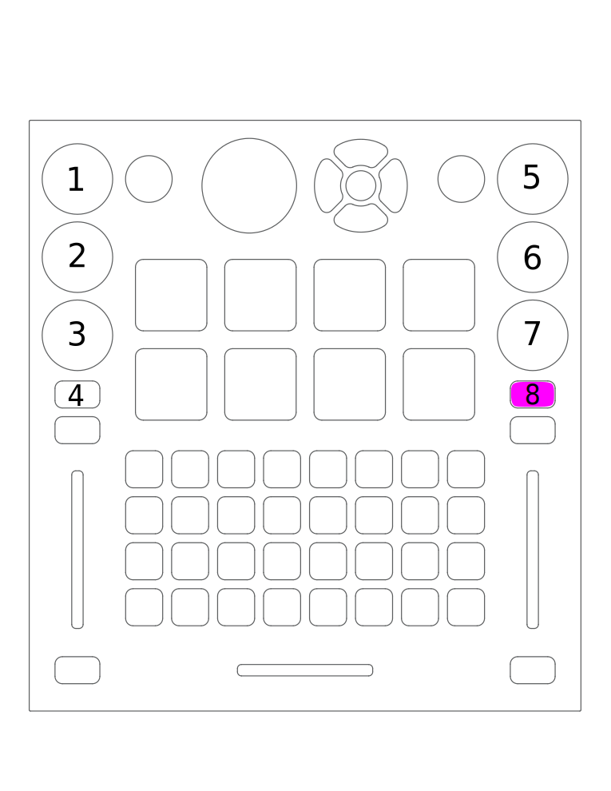
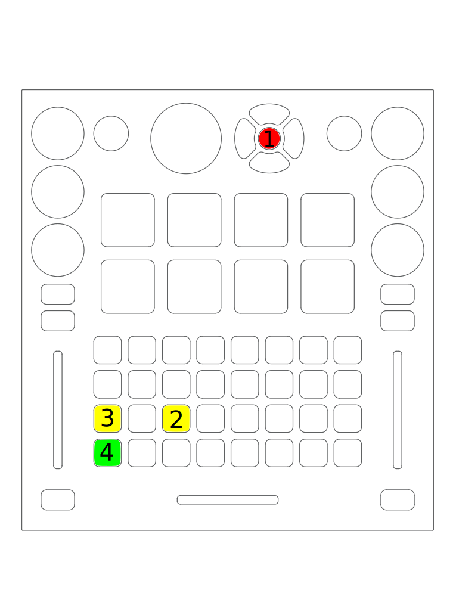

Electrix Tweaker
================

The Electrix Tweaker is an unconventional MIDI controller that can
control most aspects of Mixxx. Instead of jog wheels, it fits an 8x4
grid of multicolor backlit buttons, 8 velocity-sensitive buttons, and 6
push encoders with LED rings into a relatively small package. It does
not have a built in sound card, so it requires a separate sound card or
splitter cable (although it does include 5-pin MIDI in and out ports).

-  `Manufacturer’s website <http://electrixpro.com/>`__
-  `Forum topic <https://mixxx.discourse.group/t/electrix-tweaker-mapping/15071>`__
-  `Manufacturer’s manual <http://electrixpro.com/wp-content/uploads/2014/10/Tweaker_User_Manual.pdf>`__

.. versionadded:: 2.0

Compatibility and setup
-----------------------

The Tweaker is a USB MIDI class compliant device, so it does not require
any special drivers on any operating system. Just plug it in and load
the Mixxx mapping on any OS that Mixxx runs on.

Use it with the Tweaker MIDI 1 port (Tweaker MIDI 2 is the 5-pin MIDI
I/O on the Tweaker).

Mapping description
-------------------

Global controls
~~~~~~~~~~~~~~~

   Electrix Tweaker (global controls)

1.  Scroll through library. Press to toggle big library view
2.  Scroll up left panel of library
3.  Scroll down left panel of library
4.  Samplers

   -  Off when empty, red when loaded
   -  Press a button to load the selected sample into a sampler and play
      it
   -  Press a button to play a sample. When the button is released, the
      sample will stop playing.
   -  Press [[#top-shift-layer|top shift]] and a sampler button to eject
      a sample from a sampler
   -  Samples will play with their volume proportional to how much force
      was used to strike the button. You can adjust the sensitivity or
      disable the velocity sensitivity (and make them work as on/off
      switches) by adjusting options at the top of the JavaScript file
      in a text editor.

5.  Crossfader

Top shift layer
~~~~~~~~~~~~~~~

   Electrix Tweaker (top shift layer controls)

This layer is active while the top shift button (#1 in the diagram) is
held down.

With the exception of the headphone mix encoder (#8 in the diagram),
pressing the encoders 7-12 resets them to center.

1.  Top shift button
2.  Eject left deck
3.  Eject right deck
4.  Expand/collapse selected item in left library pane
5.  Expand/collapse selected item in left library pane
6.  Scroll through library quickly. Push to load selected track into first stopped deck.
7.  Headphone gain
8.  Headphone cue/main mix in headphones. Press to toggle split cue mode. The blue LED below encoder is lit when split cue mode is enabled.
9.  Channel gain for active deck on left side
10.  Main output gain
11.  Main output balance
12.  Channel gain for active deck on right side
13.  Eject sampler
14.  Delete hotcue
15.  Deck shift button. Press to enable [[#vinyl timecode mode]] on the deck that is active on the left side (press top shift button first, then this button while holding down top shift)
16.  Deck shift button. Press to enable [[#vinyl timecode mode]] on the deck that is active on the right side (press top shift button first, then this button while holding down top shift)

Deck controls
~~~~~~~~~~~~~

   Electrix Tweaker (deck controls)

The deck controls are the same on each half of the controller. Which
deck each side controls can be switched with the deck toggle button,
labeled #11 in the diagram. When controlling deck 1 or 2, the switches
on that side (9, 11, 13, 14, and 15 in the diagram) are blue when
enabled, as shown on the left side of the diagram. When controlling deck
3 or 4, the switches on that side are magenta when enabled, as shown on
the right side of the diagram.

1.  Filter (low pass filter left of center; high pass filter right of center)
2.  Load track selected in library into deck
3.  Toggle encoders between EQ and loop mode (see [[#channel-encoder-layers|below]])
4.  Headphone cueing
5.  Volume
6.  Play/pause
7.  Hotcues. Press an unlit button to set a hotcue. When slip mode is
    disabled (see #9 below), pressing a hotcue simply jumps to that
    hotcue. When slip mode is on, hotcues can be previewed on a stopped
    deck. While previewing a hotcue, press the play button to let the
    track keep playing after the hotcue is released. Pressing a hotcue
    while a deck is playing and slip mode is on will jump to the hotcue
    then jump back to where the track would have been once the last
    hotcue button is released.
8.  Jump 4 beats forward (with quantize enabled)
9.  Slip mode. When active, loops and hotcues will only play as long as
    they are held down. When they are released, the track will jump to
    where it would have been if the loop or hotcue was not pressed.
10.  [[#deck-shift-layer|Deck shift]]
11.  Deck toggle between decks 1 & 3 on the left and decks 2 & 4 on the right.
12.  Jump 4 beats backward (with quantize enabled)
13.  Quantize. In addition to snapping cues, loops, and play button
     presses to the nearest beat, this changes the behavior of the
     controller’s navigation buttons. When enabled, the navigation buttons
     are white as shown by 8 & 11 in the diagram. With quantize enabled,
     the navigation buttons jump by 4 beats or 1 beat with
     [[#deck-shift-layer|deck shift (#10)]] pressed. When disabled, the
     navigation buttons are green as shown by 15 & 16 in the diagram. With
     quantize disabled, the navigation buttons fast forward and rewind the
     track. When quantize is disabled and deck shift is pressed, the
     navigation buttons are temporary pitch bend buttons.
14.  Key lock
15.  Sync lock
16.  Fast forward (with quantize disabled)
17.  Rewind (with quantize disabled)

Deck Shift layer
~~~~~~~~~~~~~~~~

   Electrix Tweaker (deck shift layer)

This layer is active while the yellow deck shift button on that side of
the controller is held down.

1.  Pitch (only adjusts tempo with keylock on)
2.  Jump 32 beats forward or backward
3.  Scroll through hotcue pages. The pages are color coded, in order,
    cyan, green, red, and white. The LED around the encoder indicates the
    hotcue page number. The active page on a deck is remembered when
    toggling between decks (see [[#deck-controls|deck controls (#11)]]
    above).
4.  Exit loop
5.  Volume
6.  Cue. When previewing from the cue point on a stopped deck, release
    this cue button to stop playing and jump back to the cue point.
    Release deck shift to continue playing.
7.  Move hotcue to current position
8.  Jump forward 1 beat (with quantize enabled, see [[#deck-controls|deck controls #13]])
9.  Manually place loop start point
10.  Deck shift button
11.  Manually place loop end point
12.  Jump back 1 beat (with quantize enabled, see [[#deck-controls|deck controls #13]])
13.  Align beatgrid with current position
14.  Sync key. If key has been changed from track’s original key, reset the key.
15.  Reset tempo
16.  Temporarily raise pitch while pressed (with quantize disabled, see [[#deck-controls|deck controls #13]])
17.  Temporarily lower pitch while pressed (with quantize disabled, see [[#deck-controls|deck controls #13]])

Channel encoder layers
~~~~~~~~~~~~~~~~~~~~~~

   Electrix Tweaker (channel encoder layers)

The encoder layer buttons (#4 and #8 in the diagram) toggle the encoders
between EQ and loop layers.

The left side of the diagram shows EQ mode. In EQ mode, pressing
encoders toggles that EQ’s kill switch. The blue LED below the encoder
is lit while the kill switch is on. Pressing the encoder while holding
deck shift (see `deck controls #10 <#deck-controls>`__) resets the EQ to
center.

Tip: You can go to Options > Preferences > Equalizers and check “Reset
equalizers on track load”. On most controllers, this would be an issue
because the physical knobs would be misaligned with the values in
software when the EQs were reset, but because the Tweaker has LED rings
around encoders instead of knobs, this is not an issue.

The right side of the diagram shows loop mode. The LEDs on the loop move
length and loop length encoders represent numbers of beats. Center means
1 beat. Each step to the right doubles the beats and each step to the
left halves the beats. For example, the default loop length is 4 beats,
so the center LED and 2 LEDs to the right are lit (2 x 2 = 4).

1.  High EQ
2.  Mid EQ
3.  Low EQ
4.  Encoder mode button. Press to switch to loop mode.
5.  Loop move length
6.  Move loop
7.  Loop length. Press to toggle loop. When in slip mode (see [[#deck-controls|deck control button #9]]), the loop is only active while this is held down. The blue LED below the encoder is lit while
8.  a loop is active.
9.  Encoder mode button. Press to switch to EQ mode.

Vinyl Timecode Mode
~~~~~~~~~~~~~~~~~~~

   Electrix Tweaker (vinyl timecode mode)

1.  Top Shift
2.  Toggle vinyl timecode mode by pressing deck shift (#2 in the diagram) while holding top shift (#1 in the the diagram). This replaces the navigation buttons for that deck with buttons that toggle options for timecode control.
3.  Cycle through vinyl control modes: absolute (LED off), relative (LED indicates cue mode), and constant (LED red). If the deck is in relative mode and playing, pressing the button cycles through cue modes: off (white), cue (yellow), hotcue (green). When the deck is playing in relative mode, pressing the button with deck shift (#2) switches to constant mode.
4.  toggle vinyl control. Turns green when vinyl control is enabled. With deck shift (#2) pressed, it toggles passthrough mode and turns white.  Pressing the button while passthrough mode is enabled turns passthrough mode off (without toggling whether vinyl control is enabled).
