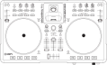
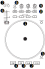

.. _ion-discover-dj-pro:

ION Discover DJ Pro
===================

Ion Discover DJ Pro is a 2-deck controller with integrated audio interface and iPhone dock.

   ION Discover DJ Pro (schematic view)

-  `Mixxx User Forum <https://mixxx.discourse.group/t/ion-discover-dj-pro-mapping-script/12120>`__

.. versionadded:: 2.2.5

Compatibility
-------------

This controller is USB MIDI class compliant, so it is plug-and-play on all platforms without having to install
any special drivers. The manufacturer’s page only mentions Windows and Mac but it’s confirmed working on Linux
as well.

Controller Mapping
------------------

Deck section
~~~~~~~~~~~~

   ION Discover DJ Pro (deck section)

===  ======================================================   ============================================================================================
No.  Control                                                  Function
===  ======================================================   ============================================================================================
1    :hwlabel:`JOG WHEEL`                                     Scratches the track
2    :hwlabel:`PLAY/PAUSE` button                             Plays/pauses a track in the respective Deck
3    :hwlabel:`CUE` button                                    While playing: go to cue point, while stopped: set cue point
4    :hwlabel:`SYNC` button                                   Sync the tempo to other playing track
5    :hwlabel:`SCRATCH` button                                Toggle the scratch mode
6    :hwlabel:`TEMPO` slider                                  Adjust the track playing speed
7    :hwlabel:`PITCH BEND` buttons -/+                        Lower (-) or Raise (+) the pitch temporarily
8    :hwlabel:`REVERSE PLAY` button                           Hold for reverse play
9    :hwlabel:`BASS`/:hwlabel:`MID`/:hwlabel:`TREBLE` knobs   Adjust the low/mid/high-frequency regions of the song
10   :hwlabel:`MUTE` buttons                                  Mute low/mid/high-frequency regions
===  ======================================================   ============================================================================================

Mixer section
~~~~~~~~~~~~~

   ION Discover DJ Pro (mixer section)

===  ======================================================   ============================================================================================
No.  Control                                                  Function
===  ======================================================   ============================================================================================
1    Channel faders                                           Adjust the output level for each channel
2    Cross fader                                              Fades between left and right deck.
3    :hwlabel:`A CUE` / :hwlabel:`B CUE` buttons              Sends the selected channel's audio to the headphone output
4    :hwlabel:`LOAD A` / :hwlabel:`LOAD B` buttons            Load the selected library track to deck A / B
5    :hwlabel:`CUE VOLUME` knob                               Control the output volume of the headphones output
6    :hwlabel:`BROWSE` knob                                   Browse the library
7    :hwlabel:`MASTER VOLUME` knob                            Control the output volume of the master output
===  ======================================================   ============================================================================================

Known Issues
------------

Controls not yet working:

- :hwlabel:`STUTTER` button
- :hwlabel:`ALL MUTE` button
- :hwlabel:`AUTOLOOP` buttons
- iPod dock
