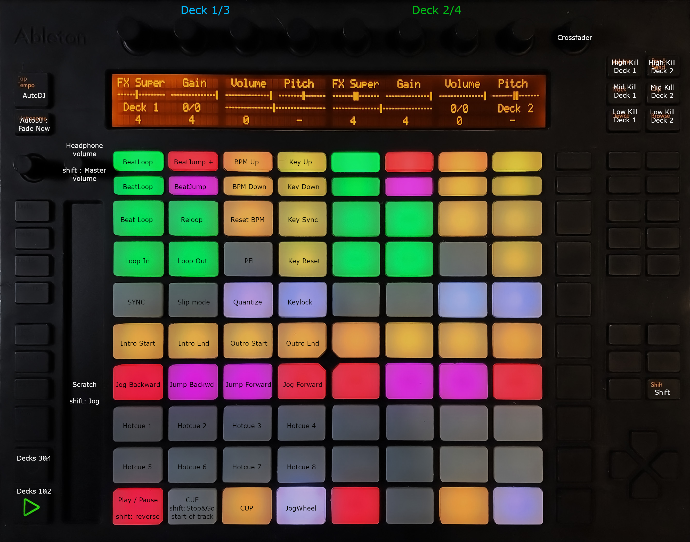

Ableton Push
============

-  `Manufacturer’s product page <https://web.archive.org/web/20130404203151/https://www.ableton.com/en/push/>`__ (archived)
-  `Forum thread <https://mixxx.discourse.group/t/ableton-push-mapping/>`__

Ableton Push was a controller released by Ableton in 2013.
It is not a DJing controller, but it offers some pads, buttons, knobs and an LCD screen.
A new version, Push 2, was released in 2015. The Push 2 is not supported by this mapping.

Mapping Description
-------------------

   Ableton Push (mapping view).

Center pads of the controller are split in 2 sections, Left and Right.
At startup, left half controls Channel 1, and right half controls Channel 2.
You can switch between deck 1&2 and deck 3&4 control using play/record buttons.

The 2 first lines on the screen shows knobs actions and positions.
The 3rd line on the screen shows which decks are controlled, track time and position.
4th line shows values controlled by the 2 buttons below the screen (BeatLoop size, BeatJump size, BPM and Key).

For top knobs, touching knobs while Shift button is pressed resets the value by default.
On volume knob, shift changes control from Headphone to Master.

.. versionadded:: To Be Released

.. note::
   This mapping is a work in progress.
   You can try it in the current release of Mixxx but it is not yet released.
   To test it, copy the 2 files Ableton-Push.midi.xml and Ableton-Push-scripts.js
   from `Mixxx source <https://github.com/mixxxdj/mixxx/tree/2.3/res/controllers>`__ in your Mixxx installation directory,
   inside controllers, and share your comments in `the forum <https://mixxx.discourse.group/t/ableton-push-mapping/>`__.
   
