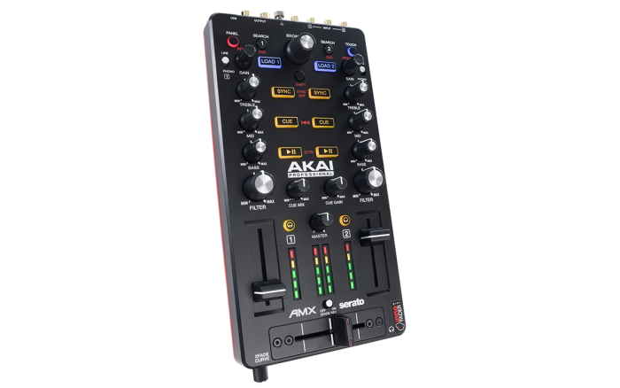
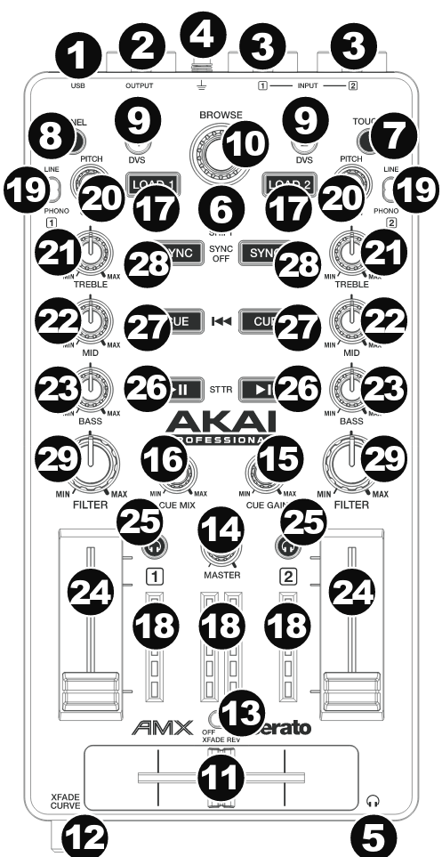

# Akai AMX

:::{warning}
This is an old manual that was rescued from the Mixxx wiki and may be outdated. If you encounter any issues, you can reach out on ?Github?Discourse?
:::

  - [Manufacturer's product page](http://www.akaipro.com/product/amx)
  - [Forum thread](http://www.mixxx.org/forums/viewtopic.php?f=7&t=7514)

This controller has all the basics for mixing and the cheapest 4 in/4
out sound card with 2 phono preamps, making it a good option for vinyl
control users. However, the maximum output level is low.

## Mapping description

Most of the controls are mapped exactly as for original SeratoDJ
mappings. There are some mappings that are different and specific to
Mixxx. They will be on the bottom of the list.

  - **8** - Panel - toggles large Library view
  - **9** - not mapped yet
  - **10** - When scrolls through track list. When clicked switches
    between track list / library. When clicked with Shift pressed
    expands selected item in library
  - **7** - enables touch controls on some buttons

<!-- end list -->

  - **20** - adjust gain
  - **21** - adjust treble, when touched kills treble
  - **22** - adjust mid, when touched kills mid
  - **23** - adjust bass, when touched kills bass

<!-- end list -->

  - **29** - turn right - lowpass filter, turn left - highpass filter
  - **17** - loads currently selected track from track list into related
    deck
  - **28** - sync current deck to playing deck
  - **27** - mapped to Mixxx CUE button, so behavior is defined in MIXXX
    settings
  - **26** - Play/pause related deck
  - **16** - adjust ratio of mix between current output and Cue Channel
  - **15** - gain for headphones
  - **25** - send this channel's pre-fader signal to the Cue Channel for
    monitoring.
  - **14** - Master volume knob
  - **11** - Crossfader
  - **12** - Adjusts Crossfader curve
