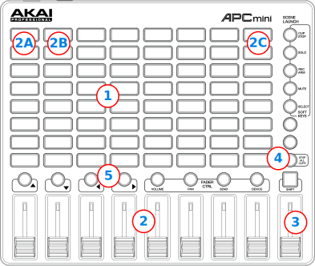

Akai APC Mini
===================

The *Akai APC Mini* is a controller for a 64 Samplers deck.

-  `Manufacturer’s product page <https://www.akaipro.com/apc-mini>`__

Mapping description
-------------------

- ( 1 ) The 64 pads are mapped directly to the 64 samplers available in the extended skins. If the skin has less samplers, the corresponding buttons will simply not work.
The first two rows of buttons are setup to be repeating samples to be used for looping sounds, the other six rows are left as they are.
All buttons supports three light states, yellow, green and red

 **Yellow**
   A sample is loaded and ready to play, but still not played.

 **Green**
   The sample is playing right now.

 **Red**
   The sample has played and now is stopped.

-  ( 2 ) The sliders below the buttons are mapped to the pregain control of the first two rows of samplers, that is:
   The first slider controls Samplers 1 and 9 (2a), the second slider 2 and 10 (2b) and so on until the last that controls 8 and 16 (2c).
-  ( 3 ) The last slider on the corner is attached to the Master Gain.
-  ( 4 ) The key :hwlabel:`Stop all clips` will actually do that.
-  ( 5 ) The left and right arrows just above the sliders are attached to Deck 1 and Deck 2 Play.
