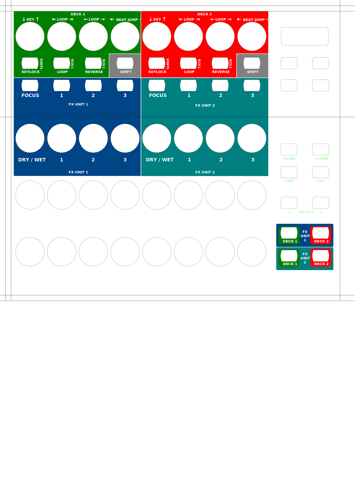

Behringer B-Control BCR2000
===========================

- `Manufacturer's product page <https://www.behringer.com/behringer/product?modelCode=P0245>`_
- `Forum thread <https://mixxx.discourse.group/t/behringer-b-control-bcr2000/20287>`_

The B-CONTROL BCR2000 is a general-purpose :term:`USB` :term:`MIDI` controller containing 20 buttons, 24 rotary
encoders and 8 push encoders. Every control is backed by LEDs that show the current value. As a
pure MIDI controller it contains no interfaces for audio or microphones.

The controller can be be configured extensively.
It offers 32 presets that may be programmed by the user.

.. versionadded:: 2.3

Compatibility
-------------

This controller is a class compliant USB MIDI and audio device, so it can be used without any
special drivers on GNU/Linux, Mac OS X, and Windows.

Setup
-----
Controller Preset
^^^^^^^^^^^^^^^^^
The default mapping works out-of-the-box for the factory settings of controller preset 1.

If you don't want to use this preset, you can choose one of the
following options:

#. Load the dump file ``bcr_Only_Controllers.syx`` via Sysex to any other preset slot.
   The dump file and instructions how to install it in the controller is available on the
   manufacturer's webpage.
#. Factory reset the controller.

Button Behaviour
^^^^^^^^^^^^^^^^
It is recommended, but not required, to change the button behaviour from *Toggle On* (default)
to *Toggle Off*. Both behaviours send an ``On`` message on button press, but the action to
send an ``Off`` message is different: *Toggle Off* responds to a button release while *Toggle On*
ignores the release and requires a second press. To change the behaviour:

#. Hold :hwlabel:`EDIT`, press a button, then release both
#. Turn the :hwlabel:`MODE` encoder until the display shows ``toFF``
#. Press the :hwlabel:`EXIT` button

To make the change persistent, press *Store* twice. See the manual for details.

Mapping Description
-------------------
The BCR2000 is a general purpose controller that allows different mappings.

The file ``Behringer-BCR2000-scripts.js`` contains a default mapping which works
out-of-the-box for a factory-reset controller, but may be customized freely according to your needs.

The mapping is split into several files:

============================================== =================== ===========
File                                           When to edit?       Description
============================================== =================== ===========
``Behringer-BCR2000-scripts.js``               Mapping changes     Mapping configuration. You can assign Mixxx controls to hardware controls here, and change which controls are bound to the Shift layer.
``Behringer-BCR2000-preset-scripts.js``        Preset changes      Contains the mapping of MIDI messages to hardware controls. If for some reason you'd like to use a different preset than the factory settings of preset #1, you can change the MIDI addresses according to your controller's preset within this file.
``Behinger BCR2000.midi.xml``                  Preset changes      Entry point that contains the MIDI addresses for all input controls and includes all other files. The mapping of MIDI messages to Mixxx controls is purely done in Javascript and based on `Components JS <https://github.com/mixxxdj/mixxx/wiki/Components%20JS>`_, so that the XML file does not contain any information about the Mixxx controls (e.g. `key` and `group`).
``midi-components-extension.js``               Usually never       Contains required Javascript components for the mapping.
============================================== =================== ===========

The mapping covers 2 effect units and loop, reverse & pitch controls for 2 decks:

The Shift buttons change the behaviour of the effect units (see
`Standard Effects Mapping <https://github.com/mixxxdj/mixxx/wiki/Standard%20Effects%20Mapping>`_
in the Wiki) and the buttons with side labels.

.. note:
   Both Shift buttons have the same effect, they are not deck-specific.
   The design decision was to keep the layout symmetric so that you don't have to press a button on deck 1 when you're currently working on deck 2.

Overlay
~~~~~~~
Overlay to print on cardboard or paper for lamination:

- `PDF, DIN A4 <behringer_bcr2000-a4.pdf>`_
- `PDF, DIN A3 <behringer_bcr2000-a3.pdf>`_
- `ODG <behringer_bcr2000.odg>`_ (LibreOffice)

Custom Mapping
^^^^^^^^^^^^^^
The mapping configuration (file ``Behringer-BCR2000-scripts.js``) may be customized by changing the
``configurationProvider`` object. Please see the documentation of the component
``GenericMidiController`` (file ``midi-components-extension.js``) for details.

Overlay
~~~~~~~
Feel free to create your own controller overlay be editing the `overlay file <behringer_bcr2000.odg>`_
using LibreOffice or similar.
