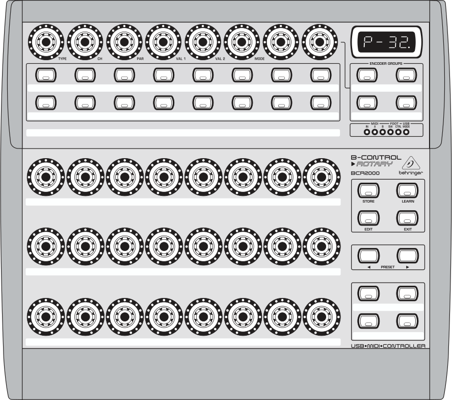

Behringer B-Control BCR2000
===========================

- `Manufacturer's product page <https://www.behringer.com/behringer/product?modelCode=P0245>`_
- `Forum thread <https://mixxx.discourse.group/t/behringer-b-control-bcr2000/20287>`_

The B-CONTROL BCR2000 is a general-purpose :term:`USB` :term:`MIDI` controller containing 20 buttons, 24 rotary
encoders and 8 push encoders. Every control is backed by LEDs that show the current value. As a
pure MIDI controller it contains no interfaces for audio or microphones.

The controller can be be configured extensively.
It offers 32 presets that may be programmed by the user.

.. versionadded:: 2.3

Compatibility
-------------

This controller is a class compliant USB MIDI and audio device, so it can be used without any
special drivers on GNU/Linux, Mac OS X, and Windows.

Setup
-----
Controller Preset
^^^^^^^^^^^^^^^^^
The default mapping works out-of-the-box for the factory settings of controller preset 1.

If you don't want to use this preset, you can choose one of the
following options:

#. Load the dump file ``bcr_Only_Controllers.syx`` via Sysex to any other preset slot.
   The dump file and instructions how to install it in the controller is available on the
   manufacturer's webpage.
#. Factory reset the controller.

Button Behaviour
^^^^^^^^^^^^^^^^
It is recommended, but not required, to change the button behaviour from *Toggle On* (default)
to *Toggle Off*. Both behaviours send an ``On`` message on button press, but the action to
send an ``Off`` message is different: *Toggle Off* responds to a button release while *Toggle On*
ignores the release and requires a second press. To change the behaviour:

#. Hold :hwlabel:`EDIT`, press a button, then release both
#. Turn the :hwlabel:`MODE` encoder until the display shows ``toFF``
#. Press the :hwlabel:`EXIT` button

To make the change persistent, press *Store* twice. See the controller manual for details.

Mapping Description
-------------------
The BCR2000 is a general purpose controller that allows different mappings.

The file ``Behringer-BCR2000-scripts.js`` contains a default mapping which works
out-of-the-box for a factory-reset controller, but may be customized freely according to your needs.

The controls are divided into five parts:

- Top left area (4 push encoders + 4 buttons): loop, reverse & pitch controls for Deck 1
- Top right area (4 push encoders + 4 buttons): loop, reverse & pitch controls for Deck 2
- Middle left area (4 buttons + 4 encoders): controls for Effect Unit 1
- Middle right area (4 buttons + 4 encoders): controls for Effect Unit 2
- Bottom right area (4 buttons): controls for assignment of effect units to decks

+-------------------------------------------------------+-----------------------------------------------------------------------------+
| Control                                               | Description                                                                 |
+==================+===============+====================+=============================================================================+
| 1st Push Encoder | Deck 1        | Encoder 1          | - Rotate: Manipulates the key of the track in semitones.                    |
|                  |               | (:hwlabel:`TYPE`)  | - Push: Resets the key to the original track key.                           |
|                  +---------------+--------------------+                                                                             |
|                  | Deck 2        | Encoder 5          |                                                                             |
|                  |               | (:hwlabel:`VAL 2`) |                                                                             |
+------------------+---------------+--------------------+-----------------------------------------------------------------------------+
| 2nd Push Encoder | Deck 1        | Encoder 2          | Increases or decreases the size of the current loop in beats.               |
|                  |               | (:hwlabel:`CH`)    |                                                                             |
|                  +---------------+--------------------+                                                                             |
|                  | Deck 2        | Encoder 5          |                                                                             |
|                  |               | (:hwlabel:`VAL 2`) |                                                                             |
+------------------+---------------+--------------------+-----------------------------------------------------------------------------+
| 3rd Push Encoder | Deck 1        | Encoder 3          | Moves the current loop left or right.                                       |
|                  |               | (:hwlabel:`PAR`)   |                                                                             |
|                  +---------------+--------------------+                                                                             |
|                  | Deck 2        | Encoder 7          |                                                                             |
+------------------+---------------+--------------------+-----------------------------------------------------------------------------+
| 4th Push Encoder | Deck 1        | Encoder 4          | Increases or decreases the number of beats to move the loop.                |
|                  |               | (:hwlabel:`VAL 1`) |                                                                             |
|                  +---------------+--------------------+                                                                             |
|                  | Deck 2        | Encoder 8          |                                                                             |
+------------------+---------------+--------------------+-----------------------------------------------------------------------------+
| Button Row 1,    | Deck 1        | Button 1           | - Press: Toggles keylock.                                                   |
| 1st Button       +---------------+--------------------+ - Shift + Press: Toggles vinyl control mode.                                |
|                  | Deck 2        | Button 5           |                                                                             |
+------------------+---------------+--------------------+-----------------------------------------------------------------------------+
| Button Row 1,    | Deck 1        | Button 2           | - Press: Toggles a loop that ends at the current play position.             |
| 2nd Button       +---------------+--------------------+ - Shift + Press: Toggles a rolling loop. Playback will resume where         |
|                  | Deck 2        | Button 6           |   the track would have been if it had not entered the loop.                 |
+------------------+---------------+--------------------+-----------------------------------------------------------------------------+
| Button Row 1,    | Deck 1        | Button 3           | - Press: Toggles reverse playback.                                          |
| 3rd Button       +---------------+--------------------+ - Shift + Press: Toggles rolling reverse playback. Playback continues       |
|                  | Deck 2        | Button 7           |   where the track would have been if it had not been temporarily reversed.  |
+------------------+---------------+--------------------+-----------------------------------------------------------------------------+
| Button Row 1,    | Deck 1        | Button 4           | Toggles shift. The Shift buttons change the controls as described in this   |
| 4th Button       +---------------+--------------------+ table and the behaviour of the effect units (see `Standard Effects Mapping  |
|                  | Deck 2        | Button 8           | <https://github.com/mixxxdj/mixxx/wiki/Standard%20Effects%20Mapping>`_      |
|                  |               |                    | in the Wiki).                                                               |
+------------------+---------------+--------------------+-----------------------------------------------------------------------------+
| Button Row 2,    | Effect Unit 1 | Button 1           | - Press: Toggles effect focus mode.                                         |
| 1st Button       +---------------+--------------------+ - Shift + Press: Toggles effect unit.                                       |
|                  | Effect Unit 2 | Button 5           |                                                                             |
+------------------+---------------+--------------------+-----------------------------------------------------------------------------+
| Button Row 2,    | Effect Unit 1 | Button 2           | Toggles parameter button 1.                                                 |
| 2nd Button       +---------------+--------------------+                                                                             |
|                  | Effect Unit 2 | Button 6           |                                                                             |
+------------------+---------------+--------------------+-----------------------------------------------------------------------------+
| Button Row 2,    | Effect Unit 1 | Button 3           | Toggles parameter button 2.                                                 |
| 3rd Button       +---------------+--------------------+                                                                             |
|                  | Effect Unit 2 | Button 7           |                                                                             |
+------------------+---------------+--------------------+-----------------------------------------------------------------------------+
| Button Row 2,    | Effect Unit 1 | Button 4           | Toggles parameter button 3.                                                 |
| 4th Button       +---------------+--------------------+                                                                             |
|                  | Effect Unit 2 | Button 8           |                                                                             |
+------------------+---------------+--------------------+-----------------------------------------------------------------------------+
| Encoder Row 1,   | Effect Unit 1 | Encoder 1          | Adjust the mixing of the dry (input) signal with the wet (output) signal    |
| 1st Encoder      +---------------+--------------------+ of the effect unit.                                                         |
|                  | Effect Unit 2 | Encoder 5          |                                                                             |
+------------------+---------------+--------------------+-----------------------------------------------------------------------------+
| Encoder Row 1,   | Effect Unit 1 | Encoder 2          | Controls the parameter of effect 1.                                         |
| 2nd Encoder      +---------------+--------------------+                                                                             |
|                  | Effect Unit 2 | Encoder 6          |                                                                             |
+------------------+---------------+--------------------+-----------------------------------------------------------------------------+
| Encoder Row 1,   | Effect Unit 1 | Encoder 3          | Controls the parameter of effect 2.                                         |
| 3rd Encoder      +---------------+--------------------+                                                                             |
|                  | Effect Unit 2 | Encoder 7          |                                                                             |
+------------------+---------------+--------------------+-----------------------------------------------------------------------------+
| Encoder Row 1,   | Effect Unit 1 | Encoder 4          | Controls the parameter of effect 3.                                         |
| 4th Encoder      +---------------+--------------------+                                                                             |
|                  | Effect Unit 2 | Encoder 8          |                                                                             |
+------------------+---------------+--------------------+-----------------------------------------------------------------------------+
| Button Box,      | Deck 1        | Left Button        | Toggles assignment of Effect Unit 1.                                        |
| 1st row          +---------------+--------------------+                                                                             |
|                  | Deck 2        | Right Button       |                                                                             |
+------------------+---------------+--------------------+-----------------------------------------------------------------------------+
| Button Box,      | Deck 1        | Left Button        | Toggles assignment of Effect Unit 2.                                        |
| 2nd row          +---------------+--------------------+                                                                             |
|                  | Deck 2        | Right Button       |                                                                             |
+------------------+---------------+--------------------+-----------------------------------------------------------------------------+

Overlay
^^^^^^^
Overlay to print on cardboard or paper for lamination:

- `PDF, DIN A4 <../../_static/controllers/behringer_bcr2000-a4.pdf>`_
- `PDF, DIN A3 <../../_static/controllers/behringer_bcr2000-a3.pdf>`_
- `ODG <../../_static/controllers/behringer_bcr2000.odg>`_ (LibreOffice)
