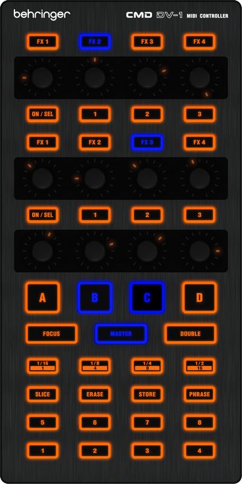

# Berhinger CMD DV-1

Manufacturer's product page :
[Behringer](https://www.music-group.com/Categories/Behringer/Computer-Audio/DJ-Controllers/CMD-DV-1/p/P0AJG)

## Hardware

This device is composed by endless
encoders (Not specified by the officials specifications) sending
two states position and by momentary push buttons. Its LEDs cannot be
turned off and are lighting in **orange** by default. They can be set in
two modes : **blue** or **blinking blue**.
The **FX\[1-4\],Focus,Master,Double** buttons are builtin controls used
as a "shift" function and will only changes the addresses of their
affected controls (knobs for FX\[1-4\], decks for others).

### LEDs Brightness

There is two levels for the brightness of the LEDs equipped on the CMD
Series :

  - Dimmed
  - Bright (Max :?:)

Toggling between them can simply be done by pressing the four bottom
buttons of the controller at same time and this can be done anytime
while the device is running (plugged to power via USB).

Source : [Resolume
forum](http://resolume.com/forum/viewtopic.php?f=7&t=10639#p42068)

:?: Controller also going into another mode (need to be defined) when
pressing the same buttons but while plugging the controller : this one
show buttons LEDs \[ 7 \]&\[ 8 \] dimmed and buttons LEDs \[ 3 \]&\[ 4
\] in bright mode.

## Mapping Description

The following description mapping is for a community mapping that you
can find in the forums
~~[here](http://www.mixxx.org/forums/viewtopic.php?f=7&t=7910)~~.
Up to date mapping can be found on github :
<https://github.com/Tikeri/mixxxstuff>.

### FX Rows

The first two rows of encoders and the row of buttons above & below each
of them control effects.

#### Dual FX Rack

| Encoder | Effect Selection        | Effect Parameter 1    | Effect Parameter 2    | Effect Parameter 3    |
| ------- | ----------------------- | --------------------- | --------------------- | --------------------- |
| Button  | Enable/Disable Effect 1 | Channel output Deck 1 | Channel output Deck 2 | Channel output Master |
| Label   | \[ON/SEL\]              | \[ 1 \]               | \[ 2 \]               | \[ 3 \]               |

  - **\[ON/SEL\]** LEDs buttons are **blinking blue** when
    no effect is selected, turns into
    **fixed blue** when the effect unit is
    enabled and into fixed **orange** if
    disabled.
  - **\[ 1 \] / \[ 2 \] / \[ 3 \]** LEDs buttons are **fixed blue** if
    the desired channel is enabled and
    **orange** if disabled.

#### Special FX Rack

Theses are located above the deck buttons \[A-D\] :

|                                     |                                   |                                   |                                     |
| ----------------------------------- | --------------------------------- | --------------------------------- | ----------------------------------- |
| Quick effect Pitch Adjust Channel 1 | Quick effect Super Knob Channel 1 | Quick effect Super Knob Channel 2 | Quick effect Pitch Adjust Channel 2 |

### Modes & Deck Selection

Mode is switched automatically after select one or more deck.

**A,B,C,D** :

  - Select or deselect a deck for the differents mode operations
  - LEDs are **blinking blue** when
    selected and **orange** if
    not.

**Focus** :

  - Allow to set hotcues on selected
    deck(s)

**Master** :

  - Enable temporary beat rolls looping with ratios \[1/16\], \[1/8\],
    \[1/4\] and \[1/2\]
  - Activate the goto hotcues on selected
    deck(s)

**Double** :

  - Enable temporary beat rolls looping with ratios \[1\], \[4\], \[8\]
    and \[16\]
  - Activate the goto and play hotcues on
    selected deck(s)

:\!: **Important** : Switching mode will always require to redo deck
selection.
## Others functions

**Slice** :

  - Not assigned yet

**Erase** :

  - Allow to remove hotcues after selecting deck(s) (Available in any
    mode)

**Store** :

  - Not assigned yet

**Phrase** :

  - Not assigned yet

### HotCues

They are located to the bottom of controller with numbers
**\[1\]..\[8\]** :

  - Set HotCue : Enable **FOCUS** mode
    and select the desired deck(s)
  - Goto HotCue : Enable **MASTER** mode
    and select the desired deck(s)
  - Goto and Play HotCue : Enable
    **DOUBLE** mode and select the desired deck(s)
  - Remove HotCue : Press **ERASE**
    button and select the desired HotCue you want to remove

### See also

\* [Behringer CMD DC-1](behringer_cmd_dc-1)
\* [Behringer CMD MM-1](behringer_cmd_mm-1)
