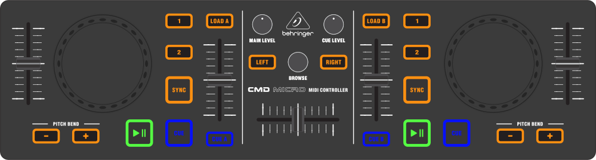

Behringer CMD Micro
===================

   Behringer CMD Micro (schematic view)

The *Behringer CMD Micro* is a simple controller for basic two-channel
mixing. This device does not have a built in sound card, so it would
require a `splitter cable <hardware%20compatibility#splitter%20cables>`__ or `separate sound card <hardware%20compatibility#usb%20sound%20cards>`__ to be able to preview tracks in headphones.

-  `Manufacturer’s product
   page <https://www.music-group.com/Categories/Behringer/Computer-Audio/DJ-Controllers/CMD-MICRO/p/P0AJR/>`__
   (offline as of 2016)

.. versionadded:: 2.1

Mapping description
-------------------

-  **Cue**, **Play/Pause**, **Sync**, **Load A**, **Load B**, the
   **Level** / **Browse** knobs, and the **crossfader** all behave as
   labeled.
-  **Cue A** and **Cue B** send the respective track to the headphones.
-  The inner vertical sliders control the track’s volume.
-  The outer sliders control the playback speed.
-  The **1**, and **2** buttons toggle a 4 and 8 beat loop,
   respectively.
-  The **Pitch Bend** buttons temporarily adjust the playback rate. They
   can be configured to change the key of the track instead by setting
   the ``PitchBendsKey`` option to true at the top of the JS file (open
   the JS file in a text editor such as Notepad, TextEdit, or gEdit to
   change this). With the PitchBendsKey option, when both buttons are
   pressed simultaneously, the key is reset to the track’s default key.

Jog Wheels
~~~~~~~~~~

The jog wheels are touch enabled. When the top is pressed, they emulate
turntable scratching. When the side is touched, they affect the playback
speed (jog).
