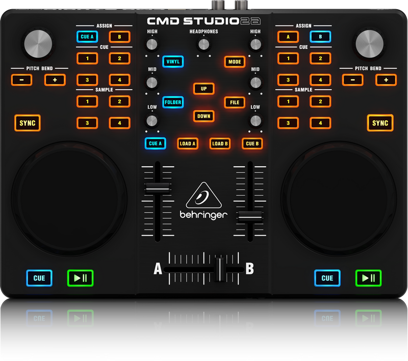
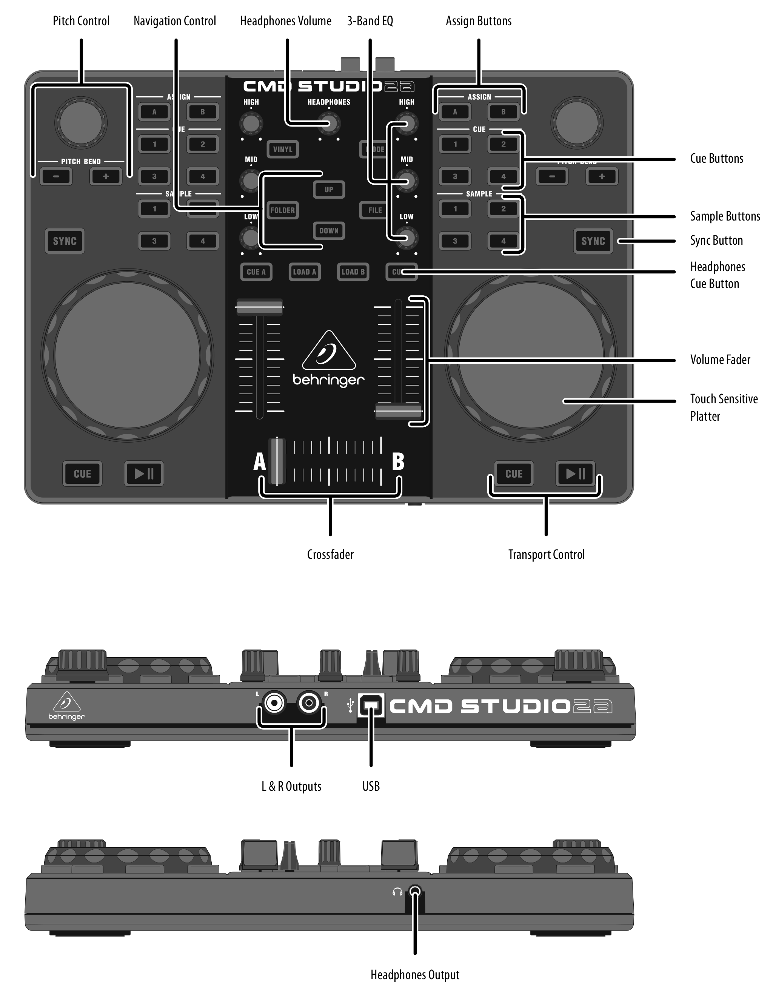
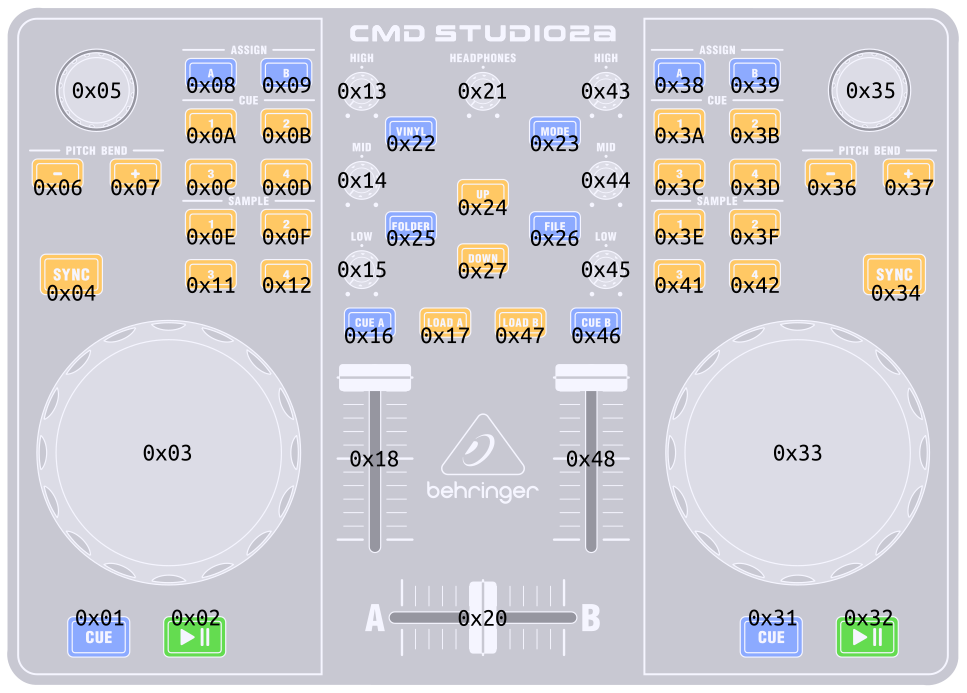

This is the Work in progress page of **Behringer CMD Studio 2a** mapping
for Mixxx 2.0.0

# Behringer CMD Studio 2a

Ultra-Portable Dual-Deck DJ MIDI Controller with 4-Channel Audio
Interface

The Behringer CMD Studio 2a is a 2 deck DJ MIDI controller and has a 4
channel (one stereo master, one stereo headphones) USB sound card built
in.

  - [Mixxx Forum
    Thread](https://www.mixxx.org/forums/viewtopic.php?f=7&t=9359)
  - [Manufacturer's product
    page](https://www.musictri.be/Categories/Behringer/Computer-Audio/DJ-Controllers/CMD-STUDIO-2A/p/P0AVW)
  - [Manufacturer's product downloads
    page](http://www.musictri.be/Categories/Behringer/Computer-Audio/DJ-Controllers/CMD-STUDIO-2A/p/P0AVW/downloads)
  - [Manufacturer's quick start
    guide](https://media.music-group.com/media/PLM/data/docs/P0AVW/CMD%20STUDIO%202A_QSG_WW.pdf)

## Mixxx Sound Hardware Preferences

  - Master output: channels 1-2
  - Headphone output: channels 3-4

## Mapping description

All the buttons and knobs on the controller behave as they are labelled:

However, some buttons (Mode, Vinyl, Assign A and Assign B) require extra
explanations.

### Mixer

  - The HIGH, MID, and LOW EQ knobs, deck faders, crossfader, CUE A and
    CUE B buttons (headphone monitoring), and headphone knob (head
    gain), all operate as labelled.

### Navigation Control

  - The FOLDER button focus on folders tree and expand/collapses library
    items.
  - The FILE button focus on files list.
  - The UP and DOWN buttons change the selected item (file or folder) up
    or down one by one. If MODE button is active, file selection moves
    up or down ten by ten.

### Transport Control

  - The LOAD A and LOAD B buttons will load the currently highlighted
    track in the library window into deck A or B.
  - The deck CUE, PLAY and SYNC buttons work as labelled (SYNC toggles
    master sync for the deck).

### Wheels

  - While a track is playing, spinning the wheels temporarily speeds up
    or slows down the track.
  - When a track is stopped, spinning the wheels results in a fast
    search.
  - When the top wheel surface is touched the wheels act as as a
    precision jog.
  - When the VINYL button is activated, moving the wheel while touching
    the top surface scratches the track.

### Hot Cue Buttons

  - If not currently set, pressing a HOT CUE button sets that hot cue at
    the current playback position.
  - If already set, pressing a HOT CUE button jumps to that hot cue
    position.
  - If the MODE button is active, pressing an already set HOT CUE button
    will clear that hot cue.

### Playback Pitch/Rate

  - The pitch knobs control the pitch sliders in Mixxx and change the
    tempo permanently.
  - The PITCH BEND +/- buttons step the playback rate up or down
    temporally while pressed.
  - The PITCH BEND +/- buttons reset the tempo to normal rate when both
    are pressed simultaneously.

### ASSIGN A and ASSIGN B Buttons

  - ASSIGN A button activates loop mode.
  - ASSIGN B button toggles loop enabled.
  - When loop mode is active, +/- buttons set loop in and loop out
    points.

### Sample Buttons

  - When samples are loaded, deck A sample buttons trigger samples 1 to
    4 of bank 1 and deck B sample buttons trigger samples 1 to 4 of bank
    2.
  - When MODE button is active, pressing a sample button stops the
    current sample playing and goes to start.

### MODE button

  - The MODE button has three states: off, shifted and locked. When off,
    led is orange. When shifted, led is blinking blue. When locked, led
    is blue.
  - Pressing the MODE button once activates shifted mode. Pressing the
    button twice activates the locked mode. Pressing again toggles mode
    off.
  - When MODE is shifted, next action will determine a different MODE
    state. Navigation up or down into library sets the state to locked.
    Other actions sets to off.

### MODE actions

This is equivalent to a shift button on other controllers and so changes
the behaviour of a number of the controller buttons as follows:

  - The HOT CUE buttons clear the current hot cue point if defined.
  - The sample buttons stop the current sample and go to start.
  - The UP and DOWN buttons, in file navigation, move ten by ten items
    up or down.
  - The CUE buttons go to start cue.

## Hardware settings

### MIDI Channel

  - Default MIDI channel with which the unit works is channel 1 (0x0).
  - The unit offers the ability to change the MIDI channel if is needed,
    but then, in order to work properly, JS and XML mapping files must
    be changed too according to match the new channel.
  - The manufacturer offers a channel changer application in his
    [download
    page](http://www.musictri.be/Categories/Behringer/Computer-Audio/DJ-Controllers/CMD-STUDIO-2A/p/P0AVW/downloads)
    for Mac and Windows users. GNU/Linux users can try the Windows
    version with Wine (tested on Ubuntu 16.04 LTS and working fine).

### Reset to factory defaults

Follow this procedure to reset the unit to its default factory settings
(including resetting MIDI channel to 1):

  - Unplug the USB cable if it was plugged to the unit. Lights will turn
    off.
  - Hold simultaneously left CUE and left PLAY buttons and, while
    holding, plug the USB cable to the unit.
  - After a few seconds, right CUE and right PLAY buttons start to
    blink.
  - Release the pressed buttons and the unit reset will be completed.
    Lights will turn on.

### MIDI controls diagram

Default MIDI channel is number 1 (0x0).

