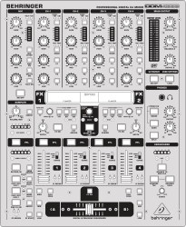
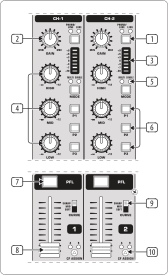
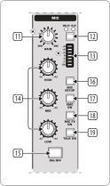
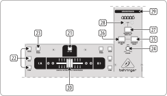
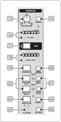

.. _behringer-ddm4000:

Behringer DDM4000
=================

   Behringer DDM4000 (schematic view)

The DDM4000 is a 5-Channel Digital DJ Mixer with Sampler, 4 FX Sections, BPM Counters and MIDI
support. Each of the following sections can be configured separately to be used either for audio
or as MIDI controller:

* Channel 1-4
* Microphone Channel
* Crossfader
* Sampler

The mixer contains no digital interfaces for audio or microphones.

* `Manufacturer's product page <https://www.behringer.com/behringer/product?modelCode=P0167>`_
* `User Manual <https://mediadl.musictribe.com/media/sys_master/h1f/h4d/8849404887070.pdf>`_
* `Forum thread <https://mixxx.discourse.group/t/ddm4000-controller-mapping/20045>`_

.. versionadded:: 2.3

Compatibility
-------------

This controller contains a :term:`MIDI` interface with 5-pin DIN jacks In/Out/Thru. If your
soundcard does not offer DIN jacks, a separate USB/MIDI interface is required to use it
on GNU/Linux, Mac OS X, and Windows.

Setup
-----
Configure at least one mixer section as MIDI controller:

#. Long press the :hwlabel:`CONSOLE SETUP` knob
#. Select ``MIDI SETTINGS`` by turning and pressing the :hwlabel:`CONSOLE SETUP` knob
#. Select the sections that you want to use as MIDI controller
#. Press the :hwlabel:`ESC` button to exit MIDI Setup
#. To make the change persistent, save the settings in a user preset.
   See the controller manual for details.

Controller Mapping
------------------

A schematic drawing with the control numbers that are used here can be found on the specified page in the User Manual in the Links section.

.. _behringer-ddm4000-stereochannels:

Stereo channels 1 – 4 (p. 6)
~~~~~~~~~~~~~~~~~~~~~~~~~~~~

   Stereo channels strips

===  =======================================================  ============================================================================================
No.  Control                                                  Function
===  =======================================================  ============================================================================================
4    :hwlabel:`HIGH` / :hwlabel:`MID` / :hwlabel:`LOW` knobs  Adjust high/mid/low-frequencies.
6    :hwlabel:`P1` / :hwlabel:`P2` / :hwlabel:`P3` buttons    Toggle the kill function for high/mid/low-frequencies.
7    :hwlabel:`PFL` button                                    Toggle headphone pre-fader listening.
8    Channel faders                                           Adjust the output volume.
10   :hwlabel:`CF ASSIGN` button                              Assign the channel to either side of the crossfader.
===  =======================================================  ============================================================================================

.. note::
  On some units of this mixer, the LEDs of the buttons :hwlabel:`P1` / :hwlabel:`P2` / :hwlabel:`P3`
  show an unexpected behavior in MIDI mode. When such a LED is turned on via MIDI, it flashes
  shortly but does not stay lit. The problem occurs only when at least 1 channel is in audio
  (non-MIDI) mode. It does not occur when all channels are in MIDI mode.
  Firmware version 1.02 (Dec 14 2007) is known to show this behavior,
  and there's no fix available according to a reply from the technical support:

    "I see the issue, but sorry, the code is 15 years old and getting the 15 year old tools
    (plus license, plus old windows version) needed to compile it,
    together with finding the bug in a very complex code base (without access to the developer)
    makes fixing this nearly impossible."

    -- [MUSIC Tribe Care] Behringer - Technical Support (08 Sep 2021)

.. _behringer-ddm4000-microphonechannel:

Microphone (p. 6)
~~~~~~~~~~~~~~~~~

   Microphone channel

===  =======================================================  ============================================================================================
No.  Control                                                  Function
===  =======================================================  ============================================================================================
19   :hwlabel:`TALK ON`                                       Switch the Talkover function.
===  =======================================================  ============================================================================================

.. _behringer-ddm4000-crossfader:

Crossfader section (p. 7)
~~~~~~~~~~~~~~~~~~~~~~~~~

   Crossfader section

===  =======================================================  ============================================================================================
No.  Control                                                  Function
===  =======================================================  ============================================================================================
20   Crossfader                                               Fade between the signals that are assigned to its two sides A and B.
21   :hwlabel:`CF ON` button                                  Toggle crossfader function. When disabled, the crossfader control in the Mixxx user interface is hidden.
24   :hwlabel:`CURVE` knob                                    Adjust the response of the crossfader.
25   :hwlabel:`REVERSE HOLD` button                           Toggle a permanent reverse of the crossfader sides A and B. This means that A and B are interchanged.
26   :hwlabel:`REVERSE TAP` button                            Toggle a momentary reverse of the crossfader sides A and B. This means that A and B are interchanged as long as the TAP push button is held down.
===  =======================================================  ============================================================================================

.. _behringer-ddm4000-sampler:

Sampler (p. 8)
~~~~~~~~~~~~~~

   Sampler section

===  =======================================================  ============================================================================================
No.  Control                                                  Function
===  =======================================================  ============================================================================================
55   :hwlabel:`VOLUME/MIX` knob                               Control the volume of sampler 1.
57   :hwlabel:`PFL` button                                    Toggle headphone pre-fader listening for sampler 1.
58   :hwlabel:`SAMPLE LENGTH` buttons                         Adjust the beatloop size of sampler 1.
61   :hwlabel:`MODE` buttons for bank 1/2                     Select the playback type for the selected sampler (Reverse or Loop). A short press toggles the Reverse function, a long press toggles the Loop function.
62   :hwlabel:`PLAY/OUT` buttons for bank 1/2                 Start or stop playback for the selected sampler. When the Loop function is disabled, the sample is only played back while the button is pressed.
63   :hwlabel:`SMP FX ON` button                              Toggle effect unit 1 for sampler 1.
65   :hwlabel:`CF ASSIGN` button                              Assign sampler 1 to either side of the crossfader.
===  =======================================================  ============================================================================================
