This document explains the _Behringer Extension Library_ which is provided under `controllers/behringer-extension-scripts.js`.
Main target audience is the group of mapping creators.

## Overview

The library is an extension to [Components JS](https://github.com/mixxxdj/mixxx/wiki/Components-JS). It contains

1. A framework to declare a controller mapping in JavaScript
2. Additional Components

Initial purpose of this library was to simplify the mapping of two Behringer controllers. Despite its name, it doesn't require anything Behringer-specific. It is a generic library that may be used for any controller mapping.

> [!NOTE]
This library was not developed by the core developer team. It might be that its underlying concepts do not match the long-term direction of controller mapping development. Therefore, it might be required to introduce incompatible changes in future if mainline development requires so. The name _Behringer_ was kept as part of the name to prevent general use by accident. Keep this in mind before using it.

## Controller Mapping Framework
The framework allows to define the input and output bindings of a controller mapping in JavaScript by declaring a `GenericMidiController` object.

### `GenericMidiController`

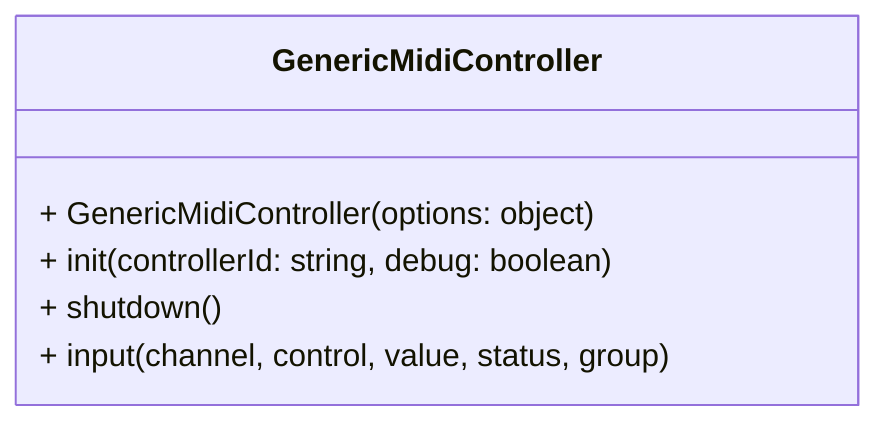
A `ComponentContainer` representing a generic, configurable MIDI controller. It consists of custom decks, effect units and additional component containers, where _custom_ means:

- Decks may be composed of arbitrary components.
- Effect units have support for sending output values for encoders.
- All components are managed by a `LayerManager` so that they may be put on either the _Default_ or the _Shift_ layer by configuration.

The mapping definitions are defined by a `Configuration` object. It is read on controller initialization by calling `configurationProvider()` on the constructor options object.

The `input()` function dispatches incoming messages to the component with matching MIDI address and layer. It may be referenced from XML, although this is usually not required: since Mixxx 2.6, both input and output bindings are managed via JavaScript. This means that input will work even if the XML element `<controls>` is omitted.

This example illustrates how to do declare a minimal `GenericMidiController`:

- File `controllers/Demo.midi.xml`:
  ```xml
  <?xml version="1.0" encoding="UTF-8"?>
  <MixxxControllerPreset schemaVersion="1" mixxxVersion="2.6+">
    <info>
      <name>Demo</name>
      <description>Demo Controller</description>
    </info>
    <controller id="Demo">
      <scriptfiles>
        <file filename="midi-components-0.0.js"/>
        <file filename="Behringer-Extension-scripts.js" />
        <file filename="Demo-scripts.js" functionprefix="Demo" />
      </scriptfiles>
    </controller>
  </MixxxControllerPreset>
  ```
- File `controllers/Demo-scripts.js`:
  ```js
  var Demo = new behringer.extension.GenericMidiController({
    configurationProvider: function() {
      return {
        init: function() { print("Initializing DemoController"); },
        decks: [ /* deck definitions */ ],
        effectUnits: [ /* effect unit definitions */ ]
      };
    }
  });
  ```

The `GenericMidiController` was designed for general purpose controllers (such as AKAI APC, AKAI Fire, AKAI midimix, Behringer BCR2000, Behringer X-Touch, DJ Techtools Midi Fighter, Faderfox, Icon Platform M+, Korg nanoKONTROL, Midiplus SmartPAD, Nektar Aura, Novation Launchpad & Studiologic SL Mixface). For real world examples, see Behringer [DDM4000](https://github.com/mixxxdj/mixxx/blob/main/res/controllers/Behringer-DDM4000-scripts.js) and [BCR2000](https://github.com/mixxxdj/mixxx/blob/main/res/controllers/Behringer-BCR2000-scripts.js) mappings.

### `Configuration`

An object that contains all mapping definitions for a controller.

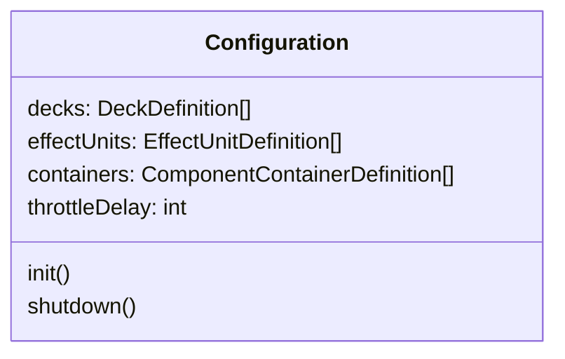

All members are optional.

- `decks`: An array of deck definitions.
- `effectUnits`: An array of effect unit definitions.
- `containers`: An array of component container definitions.
- `throttleDelay`: A positive number (in ms) that is used to slow down the initialization of the controller; this option is useful if the hardware is limited to process a certain number of MIDI messages per time.
- `init()`: A function that is called when the mapping is loaded, e.g. when Mixxx is started.
- `shutdown()`: A function that is called when the mapping is unloaded, e.g. when Mixxx is shutting down.

Example:
```js
{
  throttleDelay: 40,
  init: function() {
    components.Button.prototype.shiftChannel = true;
    components.Button.prototype.shiftOffset = 0x20;
  },
  decks: [{
    deckNumbers: [1],
    components: [
      {type: components.Button, options: {midi: [0x90, 0x01], inKey: "reverseroll"}},
      {type: components.Button, shift: true, options: {midi: [0x90, 0x01], inKey: "reverse", type: c.Button.prototype.types.toggle}},
      // ... more components
    ]
  }]
}
```

#### ComponentDefinition
Mapping definition for a single Component, e.g. a button or an encoder.

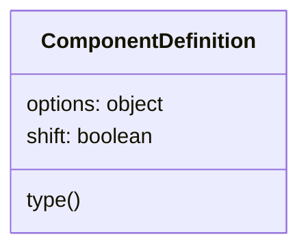

- `type`: Component type (constructor function, required).
- `options`: Additional options for the component (object, required).
- `shift`: Active only when a Shift button is pressed? (boolean, optional).

Examples:
```js
{type: components.Button, options: {midi: [0x90, 0x01], inKey: "reverseroll"}}

{type: components.Button, shift: true, options: {midi: [0x90, 0x01], inKey: "reverse", type: c.Button.prototype.types.toggle}}
```

#### DeckDefinition
Mapping definition for a deck (channel) containing components for e.g. play or loop as well as an equalizer and a quick effect unit.

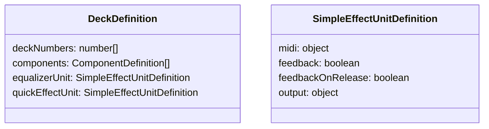

Example:
```js
{
  deckNumbers: [1],
  components: [
    {type: components.Button, options: {midi: [0x90, 0x01], inKey: "reverseroll"}},
    {type: components.Button, shift: true, options: {midi: [0x90, 0x01], inKey: "reverse", type: toggle}},
    // ... more components
  ],
  equalizerUnit: {
    midi: {
      parameterKnobs:   {1: [0xB0, 0x06], 2: [0xB0, 0x05], 3: [0xB0, 0x04]},
      parameterButtons: {1: [0x90, 0x02], 2: [0x90, 0x01], 3: [0x90, 0x00]},
    },
    output: {
      parameterButtons: {1: [0xB0, 0x3D], 2: [0xB0, 0x3B], 3: [0xB0, 0x39]},
    },
  },
  quickEffectUnit: {
    midi: {enabled: [0x90, 0x02], super1: [0xB0, 0x06]},
    output: { enabled: [0xB0, 0x3D]},
  }
}
```

##### DeckDefinition
- `deckNumbers`: As defined by `components.Deck`
- `components` (optional): An array of component definitions for the deck
- `equalizerUnit` (optional): Equalizer unit definition
- `quickEffectUnit` (optional): Quick effect unit definition

##### SimpleEffectUnitDefinition
This definition is used for both equalizer and quick effect unit of a deck.

- `midi`: An object of component definitions for the unit. Each definition is a key-value pair for a component of `EqualizerUnit` or `components.QuickEffectUnit` where `key` is the name of the component and `value` is the MIDI address.
- `feedback`: Enable controller feedback (boolean, optional). When set to `true`, values of the components in this unit are sent to the hardware controller on changes. The address of the MIDI message is taken from the `midi` property of the affected component.
- `feedbackOnRelease`: Enable controller feedback on button release (boolean, optional). When set to `true`, values of the buttons in this unit are sent to the hardware controller on release, no matter if changed or not. The address of the MIDI message is taken from the `midi` property of the affected component.
- `output`: Additional output definitions (optional). The structure of this object is the same as the structure of `midi`. Every value change of a component contained in `output` causes a MIDI message to be sent to the hardware controller, using the configured address instead of the component's `midi` property. This option is independent of the `feedback` option.

#### EffectUnitDefinition
Mapping definition for an effect unit.

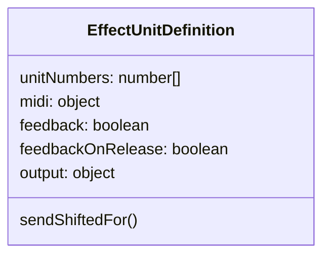

- `unitNumbers`: As defined by `components.EffectUnit`.
- `midi`, `feedback`, `feedbackOnRelease`, `output`: same as for [`SimpleEffectUnitDefinition`](#simpleeffectunitdefinition).
- `sendShiftedFor`: Type of components that send shifted MIDI messages (optional). When set, all components of this type within this effect unit are configured to send shifted MIDI messages (`sendShifted: true`).

Example:
```js
{
  unitNumbers: [1, 2],
  midi: {
    dryWetKnob: [0xB0, 0x03],
    effectFocusButton: [0x90, 0x34],
    enableButtons: {1: [0x90, 0x31], 2: [0x90, 0x32], 3: [0x90, 0x33]},
    knobs: {1: [0xB0, 0x00], 2: [0xB0, 0x01], 3: [0xB0, 0x02]},
  },
  sendShiftedFor: components.Button,
}
```

#### ComponentContainerDefinition
Mapping definition for a custom component container. May be used to group components that are not part of a deck or effect unit, e.g. for a sampler, crossfader or microphone.

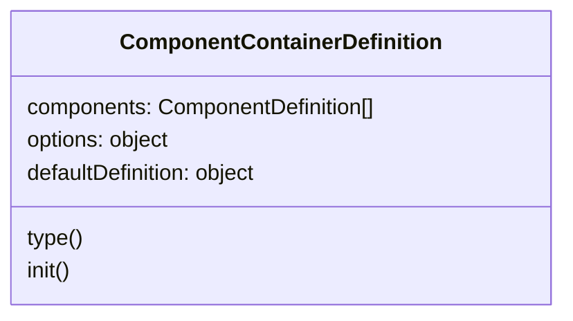

- `components`: An object of component definitions for the component container.
- `options`: (object, optional) Constructor argument for the container
- `defaultDefinition`: (object, optional) Default definition for components in the container
- `type`: (constructor function, optional); default: `components.ComponentContainer`
- `init`: (function, optional) A function that is called after component creation and before first use

The `defaultDefinition` may be used to avoid repeated declarations of settings for multiple components. It is deep-merged with each component definition before the component is created. If both default and component definition are given, the component definition is preferred.

Example:
```js
{ // Crossfader
  defaultDefinition: {options: {group: "[Mixer Profile]"}},
  components: [
    {type: behringer.extension.CrossfaderCurvePot, options: {midi: [0xB0, 0x14]}},
    {type: components.Button, options: {midi: [0x90, 0x29], key: "xFaderReverse", type: toggle, sendShifted: true}},
  ]
}
```

### Framework Architecture
This section gives some insight into implementation details of the framework. Despite the rest of this document, it is targeted at developers, not mapping creators.

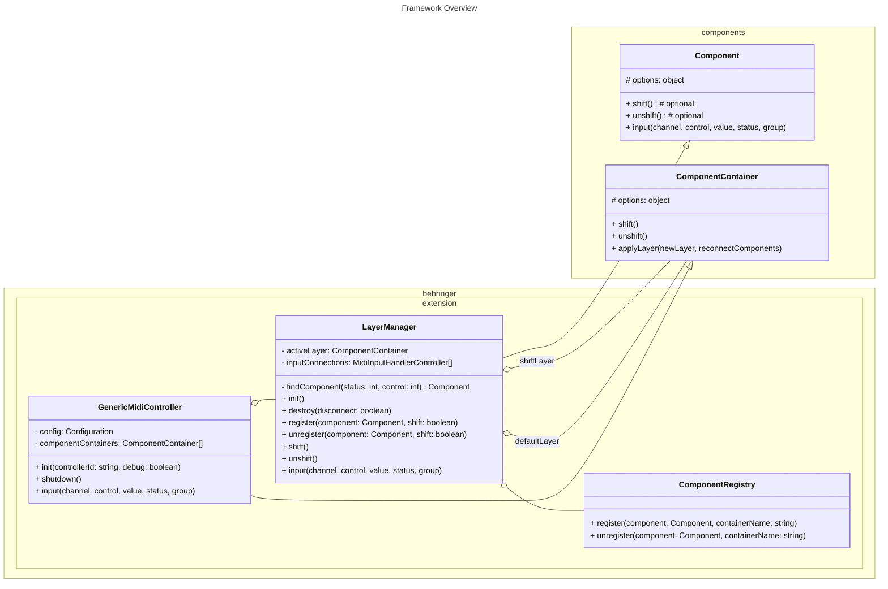

- The root object `GenericMidiController` creates and stores all components and component containers given by the definitions of the `Configuration` object. All components are registered in a `LayerManager` on initialization.
- The `LayerManager` associates each component to either the _Default_ or the _Shift_ layer.
  - A `ComponentRegistry` is used internally to manage layers.
  - Only one layer is _active_ at a time.  The `LayerManager` is derived from `Component` and thus knows `shift()` and `unshift()` functions. These are used to switch the active layer.
  - When a component is registered, connections for both input and output are created; input is bound to `LayerManager.input()` which dispatches MIDI messages to the component matching MIDI address and layer.
  - If a component container is configured for `feedback`, a `Publisher` is created for each contained `Pot` so that its values are sent to the controller.
  - If a component container is configured for `feedbackOnRelease`, `triggerOnRelease` is enabled for each contained `Button`.
- The `ComponentRegistry` simplifies association of a component to a named container.

### `LayerManager`
A `Component` that helps working with layered components.

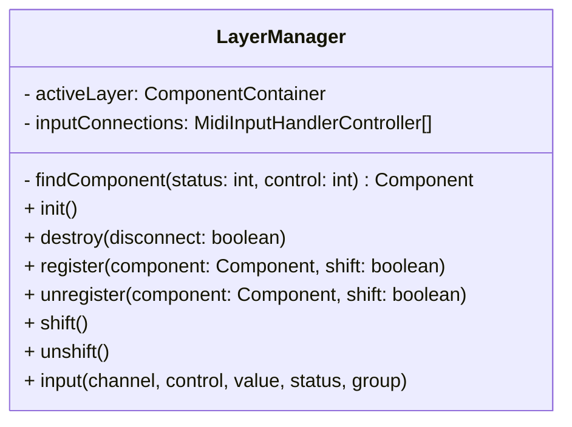

The wiki article [MIDI Scripting](https://github.com/mixxxdj/mixxx/wiki/MIDI%20scripting#modifier-shift-buttons-and-layered-mappings) describes two approaches to implement a shift layer: either working with a condition _within_ a component or switching components in a _container_. The LayerManager is a generic component that implements the second approach.

Internally, it uses a component registry for the two layers _Default_ and _Shift_. JS Components may be added to either layer. The `shift()` and `unshift()` functions toggle between the these layers, whereas the `LayerManager` is the only component that knows about shifting. When toggled, all affected components on the corresponding layer are registered / unregistered. Components that are not shiftable stay untouched. Additionally, the `LayerManager` offers `input()`, a facade to be called from the outside that delegates to the component on the currently active layer.

### `ComponentRegistry`
An `object` (no `Component`) that manages `Components` in named `ComponentContainers`. Within a container, components are identified by their MIDI address.

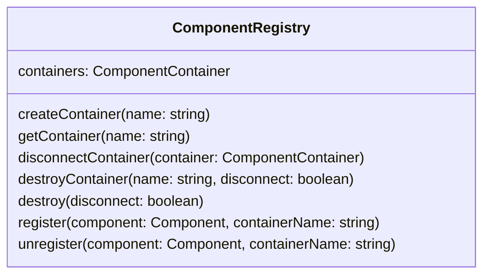

### `Publisher`
A component that sends the values of a source component to a MIDI controller even if the source component uses its `outKey` property for other purposes.

Useful if an input-only component in Mixxx (e.g. a `Pot`) is bound to an output-aware physical control (e.g. an encoder with LEDs).

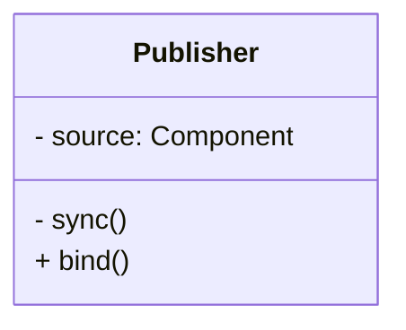

- `options.source` Source component whose values are sent to the controller

Most components send output properly out of the box so that no `Publisher` is required. It was designed to add functionality to some special components, e.g. effect unit controls, and offers a `bind()` function that allows for re-binding to the source component when its internal state changes.

## Additional Components
All components are derived from type `Component` unless specified otherwise.

### `BackLoopButton`
A button that toggles a beatloop _ending_ at the current play position, so the beat jump occurs immediately on button press and not after the first loop.

### `BlinkingButton`
A button that blinks when `on`.

- `options.blinkDuration`: Blink duration in ms; optional, default: 500

### `CrossfaderCurvePot`
A pot for the crossfader curve.

- `options.mode`: Crossfader mode; optional, default: `0`. (`0`: additive, `1`: constant)

### `CustomButton`
A button with configurable Mixxx control values for `on` and `off`.

- `options.onValue`: Value for `on`; optional, default: `1`
- `options.offValue`: Value for `off`; optional, default: opposite of `onValue`

### `DirectionEncoder`
An encoder for directions. Turning the encoder to the right means "forwards" and returns `1`; turning it to the left means "backwards" and returns `-1`.

- `options.relative`: Enable [soft-takeover](https://github.com/mixxxdj/mixxx/wiki/Midi-Scripting#soft-takeover)

This component supports an optional relative mode as an alternative to dealing with soft takeover. To use it, set the `relative` property to `true` in the options object for the constructor. In this mode, moving the Pot will adjust the Mixxx Control relative to its current value. Holding shift and moving the encoder will not affect the Mixxx Control. This allows the user to continue adjusting the Mixxx Control after the encoder has reached the end of its physical range.

### `EnumEncoder`
An encoder for enumeration values.

- `options.values`: an array containing the enumeration values
- `options.softTakeover`: (optional) Enable [soft-takeover](https://github.com/mixxxdj/mixxx/wiki/Midi-Scripting#soft-takeover); default: `true`

### `EnumToggleButton`
A button to cycle through the values of an enumeration.

The enumeration values may be defined either explicitly by an array or implicitly by a `maxValue` so that the values are `[0..maxValue]`.

- `options.values` An array of enumeration values
- `options.maxValue` A positive integer defining the maximum enumeration value

### `LongPressButton`
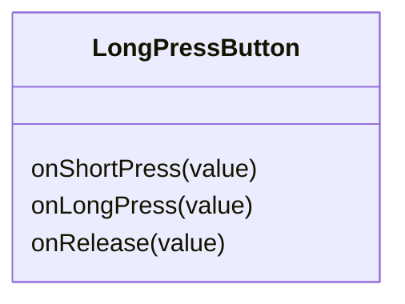

A button that supports different actions on short and long press.

### `LoopEncoder`
An EnumEncoder for a loop control that uses beat sizes as enumeration.

Example use: Encoder for `beatloop_size` and `beatjump_size`

### `LoopMoveEncoder`
An encoder that moves the current loop.  Turning the encoder to the right will move the loop forwards; turning it to the left will move it backwards. The amount of movement may be given by either `size` or `sizeControl`, `sizeControl` being preferred.

- `options.size` (optional) Size given in number of beats; default: 0.5
- `options.sizeControl` (optional) Name of a control that contains `size`

### `ParameterComponent`
A component that uses the parameter instead of the value as output.

### `RangeAwareEncoder`
An encoder for a value range of _[-bound..0..+bound]_.

- `options.bound`: A positive integer defining the range bound

Example use: encoder to change key (`pitch`)

### `RangeAwarePot`
An pot for a value range of _[-bound..0..+bound]_.

- `options.bound`: A positive integer defining the range bound

### `ShiftButton`
A button that triggers `shift()` and `unshift()` on a `target` component.

- `options.target`: Target component

### `Timer`
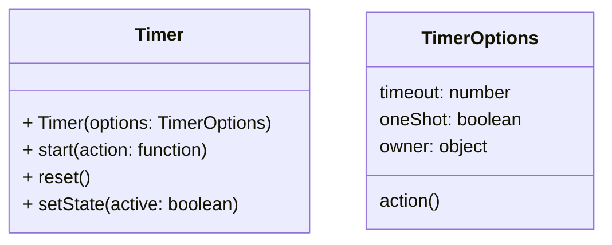

An `object` (no `Component`) that simplifies using a timer safely. See [Script Timers](https://github.com/mixxxdj/mixxx/wiki/Script-Timers) for details.

- `timeout`: Duration between start and action (in ms)
- `oneShot`: If `true`, the action is run once; otherwise, it is run periodically until the timer is reset.
- `action` Function that is executed whenever the timer expires
- `owner` Owner object of the `action` function (assigned to `this`)

### `Trigger`
A component that is triggered on every input, regardless of the value.
Example use: Button to reset key (`pitch_set_zero`).

### DDM4000 Components
The [DDM4000](https://github.com/mixxxdj/mixxx/blob/main/res/controllers/Behringer-DDM4000-scripts.js) mapping contains a few more `Components` internally; they are specific to the device but might be interesting anyway:
- `Blinker`
- `OnTrackLoadButton`
- `KeyButton`
- `EffectAssignmentToggleButton`
- `EffectAssignmentLongPressButton`
- `EchoOutButton`
- `CrossfaderUnit` (with `Crossfader`, `CrossfaderToggleButton`)
- `CrossfaderReverseTapButton`
- `CrossfaderAssignLED`
- `SamplerBank` (with `PlayButton`, `PlayIndicatorLED`, `ReverseMode`, `LoopMode`, `ModeButton`)

## References
### Related Wiki pages
- [Components JS](https://github.com/mixxxdj/mixxx/wiki/Components-JS)
- [MIDI Scripting](https://github.com/mixxxdj/mixxx/wiki/MIDI%20scripting#modifier-shift-buttons-and-layered-mappings)
- [New controller system](https://github.com/mixxxdj/mixxx/wiki/New-controller-system)
- [Component JS ES7 Brainstorming](https://github.com/mixxxdj/mixxx/wiki/Component-JS-ES7-Brainstorming)

### Usage of the extension library
- Mapping of Behringer [DDM4000](https://github.com/mixxxdj/mixxx/blob/main/res/controllers/Behringer-DDM4000-scripts.js)
- Mapping of Behringer [BCR2000](https://github.com/mixxxdj/mixxx/blob/main/res/controllers/Behringer-BCR2000-scripts.js)

### Development history
- PR [#3342](https://github.com/mixxxdj/mixxx/pull/3342): Mapping for MIDI Controller Behringer BCR2000
- PR [#4262](https://github.com/mixxxdj/mixxx/pull/4262): Update controller mapping for Behringer DDM4000 mixer
