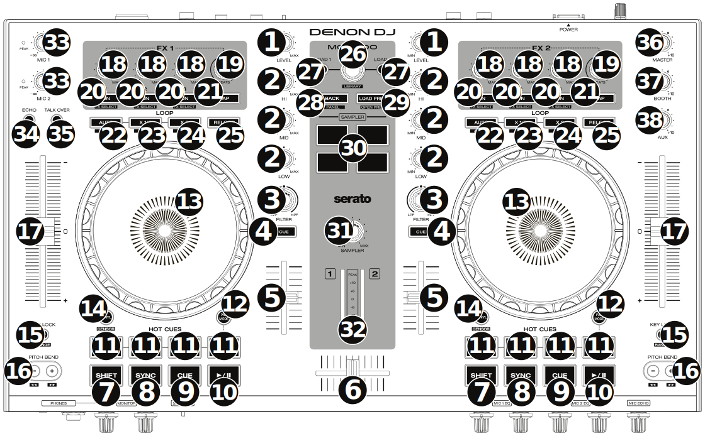

Denon MC4000
============

The MC4000 is a 2-deck DJ controller for the professional entertainer
wrapping in-demand audio manipulation tools in a robust steel chassis
for rugged durability. In addition to precision touch-activated jog
wheels, performers get access to dedicated hot cue and sample pads for
on-the-fly remixes.

-  `Manufacturer’s product page <https://www.denondj.com/mc4000-mc4000xus>`__
-  `Manual / Midi commands <http://denon-dj.de/wp-content/uploads/2023/03/MC4000-User-Guide-v1.2_00.pdf>`__
-  `Forum thread <https://mixxx.discourse.group/t/denon-mc4000-mapping/15311>`__

The microphone and auxiliary inputs are mixed with the main output in
hardware. They are not available to the computer through the MC4000’s
sound card, so this controller’s sound card is not suitable for
broadcasting or recording the inputs. You could use the controller with
a separate USB sound card that has a microphone input for that purpose.

.. versionadded:: 2.1

Mapping Description
-------------------

The Mixxx mapping is mostly the same as the standard Serato mapping,
with a few exceptions which are highlighted below with *underlined text*
where a specific functionality that exists in Serato is not (yet) implemented in the Mixxx mapping.

   Denon MC4000 (layout)

1. **Channel Level:** Adjust the level of the pre-fader, pre-EQ audio signal
2. **Channel EQ:** Boost or cut the high, mid-range, and low frequencies
3. **Channel Filter:** Turn counterclockwise to apply a low-pass filter.
   Turn clockwise to apply a high-pass filter.
4. **Channel Cue:** Send the channel’s pre-fader signal to the headphones’ cue channel.
5. **Channel Fader:** Adjust the channel’s volume level.
6. **Crossfader:** Mix between the two decks.
7. **Shift:** Press and hold this button to access secondary functions of other controls.
8. **Sync / Sync Off:** Automatically match the corresponding Deck’s tempo with the opposite Deck’s tempo and phase.
   *Unlike Serato, Shift + sync is not mapped to anything.*
9. **Cue / Track Start:** Behavior changes according to the :ref:`cue mode selected in Mixxx’s preferences <interface-cue-modes>`.
   Hold Shift and press this button to return to the start of the track.
10. **Play/Pause / Stutter:** Play/pause playback. Hold Shift and press to “stutter-play” the track from the cue point.
11. **Hot Cues:** Press a pad to set or jump to a hot cue point.
    To set a hot cue point, press an unlit pad at the desired location in the track (the pad will then be lit).
    To jump to that hot cue point, press the lit pad.
    To delete a hot cue point, hold Shift and press a lit pad.
12. **Pad Mode:** *Currently unmapped*
13. **Platter:** This capacitive, touch-sensitive platter controls the audio playhead when the wheel is touched and moved.
    When the Vinyl button is on, move the platter to “scratch” the track like a vinyl record.
    When the Vinyl button is off (or if you are touching only the side of the platter), move the platter to temporarily adjust the track’s speed.
14. **Vinyl / Censor:** Toggle “vinyl mode” for the platter.
    When activated, you can use the platter to scratch the track as you would with a vinyl record.
    Hold Shift and this button to activate the Censor feature: the playback
    of the track will be reversed, but when you release the button, normal
    playback will resume from where it would have been if you had never
    engaged the Censor feature (i.e., as if the track had been playing
    forward the whole time).
15. **Key Lock / Range:** Toggle Key Lock.
    When Key Lock is activated, the track’s key will remain the same even if you adjust its speed.
    Hold Shift and press to cycle through the available ranges of the pitch fader (+/- 8%, 16%, 50%). Other ranges for the fader can be selected in Mixxx’s Preferences in the Interface section, but pressing this button with Shift will only cycle through 8%, 16%, and 50%.
16. **Pitch Bend -/+ :** Hold one of these buttons to momentarily reduce or increase (respectively) the speed of the track.
    Hold Shift and then press and hold one of these buttons to rewind or fast-forward (respectively) through the track.
17. **Pitch Fader:** Move this fader to adjust the speed (pitch) of the track.
    You can adjust its total range with the Key Lock / Range button.
18. **FX Level:** Turn the knobs on the left side of the controller to adjust the effect intensity (i.e. “meta” parameter) for the effects in Effect Unit 1.
    Turn the knobs on the right side of the controller to adjust the meta parameter for the effect in Effect Unit 2.
    The FX On button under the knob must be lit for the effect to be enabled.
19. **FX Beats:** Currently changes the wet/dry ratio of the effect chain.
    This will probably change in the future.
20. **FX On / Select:** Press to toggle the corresponding effect on or off.
    Hold Shift and press to assign a different effect to this slot.
21. **FX Tap:** *Currently not mapped*
22. **Auto-Loop / Auto 4:** Toggle a 4 beat loop on or off.
    Hold Shift and press to toggle beat quantize on or off (I.e quantization of loop start / end points to the nearest beat).
    *Note: this behavior is different from Serato*.
23. **X 1/2 Loop / Loop In:** Halve the length of the current loop.
    Hold Shift and press to create a Loop In point at the current location.
24. **X 2 Loop / Loop Out:** Double the length of the current loop.
    Hold Shift and press to create a Loop Out point at the current location.
25. **Reloop:** Exit the current loop if a loop is active, or skip to the last-played loop and activate it immediately if there is no loop active.
26. **Browse / Library Knob:** Turn to browse through the items in the currently focused pane (i.e. library or sidebar).
    Press shift and turn to scroll *quickly* through the items in the currently focused pane.
    Press the knob to select the current item.
27. **Load:** Load the currently selected track to the deck.
28. **Back / Panel:** Change the currently focused pane (i.e. library or sidebar) to the next or previous pane.
29. **Load Prep / Open Prep:** Load the currently selected track to the preview deck.
    Hold Shift and press to eject the current track from the preview deck.
    (*Different from Serato mapping*).
30. **Sampler Pads:** Press to play the corresponding samples in the software’s sampler (1–4).
    Hold Shift and press a pad to stop its sample playback.
31. **Sample Level:** Turn this knob to adjust the volume level of the software’s samplers (1–4).
32. **Level Meters:** These LEDs display the level of the audio signal depending on the state of each deck and Channel Fader.
    The meters are not affected by the position of the Master Knob.
33. **Mic Volume:** Adjust the input gain of the microphone.
    This adjusts the hardware microphone preamplifier, not Mixxx’s mic gain.
    The microphone input is not available to the computer through the MC4000’s sound card; it is mixed with the main output in hardware.
34. **Mic Echo:** Toggle an echo effect on the microphone input. This effect is done in hardware, not in Mixxx.
35. **Mic Talk Over / Post:** Toggle microphone talkover, which automatically reduces the volume of the music when using the microphone.
    Hold shift and press to toggle whether the microphone input is routed to the booth output.
    These controls are done by the MC4000 in hardware and do not affect Mixxx.
36. **Master:** Adjust the main output level of the sound card. This does not affect the main gain in Mixxx.
37. **Booth:** Adjust the booth output level of the sound card. This does not affect anything in Mixxx.
38. **Aux:** Adjust the auxiliary output level of the sound card. This does not affect anything in Mixxx.
