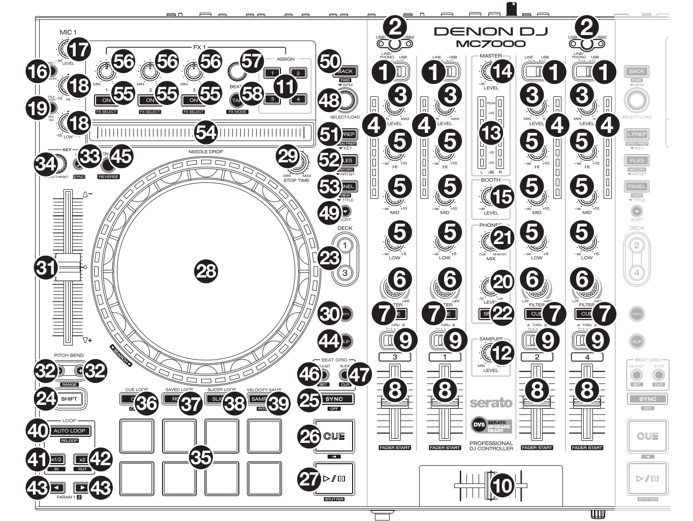

Denon MC7000
============

The Denon MC7000 is a professional DJ controller which has got 4-channel capability and dual USB connections. These two USB audio interfaces enable two DJs to play together. This controller includes Denon’s high build quality and superior 24-bit audio reproduction, makes this suited to both mobile and club DJs.

The dual 6" platters have a touch-capacitive design with rotational LED displays. The MC7000 has exclusive and dedicated Key Matching and Changing controls that deliver an unprecedented ability to instantly and harmonically match musical keys. The unit’s comprehensive, multi-input mixer also provides access to line/phono inputs from both authentic analogue (vinyl) and digital sources.

Links
~~~~~

-  `Denon MC7000 Mapping thread <https://mixxx.discourse.group/t/denon-mc7000-mapping/18235>`__
-  `Manufacturer’s product page <https://www.denondj.com/professional-dj-controller-for-serato-mc7000xus>`__
-  `User Guide <http://cdn.inmusicbrands.com/denondj/MC7000/MC7000-UserGuide-v1.1.pdf>`__
-  `Hardware Setting Specification <http://cdn.inmusicbrands.com/denondj/MC7000/MC7000-Hardware-Settings-Mode-Specification-v1_4.pdf>`__

.. versionadded:: 2.2.4

Features
~~~~~~~~

-  4-channel DJ controller with digital mixer
-  Dual USB audio interfaces - connect 2 computers at once
-  16 velocity-sensitive performance pads
-  New dedicated key-matching and changing controls
-  Solid 6-inch touch-capacitive platters with tracking LED
-  2 mic inputs with dedicated controls
-  XLR Booth and Master connections

Compatibility
~~~~~~~~~~~~~

-  **Mac** users should be just fine connecting the MC7000 and go.
-  **Windows** users need to install the latest Windows Driver from `Denon Download Site <https://www.denondj.com/downloads>`__.
-  **Linux** users need to know that the MC7000 internal audio interface
   is not available out-of-the-box for older Linux Kernels. You have to
   upgrade your **Kernel** to minimum versions LTS: **4.19.105** or
   **5.4.21**. All kernel versions **5.6.x** and following are supporting the device. 
   All recent Linux distributions are shipped with Audio support for the MC7000, like
        -  Ubuntu 20.04 and 20.10
        -  Ubuntu based like Linux Mint and KDE Neon
        -  Manjaro Linux 19.x & 20.x
        -  OpenSUSE Tumbleweed
        -  Gentoo stable 
        
Mapping
~~~~~~~

This controller is made for Serato DJ and most of the mapping is made
for Mixxx accordingly. Anyhow, there are several differences for
functions not matching the Serato mapping. If you have any wishes to
improve the mapping, then please discuss it in the `Denon MC7000
Mapping <https://mixxx.discourse.group/t/denon-mc7000-mapping/18235>`__
thread.

User Variables
~~~~~~~~~~~~~~

Please check the :file:`Denon-MC7000-scripts.js` mapping file for user variables to:

-  activate NeedleDrop sensor while a track is playing (default: false)
-  set the Pitch Fader ranges in % to toggle between them 
   (default: 4, 6, 8, 10, 16, 24)
-  Platter Ring LED mode: single LED on or off (default: 1). Can be
   switched with SHIFT + Deck button
-  Vinyl Mode on or off at Mixxx start which also triggers the Platter
   Ring LED function (default: 1)
-  Scratch Parameters (default: 33.3, 1/10, 1/10/32)
-  Jog Parameters (default: 1, 3)

Layout and functions
~~~~~~~~~~~~~~~~~~~~

   Denon MC7000 (schematic view)

----

1.  **Input Selector:** Set this switch to the desired audio source from this channel. Channel’s controls will only send MIDI information when its input selector is set to USB.

    .. hint::
        This is handled by the controller. The status of Mixxx will not be changed.

----

2.  :hwlabel:`USB1 / USB2`: Press this button to select whether the deck is controlling the computer connected to USB Port 1 or USB Port 2. If only one USB Port is connected the controller activates this automatically.

    .. hint::
        This is handled by the controller. The status of Mixxx will not be changed.

----

3.  :hwlabel:`LEVEL`: Turn this knob to adjust the level of the pre-fader, pre-EQ audio signal for the channel.

----

4.  **Channel Level Meters:** These LEDs display the audio signal level of the channel as in Mixxx GUI.

----

5.  **Channel EQ:** Turn these knobs to boost or cut the :hwlabel:`HI`, :hwlabel:`MID` and :hwlabel:`LOW` frequencies for the channel.

----

6.  :hwlabel:`FILTER`: Turn this knob to adjust the filter applied to the channel. Turn the knob counterclockwise to apply a low-pass filter. Turn the knob clockwise to apply a high-pass Filter.

----

7.  :hwlabel:`CUE`: Press this button to send the channel’s pre-fader signal to the headphones’ cue channel.

----

8.  **Channel Fader:** Use this fader to adjust the channel’s volume level.

----

9.  **Crossfader Assign:** Routes the audio playing on the corresponding channel to either side of the crossfader (:hwlabel:`A` or :hwlabel:`B`), or bypasses the crossfader and sends the audio directly to the program mix (:hwlabel:`THRU`).

----

10. **Crossfader:** Use this crossfader to mix between the left and right decks.

----

11. :hwlabel:`FX ASSIGN`: Use these buttons to apply :hwlabel:`FX 1` and/or :hwlabel:`FX 2` to the corresponding channel.

----

12. :hwlabel:`SAMPLER LEVEL`: Turn this knob to adjust the volume level of the software’s sampler. If the volume is set to 0 then the Sampler banks are hidden, otherwise shown.

----

13. **Master Level Meters:** These LEDs show the Master Audio signal.

    .. hint::
        The LEVEL Meter is handled by the controller and not correlated to the output in Mixxx.

----

14. :hwlabel:`MASTER LEVEL`: Turn this knob to adjust the volume level of the master outputs.
    
    .. hint::
        This is handled by the controller. The status of Mixxx will not be changed.

----

15. :hwlabel:`BOOTH LEVEL`: Turn this knob to adjust the volume level of the booth outputs.
    
    .. hint::
        This is handled by the controller. The status of Mixxx will not be changed.

----

16. :hwlabel:`MIC ON/OFF`: Press this button to activate/deactivate the microphones.
    
    .. hint::
        This is handled by the controller. The status of Mixxx will not be changed.

----

17. :hwlabel:`MIC LEVEL`: Turn these knobs to adjust the volume levels of the corresponding microphone inputs.

    .. hint::
        This is handled by the controller. The status of Mixxx will not be changed.

----

18. **Microphone settings:** 

    **Left Deck:** **Mix EQ:** Turn these knobs to boost or cut the :hwlabel:`HI` and :hwlabel:`LOW` frequencies for Mic 1. 
    
    **Right Deck:** :hwlabel:`TONE`: Turn this knob to adjust the tone (high-low) of the Mic 2 audio signal. 
    
    **Right Deck:** :hwlabel:`ECHO (MIC 1&2)`: Turn this knob to adjust the amount of the echo effect on the microphones’ audio signal. This works on both: Mic 1 and Mic 2.
    
    .. hint::
        This is handled by the controller. The status of Mixxx will not be changed.

----

19. **Microphone switch:**

    **Left Deck:** :hwlabel:`TALKOVER MIC 1&2`: Press this button to use the “talkover” feature, which automatically reduces the volume level of the master mix when you speak into the microphones. 
    
    Press and hold :hwlabel:`SHIFT` and then press this button to activate/deactivate the “post” feature. When on, the microphones’ signal will be sent to the Booth Outputs. When off, the microphones’ signal will not be routed to the Booth Outputs. 
    
    **Right Deck:** `ECHO MIC 1&2`: Press this button to activate or deactivate the echo effect on the microphones’ audio signal.
    
    .. hint::
        This is handled by the controller. The status of Mixxx will not be changed.

----

20. :hwlabel:`PHONES LEVEL`: Adjusts the volume of the headphones.

    .. hint::
        This is handled by the controller. The status of Mixxx will not be changed.

----

21. :hwlabel:`PHONES MIX`: Adjusts the software’s audio output to the headphones, mixing between the cue output and the master mix output.
    
    .. hint::
        This is handled by the controller. The status of Mixxx will not be changed.

----

22. :hwlabel:`SPLIT`: When this switch is in the On position, the headphone audio will be “split” such that all channels sent to cue channel are summed to mono and sent to the left headphone channel and the master mix is summed to mono and sent to the right channel. When the switch is in the Off position, the cue channel and master mix will be “blended” together.
    
    .. hint::
        This is handled by the controller. The status of Mixxx will not be changed.

----

23. :hwlabel:`DECK`: Selects which deck in the software is controlled by that
    hardware deck. The left deck can control Deck 1 or 3; the right deck
    can control Deck 2 or 4. 
    
    Press and hold :hwlabel:`SHIFT` and then press this button to trigger the Platter LEDs mode.

----

24. :hwlabel:`SHIFT`: Press and hold this button to access secondary functions of other controls.
 
----

25. :hwlabel:`SYNC`: Press this button to automatically match the corresponding deck’s tempo with the tempo and phase of the opposite deck. Press again to deactivate Sync. Hold this button down for one sec to permanently match the tempo.

----

26. :hwlabel:`CUE`: During playback, press this button to return the track to the cue point. If a cue point is not set yet, then press this button to set it at the current track position. If the deck is paused, press and hold this button to play the track from the cue point. Release the button to return the track to the cue point and pause it. To continue playback without returning to the cue point, press and hold this button and then press the :hwlabel:`PLAY` button, afterwards release cue button. 

    Press and hold :hwlabel:`SHIFT` and then press this button to return to the start of the track.

----

27. :hwlabel:`PLAY / PAUSE`: This button pauses or resumes playback.

    Press and hold :hwlabel:`SHIFT` and then press this button to :hwlabel:`STUTTER` the track from the last set cue point.

----

28. **Platter:** This capacitive, touch-sensitive platter controls the audio playhead when the wheel is touched and moved. When the :hwlabel:`VINYL` button is on, move the platter to “scratch” the track as you would with a :hwlabel:`VINYL` record. When the :hwlabel:`VINYL` button is off (or if you are touching only the side of the platter), move the platter to temporarily adjust the track’s speed. 

    Press and hold :hwlabel:`SHIFT` and then move the side of the platter (or deactivate :hwlabel:`VINYL`) to navigate quickly through the track (:hwlabel:`SEARCH`).

----

29. :hwlabel:`STOP TIME`: Controls the rate at which the track slows to a complete stop (“brake time”) during backspin. This also affects how quickly the track starts after a backspin ("Soft Start").

----

30. :hwlabel:`VINYL`: Press this button to activate/deactivate a “vinyl mode” for the platter. When activated, you can use the platter to “scratch” the track as you would with a vinyl record.

----

31. **Pitch Fader:** Move this fader to adjust the speed (pitch) of the track. You can adjust its total range with the :hwlabel:`PITCH BEND -/+` buttons.

----

32. :hwlabel:`PITCH BEND –/+`: Press and hold one of these buttons to momentarily reduce or increase the speed of the track.

    Press and hold :hwlabel:`SHIFT` and then press one of these buttons to set the range of the Pitch Fader to values of 4%, 6%, 8%, 10%, 16% and 24%.

    .. hint::
        Pitch Fader Range values can be set inside the script :file:`Denon-MC7000-scripts.js`

----

33. :hwlabel:`KEY LOCK`: Press this button to activate/deactivate Key Lock. When Key Lock is activated, the track’s key will remain the same even if you adjust its speed.

    Press and hold :hwlabel:`SHIFT` and then press this button to automatically match the corresponding deck’s key with the key of the opposite deck (:hwlabel:`SYNC`).

----

34. :hwlabel:`KEY SELECT/RESET`: Turn this knob to raise or lower the key of the track. Press this knob to reset the track’s key to its original key.

    Press and hold :hwlabel:`SHIFT` and turn the knob to zoom in and out the waveform or push the knob to reset the Waveform zoom to the level set in preferences.

----

35. **Pads:** Performance PADs have different functions based on the PAD Mode described below.

----

36. :hwlabel:`CUE`: Push this button to activate the "Hot Cue" feature. In this mode push a Performance PAD (35) to set or play a HOT CUE. 

    Press and hold :hwlabel:`SHIFT` and push a Performance PAD (35) to delete an existing HOT CUE.
    
    2nd (:hwlabel:`CUE LOOP`) and 3rd (:hwlabel:`FLIP`) functions are not yet available.

----

37. :hwlabel:`ROLL`: Push this button to activate the "Roll" feature, which lets you repeat a number of beats while keep pushing a Performance PAD down. From the 1st to 8th Performance PAD the loop size is set as 1/16, 1/8, 1/4, 1/2, 1, 2, 4 and 8 beats. The SLIP function remains active so that the track continues at the position where it had been playing forward the whole time.

    2nd (:hwlabel:`SAVED LOOP`) function is not yet available.

----

38. :hwlabel:`SLICER`: Push this button to activate the "Beat Jump" feature. The first row buttons jump forward by 1, 2, 4 and 8 beats. The 2nd row buttons jump backward by 1, 2, 4 and 8 beats.

    2nd (:hwlabel:`SLICER LOOP`) function is not yet available.

----

39. :hwlabel:`SAMPLER`: 8 samplers can be triggered from either Deck. Add samplers to the sampler bank pushing a Performance PAD button. If a sampler is loaded then the push will start the sampler, push again while playing will replay the track from Cue point.

    Press and hold :hwlabel:`SHIFT` and push a Performance PAD button to stop a sampler while playing or eject a sampler when stopped.

    2nd (:hwlabel:`VELOCITY SAMP`) and 3rd (:hwlabel:`PITCH`) functions are not yet available.

----

40. :hwlabel:`AUTO LOOP`: Press this button to create an auto-loop with the length set with loop length. You may change the length of beats by using the :hwlabel:`X1/2` or :hwlabel:`X2` buttons. 

    Press and hold :hwlabel:`SHIFT` and then press this button to toggle the current loop on or off. If the loop is ahead of the current play position, the track will keep playing normally until it reaches the loop.

----

41. :hwlabel:`X1/2`: Press this button to halve the length of the current loop.

    Press and hold :hwlabel:`SHIFT` and then press this button to create a loop :hwlabel:`IN` point at the current Location.

----

42. :hwlabel:`X2`: Press this button to double the length of the current loop.

    Press and hold :hwlabel:`SHIFT` and then press this button to create a loop :hwlabel:`OUT` point at the current Location.

----

43. :hwlabel:`< / > PARAM 1`: Press these buttons to add/remove rating stars to the loaded track. 

    Press and hold :hwlabel:`SHIFT` and then press one of these buttons to change the track color in the library.

----

44. :hwlabel:`SLIP`: Press this button to enable or disable Slip Mode. In Slip Mode, you can jump to cue points, trigger loops or use the platters, while the track’s timeline continues. In other words, when you deactivate Slip Mode, the track will resume normal playback from where it would have been if you had never done anything (i.e., as if the track had been playing forward the whole time).

----

45. :hwlabel:`CENSOR`: Press and hold this button to play the track :hwlabel:`REVERSE`. When releasing the button, the track immediately starts playing again.

    If :hwlabel:`SLIP` was active then after releasing the button the track continues as it had been playing forward the whole time (:hwlabel:`CENSOR`).

    Press and hold :hwlabel:`SHIFT` and push this button to activate a backspin with the length set by the :hwlabel:`STOP TIME` knob (29).

----

46. :hwlabel:`BEAT GRID ADJUST`: Press this button to adjust the Beat Grid to the current play position.

    Press and hold :hwlabel:`SHIFT` and then press this button to activate Quantize mode.

----

47. :hwlabel:`BEAT GRID SLIDE`: Press this button to adjust the Beat Grid to another playing track.

----

48. :hwlabel:`SELECT/LOAD`: Turn this knob to navigate through lists. Press the left side button to load a track into the active Deck (1 or 3), press the right side button to load a track into the active Deck (2 or 4). If you keep the knob pressed down longer than 0,5 sec an actual loaded track will be ejected from the deck upon release of the knob.

    Press and hold :hwlabel:`SHIFT` and then turn this knob to browse quickly through the tracks in your library or push the knob to open folders on the left side of the library.

----

49. :hwlabel:`SORT`: Press and hold this button to activate sort functions.

----

50. :hwlabel:`BACK`: Press this button to switch between right and left side of the library.

    Press and hold :hwlabel:`SHIFT` and then press this button to move :hwlabel:`FWD` through frames inside the GUI.

    Press and hold :hwlabel:`SORT` and then press this button to sort the tracks by :hwlabel:`BPM`.

----

51. :hwlabel:`L.PREP`: Press this button to load the currently selected track to the Preview Deck. 

    Press and hold :hwlabel:`SHIFT` and then press this button to start the track in Preview Deck.

    Press and hold :hwlabel:`SORT` and then press this button to sort the tracks by :hwlabel:`KEY`.

----

52. :hwlabel:`FILES`: Press this button to maximise the library. Press this button again to exit maximised library.

    Press and hold :hwlabel:`SORT` and then press this button to sort the tracks by :hwlabel:`ARTIST`.

----

53. :hwlabel:`PANEL`: Press this button to open and close the FX panel inside the GUI.

    Press and hold :hwlabel:`SORT` and then press this button to sort the tracks by :hwlabel:`TITLE`.

----

54. :hwlabel:`NEEDLE DROP`: The length of this strip represents the length of the entire track. Place your finger on a point along this sensor to jump to that point in the track.

    Press and hold :hwlabel:`SHIFT` to jump to a position while a track is currently playing.
    
    .. hint::
        Activate Needle Drop while playing a track can be set inside the script :file:`Denon-MC7000-scripts.js`

----

55. :hwlabel:`FX ON`: Press this button to turn the corresponding effect on or off.

    Press and hold :hwlabel:`SHIFT` and then press this button to select an effect from the list that was enabled in the Mixxx Preferences FX section.

----

56. **FX Level:** Turn knob :hwlabel:`1`, :hwlabel:`2` or :hwlabel:`3` to adjust the level of the corresponding effect. The :hwlabel:`FX ON` button under the knob must be lit for this knob to function.

----

57. :hwlabel:`FX BEATS`: Turn this knob to adjust the Wet/Dry rate of the effects.

----

58. :hwlabel:`FX TAP`: Press this button will activate effects for the Master Signal.

    Press and hold :hwlabel:`SHIFT` and then press this button to activate effects for headphones cue.
    
----

    :hwlabel:`X FADER CONTOUR`: Adjusts the slope of the crossfader curve. Turn the knob to the left for a smooth fade (mixing) or to the right for a sharp cut (scratching). The center position is a typical setting. This seams to have a very minor effect in Mixxx.

LEDs
~~~~

The Channel Volume Meters matches to the ones shown in Mixxx GUI. Only when clipping the red LED illuminates.

The Master Volume Meter is not correlated to Mixxx GUI as the controller handles that in Hardware.

Button LEDs are fully mapped for the first function. As you press and hold :hwlabel:`SHIFT` then the secondary functions have only got some flashing LEDs mapped, e.g. TAP and KEY SYNC, when activated.

Platter Ring LEDs are correlated with the :hwlabel:`VINYL` button.

    -  If VINYL Mode is set ON then the LED follows the 33.3 rpm value.
    -  If VINYL Mode is set OFF then the current track position is indicated by the Platter LEDs starting at the top.
   
Platter Ring LED Mode can be switched by pressing :hwlabel:`SHIFT` and :hwlabel:`Deck`

    -  Mode 0 = Single "off" LED chase (all other LEDs are "on")
    -  Mode 1 = Single "on" LED chase (all other LEDs are "off")

    .. hint::
        The Platter Ring LED Mode by default is set to "Mode 1" but can be changed inside the script :file:`Denon-MC7000-scripts.js`
