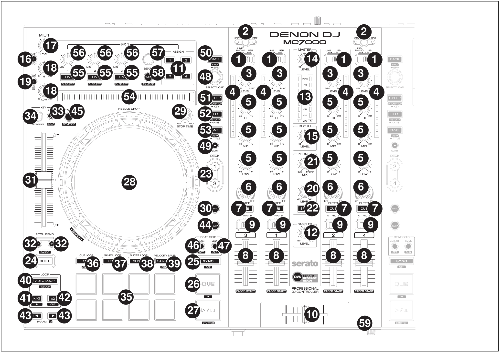
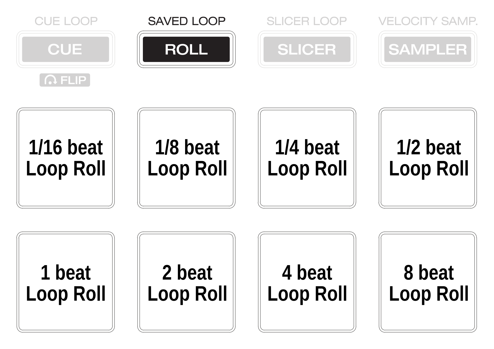
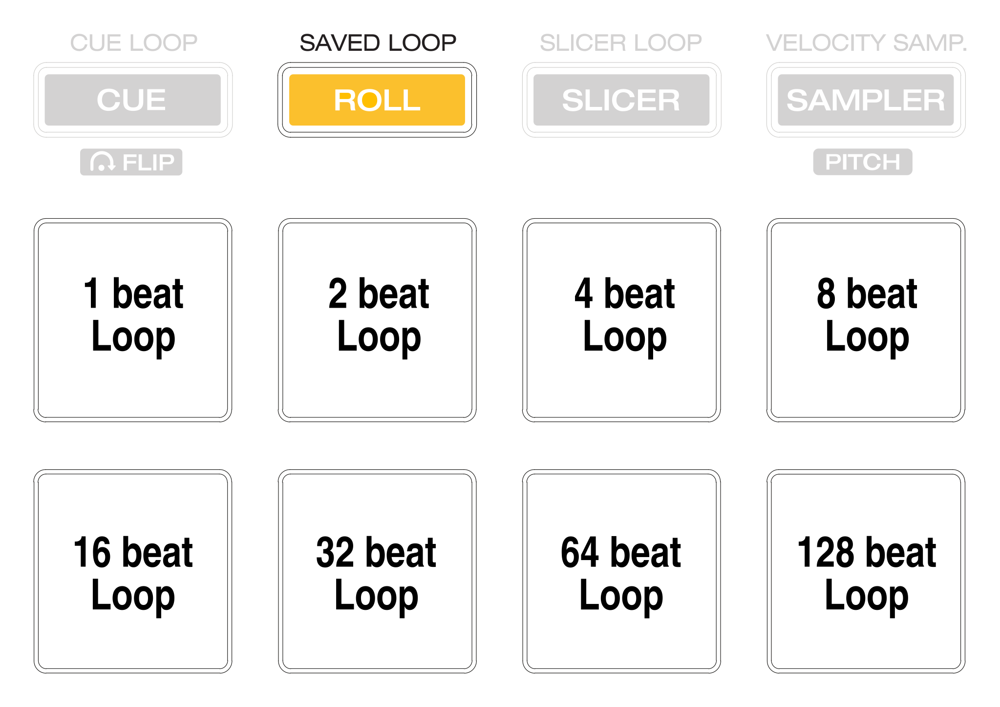
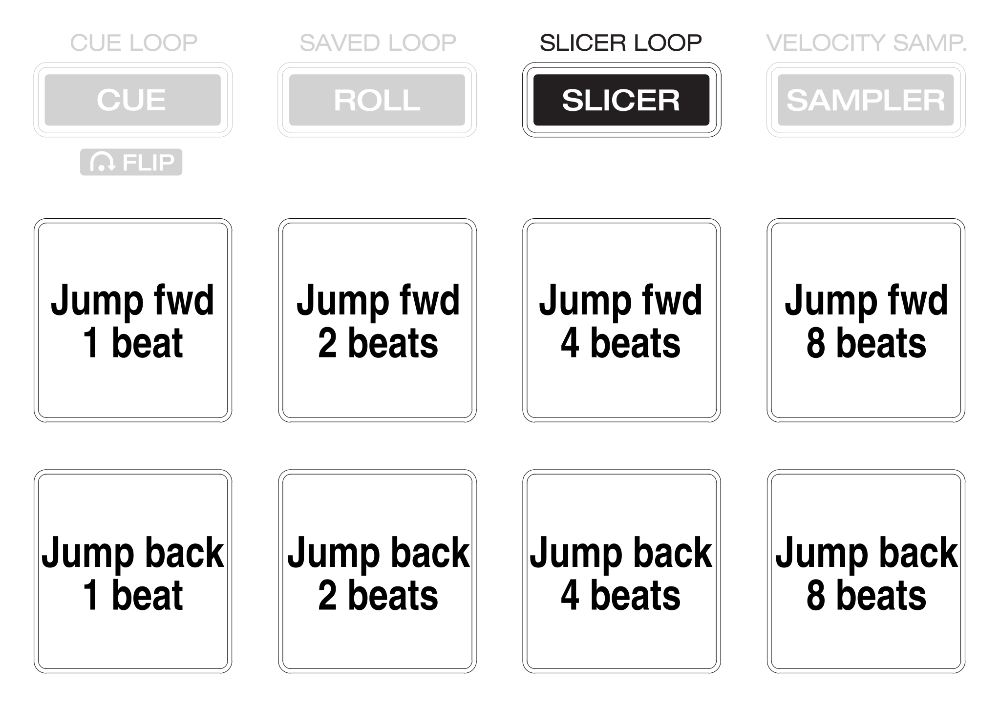
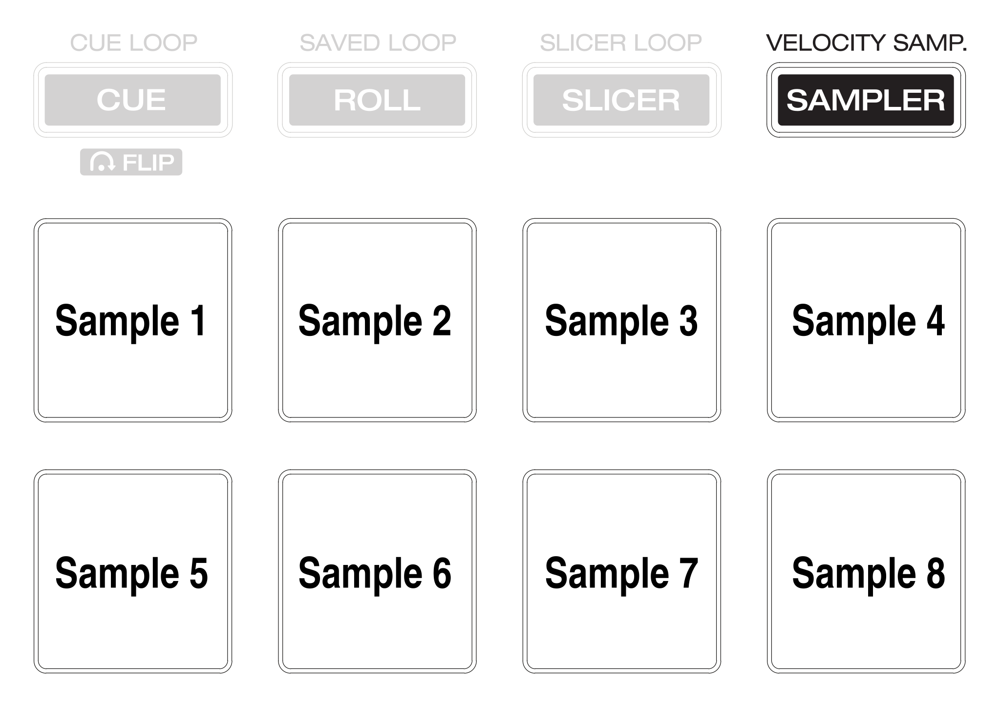

Denon MC7000
============

The Denon MC7000 is a professional DJ controller which has got 4-channel capability and dual USB connections. These two USB audio interfaces enable two DJs to play together. This controller includes Denon’s high build quality and superior 24-bit audio reproduction, makes this suited to both mobile and club DJs.

.. versionadded:: 2.2.4
.. versionchanged:: 2.3.0
   Fixed a vinyl mode bug on deck 4 and added new features, like library sorting, searching through track with jog wheel, ejecting track from deck, waveform zoom, fixed loops and an experimental beat counter (slicer-like) and improved parameter and censor/reverse/spinback button mappings.
.. versionchanged:: 2.3.1
   Some improvements for slip mode, sampler play and rate range toggle. Added browsing through library using jog wheel.

Useful links
~~~~~~~~~~~~

-  `Denon MC7000 Mapping thread <https://mixxx.discourse.group/t/denon-mc7000-mapping/18235>`__
-  `Manufacturer’s product page <https://www.denondj.com/professional-dj-controller-for-serato-mc7000xus>`__
-  `User Guide <http://cdn.inmusicbrands.com/denondj/MC7000/MC7000-UserGuide-v1.1.pdf>`__
-  `Hardware Setting Specification <http://cdn.inmusicbrands.com/denondj/MC7000/MC7000-Hardware-Settings-Mode-Specification-v1_4.pdf>`__
-  `Mixxx showcase on YouTube <https://youtu.be/KRtgSBXFGqI>`__

Compatibility
~~~~~~~~~~~~~

-  **Mac** users should be just fine connecting the MC7000 and go.
-  **Windows** users need to install the latest Windows Driver from `Denon Download Site <https://www.denondj.com/downloads>`__.
-  **Linux** users need a minimum LTS Kernel version **4.19.105** or **5.4.21**. All Kernels **5.6.x** and following are supporting the device out-of-the-box.

Mapping
~~~~~~~

   Denon MC7000 (schematic view)

This controller is made for Serato DJ and most of the mapping is made
for Mixxx accordingly. Anyhow, there are several differences for
functions not matching the Serato mapping. If you have any wishes to
improve the mapping, then please discuss it in the `Denon MC7000
Mapping <https://mixxx.discourse.group/t/denon-mc7000-mapping/18235>`__
thread.

.. _denon_mc7000_uservariables:

User Variables
~~~~~~~~~~~~~~

User variables can be set to suit individual needs inside the :file:`Denon-MC7000-scripts.js` mapping file:

-  ``MC7000.experimental`` activate :ref:`experimental beat count feature <denon_mc7000_experimental>` (default: ``false``)
-  ``MC7000.needleSearchPlay`` activate :hwlabel:`NEEDLE DROP` sensor while a track is playing (default: ``false``)
-  ``MC7000.prevSamplerStop`` set to single play samplers (default: ``true``)
-  ``MC7000.rateRanges`` set the available Pitch Fader ranges (default: 4, 6, 8, 10, 16, 24, 50, 90)
-  ``MC7000.modeSingleLED`` set single LED on or off (default: 1). Can be toggled with :hwlabel:`SHIFT` + :hwlabel:`Deck`
-  ``MC7000.VinylModeOn`` set the Vinyl Mode on or off at Mixxx start which also triggers the Platter Ring LED function (default: 1)
-  ``MC7000.scratchParams`` set Scratch Parameters (default: 33+1/3, 1/10, 1/10/32)
-  ``MC7000.jogSensitivity`` set the Jog Sensitivity (default: 1)

Mixer Section
~~~~~~~~~~~~~

.. csv-table::
   :header: "No.", "Control", "Function"
   :widths: 10 90 250

   "1",  "Input Selector Switch",      "Set to the desired audio source for this channel.

   :hwlabel:`LINE/PHONO` will disable the corresponding Deck (switches off all LEDs and the controller will not send MIDI signals to control Mixxx). This allows the mixer to use an external source.

   :hwlabel:`USB` will turn the corresponding Deck on and allows to control Mixxx via USB connection."
   "2",  ":hwlabel:`USB1 / USB2`",     "Press to select whether the deck is controlling the computer connected to USB Port 1 or USB Port 2. If only one USB Port is connected the controller activates this automatically."
   "3",  ":hwlabel:`LEVEL`",           "Turn to adjust the level of the pre-fader, pre-EQ audio signal for the channel."
   "4",  "Channel Level Meters",       "Display the audio signal level of the channel as in Mixxx GUI."
   "5",  "Channel EQ",                 "Turn to boost or cut the :hwlabel:`HI`, :hwlabel:`MID` and :hwlabel:`LOW` frequencies for the channel."
   "6",  ":hwlabel:`FILTER`",          "Turn this knob to adjust the filter applied to the channel. Turn the knob counterclockwise to apply a low-pass filter. Turn the knob clockwise to apply a high-pass Filter."
   "7",  ":hwlabel:`CUE`",             "Press to send the channel’s pre-fader signal to the headphones’ cue channel."
   "8",  "Channel fader",              "Use to adjust the channel’s volume level."
   "9",  "Crossfader Assign",          "Routes the audio playing on the corresponding channel to either side of the crossfader (:hwlabel:`A` or :hwlabel:`B`), or bypasses the crossfader and sends the audio directly to the program mix (:hwlabel:`THRU`)."
   "10", "Crossfader",                 "Use this crossfader to mix between the left and right decks."
   "12", ":hwlabel:`SAMPLER LEVEL`",   "Turn this knob to adjust the volume level of the software’s sampler. If the volume is set to 0 then the Sampler banks are hidden, otherwise shown."
   "13", "Master Level Meters",        "These LEDs show the Master Audio signal."
   "14", ":hwlabel:`MASTER LEVEL`",    "Turn to adjust the volume level of the master outputs."
   "15", ":hwlabel:`BOOTH LEVEL`",     "Turn to adjust the volume level of the booth outputs."
   "20", ":hwlabel:`PHONES LEVEL`",    "Turn to adjust the volume level of the headphones."
   "21", ":hwlabel:`PHONES MIX`",      "Adjusts the software’s audio output to the headphones, mixing between the cue output and the master mix output."
   "22", ":hwlabel:`SPLIT`",           "Press to switch Headphone 'split' mode. When this switch is lit, the headphone audio will be 'split' such that all channels sent to cue channel are summed to mono and sent to the left headphone channel and the master mix is summed to mono and sent to the right channel. When the switch is unlit, the cue channel and master mix will be 'blended' together."
   "59", ":hwlabel:`X FADER CONTOUR`", "Turn to adjust the slope of the crossfader curve, to the left for a smooth fade (mixing) or to the right for a sharp cut (scratching."

.. note::
   The Input source selection, Master Level Meters, :hwlabel:`USB1 / USB2`, :hwlabel:`MASTER LEVEL`, :hwlabel:`BOOTH LEVEL`, :hwlabel:`PHONES LEVEL`, :hwlabel:`PHONES MIX` and :hwlabel:`SPLIT` are handled by the controller.
   The status of Mixxx will not be changed.

Microphone Section
~~~~~~~~~~~~~~~~~~

.. csv-table::
   :header: "No.", "Control", "Function"
   :widths: 10 50 250

   "16", ":hwlabel:`MIC ON/OFF`",                                      "Press to activate/deactivate the microphones."
   "17", ":hwlabel:`MIC LEVEL`",                                       "Turn to adjust the volume levels of the corresponding microphone inputs."
   "18", ":hwlabel:`MIC 1 HI`/:hwlabel:`MIC 1 LOW` (left deck)",       "Turn to boost or cut the high or low frequencies for Microphone 1."
   "18", ":hwlabel:`MIC 2 TONE` (right deck)",                         "Turn to adjust the tone (high-low) for Microphone 2."
   "18", ":hwlabel:`ECHO MIC 1&2` (right deck)",                       "Turn to adjust the amount of the echo effect for both Microphones."
   "19", ":hwlabel:`TALKOVER MIC 1&2` (left deck)",                    "Press to use the 'talkover' feature, which automatically reduces the volume level of the master mix when you speak into the microphones."
   "19", ":hwlabel:`SHIFT` + :hwlabel:`TALKOVER MIC 1&2` (left deck)", "Press to activate/deactivate the 'Post' feature. When on, the microphones signal will be sent to the Booth Outputs. When off, the microphones signal will not be routed to the Booth Outputs."
   "19", ":hwlabel:`ECHO MIC 1&2` (right deck)",                       "Press this button to activate or deactivate the echo effect on the microphones’ audio signal."

.. note::
   All functions are handled by the controller in hardware.
   The status of Mixxx will not be changed.

FX Section
~~~~~~~~~~

.. csv-table::
   :header: "No.", "Control", "Function"
   :widths: 10 90 250

   "11", ":hwlabel:`FX ASSIGN`",                              "Press assign :hwlabel:`FX 1` and/or :hwlabel:`FX 2` to the corresponding channel."
   "55", ":hwlabel:`FX ON`",                                  "Press to turn the corresponding effect on or off."
   "55", ":hwlabel:`SHIFT` + :hwlabel:`FX ON`",               "Press to select an effect from the list that was enabled in the Mixxx Preferences FX section."
   "56", ":hwlabel:`FX 1`, :hwlabel:`FX 2`, :hwlabel:`FX 3`", "Turn to adjust the level of the corresponding effect. The :hwlabel:`FX ON` button under the knob must be lit for this knob to function."
   "57", ":hwlabel:`FX BEATS`",                               "Turn to adjust the Wet/Dry rate of the effects."
   "58", ":hwlabel:`FX TAP`",                                 "Press to activate effects for the Master output. This can be overlapped with Channel Effects."
   "58", ":hwlabel:`SHIFT` + :hwlabel:`FX TAP`",              "Press to activate effects for headphones cue."

Library Section
~~~~~~~~~~~~~~~

.. csv-table::
   :header: "No.", "Control", "Function"
   :widths: 10 90 250

   "48", ":hwlabel:`SELECT/LOAD`",                    "Turn to navigate through lists. Press the left side button to load a track into the active Deck (1 or 3), press the right side button to load a track into the active Deck (2 or 4).

   When you keep the knob pressed down longer than 0,5 sec an actual loaded track will be ejected from the deck upon release of the knob."
   "48", ":hwlabel:`SHIFT` + :hwlabel:`SELECT/LOAD`", "Turn to browse quickly through the tracks in the library or push the knob to open folders on the left side of the library."
   "49", ":hwlabel:`SORT`",                           "Press and hold to activate sort functions."
   "50", ":hwlabel:`BACK`",                           "Press to switch between right and left side of the library."
   "50", ":hwlabel:`SHIFT` + :hwlabel:`BACK`",        "Press to move through frames inside the GUI."
   "50", ":hwlabel:`SORT` + :hwlabel:`BACK`",         "Press to sort the tracks by Beats Per Minute."
   "51", ":hwlabel:`L.PREP`",                         "Press to load the currently selected track to the Preview Deck."
   "51", ":hwlabel:`SHIFT` + :hwlabel:`L.PREP`",      "Press to start and stop playing the track in Preview Deck."
   "51", ":hwlabel:`SORT` + :hwlabel:`L.PREP`",       "Press to sort the tracks by their Key."
   "52", ":hwlabel:`FILES`",                          "Press to maximize the library. Press this button again to exit maximized library.

   While the library is maximized you can use the jog wheel to navigate quickly through lists."
   "52", ":hwlabel:`SORT` + :hwlabel:`FILES`",        "Press to sort the tracks by Artist."
   "53", ":hwlabel:`PANEL`",                          "Press to open and close the FX panel inside the GUI."
   "53", ":hwlabel:`SORT` + :hwlabel:`PANEL`",        "Press to sort the tracks by Title."

Deck Section
~~~~~~~~~~~~

.. csv-table::
   :header: "No.", "Control", "Function"
   :widths: 10 90 250

   "23", ":hwlabel:`DECK`",                                "Selects which deck in the software is controlled by that hardware deck. The left deck can control Deck 1 or 3; the right deck can control Deck 1 or 4."
   "23", ":hwlabel:`SHIFT` + :hwlabel:`DECK`",             "Press to switch Platter Ring LED Mode. Refer to the :ref:`LEDs section<denon_mc7000_led>` for details."
   "24", ":hwlabel:`SHIFT`",                               "Press and hold this button to access secondary functions of other controls."
   "25", ":hwlabel:`SYNC`",                                "Press to automatically match the corresponding deck’s :term:`tempo` with the tempo and phase of the opposite deck. Press again to deactivate Sync. Hold this button down for one sec to permanently match the tempo."
   "26", ":hwlabel:`CUE`",                                 "If a cue point is not set then press this button to set it at the current track position.

   During playback, press this button to return the track to the cue point.

   If the deck is paused, press and hold this button to play the track from the cue point. Release the button to return the track to the cue point and pause it. To continue playback without returning to the cue point, press and hold this button and then press the :hwlabel:`PLAY` button, afterwards release cue button."
   "26", ":hwlabel:`SHIFT` + :hwlabel:`CUE`",              "Press to return to the start of the track."
   "27", ":hwlabel:`PLAY / PAUSE`",                        "Press to pause or resume playback."
   "27", ":hwlabel:`SHIFT` + :hwlabel:`PLAY / PAUSE`",     "Press to stutter play the track from the last set cue point."
   "28", "Jog Wheel",                                      "Controls the audio playhead when the wheel is touched and moved.

   When the :hwlabel:`VINYL` button is lit, move the platter to 'scratch' the track as you would with a vinyl record.

   When the :hwlabel:`VINYL` button is unlit (or if you are touching only the side of the platter), move the platter to temporarily adjust the track’s speed.

   If the library is maximized (use :hwlabel:`FILES` button) turning the jog wheel will scroll the current table view (currently playing track is not affected). Be careful though: after exiting the maximized library view the jog wheel will immediately return to jog or scratch mode."
   "28", ":hwlabel:`SHIFT` + Jog Wheel",                   "Navigates quickly through the track. This only applies if touching the side of the platter or with :hwlabel:`VINYL` deactivated."
   "29", ":hwlabel:`STOP TIME`",                           "Controls the rate at which the track slows to a complete stop ('brake time') during backspin. This also affects how quickly the track starts after a backspin ('Soft Start')."
   "30", ":hwlabel:`VINYL`",                               "Press to activate/deactivate a 'vinyl mode' for the platter. When activated, you can use the platter to 'scratch' the track as you would with a vinyl record."
   "31", "Pitch Fader",                                    "Move to adjust the speed (pitch) of the track."
   "32", ":hwlabel:`PITCH BEND –/+`",                      "Press to momentarily reduce or increase the speed of the track."
   "32", ":hwlabel:`SHIFT` + :hwlabel:`PITCH BEND –/+`",   "Press to set the Pitch Fader range. You may adjust the steps in :ref:`JavaScript file<denon_mc7000_uservariables>`"
   "33", ":hwlabel:`KEY LOCK`",                            "Press to activate/deactivate Key Lock. When Key Lock is activated, the track’s key will remain the same even if you adjust its speed."
   "33", ":hwlabel:`SHIFT` + :hwlabel:`KEY LOCK`",         "Press to automatically match the corresponding deck’s key with the key of the opposite deck."
   "34", ":hwlabel:`KEY SELECT/RESET`",                    "Turn to raise or lower the key of the track. Press to reset the track’s key to its original key."
   "34", ":hwlabel:`SHIFT` + :hwlabel:`KEY SELECT/RESET`", "Turn to zoom in and out the waveform or push the knob to reset the Waveform zoom to the level set in preferences."
   "35", "Performance Pads",                               "refer to the :ref:`Performance Pads section<denon_mc7000_pad>` for details."
   "40", ":hwlabel:`AUTO LOOP`",                           "Press to create an auto-loop with the length set with loop length. You may change the length of beats by using the :hwlabel:`X1/2` or :hwlabel:`X2` buttons."
   "40", ":hwlabel:`SHIFT` + :hwlabel:`AUTO LOOP`",        "Press to toggle the current loop on or off. If the loop is ahead of the current play position, the track will keep playing normally until it reaches the loop."
   "41", ":hwlabel:`X1/2`",                                "Press to halve the length of the current loop."
   "41", ":hwlabel:`SHIFT` + :hwlabel:`X1/2`",             "Press to create a loop in point at the current Location."
   "42", ":hwlabel:`X2`",                                  "Press to double the length of the current loop."
   "42", ":hwlabel:`SHIFT` + :hwlabel:`X2`",               "Press to create a loop out point at the current Location."
   "43", ":hwlabel:`</> PARAM 1 2`",                       "Press to add/remove rating stars to the loaded track."
   "43", ":hwlabel:`SHIFT` + :hwlabel:`</> PARAM 1 2`",    "Press to change the track color in the library."
   "44", ":hwlabel:`SLIP`",                                "Press to enable or disable Slip Mode. In Slip Mode, you can jump to cue points, trigger loops or use the platters, while the track’s timeline continues. In other words, when you deactivate Slip Mode, the track will resume normal playback from where it would have been if you had never done anything (i.e., as if the track had been playing forward the whole time).

   After scratch, hot cue play, reverse play and backspin the slip mode releases itself so the timeline of the track jumps back to original position after the action is done. Slip mode reactivates itself after 50ms so you can continue with more actions in slip mode almost immediately after."
   "45", ":hwlabel:`CENSOR`",                              "Press and hold this button to play the track in :hwlabel:`REVERSE`. When releasing the button, the track immediately starts playing from it's momentary position.

   If :hwlabel:`SLIP` was active then after releasing the :hwlabel:`CENSOR` button the track continues as it had been playing forward the whole time (:hwlabel:`CENSOR`). Slip mode stays enabled so you can continue with more actions in slip mode."
   "45", ":hwlabel:`SHIFT` + :hwlabel:`CENSOR`",           "Press to activate a backspin with the length set by the :hwlabel:`STOP TIME` knob.

   If :hwlabel:`SLIP` was active then after releasing the :hwlabel:`CENSOR` button the track continues as it had been playing forward the whole time. Slip mode stays enabled so you can continue with more actions in slip mode."
   "46", ":hwlabel:`BEAT GRID ADJUST`",                    "Press to adjust the Beat Grid to the current play position."
   "46", ":hwlabel:`SHIFT` + :hwlabel:`BEAT GRID ADJUST`", "Press to activate Quantize mode."
   "47", ":hwlabel:`BEAT GRID SLIDE`",                     "Press to adjust the Beat Grid to another playing track."
   "54", ":hwlabel:`NEEDLE DROP`",                         "Place your finger on a point along this sensor to jump to that point in the track (strip represents entire track)."
   "54", ":hwlabel:`SHIFT` + :hwlabel:`NEEDLE DROP`",      "Press to jump to a position while a track is currently playing."

.. hint::
   The jog sensitivity and scratch parameters (28), the default vinyl mode (30), the pitch fader ranges (32) as well as the needle drop activity (54) can be set by modifying the variables inside the :ref:`JavaScript file<denon_mc7000_uservariables>` accordingly.

.. note::
   Use :hwlabel:`SHIFT` + :hwlabel:`CENSOR` for a backspin while :hwlabel:`SLIP` is active. Backspin using the platter is only possible while :hwlabel:`SLIP` is disabled.

.. _denon_mc7000_pad:

Performance Pads
~~~~~~~~~~~~~~~~

Mode Selection
--------------

.. csv-table::
   :header: "No.", "Control", "Function"
   :widths: 10 90 250

   "35", "Performance Pads",      "Press to perform action with one of those buttons."
   "36", ":hwlabel:`CUE`",        "Press to switch to **'Hot Cue'** mode."
   "37", ":hwlabel:`ROLL`",       "Press to switch to **'Roll'** mode."
   "37", ":hwlabel:`SAVED LOOP`", "Press :hwlabel:`ROLL` one more time to get into **'Fixed Loop'** mode."
   "38", ":hwlabel:`SLICER`",     "Press to switch to **'Beatjump'** mode."
   "39", ":hwlabel:`SAMPLER`",    "Press to switch to **'Sampler'** mode."

Hot Cue Mode (blue LED)
-----------------------

8 Hot Cue positions can be defined in this mode.

| Press one of the pad buttons to set or play a Hot Cue.
| Use :hwlabel:`SHIFT` + pad button to delete an existing Hot Cue.
| If :hwlabel:`SLIP` is active then press and hold a pad button to play from the Hot Cue position. After releasing the Hot Cue button the track continues as it had been playing forward the whole time. Slip mode stays enabled so you can continue with more actions in slip mode.

.. figure:: ../../_static/controllers/denon_mc7000_cue_mode.svg
   :alt: Denon MC7000 CUE Mode
   :figclass: pretty-figures

Roll Mode (turquoise LED)
-------------------------

| This mode lets you repeat a number of beats while keep pushing a pad button down.
| The :hwlabel:`SLIP` function remains active so that the track continues at the position where it had been playing forward the whole time.

Fixed Loop Mode (yellow LED)
----------------------------

| This mode lets you set a dedicated loop from current position.
| Another push on the pad button will turn the loop off.

.. _denon_mc7000_experimental:

Beatjump Mode (red LED)
-----------------------

This mode lets you jump a number of beats while pushing a pad button once.

| Press and hold ":hwlabel:`SHIFT`" and then push a pad button to jump even more beats.
| 16, 32, 64 and 128 forward on the upper row and backwards on the lower row.

.. hint::
   If experimental features were set to `true` in the :ref:`JavaScript file<denon_mc7000_uservariables>` then the pad LEDs counting the beat **after** the main CUE point.

Sampler Mode (pink LED)
-----------------------

8 samplers can be triggered from either Deck.

| Add samplers to the sampler bank pushing a pad button.
| If a sampler is loaded, then another push on the pad button will play the sampler from its Cue point.
| Push the pad button again while playing will replay the sampler from Cue point.
| When a sampler is started while another one is still playing, then the initial sampler stops and only the newly triggered sampler plays (single play).

Use :hwlabel:`SHIFT` + pad button to stop a sampler while playing or eject a sampler when stopped.

.. hint::
   To use default Mixxx behaviour and allow playing multiple samplers at the same time you can set the user variable ``MC7000.prevSamplerStop`` inside the :ref:`JavaScript file<denon_mc7000_uservariables>` to ``false``.

.. _denon_mc7000_led:

LEDs
~~~~

The Channel Volume Meters matches to the ones shown in Mixxx GUI. Only when clipping the red LED illuminates.

The Master Volume Meter is not correlated to Mixxx GUI as the controller handles that in Hardware.

Button LEDs are fully mapped for the first function. As you press and hold :hwlabel:`SHIFT` then the secondary functions have only got some flashing LEDs mapped, e.g. TAP and KEY SYNC, when activated.

Press :hwlabel:`SHIFT` + :hwlabel:`Deck` to switch Platter Ring LED Mode.

  - Mode 0 - Single 'off' LED chase (all other LEDs are 'on')
  - Mode 1 - Single 'on' LED chase (all other LEDs are 'off')

.. hint::
   The default mode can be set to ``0`` or ``1`` inside the :ref:`JavaScript file<denon_mc7000_uservariables>`.

Platter Ring LEDs are correlated with the :hwlabel:`VINYL` button.

  - If vinyl mode is enabled, the LED imitates a turntable platter spinning at 33.3 rpm.
  - If vinyl mode is disabled, the current track position is indicated by the Platter LEDs starting at the top.

.. note::
  The Platter Ring LEDs are not moving while the track position is 'negative'. That means if the position is before the track starts then the position LED keeps staying at most up position.

Known Issues
~~~~~~~~~~~~

- Some Performance Pad modes are not available (Cue Loop, Flip, Slicer Loop, Velocity Sampler, Pitch).
- The Effect Units don't use Mixxx' Standard Effects Mapping
