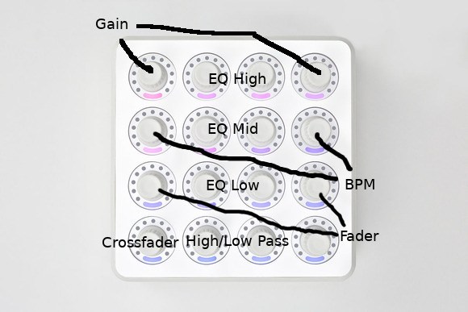

# MIDI Fighter Twister

MIDI Fighter Twister is a MIDI controller by DJ Tech Tools.

It features 16 knobs that you can press as buttons.

#### Mapping

You can reset each knob by pressing it. And you can toggle PFL by
pressing faders knob.

#### Help Wanted

[It would be great to map this controller for Mixxx's effects
too.](https://github.com/mixxxdj/mixxx/pull/1778#issuecomment-429711266)

#### Links

[Mapping
XML](https://github.com/mixxxdj/mixxx/blob/9e8bec58eed120a476864a857cb74a85ec4d0e41/res/controllers/DJ%20TechTools%20MIDI%20Fighter%20Twister.midi.xml)
