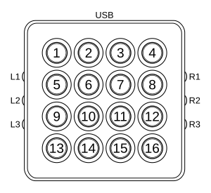

DJ TechTools MIDI Fighter Spectra
=================================

`Manufacturer's product page <https://store.djtechtools.com/products/midi-fighter-spectra>`_ ·
`Forum thread <https://mixxx.discourse.group/t/dj-techtools-midi-fighter-spectra/31554>`_

.. versionadded:: 2.5.1

Overview
--------

The MIDI Fighter Spectra contains 16 buttons with programmable LEDs, white
ground effect lighting, and six buttons on the side.

Out of the box all six side buttons are mapped to the layer selection functions
and cannot be used for other features.

.. csv-table::
   :header: "#", "Function"
   :widths: 15 70

   "L1", "Previous Layer"
   "L2", "Previous Layer"
   "L3", "Previous Layer"
   "R1", "Next Layer"
   "R2", "Next Layer"
   "R3", "Next Layer"

Layer 1
-------

The first layer of buttons control the EQ and quick effect cutoffs.

.. csv-table::
   :header: "#", "Deck", "Function"
   :widths: 15, 15, 70

   "1", "3", "Kill High"
   "2", "1", "Kill High"
   "3", "2", "Kill High"
   "4", "4", "Kill High"
   "5", "3", "Kill Mid"
   "6", "1", "Kill Mid"
   "7", "2", "Kill Mid"
   "8", "4", "Kill Mid"
   "9", "3", "Kill Low"
   "10", "1", "Kill Low"
   "11", "2", "Kill Low"
   "12", "4", "Kill Low"
   "13", "3", "Toggle Quick Effect"
   "14", "1", "Toggle Quick Effect"
   "15", "2", "Toggle Quick Effect"
   "16", "4", "Toggle Quick Effect"

Layer 2
-------

The second layer controls intro/outro markers and hotcues.
The deck displayed may be selected using buttons 13–16.
For each deck, the hotcues will be displayed in the color selected in the
interface.
Active loops, or hotcues that are being previewed will be brighter than inactive
cues.

.. csv-table::
   :header: "#", "Function"
   :widths: 15, 70

   "1", "Intro Marker Start"
   "2", "Intro Marker End"
   "3", "Outro Marker Start"
   "4", "Outro Marker End"
   "5", "Hot Cue 1"
   "6", "Hot Cue 2"
   "7", "Hot Cue 3"
   "8", "Hot Cue 4"
   "9", "Hot Cue 5"
   "10", "Hot Cue 6"
   "11", "Hot Cue 7"
   "12", "Hot Cue 8"
   "13", "Select Deck 1"
   "14", "Select Deck 2"
   "15", "Select Deck 3"
   "16", "Select Deck 4"

Layer 3
-------

The third layer loads and plays audio samplers.
The sampler number corresponds with the button number in the image above (1 in
the top left, 16 in the bottom right).

.. csv-table::
   :header: "LED", "Function"
   :widths: 15, 70

   "Off", "Load sampler"
   "On", "Play sampler"

Settings
--------

There are various settings available in the Mixxx preferences dialog.

.. csv-table::
   :header: "Setting", "Values", "Function"
   :widths: 30, 20, 70

   "Default Layer", "EQ, Hotcues, Samplers", "Sets the active layer when the controller is started."
   "Ground Effect LEDs", "Off, Pulse on Track End, Blink on Beat", "Set the behavior of the white LEDs on the bottom of the controller."
   "Pulse Deck Select", "Boolean", "Pulse the deck selection LED when the track on the deck is ending."
   "Selected Deck Color", "Colors", "The color of the selected deck button."
   "Inactive Deck Color", "Colors", "The color of the 3 inactive deck buttons."
   "Intro/Outro Color", "Colors", "The color of the set intro or outro buttons."
   "Unset Intro/Outro Color", "Colors", "The color of any unset intro or outro buttons."
   "EQ Kill Switch On", "Colors", "The color of the EQ kill switch when it is on."
   "EQ Kill Switch Off", "Colors", "The color of the EQ kill switch when it is off."
   "Super On", "Colors", "The color of the quick effects super button when it is on."
   "Super Off", "Colors", "The color of the quick effects super button when it is off."
   "Sampler Loaded", "Colors", "The color of a loaded sampler button."
   "Sampler Empty", "Colors", "The color of an empty sampler button."
