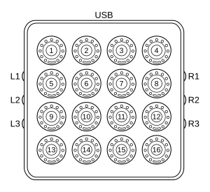

DJ TechTools MIDI Fighter Twister
=================================

`Manufacturer’s product page <https://www.midifighter.com/#Twister>`_ ·
`Forum thread <https://mixxx.discourse.group/t/mapping-the-midifighter-twister/16253>`_

.. versionadded:: 2.1.5

Overview
--------

The MIDI Fighter Spectra contains 16 rotary encoders, each of which is
pressable, has one full-color indicator LED below it, and an 11 segment ring
display surrounding it.

The controller also has six additional buttons on the side.
These side buttons are used for deck and layer selection, though currently only
the first layer is mapped.

.. csv-table::
   :header: "#", "Function"
   :widths: 15 70

   "L2", "Previous Layer"
   "R2", "Next Layer"

Layer 1
-------

The first layer controls the mixer.
For each control pressing the button results in the adjusted value being reset
to the default unless otherwise noted.

.. csv-table::
   :header: "#", "Deck", "Function"
   :widths: 15, 15, 70

   "L1", "–", "Left side deck 1, 3 toggle"
   "R1", "–", "Right side deck 2, 4 toggle"
   "L3", "–", "Shift"
   "R3", "–", "Shift"
   "1", "1, 3", "Gain"
   "2", "1, 3", "EQ High"
   "2 (shift, press)", "1, 3", "EQ High Kill"
   "3", "2, 4", "EQ High"
   "3 (shift, press)", "2, 4", "EQ High Kill"
   "4", "2, 4", "Gain"
   "5", "1, 3", "Tempo"
   "6", "1, 3", "EQ Mid"
   "6 (shift, press)", "1, 3", "EQ Mid Kill"
   "7", "2, 4", "EQ Mid"
   "7 (shift, press)", "2, 4", "EQ Mid Kill"
   "8", "2, 4", "Tempo"
   "9 (rotate)", "1, 3", "Volume"
   "9 (press)", "1, 3", "PFL"
   "10", "1, 3", "EQ Low"
   "10 (shift, press)", "1, 3", "EQ Low Kill"
   "11", "2, 4", "EQ Low"
   "11 (shift, press)", "2, 4", "EQ Low Kill"
   "12 (rotate)", "2, 4", "Volume"
   "12 (press)", "2, 4", "PFL"
   "13", "–", "Crossfader"
   "13 (shift)", "–", "Balance"
   "14", "1, 3", "Quick Effect Super Knob"
   "15", "2, 4", "Quick Effect Super Knob"
   "16", "–", "Main Gain"
   "16 (shift)", "–", "Headphone Gain"

Layer 2
-------

The second layer provides a dedicated effect controller.
The center knobs and buttons (2, 3, 6, 7, 10, 11, 14, and 15 in the diagram) are
laid out vertically using the :ref:`Standard Effects Mapping
<controller-effects-mapping>`.
The remaining knobs are unused, but their buttons are used to enable or disable
the units and change the mix mode:

.. csv-table::
   :header: "#", "FX Unit", "Function"
   :widths: 15, 15, 70

   "L1", "–", "FX unit 1, 3 toggle"
   "R1", "–", "FX unit 2, 4 toggle"
   "L3", "–", "Shift"
   "R3", "–", "Shift"
   "1", "1, 3", "Enable/disable selected FX unit on deck 1"
   "1 (shift)", "1, 3", "Enable/disable selected FX unit on deck 3"
   "5", "1, 3", "Enable/disable selected FX unit on deck 2"
   "5 (shift)", "1, 3", "Enable/disable selected FX unit on deck 4"
   "9", "1, 3", "Enable/disable selected FX unit on the headphones"
   "13", "1, 3", "Change the mix mode for the selected FX unit"
   "4", "2, 4", "Enable/disable selected FX unit on deck 1"
   "4 (shift)", "2, 4", "Enable/disable selected FX unit on deck 3"
   "8", "2, 4", "Enable/disable selected FX unit on deck 2"
   "8 (shift)", "2, 4", "Enable/disable selected FX unit on deck 4"
   "12", "2, 4", "Enable/disable selected FX unit on the headphones"
   "16", "2, 4", "Change the mix mode for the selected FX unit"

Settings
--------

On versions of Mixxx greater than 2.5.0 settings can be edited in the preference
windows, under :guilabel:`Preferences` > :guilabel:`Controllers` >
:guilabel:`Midi Fighter Twister …`.

.. csv-table::
   :header: "Setting", "Values", "Function"
   :widths: 40, 15, 70

   "Use gain knob as vu meter", "Boolean", "Show a VU meter using the gain knobs 11 segment display."
   "Beat Indicator Color", "Colors", "Flash the tempo knobs LED to the beat in the given color."
   "Peak Indicator Color", "Colors", "Show a peak indicator on the gain knobs LED in the given color."
   "Default Value/Pushed Color", "Colors", "The LED color when buttons are pushed or when the encoders match the default value for the control."
   "Released Color", "Colors", "The LED color when the default value indicator is not illuminated."
   "Quick Effect Switch On Color", "Colors", "The LED color when the quick effects kill switch is on."
   "Quick Effect Switch Off Color", "Colors", "The LED color when the quick effects kill switch is off."
   "EQ Kill Switch On Color", "Colors", "The LED color when an EQ kill switch is on."
   "EQ Kill Switch Off Color", "Colors", "The LED color when an EQ kill switch is off."
