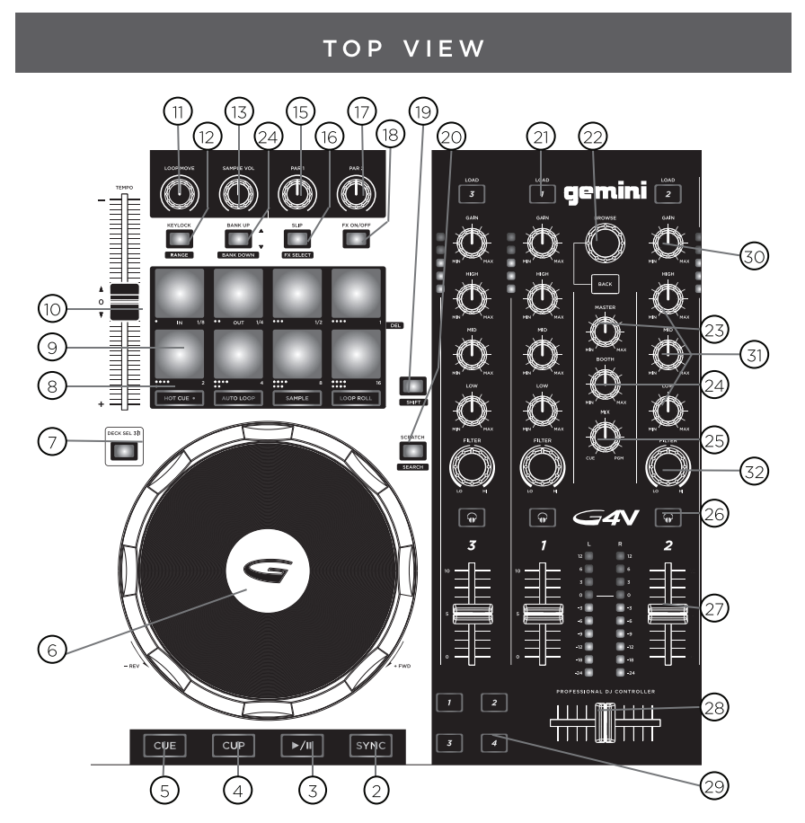
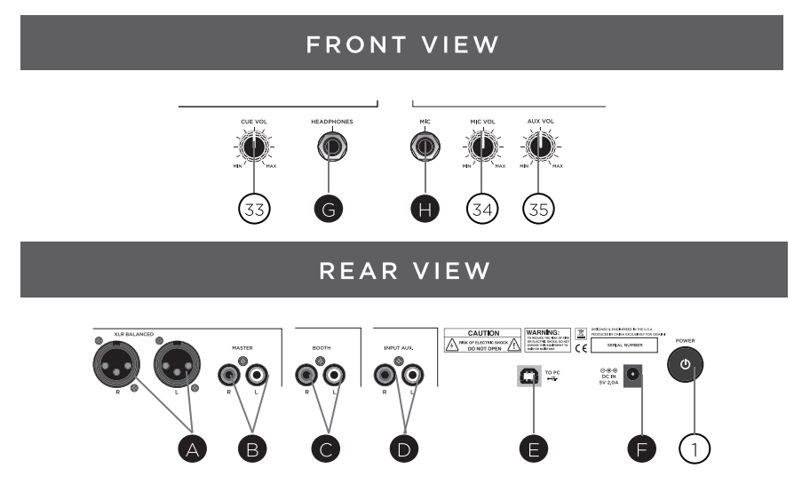
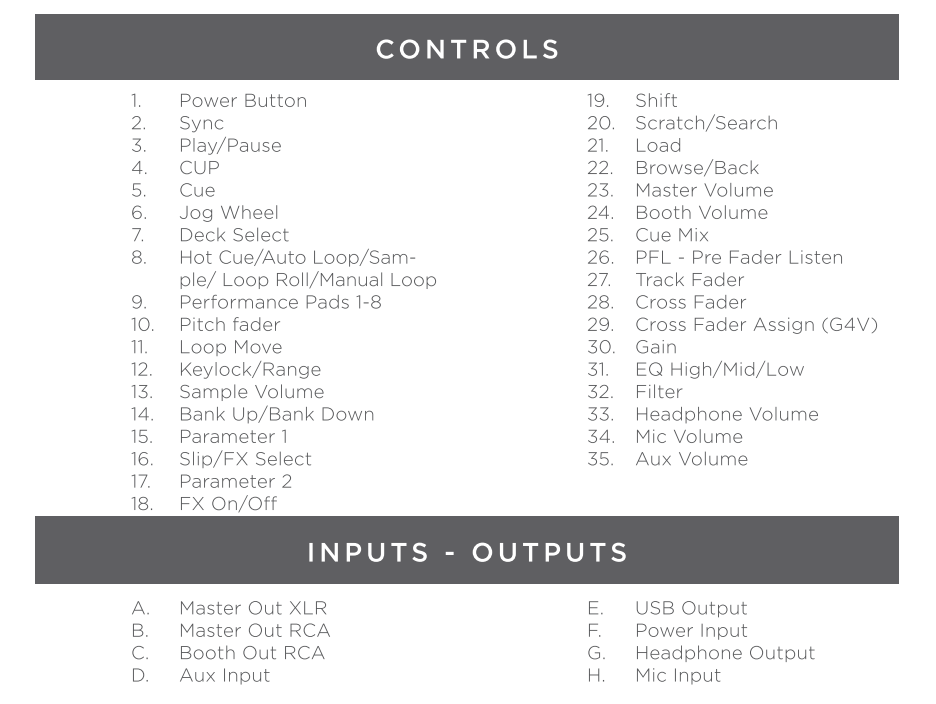

# Gemini G4V


The Gemini G4V is a 2 deck controller that supports 4 virtual decks, a 4
way mixer and has a built-in 4 channel USB soundcard.

It includes a Microphone input line, an Aux input line and an Booth
output line. This lines are not going thorugh the soundcard but mixed
directly at the controller. They are not accessible nor controlled by
Mixx so they will not appear in any recording nor is possible to control
them via the Mixxx screen interface.

This documentation is for the functionalities of the official controller
(to be) included with Mixxx. For the documentation of the old controller
available in the wiki, please use the Old Revisions button.

  - [Mixxx Forum
    Thread](https://www.mixxx.org/forums/viewtopic.php?f=6&t=12919)
  - [Manufacturer's product page](http://geminisound.com/product/g4v)
  - [Manufacturer's
    manual](https://www.manualslib.com/manual/826563/Gemini-G4v.html)

## Mixxx Sound Hardware Preferences

  - Master output: channels 1-2
  - Headphone output: channels 3-4

## Mapping Description

Most of the board's controls work as described in the G4V's manual, with
a few exceptions. Snapshots of the board's labeling from the Manual are
included below:

 


### Shift

  - On each of the physical decks is a SHIFT button
  - This button, when held, changes the behavior of various buttons on
    that deck, labeled under the respective button

### Mixer

  - In the middle of board, there are HIGH, MID, and LOW EQ, GAIN, and
    FILTER knobs for the individual virtual decks that work as normal
  - The Master and Cue Mix knobs works as normal, with Cue Mix mapped to
    Pre/Main
  - The Booth knobs affects the internal sound card

### Crossfader

  - The crossfader works as normal
  - The numbered buttons on the sides of the crossfader change the
    orientation of the virtual decks with respect to the crossfader. If
    the right button is lit up, the orientation of the virtual deck is
    to the right of the crossfader, and vice versa for the left button.
    If neither the left nor the right button are lit up, the virtual
    deck is centered on the crossfader

### Deck Select Buttons

  - Just below the Tempo slider on either side of the board is a Deck
    Sel button (1|3 on the left and 2|4 on the right). These buttons
    toggle the controls on the board between the virtual decks.
  - When the button is not lit, the first deck (1 on the left or 2 on
    the right) is the active virtual deck
  - When the button is lit up, the second deck (3 on the left or 4 on
    the right) is the active virtual deck

### Library controls

  - The Back button toggles the Browse knob's control between the
    folders list and the track list in the library display
  - The Browse knob scrolls up and down through the active list in the
    library display, if there is a track loaded in the preview deck it
    will move the play position back and forward
  - Shift+Browse knob while the left panel is active expand and
    collapses the different folders
  - Pressing the Browse knob while the track list is active will load
    the selected track in the preview deck and start playing in the
    headphone, if the preview deck is already loaded it will unload it
  - The LOAD buttons at the top of the board load the selected track
    from the library into the respective virtual deck
  - Pressing Shift+LOAD unloads the respective deck

### Transport Controls

  - The deck's Play/Pause, CUE, and SYNC buttons work as normal on the
    active virtual deck
  - The deck's CUP buttons will start playback from the beginning of the
    track

### Jog Wheels

  - Pressing the top of the Jog Wheel will change the mode to vinyl
    mode. It will stop playing

<!-- end list -->

```
   * Turning the jog wheel will move the track play head, for scratching or fine placement
   * Turning the jog wheel while pressing shift will change the track play head fast, for fast search
   * When the jog wheel top is released, the jog wheel will stay in vinyl mode until it stops moving, for spin backs or similar actions
   * If the deck was in slip mode before entering in vinyl mode, the play head will move to the position it wil have been if no manipulation happened, useful for scratching without losing the beat
* Turning the jog wheel without pressing the top will temporarily change the tempo, for nudging
```

### Performance Pads

```
 * Above the wheel on each deck is a set of 8 performance pads (top pads numbered 1-4 and bottom pads numbered 5-8 for the remainder of this wiki page)
 * The functionality of the performance pads is determined by the pads mode: Hot Cue, Auto Loop, Sample, Loop Roll, manual Loop and Beat Jump.
 * You can can change the mode by using the mode buttons as indicated.
```

#### Hot Cue Mode

  - To enable Hot Cue mode, press the Hot Cue button
  - When the performance pads are in Hot Cue mode, the Hot Cue button
    will be lit up
  - Pressing a performance pad when in Hot Cue mode will control the
    corresponding numbered Hot Cue (Performance Pad 1 controls Hot Cue
    1, etc) on the virtual deck
  - If the corresponding Hot Cue isn't set, pressing the performance pad
    will set a hot cue at that point
  - If the corresponding Hot Cue is set, pressing the performance pad
    will move playback to that hot cue
  - If a hot cue is set and it's corresponding performance pad is
    pressed while the deck's Shift button is being held, the hot cue
    will be deleted

#### Sample Mode

  - To enable Sample mode, press the Sample button
  - When the performance pads are in Sample mode, the Sample button will
    be lit up
  - It will show the sample decks if the skin has support for them
  - The Sample button will be lit up if they have a track loaded
  - Each deck control 8 samples, deck 1 controls samples 1 to 8, deck 2
    controls samples 9 to 16, an so on
  - The Sample Volume knobs control the volume for all the samples

#### Auto Loop Mode

  - To enable looping mode, press the Auto Loop button
  - When the performance pads are in Auto Loop mode, the Auto Loop
    button will be lit up
  - Pressing a pad start a loop of the length indicated in the pad, the
    pad will lit up
  - Pressing the lit pad stop the loop
  - Pressing a different pad will stop the first pad and will start a
    new loop
  - The Loop Move knob shifts the loop position in the virtual deck

#### Loop Roll Mode

  - To enable loop roll mode, press the Loop Roll button
  - When the performance pads are in Loop Roll mode, the Loop Roll
    button will be lit up
  - Pressing a pad start a loop of the length indicated in the pad, the
    pad will lit up
  - Pressing the lit pad stop the loop
  - Pressing a different pad will stop the first pad and will start a
    new loop
  - When a loop is started the deck will change to Slip mode, when the
    loop is stopped the track position will move to the position it will
    have been if the loop never happened
  - The Loop Move knob shifts the loop position in the virtual deck

#### Manual Loop Mode

  - To enable Manual Loop mode, press the Loop Roll button while holding
    the Shift button
  - When the performance pads are in Manual Loop mode, the Loop Roll
    button will flash
  - When a manual loop is set, all 8 performance pads are lit
  - Performance pad 1 sets the loop IN point
  - Performance pad 2 sets the loop OUT point
  - Performance pads 3 and 4 enable and disable the loop once the IN and
    OUT points are set
  - Performance pad 5 doubles the length of the loop
  - Performance pad 6 halves the length of the loop
  - Performance pad 7 moves the loop 1 beat backward
  - Performance pad 8 moves the loop 1 beat forward

#### Beat Jump Mode

  - To enable Beat Jump mode, press the Sample button while holding the
    Shift button
  - When the performance pads are in Beat Jump mode, the Sample button
    will flash
  - Pressing a pad jumps forward the number of beats indicated in the
    pad
  - Pressing a pad while holding the Shift button jumps backward the
    number of beats indicated in the pad

### FX and Effects

  - Each virtual deck is assigned 1 Effect Unit, with the deck number
    being the same as the Effect Unit number
  - Pressing the deck's FX ON/OFF button will enable/disable the Effect
    Unit corresponding to the virtual deck number
  - The FX ON/OFF button is lit when the virtual deck's corresponding
    Effect Unit is enabled
  - Holding Shift and pressing the FX Select button will scroll through
    the Effect Unit's effect chains
  - The Par 1 and Par 2 knobs control the meta knob and the effect mix
    level , respectively, for the Effect Chain

### Slip Mode

  - The Slip button enables/disables slip mode on the virtual deck, the
    button will be lit up if Slip mode is on
  - When releasing the jog wheel top after scratching will, the track
    play head will jump the the same position it was when the jog wheel
    top was pressed

### Misc Controls

  - The Keylock button enables/disables keylock on the virtual deck

### Unused controls

Below is a list of controls on the board that currently do not have any
functionality

  - The Bank Up/Bank Down button
  - The Scratch button
