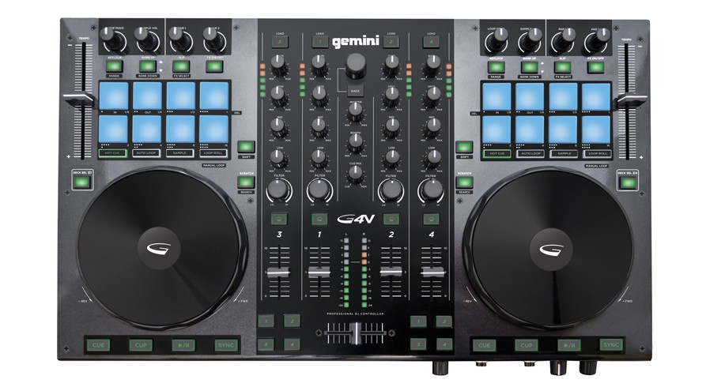
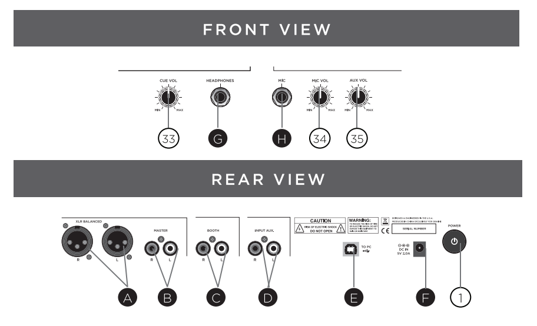

Gemini G4V
=====================

The Gemini G4V is a 2 deck controller that supports 4 virtual decks, a 4 way mixer and has a built-in 4 channel USB soundcard.
It includes a Microphone input line, an Aux input line and an Booth output line. This lines are not going through the soundcard but mixed directly at the controller.
They are not accessible nor controlled by Mixx so they will not appear in any recording nor is possible to control them via the Mixxx screen interface.

-  `Manufacturer’s product page <http://geminisound.com/product/g4v>`__
-  `Forum thread <https://www.mixxx.org/forums/viewtopic.php?f=6&t=12919>`__
-  `Manufacturer’s User Guide <https://www.manualslib.com/manual/826563/Gemini-G4v.html>`__

.. versionadded:: 2.3

Mixxx sound hardware preferences
--------------------------------

========== =============
Output     Channel
========== =============
Master     Channel 1 - 2
Headphones Channel 3 - 4
========== =============

Mapping Description
-------------------

Most of the board's controls work as described in the G4V's manual, with a few exceptions. Snapshots of the board's labeling from the Manual are included below:

.. figure:: ../../_static/controllers/gemini_g4v_controls.png
   :align: center
   :width: 100%
   :figwidth: 100%
   :alt: Behringer CMD Micro
   :figclass: pretty-figures

.. figure:: ../../_static/controllers/gemini_g4v_controllist.jpg
   :align: center
   :width: 100%
   :figwidth: 100%
   :alt: Behringer CMD Micro
   :figclass: pretty-figures

Shift
-----

On each of the physical decks is a :hwlabel:`SHIFT` button.

This button, when held, changes the behavior of various buttons on that deck, labeled under the respective button.

Mixer
-----

In the middle of board, there are :hwlabel:`HIGH`, :hwlabel:`MID`, and :hwlabel:`LOW` equalizer knobs, :hwlabel:`GAIN`, and :hwlabel:`FILTER` knobs for the individual virtual decks that work as normal.

The :hwlabel:`MASTER` and :hwlabel:`CUE MIX` knobs works as usual.

The :hwlabel:`BOOTH` knob controls the gain of the booth audio output. This output is managed internally by the controller.

Crossfader
----------

The :hwlabel:`CROSSFADER` works as usual.

The numbered buttons on the sides of the crossfader change the orientation of the virtual decks with respect to the crossfader.

Deck Select Buttons
-------------------

Just below the Tempo slider on either side of the board is a :hwlabel:`Deck Sel` button (1|3 on the left and 2|4 on the right).

These buttons toggle the controls on the board between the virtual decks.
When the button is not lit, the first deck (1 on the left or 2 on the right) is the active virtual deck.
When the button is lit up, the second deck (3 on the left or 4 on the right) is the active virtual deck.

Library controls
----------------

Pressing the :hwlabel:`BACK` button is equivalent to pressing the tab key, it moves the focus through the different library windows.

Pressing the :hwlabel:`BROWSE` knob while the track list is active will load the selected track in the preview deck and start playing in the headphone,
if the preview deck is already loaded it will unload it

The :hwlabel:`BROWSE` knob scrolls up and down through the active list in the library display,
if there is a track loaded in the preview deck it will move the play position back and forward.

:hwlabel:`SHIFT` + :hwlabel:`Browse` knob while the left panel is active expand and collapses the different folders.

Pressing :hwlabel:`1`, :hwlabel:`2`, :hwlabel:`3` or :hwlabel:`4` buttons at the top of the mixer section,
loads the selected track from the library into the respective deck.

Pressing :hwlabel:`SHIFT` + :hwlabel:`1`, :hwlabel:`SHIFT` + :hwlabel:`2`, :hwlabel:`SHIFT` + :hwlabel:`3` or :hwlabel:`SHIFT` + :hwlabel:`4`
buttons at the top of the mixer section, unloads the respective deck.

Transport Controls
------------------

The deck's :hwlabel:`Play/Pause`, :hwlabel:`CUE`, and :hwlabel:`SYNC` buttons work as usual on the active virtual deck.

The deck's :hwlabel:`CUP` buttons will start playback from the beginning of the track.

Jog Wheels
----------

Pressing the top of the Jog Wheel will activate scratching mode mode. It will stop playing.

Turning the jog wheel will move the track play head, for scratching or fine placement.

Turning the jog wheel while pressing shift will change the track play head fast, for fast search.

When the jog wheel top is released, the jog wheel will stay in scratching mode until it stops moving, for spin backs or similar actions

If the deck was in slip mode before entering in scratching mode, the play head will move to the position it will have been if no manipulation happened, useful for scratching without losing the beat

Turning the jog wheel without pressing the top will temporarily change the tempo, for nudging.

Performance Pads
----------------

Above the wheel on each deck is a set of 8 performance pads (top pads numbered 1-4 and bottom pads numbered 5-8 for the remainder of this manual page).

The functionality of the performance pads is determined by the pads mode: Hot Cue, Auto Loop, Sample, Loop Roll, manual Loop and Beat Jump.

You can can change the mode by using the mode buttons as indicated.

Hot Cue Mode
^^^^^^^^^^^^

To enable Hot Cue mode, press the :hwlabel:`Hot Cue` button.
When the performance pads are in Hot Cue mode, the Hot Cue button will be lit up.

Pressing a performance pad when in Hot Cue mode will control the corresponding numbered Hot Cue (Performance Pad 1 controls Hot Cue 1, etc) on the virtual deck.
If the corresponding Hot Cue isn't set, pressing the performance pad will set a hot cue at that point.
If the corresponding Hot Cue is set, pressing the performance pad will move playback to that hot cue.
If a hot cue is set and it's corresponding performance pad is pressed while the deck's Shift button is being held, the hot cue will be deleted.

Sample Mode
^^^^^^^^^^^

To enable Sample mode, press the :hwlabel:`SAMPLE` button.
When the performance pads are in Sample mode, the Sample button will be lit up.
It will show the sample decks if the skin has support for them.

Pads will be lit up if they have a track loaded.
Each deck control 8 samples, deck 1 controls samples 1 to 8, deck 2 controls samples 9 to 16, an so on.

The :hwlabel:`Sample Volume` knobs control the volume for all the samples.

Auto Loop Mode
^^^^^^^^^^^^^^

To enable looping mode, press the :hwlabel:`AUTO LOOP` button.
When the performance pads are in Auto Loop mode, the Auto Loop button will be lit up.

Pressing a pad starts a loop of the length indicated in the pad, the pad will lit up.
Pressing the lit pad stop the loop.
Pressing a different pad will stop the first pad and will Cstart a new loop.

The :hwlabel:`Loop Move` knob shifts the loop position in the track.

Loop Roll Mode
^^^^^^^^^^^^^^

To enable loop roll mode, press the :hwlabel:`Loop Roll` button.
When the performance pads are in Loop Roll mode, the Loop Roll button will be lit up

Pressing a pad start a loop of the length indicated in the pad, the pad will lit up.
Releasing the pad will end the loop and the track position will move to the position it will have been if the loop never happened.

The:hwlabel:`Loop Move` knob shifts the loop position in the virtual deck.

Manual Loop Mode
^^^^^^^^^^^^^^^^

To enable Manual Loop mode, press the :hwlabel:`Loop Roll` button while holding the Shift button.
When the performance pads are in Manual Loop mode, the :hwlabel:`Loop Roll` button will flash.

When a manual loop is set, all 8 performance pads are lit.

Performance pad 1 sets the loop IN point.

Performance pad 2 sets the loop OUT point.

Performance pads 3 enables and disables the loop once the IN and OUT points are set.

Performance pad 5 doubles the length of the loop.

Performance pad 6 halves the length of the loop.

Performance pad 7 moves the loop 1 beat backward.

Performance pad 8 moves the loop 1 beat forward.

Beat Jump Mode
^^^^^^^^^^^^^^

To enable Beat Jump mode, press the :hwlabel:`SAMPLE`  button while holding the :hwlabel:`SHIFT` button.
When the performance pads are in Beat Jump mode, the :hwlabel:`SAMPLE` button will flash

Pressing a pad jumps forward the number of beats indicated in the pad.

Pressing a pad while holding the :hwlabel:`Shift` button jumps backward the number of beats indicated in the pad.

FX and Effects
--------------

Each virtual deck has assigned 1 Effect Unit, with the deck number being the same as the Effect Unit number.

Pressing the deck's :hwlabel:`FX ON/OFF` button will enable/disable the Effect Unit corresponding to the virtual deck number.

The :hwlabel:`FX ON/OFF` button is lit when the virtual deck's corresponding Effect Unit is enabled.

Holding :hwlabel:`SHIFT` and pressing the :hwlabel:`FX SEL` button will scroll through the Effect Unit's effect chains.

The :hwlabel:`PAR 1` and :hwlabel:`PAR 2` knobs control the meta knob and the effect mix level, respectively, for the Effect Chain.

Slip Mode
---------

The :hwlabel:`SLIP` button enables/disables slip mode on the virtual deck, the button will be lit up if Slip mode is on.

Misc Controls
-------------

    The :hwlabel:`Keylock` button enables/disables keylock on the virtual deck.

Unused controls
---------------

Below is a list of controls on the board that currently do not have any functionality.

The :hwlabel:`Bank Up/Bank Down` button.

The :hwlabel:`Scratch` button.
