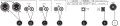
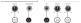

Gemini G4V
=====================

The Gemini G4V is a 2 deck controller that supports 4 virtual decks, a 4 way mixer and has a built-in 4 channel USB soundcard.
It includes a Microphone input line, an Aux input line and an Booth output line. This lines are not going through the soundcard but mixed directly at the controller.
They are not accessible nor controlled by Mixx so they will not appear in any recording nor is possible to control them via the Mixxx screen interface.

-  `Manufacturer’s product page <http://geminisound.com/product/g4v>`__
-  `Forum thread <https://www.mixxx.org/forums/viewtopic.php?f=6&t=12919>`__
-  `Manufacturer’s User Guide <https://www.manualslib.com/manual/826563/Gemini-G4v.html>`__

.. versionadded:: 2.3

Mixxx sound hardware preferences
--------------------------------

========== =============
Output     Channel
========== =============
Master     Channel 1 - 2
Headphones Channel 3 - 4
========== =============

Mapping Description
-------------------

Most of the board's controls work as described in the G4V's manual, with a few exceptions.

Snapshots of the board's labeling from the Manual are included below:

Rear
^^^^

===  ====================================================  ============================================================================================
No.  Control                                               Function
===  ====================================================  ============================================================================================
1    :hwlabel:`POWER` button                               Press to switch controller on/off.
A    :hwlabel:`XLR BALANCED` jacks                         Main output XLR jacks
B    :hwlabel:`MASTER` jacks                               Main output RCA jacks
C    :hwlabel:`BOOTH` jacks                                Booth output RCA jacks
D    :hwlabel:`INPUT AUX.` jacks                           Auxiliary input RCA jacks
E    :hwlabel:`TO PC` port                                 USB port for connecting to the computer
F    :hwlabel:`DC IN` port                                 Power Input
===  ====================================================  ============================================================================================

Deck and Mixer
^^^^^^^^^^^^^^
.. figure:: ../../_static/controllers/gemini_g4v_top.svg
   :align: center
   :width: 100%
   :figwidth: 100%
   :alt: Gemini G4V
   :figclass: pretty-figures

===  ====================================================  ============================================================================================
No.  Control                                               Function
===  ====================================================  ============================================================================================
2    :hwlabel:`SYNC` button                                Match tempo and phase of other deck. Long press to set Deck as Sync Leader.
2    :hwlabel:`SHIFT` + :hwlabel:`SYNC` button             Disables Sync mode.
3    :hwlabel:`PLAY/PAUSE` button                          Plays or pause the song.
4    :hwlabel:`CUP` button                                 Starts playback from the beginning of the track.
5    :hwlabel:`CUE` button                                 Specifies, plays or recalls main :term:`cue point`.
6    Jog Wheel (top surface)                               Perform scratch operation.
6    Jog Wheel (outer edge)                                Rotate to lower/raise playback speed and pitch if key lock is off).
6    :hwlabel:`SHIFT` + Jog Wheel (top surface)            Search fast through the track location.
6    :hwlabel:`SHIFT` + Jog Wheel (top surface)            Search fast through the track location.
7    :hwlabel:`DECK SEL` buttons                           Switches the deck (left: decks 1 and 3, right: decks 2 and 4). If lit, deck 1/2 is active, deck 3/4 otherwise.
8    Performance Pad mode buttons                          See :ref:`Performance Pads <gemini-g4v-performancepads>`.
9    Performance Pads                                      See :ref:`Performance Pads <gemini-g4v-performancepads>`.
10   :hwlabel:`TEMPO` fader                                Adjust song playback speed (and pitch if key lock if off).
11   :hwlabel:`LOOP MOVE` knob                             Turn to move the loop in the track back and forth.
12   :hwlabel:`KEYLOCK` button                             Toggle key lock.
12   :hwlabel:`SHIFT` + :hwlabel:`KEYLOCK` button          Cycle through tempo slider range (8%, 16%, 50%).
13   :hwlabel:`SAMPLE VOL` knob                            Adjust the output level for all samplers.
14   :hwlabel:`BANK UP` button                             *Currently not mapped*
14   :hwlabel:`SHIFT` + :hwlabel:`BANK UP` button          *Currently not mapped*
15   :hwlabel:`PAR1` knob                                  Turn to control the effect chain's metaknob level.
16   :hwlabel:`SLIP` button                                Press to toggle slip mode (lit if enabled).
16   :hwlabel:`SHIFT` + :hwlabel:`SLIP` button             Scroll through effect unit's available effect chains.
17   :hwlabel:`PAR2` knob                                  Turn to control the effect chain's mix level.
18   :hwlabel:`FX ON/OFF` button                           Press to toggle effect unit (lit if enabled).
19   :hwlabel:`SHIFT` button                               Hold to change the behavior of various controls (labeled under the respective button).
20   :hwlabel:`SCRATCH` button                             *Currently not mapped.*
20   :hwlabel:`SHIFT` + :hwlabel:`SCRATCH` button          *Currently not mapped.*
21   :hwlabel:`LOAD` buttons                               Load track onto deck.
21   :hwlabel:`SHIFT` + :hwlabel:`LOAD` buttons            Unload song from deck.
22   :hwlabel:`BROWSE` encoder                             Scrolls though the library (or moves the play position of the preview deck if a track is loaded).
22   :hwlabel:`BROWSE` encoder (press)                     Load and play track in the preview deck (or unload the preview deck if a track is already loaded).
22   :hwlabel:`SHIFT` + :hwlabel:`BROWSE` encoder (press)  Expand or collapse currently selected library sidebar item.
22   :hwlabel:`BACK` button                                Moves focus through the different library windows (equivalent to pressing :kbd:`Tab` on the keyboard).
23   :hwlabel:`MASTER` knob                                Adjusts the output level of the :hwlabel:`XLR BALANCED` and :hwlabel:`MASTER` jacks.
24   :hwlabel:`BOOTH` knob                                 Adjusts the output level of the :hwlabel:`BOOTH` jacks.
25   :hwlabel:`MIX` knob                                   Fades between PFL and main output in headphones.
26   Headphone button                                      Press to toggle PFL for each channel.
27   Channel faders                                        Adjust the output level for each channel.
28   Crossfader                                            Fades between left and right deck.
29   Crossfader Assignment buttons                         Change the crossfader orientation of the decks.
30   :hwlabel:`GAIN` knob                                  Adjust the deck gain (prefader).
31   Equalizer knobs                                       Adjust the high/mid/low-frequency regions of the channel.
32   :hwlabel:`FILTER` knob                                QuickEffect superknob (filter by default, can be changed to a different effect in Mixxx preferences).
===  ====================================================  ============================================================================================

Front
^^^^^

===  ====================================================  ============================================================================================
No.  Control                                               Function
===  ====================================================  ============================================================================================
33   :hwlabel:`CUE VOL` knob                               Turn to modify headphone output volume.
34   :hwlabel:`MIC VOL` knob                               Turn to modify microphone input volume.
35   :hwlabel:`AUX VOL` knob                               Turn to modify auxiliary input volume.
G    :hwlabel:`HEADPHONES` jack                            6.35mm Headphones port
H    :hwlabel:`MIC` jack                                   6.35mm Microphone port
===  ====================================================  ============================================================================================

.. _gemini-g4v-performancepads:

Performance Pads
----------------

Above the wheel on each deck is a set of 8 performance pads (top pads numbered 1-4 and bottom pads numbered 5-8 for the remainder of this manual page).

The functionality of the performance pads is determined by the pads mode: Hot Cue, Auto Loop, Sample, Loop Roll, manual Loop and Beat Jump.

You can can change the mode by using the mode buttons as indicated.

Hot Cue Mode
^^^^^^^^^^^^

To enable Hot Cue mode, press the :hwlabel:`HOT CUE` button.
When the performance pads are in Hot Cue mode, the Hot Cue button will be lit up.

Pressing a performance pad when in Hot Cue mode will control the corresponding numbered Hot Cue (:hwlabel:`Pad 1` controls Hot Cue 1, etc) on the virtual deck.
If the corresponding Hot Cue isn't set, pressing the performance pad will set a hot cue at that point.
If the corresponding Hot Cue is set, pressing the performance pad will move playback to that hot cue.
If a hot cue is set and it's corresponding performance pad is pressed while the deck's Shift button is being held, the hot cue will be deleted.

Sample Mode
^^^^^^^^^^^

To enable Sample mode, press the :hwlabel:`SAMPLE` button.
When the performance pads are in Sample mode, the Sample button will be lit up.
It will show the sample decks if the skin has support for them.

Pads will be lit up if they have a track loaded.
Each deck control 8 samples, deck 1 controls samples 1 to 8, deck 2 controls samples 9 to 16, an so on.

The :hwlabel:`SAMPLE VOL` knobs control the volume for all the samples.

Auto Loop Mode
^^^^^^^^^^^^^^

To enable looping mode, press the :hwlabel:`AUTO LOOP` button.
When the performance pads are in Auto Loop mode, the Auto Loop button will be lit up.

Pressing a pad starts a loop of the length indicated in the pad, the pad will lit up.
Pressing the lit pad stop the loop.
Pressing a different pad will stop the current loop and start a new one.

The :hwlabel:`LOOP MOVE` knob shifts the loop position in the track.

Loop Roll Mode
^^^^^^^^^^^^^^

To enable loop roll mode, press the :hwlabel:`LOOP ROLL` button.
When the performance pads are in Loop Roll mode, the Loop Roll button will be lit up

Pressing a pad start a loop of the length indicated in the pad, the pad will lit up.
Releasing the pad will end the loop and the track position will move to the position it will have been if the loop never happened.

The :hwlabel:`LOOP MOVE` knob shifts the loop position in the virtual deck.

Manual Loop Mode
^^^^^^^^^^^^^^^^

To enable Manual Loop mode, press the :hwlabel:`LOOP ROLL` button while holding the Shift button.
When the performance pads are in Manual Loop mode, the :hwlabel:`LOOP ROLL` button will flash.

When a manual loop is set, all 8 performance pads are lit.

================ ===========================================================================
Pad                Function
================ ===========================================================================
:hwlabel:`pad 1` Sets the loop in point.

:hwlabel:`pad 2` Sets the loop out point.

:hwlabel:`pad 3` Enables and disables the loop once the in and out points are set.

:hwlabel:`pad 5` Doubles the length of the loop.

:hwlabel:`pad 6` Halves the length of the loop.

:hwlabel:`pad 7` Moves the loop 1 beat backward.

:hwlabel:`pad 8` Moves the loop 1 beat forward.
================ ===========================================================================

Beat Jump Mode
^^^^^^^^^^^^^^

To enable Beat Jump mode, press the :hwlabel:`SAMPLE`  button while holding the :hwlabel:`SHIFT` button.
When the performance pads are in Beat Jump mode, the :hwlabel:`SAMPLE` button will flash

Pressing a pad jumps forward the number of beats indicated in the pad.

Pressing a pad while holding the :hwlabel:`SHIFT` button jumps backward the number of beats indicated in the pad.

Known Issues
------------

- The :hwlabel:`BANK UP`/:hwlabel:`BANK DOWN` buttons are not mapped.
- The :hwlabel:`SCRATCH` button is not mapped.
