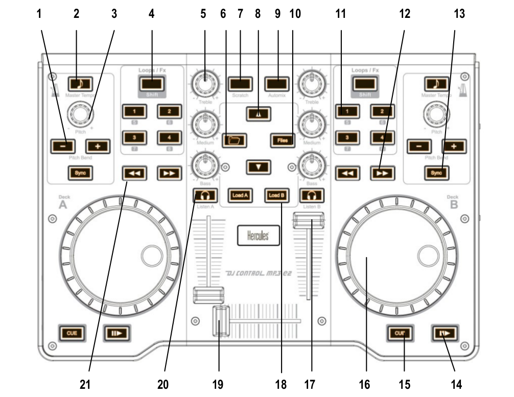

# Hercules DJ Control MP3 e2

## Mapping for Mixxx 1.11 and below

The Hercules MP3 e2 mapping for Mixxx is integrated in Mixxx so you
don't have to download or install nothing.

#### Global controls

<table>
<thead>
<tr class="header">
<th>Number</th>
<th>Control</th>
<th>Function</th>
</tr>
</thead>
<tbody>
<tr class="odd">
<td>8</td>
<td>Arrow up/down</td>
<td>Scrolls to the prev/next track in the Playlist/tracktable</td>
</tr>
<tr class="even">
<td>6</td>
<td>Folder</td>
<td>Scrolls up to 10 tracks in the Playlist/tracktable</td>
</tr>
<tr class="odd">
<td>10</td>
<td>Files</td>
<td>Scrolls down to 10 tracks in the Playlist/tracktable</td>
</tr>
<tr class="even">
<td>18</td>
<td>Load A/B</td>
<td>Loads the currently highlighted track into the corresponding deck (A or B)</td>
</tr>
<tr class="odd">
<td>19</td>
<td>Crossfader</td>
<td>Fades between left and right deck</td>
</tr>
<tr class="even">
<td>7</td>
<td>Scratch</td>
<td>Enable or disable the scratch mode on both decks</td>
</tr>
<tr class="odd">
<td>9</td>
<td>Automix</td>
<td>Used as a master shift button to obtain more controls than those provided by Hercules. 
For example: hold down the Automix button and than press the "pitchbend" buttons for adjust the pre-gain amplification</td>
</tr>
</tbody>
</table>

#### Deck / Channel specific controls

<table>
<thead>
<tr class="header">
<th>Number</th>
<th>Control</th>
<th>Simple function</th>
<th>Shifted function</th>
</tr>
</thead>
<tbody>
<tr class="odd">
<td>1</td>
<td>Pitchbend +/-</td>
<td>Holds the pitch 4% higher while pressed</td>
<td>Adjust the pre-gain amplification</td>
</tr>
<tr class="even">
<td>2</td>
<td>Master Tempo</td>
<td>Toggles a channels flanger effect on and off</td>
<td>Enable key-lock for the specified deck (rate changes only affect tempo, not key)</td>
</tr>
<tr class="odd">
<td>3</td>
<td>Pitch knobs</td>
<td>Adjusts playback pitch/speed</td>
<td>Deck A: adjust the headphone volume 
Deck B: adjust the cue/main mix in the headphone output</td>
</tr>
<tr class="even">
<td>4</td>
<td>Loop/Fx</td>
<td>Toggle the Loop/Hotcue mode for the keys buttons. 
When the button is not lit up the loop buttons are enabled, when the button is lit up the hotcue's buttons are enabled</td>
<td>Nothing</td>
</tr>
<tr class="odd">
<td>5</td>
<td>Equalizer knobs</td>
<td>Adjusts the gain of the low/medium/high equalizer filter</td>
<td>Nothing</td>
</tr>
<tr class="even">
<td>11</td>
<td>1/2/3/4 buttons</td>
<td>Loop mode: 
1 - Sets the loop-in position to the current play position. 
2 - Sets the loop-out position to the current play position. 
3 and 4 - Toggles the current loop On or Off. 
Hotcue mode: 
1, 2, 3 and 4: If hotcue X is set, seeks the player to hotcue X's position. If hotcue X is not set, sets hotcue X to the current play position.</td>
<td>Loop mode: 
Clears the loop-in/out sets. 
Hotcue mode: 
If hotcue X is set, clears its hotcue status.</td>
</tr>
<tr class="odd">
<td>12</td>
<td>Forward \ Backward</td>
<td>Fast forward/backward</td>
<td>Nothing</td>
</tr>
<tr class="even">
<td>13</td>
<td>Sync</td>
<td>Automatically sets pitch so the BPM of the other deck is matched</td>
<td>Nothing</td>
</tr>
<tr class="odd">
<td>14</td>
<td>Play</td>
<td>Starts or stop a loaded track</td>
<td>Nothing</td>
</tr>
<tr class="even">
<td>15</td>
<td>Cue</td>
<td>Sets the cue point if a track is stopped and not at the current cue point 
Stops track and returns to the current cue point if a track is playing. 
Plays preview if a track is stopped at the cue point for as long as it's held down</td>
<td>Nothing</td>
</tr>
<tr class="odd">
<td>16</td>
<td>Jog wheel</td>
<td>Seeks forwards and backwards in a stopped track. 
Temporarily changes the playback speed for playing tracks</td>
<td>Absolute sync of the track speed to the jog wheel if the scratch mode is enabled</td>
</tr>
<tr class="even">
<td>17</td>
<td>Deck volume slider</td>
<td>Controls the deck output volume</td>
<td>Nothing</td>
</tr>
<tr class="odd">
<td>20</td>
<td>Headphone monitor</td>
<td>Toggles this deck output to the headphones monitor on/off</td>
<td>Nothing</td>
</tr>
</tbody>
</table>
