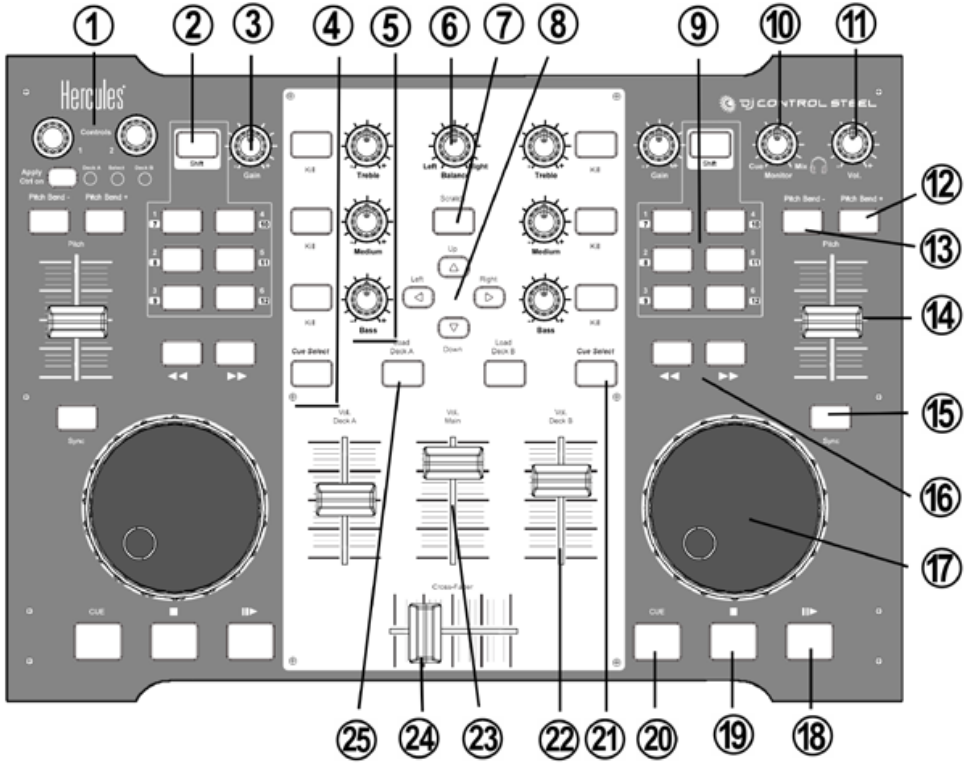

# Hercules DJ Control Steel

The Hercules DJ Control Steel is a USB MIDI controller (very similar to
DJ Console RMX but without a built in sound card). It is compatible with
Mixxx versions 1.6.1+herc and later. It works in Linux 32/64 bits (from
kernel \~2.6.27+), Windows (XP, Vista, 7), and MAC OS X (10.4.11
(Tiger)/ 10.5.x (Leopard)/ 10.6.x (Snow Leopard) 32-bit)

## MIDI driver

The midi device on the Steel is NOT USB-midi class compliant. For that
reason it requires specific drivers to be working on each OS.

### MAC OS / Windows

Drivers for MAC OS X and Windows can be found on [Hercules support
page](http://ts.hercules.com/eng/index.php?pg=view_files&gid=17&fid=62&pid=215&cid=1).

### Linux

Hercules has released a common MIDI-driver for their DJ controllers.
Read more on the page for [Hercules Linux kernel
module](Hercules%20Linux%20kernel%20module)

## Mapping for Mixxx

You need to update the mapping with following files : [Link to mapping
files](http://slist.lilotux.net/linux/deejay/mixxx/)
 

#### Global controls

| Control                  | Function                                                                     |
| ------------------------ | ---------------------------------------------------------------------------- |
| FX Wet/Dry Knobs (1)     | Unmapped                                                                     |
| FX Apply Select (1)      | Unmapped                                                                     |
| Cross-Fader (24)         | Fades between left and right deck                                            |
| Vol. Main (23)           | Controls output volume of your mix                                           |
| Balance (6)              | Controls balance between left and right audio channel of your mix            |
| Scratch (7)              | Toggles scratch on and off which changes the function of the deck jog wheels |
| Up / Down (8)            | Moves up and down in the library track list                                  |
| Up / Down (8) + Jog (18) | Rapid Track List scrolling                                                   |
| Left / Right (8)         | Moves up and down between the library sections                               |
| (10), (11)               | TODO                                                                         |

#### Deck / Channel specific controls

| Control                       | Function                                                                                                                                           |
| ----------------------------- | -------------------------------------------------------------------------------------------------------------------------------------------------- |
| Cue (20)                      | Sets the cue point if a track is stopped and not at the current cue point. Stops track and returns to the current cue point if a track is playing. |
| Stop (19)                     | Stop + Reset Track to beginning                                                                                                                    |
| Play/Pause (18)               | Starts playing a loaded track if stopped. If track is currently playing it stops the track                                                         |
| Jog wheel (17)                | Seeks forwards and backwards in a stopped track                                                                                                    |
| Forward / Backward (16)       | Seeks at high speed in a track                                                                                                                     |
| Load Deck A/B (25)            | Loads the currently selected track in the track list to the related deck                                                                           |
| Cue Select (21)               | Toggles this decks output to the monitor (headphones) on and off                                                                                   |
| Pitch (14)                    | Adjusts playback speed +/-10% (can be adjusted in the preferences)                                                                                 |
| Sync (15)                     | Automatically sets pitch so the BPM of the other deck is matched                                                                                   |
| Pitch Bend- (13)              | Resets the pitch to the tracks normal playback speed (FIXME)                                                                                       |
| Pitch Bend+ (12)              | TODO                                                                                                                                               |
| Bass (5)                      | Adjusts the volume of a channels low frequency content (ex. bass drum)                                                                             |
| Bass (5) + Scratch(7)         | Adjusts flanger period                                                                                                                             |
| Medium (5)                    | Adjusts the volume of a channels mid frequency content (ex. vocals)                                                                                |
| Medium (5) + Scratch(7)       | Adjusts flanger delay when Effect Shift is held down                                                                                               |
| Treble (5)                    | Adjusts the volume of a channels high frequency content (ex. hi-hats)                                                                              |
| Treble (5) + Scratch(7)       | Adjusts flanger depth when Effect Shift is held down                                                                                               |
| Kill (Bass / Medium / Treble) | Toggles output of a frequency band on and off                                                                                                      |
| Gain (3)                      | Controls a decks input volume                                                                                                                      |
| Vol. Deck A/B (22)            | Controls a decks output volume                                                                                                                     |
| Forward / Backward (16)       | Adjusts position of loop in/out and hot cues when a loop / hot cue button is held down                                                             |

| Control     | Default Mixxx Mapping |
| ----------- | --------------------- |
| 1 (9)       | Flanger on/off        |
| 2 (9)       | Hotcue 1 set          |
| 3 (9)       | Hotcue 2 set          |
| 4 (9)       | Reverse               |
| 5 (9)       | Hotcue 1 goto         |
| 6 (9)       | Hotcue 2 goto         |
| 7 (9)       | loop in               |
| 8 (9)       | loop exit             |
| 10 (9)      | loop out              |
| 9,11,12 (9) | Unmapped              |
