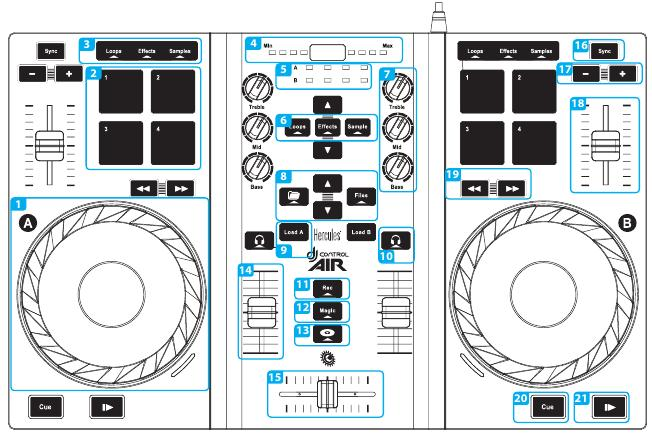

Hercules DJControl AIR
======================

This is one of the cheapest Hercules DJ controller from Hercules leisure
DJ controllers brand. There are actually many versions of it:

-  DJControl AIR (The one shown in picture above)
-  DJControl AIR Street Edition (Limited Edition)
-  DJControl AIR S Series
-  DJControl AIR for iPad

This controller have built-in soundcard with mixer output (3.5mm jack)
and headphones output (6.35mm jack).

The main fun and uncommon feature of this controller is its proximity
sensor (IR) located above EQ potentiometers and between top horizontal
vu-meter.

-  `Manufacturer’s product page <https://support.hercules.com/en/product/djcontrolair-en/>`__
-  `Forum Thread <https://mixxx.discourse.group/t/hercules-dj-control-air/12042>`__

.. versionadded:: 1.11

Sound Hardware settings
-----------------------

-  Sample rate: 44100 Hz
-  Main Output: Channels 1 - 2
-  Headphones Output: Channels 3 - 4

Mapping Description
-------------------

   Hercules DJControl AIR (schematic view). This picture is taken from the Getting Started Tutorial (courtesy of Guillemot Corporation S.A.).

We assume from the annotated picture above that each decks have same controls.

Jogs / Jogs Wheels (1)
~~~~~~~~~~~~~~~~~~~~~~

Pressing Jogs enable the scratch mode.

PADs (2)
~~~~~~~~

== =========== =================================== ========
\  Loops       Effects                             Samples
1  Loop In     Flanger (Mixxx 1.10)                Sample 1
2  Loop Out    Align Beat Grid to current position Sample 2
3  Loop Double Toggle Quantitize                   Sample 3
4  Reloop/Exit Toggle KeyLock                      Sample 4
== =========== =================================== ========

Proximity Sensor (4)
~~~~~~~~~~~~~~~~~~~~

*Currently not mapped*

Library Navigation (8)
~~~~~~~~~~~~~~~~~~~~~~

-  **Folder** : Switch to previous view (library, playlist…)
-  **Files** : Switch to next view (library, playlist…)
-  **Up** : Scroll to previous track in library/playlist
-  **Down** : Scroll to next track in library/playlist

Load track to Deck (9)
~~~~~~~~~~~~~~~~~~~~~~

This button load track to the selected deck (A => Deck 1, B => Deck 2)

Headphone listen (PFL) (10)
~~~~~~~~~~~~~~~~~~~~~~~~~~~

This toggle the Pre Fader Listen for the selected Deck(s)

Rec (11)
~~~~~~~~

*Currently not mapped*

Load selected track to sample (12)
~~~~~~~~~~~~~~~~~~~~~~~~~~~~~~~~~~

This is done by pressing and holding the **Magic** button while pressing
on the desired sample PAD.

SpinBack(13)
~~~~~~~~~~~~

*Currently not mapped*

Sync (16)
~~~~~~~~~

Synchronize the tempo to the other deck one (One-time beat sync,
tempo/phase).

Speed Adjustment (17)
~~~~~~~~~~~~~~~~~~~~~

Adjust speed slower [ - ] or faster [ + ] in Coarse mode.
