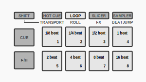
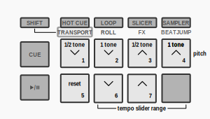
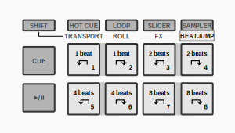
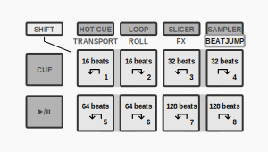

Hercules DJControl Inpulse 500
==============================

   Hercules DJControl Inpulse 500 (schematic view)

-  `Manufacturer’s product page <https://web.archive.org/web/20241013231548/https://www.hercules.com/en-us/product/djcontrol-inpulse-500/>`__
-  `Manufacturer’s support and downloads page <https://support.hercules.com/en/product/djcontrolinpulse500-en//>`__
-  `Forum thread <https://mixxx.discourse.group/t/hercules-djcontrol-inpulse-500/19739/101/>`__

.. versionadded:: 2.5.1

Compatibility
-------------

This controller is a class compliant USB MIDI and audio device, so it
can be used without any special drivers on GNU/Linux, Mac OS X, and
Windows. However, if you wish to use the :ref:`ASIO sound API <preferences-sound-api>`
under Windows, please install the latest driver package available from
the `Support page <https://support.hercules.com/en/product/djcontrolinpulse500-en//>`__.

Sound card setup
----------------

This controller has built-in 4 channel output sound card, with MAIN output
(2x RCA or 2x unbalanced 6.35mm jack) and HEADPHONE output (stereo
3.5mm jack or stereo 6.35mm jack)

-  Open **Preferences > Sound Hardware**
-  Select the **Output** tab
-  From the **Main** drop-down menu, select the audio interface, then
   **Channels 1-2**
-  From the **Headphones** drop-down menu, select the audio interface,
   then **Channels 3-4**
-  Click **Apply** to save the changes.

.. seealso::
   The :ref:`example setups section <setup-laptop-and-external-card>` provides more details about the audio configuration in Mixxx.

.. note::
   The **Master** and **Headphone** knobs, as well as the
   **Master** button are hardware controls and interact directly with the
   integrated sound card’s output. Although they also send MIDI messages,
   they have NOT been mapped in Mixxx, so do not expect an on-screen
   reaction when using them. This was done to prevent the knobs to adjust
   both the gain on the controller’s sound card and in Mixxx.

Mapping description
-------------------

Decks
~~~~~

===============================================================  ==========================================
Control                                                          Function
===============================================================  ==========================================
:hwlabel:`SYNC` button                                           Toggle :ref:`Sync Lock <sync-lock>`.
:hwlabel:`SHIFT` + :hwlabel:`SYNC` button                        Match key to currently playing track.
:hwlabel:`CUE` button                                            CUE button, behavior depends on the :ref:`cue mode <interface-cue-modes>`.
:hwlabel:`SHIFT` + :hwlabel:`CUE` button                         Return to the beginning of the track.
:hwlabel:`Play` button                                           Play/Pause the current track.
:hwlabel:`SHIFT` + :hwlabel:`Play` button                        Cue Stutter.
:hwlabel:`VINYL` button                                          Toggle scratch mode (default: on)
:hwlabel:`SHIFT` + :hwlabel:`VINYL` button                       Toggle vinyl pause effect (default: off)
Loop :hwlabel:`IN` button                                        Mark start of the loop.
:hwlabel:`SHIFT` + Loop :hwlabel:`IN` button                     Jump to loop start.
Loop :hwlabel:`OUT` button                                       Mark end of the loop.
:hwlabel:`SHIFT` + Loop :hwlabel:`OUT` button                    Jump to loop end.
Beat Align LED                                                   Track alignment markers (make sure :hwlabel:`BEATMATCH GUIDE` is on for this to work).
Loop encoder push                                                Reloop toggle
Loop encoder turn                                                Double or halve current loop
:hwlabel:`SHIFT` + Loop encoder                                  4-bar loop enable
:hwlabel:`SLIP`                                                  Toggles splip mode.
:hwlabel:`QUANT`                                                 Toggles quantize.
:hwlabel:`SHIFT` + :hwlabel:`QUANT`                              Toggles keylock.
===============================================================  ==========================================

Browser
~~~~~~~

===============================================================  ==========================================
Control                                                          Function
===============================================================  ==========================================
:hwlabel:`BROWSER` encoder (turn encoder)                        Move up/down currently focused list or search history
:hwlabel:`SHIFT` + :hwlabel:`BROWSER` encoder (turn encoder)     Move left/right (fold/unfold) list.
:hwlabel:`BROWSER` encoder (press)                               Switch focus between list, search and file view.
:hwlabel:`SHIFT` + :hwlabel:`BROWSER` encoder (press)            Maximize/Minimize library view.
:hwlabel:`ASSISTANT` button                                      Toggle AutoDJ (be sure a playlist was created for AutoDJ before activating this function).
===============================================================  ==========================================

Deck Channels
~~~~~~~~~~~~~

FX
~~

.. note::
   This mapping turns the FX button into channel selection,
   relegating FX to pad mode 7. The LED indicates which
   channel is active on the corresponding deck

===============================================================  ==========================================
Control                                                          Function
===============================================================  ==========================================
:hwlabel:`FX1` pad                                               Choose deck 1 on left deck.
:hwlabel:`FX2` pad                                               Choose deck 2 on right deck.
:hwlabel:`FX3` pad                                               Choose deck 3 on left deck.
:hwlabel:`FX4` pad                                               Choose deck 4 on right deck.
===============================================================  ==========================================

Performance Pads
~~~~~~~~~~~~~~~~

   Performance pads modes overview

MODE 1: Hot Cue Mode
^^^^^^^^^^^^^^^^^^^^

===============================================================  ==========================================
Control                                                          Function
===============================================================  ==========================================
Pad 1 - 8                                                        Set and trigger :term:`hotcue` 1 - 8
:hwlabel:`SHIFT` + Pad 1 - 8                                     Delete :term:`hotcue` 1 - 8.
===============================================================  ==========================================

MODE 2: Loop Mode
^^^^^^^^^^^^^^^^^

===============================================================  ==========================================
Control                                                          Function
===============================================================  ==========================================
Pad 1                                                            Activate Beatloop of 1/8 beat size.
Pad 2                                                            Activate Beatloop of 1/4 beat size.
Pad 3                                                            Activate Beatloop of 1/2 beat size.
Pad 4                                                            Activate Beatloop of 1 beat size.
Pad 5                                                            Activate Beatloop of 2 beat size.
Pad 6                                                            Activate Beatloop of 4 beat size.
Pad 7                                                            Activate Beatloop of 8 beat size.
Pad 8                                                            Activate Beatloop of 16 beat size.
===============================================================  ==========================================

===============================================================  ==========================================
Control                                                          Function
===============================================================  ==========================================
:hwlabel:`SHIFT` + Pad 1                                         Activate Beatloop of 1/32 beat size.
:hwlabel:`SHIFT` + Pad 2                                         Activate Beatloop of 1/16 beat size.
:hwlabel:`SHIFT` + Pad 3                                         Activate Beatloop of 32 beat size.
:hwlabel:`SHIFT` + Pad 4                                         Activate Beatloop of 64 beat size.
:hwlabel:`SHIFT` + Pad 5                                         Activate Beatloop of 128 beat size.
:hwlabel:`SHIFT` + Pad 6                                         Activate Beatloop of 256 beat size.
:hwlabel:`SHIFT` + Pad 7                                         Activate Beatloop of 512 beat size.
:hwlabel:`SHIFT` + Pad 8                                         Activate Beatloop of 1024 beat size.
===============================================================  ==========================================

MODE 3: Slicer Mode
^^^^^^^^^^^^^^^^^^^

Each pad is a beat from the current 8 bars. Press the button to slip to the beat and then playback
will resume to the current beat (marked in white as it progresses)

MODE 4: Sampler Mode
^^^^^^^^^^^^^^^^^^^^

===============================================================  ==========================================
Control                                                          Function
===============================================================  ==========================================
Pad 1 - 8 (deck A)                                               Trigger Sampler 1 - 8 or load.
Pad 1 - 8 (deck B)                                               Trigger Sampler 1 - 8.
:hwlabel:`SHIFT` + Pad 1 - 8 (deck A)                            Pause playing or "eject" sample slot
:hwlabel:`SHIFT` + Pad 1 - 8 (deck B)                            Pause playing or "eject" sample slot
===============================================================  ==========================================

MODE 5: Transport Mode
^^^^^^^^^^^^^^^^^^^^^^

===============================================================  ==========================================
Control                                                          Function
===============================================================  ==========================================
Pad 1                                                            Pitch down a whole tone.
Pad 2                                                            Pitch down a half tone.
Pad 3                                                            Pitch up a half tone.
Pad 4                                                            Pitch up a whole tone.
Pad 5                                                            Tempo slider range reset.
Pad 6                                                            Tempo slider range decrease.
Pad 7                                                            Tempo slider range increase.
Pad 8                                                            Unused
===============================================================  ==========================================

MODE 6: Roll mode
^^^^^^^^^^^^^^^^^

===============================================================  ==========================================
Control                                                          Function
===============================================================  ==========================================
Pad 1                                                            Activate roll of 1/8 beat size.
Pad 2                                                            Activate roll of 1/4 beat size.
Pad 3                                                            Activate roll of 1/2 beat size.
Pad 4                                                            Activate roll of 1 beat size.
Pad 5                                                            Activate roll of 2 beat size.
Pad 6                                                            Activate roll of 4 beat size.
Pad 7                                                            Activate roll of 8 beat size.
Pad 8                                                            Activate roll of 16 beat size.
===============================================================  ==========================================

MODE 7: FX Mode
^^^^^^^^^^^^^^^

===============================================================  ==========================================
Control                                                          Function
===============================================================  ==========================================
Pad 1 - 3                                                        Toggle Effect 1 - 3.
Pad 5 - 6                                                        Cycle filter knob effect.
Pad 7                                                            Kill filter knob effect.
Pad 4                                                            Toggle Effect Unit 1.
Pad 8                                                            Toggle Effect Unit 2.
:hwlabel:`Shift` + Pad 1 - 3                                     Cycle to next effect 1 - 3.
===============================================================  ==========================================

MODE 8: Beatjump Mode
^^^^^^^^^^^^^^^^^^^^^

===============================================================  ==========================================
Control                                                          Function
===============================================================  ==========================================
Pad 1 - 2                                                        Jump backward/forward by 1 beat.
Pad 3 - 4                                                        Jump backward/forward by 2 beats.
Pad 5 - 6                                                        Jump backward/forward by 4 beats.
Pad 7 - 8                                                        Jump backward/forward by 8 beats.
===============================================================  ==========================================

===============================================================  ==========================================
Control                                                          Function
===============================================================  ==========================================
:hwlabel:`Shift` + Pad 1 - 2                                     Jump backward/forward by 16 beat.
:hwlabel:`Shift` + Pad 3 - 4                                     Jump backward/forward by 32 beats.
:hwlabel:`Shift` + Pad 5 - 6                                     Jump backward/forward by 64 beats.
:hwlabel:`Shift` + Pad 7 - 8                                     Jump backward/forward by 128 beats.
===============================================================  ==========================================

Known issues
------------

Controls not included in this mapping
~~~~~~~~~~~~~~~~~~~~~~~~~~~~~~~~~~~~~

-  Master knob (Hardware control)
-  Headphone knob (Hardware control)
-  Master buttons (Hardware control)
-  PADS: Toneplay
