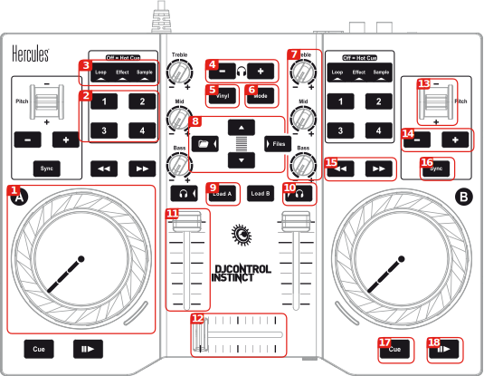

Hercules DJControl Instinct (S)
===============================

This is the cheapest all-in-one controller with an integrated sound
card. The DJControl Instinct S is functionally identical to the DJ
Control Instinct, but has a brushed stainless finish.

-  `Manufacturer's product page <https://support.hercules.com/en/product/djcontrolinstinct-en/>`__
-  `Forum thread <https://mixxx.discourse.group/t/hercules-dj-control-instinct/12623>`__

.. versionadded:: 1.10.1

Setup
-----

The controller is a class compliant MIDI controller, so you should be
able to just plug it in and it should be recognized in Mixxx. No need
for drivers.

Make sure to select the correct mapping for the controller and enable it.

Audio Channels
~~~~~~~~~~~~~~

There are two outputs on the controller itself: the headphones output
with builtin volume control on the side facing you and the speakers
output.

In Mixxx the headphones output is on channels 3 and 4, so select the
“Channels 3-4” item to get stereo output. The speakers output is on
channels 1 and 2, so to get stereo output you want to select the
“Channels 1-2” item.

Controls
--------

   Hercules DJControl Instinct (schematic view). This picture is taken from the product poster in the device manual (courtesy of Guillemot Corporation S.A.).

1.  Jog Wheel for the deck on the side of the wheel
2.  Action buttons for the deck on the side of the controls, depending on
    the mode they do the following:

    - Hot Cue:

      - **1:** Set and play (by holding it) from Hot Cue 1
      - **2:** Set and play (by holding it) from Hot Cue 2
      - **3:** Reset Hot Cue 1
      - **4:** Reset Hot Cue 2

    - Loop

      - **1:** Set Loop start
      - **2:** Set loop end
      - **3:** Shrink loop (halves it)
      - **4:** Exit loop

    - Effect

      - **1:** Toggle Effect 1
      - **2:** Toggle Effect 2
      - **3:** Toggle Effect 3
      - **4:** Toggle Effect 4

    - Sample

      - **1:** Play Sample 1
      - **2:** Play Sample 2
      - **3:** Play Sample 3
      - **4:** Play Sample 4

3.  Mode status display. The current mode is glowing or if none is on, Hot Cues are enabled.
4.  Headphone volume controls
5.  No direct use, used as a button to add a second layer of controls
6.  Switch the current mode for both decks
7.  Knobs to adjust the EQ of the deck they are on. Top knob adjusts highs, middle knob the mids and bottom know the lows.
8.  Buttons to browse your library. The up and down button go up and down in the current playlist, The folder/left button goes up in the playlist list and the Files/right button goes down in the playlist list.
9.  Load the currently selected track to the respective deck (A is the left deck, B is the right deck)
10.  Listen to this deck unmixed on the headphones
11.  Deck volume adjusts the output volume of the respective deck
12.  Crossfader
13.  Temporary pitch shift. Pressing the Vinyl button increases the shift.
14.  Adjust tempo. Pressing both buttons together resets to the original tempo. Pressing the Vinyl button takes the steps bigger.
15.  Fast forward and backward buttons for the respective decks
16.  Sync tempo of this deck to the tempo of the other deck
17.  If pressed while paused sets the cue and when held plays from the cue, when pressed during playback jumps to the cue.
18.  Play and pause playback of the respective decks
