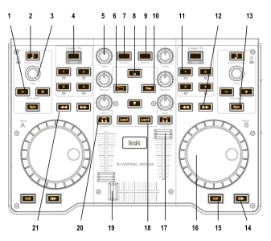

Hercules DJControl MP3 e2 / MP3 LE / Glow
=========================================

The Hercules DJ Control MP3 e2, MP3 LE, and Glow are USB controllers that have identical controls and share the same mapping.
These controllers do not have a built in sound card, so a :ref:`splitter cable <hardware-splitter-cables>` or :ref:`separate audio interface <hardware-audio-interfaces>` is recommended for use with it.

.. versionadded:: 1.11
.. versionchanged:: 2.3.0

This new version is intended to work in a more intuitive way. Once you click on a button, it does its original function.

.. note::
   These controllers are not class compliant :term:`MIDI` devices.
   On Linux, older versions of Mixxx required using a custom Hercules kernel module.
   This is neither necessary not recommended anymore.

   Hercules DJControl MP3 e2 (schematic view)

Mapping description (by function)
---------------------------------

Library
^^^^^^^

======== ============================================== ============================================================================
 Number   Control                                        Function
======== ============================================== ============================================================================
 6        Folder                                         Toggle playlist selection
 10       :hwlabel:`Files`                               Toggle track selection
 8        Up arrow                                       Go one playlst/track up
 8        Down arrow                                     Go one playlst/track down
 18       :hwlabel:`Load A`/:hwlabel:`Load B`            Loads the currently highlighted track into the corresponding deck (A or B)
======== ============================================== ============================================================================

Master/Headphones
^^^^^^^^^^^^^^^^^

======== ============================================== =====================================================================
 Number   Control                                        Function
======== ============================================== =====================================================================
 19       Crossfader                                     Fades between left (channel 1) and right (channel 2) deck
 20       Headphone monitor                              Toggles deck output to the headphones monitor on/off
======== ============================================== =====================================================================

Decks / Channels
^^^^^^^^^^^^^^^^

Playing
'''''''

======== ==============================================  =======================================================================================================================================================================================================================================
 Number   Control                                        Function
======== ==============================================  =======================================================================================================================================================================================================================================
 18       :hwlabel:`Load A`/:hwlabel:`Load B`            Loads the currently highlighted track into the corresponding deck (A or B)
 14       Play                                           Starts or stop a loaded track
 15       :hwlabel:`Cue`                                 Sets the cue point if a track is stopped and not at the current cue point. Stops track and returns to the current cue point if a track is playing. Plays preview if a track is stopped at the cue point for as long as it’s held down
 12       Forward / Backward                             Move Forward/Backward in track
 7        Scratch                                        Enable or disable the scratch mode on all two decks
 16       Jog wheel                                      Seeks forwards and backwards in a stopped track. Temporarily changes the playback speed for playing tracks.  Absolute sync of the track speed to the jog wheel if scratch mode enabled
======== ==============================================  =======================================================================================================================================================================================================================================

Volume / Equalizer / Effects
''''''''''''''''''''''''''''

======== ============================================== =============================================================================
 Number   Control                                       Function
======== ============================================== =============================================================================
 17       Deck volume slider                            Controls the deck output volume, with soft takeover on deck switch.
 5        Equalizer knobs                               Adjusts the gain of the low/medium/high equalizer filter. No soft takeover.
 4        Shift                                         Toggle Effects Selection
 11       Button :hwlabel:`1`/:hwlabel:`2`/:hwlabel:`3` Toggle Effect 1/2/3 for corresponding deck (with shift activated)
======== ============================================== =============================================================================

Loops
'''''

======== ============================================== ==========
 Number   Control                                       Function
======== ============================================== ==========
 11       Button :hwlabel:`1`                            Loop 1
 11       Button :hwlabel:`2`                            Loop 2
 11       Button :hwlabel:`3`                            Loop 4
 11       Button :hwlabel:`4`                            Loop 8
======== ============================================== ==========

Pitch / Syncing
'''''''''''''''

======== ============================================== ==================================================================
 Number   Control                                        Function
======== ============================================== ==================================================================
 1        Pitchbend :hwlabel:`-`/:hwlabel:`+`            Temporary Holds the pitch 4% lower or higher while pressed
 3        Pitch knobs                                    Adjust playback pitch / speed
 13       :hwlabel:`Sync`                                Automatically sets pitch so the BPM of the other deck is matched
 2        Master Tempo                                   Enable and lock Sync Mode
======== ============================================== ==================================================================

Troubleshooting
---------------

Jog wheels not working or controller not responding
^^^^^^^^^^^^^^^^^^^^^^^^^^^^^^^^^^^^^^^^^^^^^^^^^^^

If your jog wheels doesn’t work, or nothing works on the controller even when you have carefully read all other resources, you should be aware that this controller stores at least two configuration
options in the controller:

-  Enable/disable Jog Wheels
-  MIDI channel to use

and maybe a third one: Jog wheel sensitivity

With factory default settings, the jog wheels are enabled and the MIDI channel used is channel 1. The mapping is made for channel 1 only. If your controller is configured for another channel, nothing
will work and if you launch Mixxx with :literal:`-``-controllerDebug` parameter, you will have lines like this one showing in the logs when you press a button on the controller :

.. code-block::

   Debug [Controller]: "DJ Control MP3 e2 : 3 bytes: B3 38 38 "

note the B3 here. it’s B<MIDI Channel # - 1>. So this controller is configured on channel 4. controller configured on channel 1 will show B0, which is correct.

To change these parameters, you have to use the configuration tool that comes with the Hercules driver on on `the Hercules support
page <http://ts.hercules.com/eng/index.php?pg=view_files&gid=17&fid=61&pid=241&cid=1>`__. Unfortunately, the configuration tool is only available for Windows and Mac OS X. We are not aware of any
solution for Linux. So if you normally use Linux, you will have to find a computer with Windows or Mac OS X, install the Hercules driver, plug-in the controller and change configuration. You will only
need to do this once, then the controller should work with Linux.

Controller not recognized as bulk controller
^^^^^^^^^^^^^^^^^^^^^^^^^^^^^^^^^^^^^^^^^^^^

It has been reported that when the Hercules drivers are installed on a Windows, the driver takes over the bulk communication with the controller so it cannot be recognized by Mixxx as a bulk
controller. Uninstall the Hercules driver and use it as a USB bulk controller.
