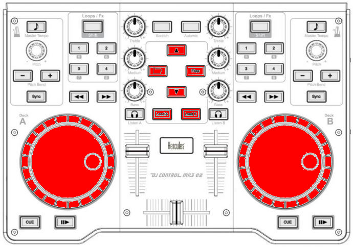
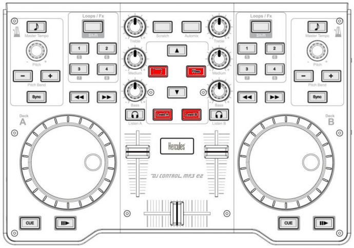
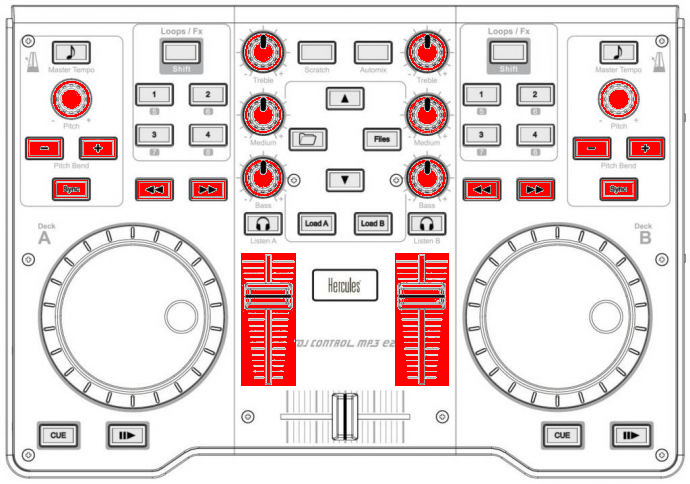
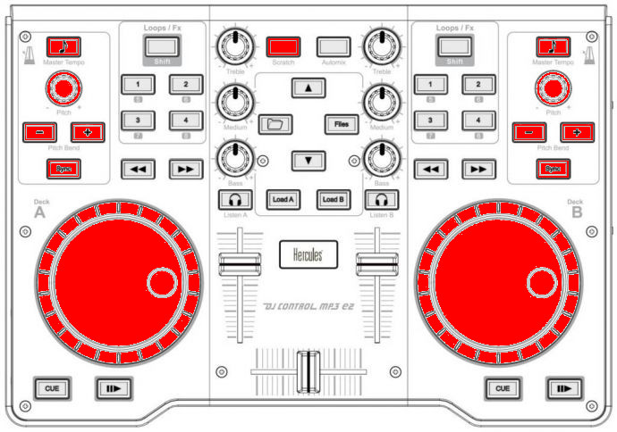

Hercules DJControl MP3 e2 / MP3 LE / Glow
=========================================

The Hercules DJ Control MP3 e2, MP3 LE, and Glow are USB controllers that have identical controls and share the same mapping.
These controllers do not have a built in sound card, so a :ref:`splitter cable <hardware-splitter-cables>` or :ref:`separate audio interface <hardware-audio-interfaces>` is recommended for use with it.
The mapping is included in Mixxx and allows you to manipulate 4 decks, 2 at a time, switching Deck A (left) between Channel 1 and 3 and Deck B (right) between Channel 2 and 4.

.. versionadded:: 1.11

.. note::
   These controllers are not class compliant :term:`MIDI` devices.
   On Linux, older versions of Mixxx required using a custom Hercules kernel module.
   This is neither necessary not recommended anymore.

Mapping description (by function)
---------------------------------

Shift / Supershift
^^^^^^^^^^^^^^^^^^

.. figure:: ../../_static/controllers/hercules_djcontrol_mp3_e2_shift.jpg
   :align: center
   :width: 100%
   :figwidth: 100%
   :alt: Hercules DJControl MP3 e2 (shift/supershift)
   :figclass: pretty-figures

   Hercules DJControl MP3 e2 (shift/supershift)

+-----------------------+-----------------------+-----------------------+
| Function              | Control               | number                |
+=======================+=======================+=======================+
| Shift button to       | Automix               | 9                     |
| obtain more controls  |                       |                       |
| than those provided   |                       |                       |
| by Hercules.          |                       |                       |
| Press & Hold automix, |                       |                       |
| then press            |                       |                       |
| corresponding button  |                       |                       |
| to obtain shifted     |                       |                       |
| behavior.             |                       |                       |
+-----------------------+-----------------------+-----------------------+
| Supershift button to  | Shift-Scratch         | 7                     |
| obtain a third level  |                       |                       |
| of controls.          |                       |                       |
| Press & Hold Automix, |                       |                       |
| then press & Hold     |                       |                       |
| Scratch, then press   |                       |                       |
| corresponding button  |                       |                       |
| to obtain             |                       |                       |
| supershifted          |                       |                       |
| behavior.             |                       |                       |
+-----------------------+-----------------------+-----------------------+
| Switch deck A (left)  | Supershift + Load A   | 18                    |
| between Channel1 and  |                       |                       |
| Channel3 (also apply  |                       |                       |
| to Sampler1 and       |                       |                       |
| Sampler3)             |                       |                       |
+-----------------------+-----------------------+-----------------------+
| Switch deck B (right) | Supershift + Load B   | 18                    |
| between Channel2 and  |                       |                       |
| Channel4 (also apply  |                       |                       |
| to Sampler2 and       |                       |                       |
| Sampler4)             |                       |                       |
+-----------------------+-----------------------+-----------------------+

Library
^^^^^^^

   Hercules DJControl MP3 e2 (library)

=========================================================================== ============================= ======
Function                                                                    Control                       number
=========================================================================== ============================= ======
Select prev/next playlist                                                   Supershift + Deck A Jog Wheel 16
Toggles (expands/collapses) the currently selected library sidebar item     Folder                        6
Go one track down                                                           Up arrow                      8
Go one track up                                                             Shift + Up arrow              8
Select prev/next track                                                      Supershift + Deck B Jog Wheel 16
Loads the currently highlighted track into the corresponding deck (A or B)  Load A/B                      18
Loads the current highlighted track into the corresponding sampler (1 or 2) Shift + Load A/B              18
=========================================================================== ============================= ======

Main/Headphones/Microphone
^^^^^^^^^^^^^^^^^^^^^^^^^^^^

.. figure:: ../../_static/controllers/hercules_djcontrol_mp3_e2_masterheadmicro.jpg
   :align: center
   :width: 100%
   :figwidth: 100%
   :alt: Hercules DJControl MP3 e2 (main/headphones/microphone)
   :figclass: pretty-figures

   Hercules DJControl MP3 e2 (main/headphones/microphone)

================================================================= ========================= ======
Function                                                          Control                   number
================================================================= ========================= ======
Microphone TalkOver                                               Down Arrow                8
Fades between left (channel 1 & 3) and right (channel 2 & 4) deck Crossfader                19
Headphone volume                                                  Shift + Deck A pitch knob 3
Adjust the cue/main mix in the headphone output                   Shift + Deck B pitch knob 3
Toggles deck output to the headphones monitor on/off              Headphone monitor         20
================================================================= ========================= ======

Sampler
^^^^^^^

   Hercules DJControl MP3 e2 (sampler)

=========================================================================== =================== ======
Function                                                                    Control             number
=========================================================================== =================== ======
Loads the current highlighted track into the corresponding sampler (1 or 2) Shift + Load A/B    18
Goto start & Play sampler 1/3                                               Shift + Folder      6
Stop sampler 1/3                                                            Supershift + Folder 6
Goto start & Play sampler 2/4                                               Shift + Files       10
Stop sampler 2/4                                                            Supershift + Files  10
=========================================================================== =================== ======

Decks / Channels
^^^^^^^^^^^^^^^^

Playing
'''''''

.. figure:: ../../_static/controllers/hercules_djcontrol_mp3_e2_deckplaying.jpg
   :align: center
   :width: 100%
   :figwidth: 100%
   :alt: Hercules DJControl MP3 e2 (deck playing)
   :figclass: pretty-figures

   Hercules DJControl MP3 e2 (deck playing)

+-----------------------+-----------------------+-----------------------+
| Function              | Control               | number                |
+=======================+=======================+=======================+
| Loads the currently   | Load A/B              | 18                    |
| highlighted track     |                       |                       |
| into the              |                       |                       |
| corresponding deck (A |                       |                       |
| or B)                 |                       |                       |
+-----------------------+-----------------------+-----------------------+
| Starts or stop a      | Play                  | 14                    |
| loaded track          |                       |                       |
+-----------------------+-----------------------+-----------------------+
| Backward Play         | Shift + Play          | 14                    |
+-----------------------+-----------------------+-----------------------+
| Toggle Repeat         | Supershift + Play     | 14                    |
+-----------------------+-----------------------+-----------------------+
| Sets the cue point if | Cue                   | 15                    |
| a track is stopped    |                       |                       |
| and not at the        |                       |                       |
| current cue point.    |                       |                       |
| Stops track and       |                       |                       |
| returns to the        |                       |                       |
| current cue point if  |                       |                       |
| a track is playing.   |                       |                       |
| Plays preview if a    |                       |                       |
| track is stopped at   |                       |                       |
| the cue point for as  |                       |                       |
| long as it's held     |                       |                       |
| down                  |                       |                       |
+-----------------------+-----------------------+-----------------------+
| Move Forward/Backward | Forward / Backward    | 12                    |
| in track              |                       |                       |
+-----------------------+-----------------------+-----------------------+
| Enable or disable the | Scratch               | 7                     |
| scratch mode on all   |                       |                       |
| four decks            |                       |                       |
+-----------------------+-----------------------+-----------------------+
| Seeks forwards and    | Jog wheel             | 16                    |
| backwards in a        |                       |                       |
| stopped track.        |                       |                       |
| Temporarily changes   |                       |                       |
| the playback speed    |                       |                       |
| for playing tracks.   |                       |                       |
| Absolute sync of the  |                       |                       |
| track speed to the    |                       |                       |
| jog wheel if scratch  |                       |                       |
| mode enabled          |                       |                       |
+-----------------------+-----------------------+-----------------------+

Volume / Equalizer / Effects
''''''''''''''''''''''''''''

   Hercules DJControl MP3 e2 (deck volume/EQ/FX)

=========================================================================== ======================================== ======
Function                                                                    Control                                  number
=========================================================================== ======================================== ======
Controls the deck output volume, with soft takeover on deck switch.         Deck volume slider                       17
Adjusts the gain of the low/medium/high equalizer filter. No soft takeover. Equalizer knobs                          5
Filter Low Kill                                                             Supershift + Pitchbend -                 1
Filter Mid Kill                                                             Supershift + Sync                        13
Filter High Kill                                                            Supershift + Pitchbend +                 1
Adjust pregain                                                              Shift + Forward / Backward               12
Quick Filter knob                                                           Supershift + Pitch knobs                 3
Brake Effect                                                                Supershift + Forward (stops on release)  12
Spinback Effect                                                             Supershift + Backward (stops on release) 12
=========================================================================== ======================================== ======

Hotcues
'''''''

.. figure:: ../../_static/controllers/hercules_djcontrol_mp3_e2_hotcues.jpg
   :align: center
   :width: 100%
   :figwidth: 100%
   :alt: Hercules DJControl MP3 e2 (hotcues)
   :figclass: pretty-figures

   Hercules DJControl MP3 e2 (hotcues)

*Need to be in Hotcue mode (button Loop/Fx (4) lit up). If not, press Loop/Fx button to switch to hotcue mode.*

================================================================================================================================ ======================= ======
Function                                                                                                                         Control                 number
================================================================================================================================ ======================= ======
If hotcue X is set, seeks the player to hotcue X’s position. If hotcue X is not set, sets hotcue X to the current play position. 1/2/3/4 buttons         11
If hotcue X is set, clears its hotcue status.                                                                                    Shift + 1/2/3/4 buttons 11
================================================================================================================================ ======================= ======

Loops
'''''

.. figure:: ../../_static/controllers/hercules_djcontrol_mp3_e2_loops.jpg
   :align: center
   :width: 100%
   :figwidth: 100%
   :alt: Hercules DJControl MP3 e2 (loops)
   :figclass: pretty-figures

   Hercules DJControl MP3 e2 (loops)

*Need to be in Loop mode (button Loop/Fx (4) turned off). If not, press Loop/Fx button to switch to Loop mode.*

============================== ===================== ======
Function                       Control               number
============================== ===================== ======
loop-in                        Button 1              11
loop-out                       Button 2              11
Toggles current loop On or Off Button 3              11
Clear Loop                     Supershift + Button 1 11
loop 1/8                       Supershift + Button 2 11
loop 1/4                       Shift + Button 1      11
loop 1/2                       Shift + Button 2      11
loop 1                         Shift + Button 3      11
loop 2                         Shift + Button 4      11
loop 4                         Button 4              11
loop 8                         Supershift + Button 3 11
loop 16                        Supershift + Button 4 11
Double loop                    Shift + Pitchbend +   1
Half loop                      Shift + Pitchbend -   1
============================== ===================== ======

Pitch / Syncing
'''''''''''''''

   Hercules DJControl MP3 e2 (pitch / sync)

+-----------------------+-----------------------+-----------------------+
| Function              | Control               | number                |
+=======================+=======================+=======================+
| Temporary Holds the   | Pitchbend +/-         | 1                     |
| pitch 4% higher while |                       |                       |
| pressed               |                       |                       |
+-----------------------+-----------------------+-----------------------+
| Set deck as leader    | Master tempo (MP3 e2) | 2                     |
| clock.                | / Pitch reset (MP3 LE |                       |
| Led blink: leader     | & Glow)               |                       |
| Fixed led: Follower   |                       |                       |
| Led off: none         |                       |                       |
+-----------------------+-----------------------+-----------------------+
| Adjust playback pitch | Pitch knobs           | 3                     |
| / speed               |                       |                       |
+-----------------------+-----------------------+-----------------------+
| Automatically sets    | Sync                  | 13                    |
| pitch so the BPM of   |                       |                       |
| the other deck is     |                       |                       |
| matched               |                       |                       |
+-----------------------+-----------------------+-----------------------+
| Enable key-lock for   | Shift + Master tempo  | 2                     |
| the specified deck    |                       |                       |
| (rate changes only    |                       |                       |
| affect tempo, not     |                       |                       |
| key)                  |                       |                       |
+-----------------------+-----------------------+-----------------------+
| Magnet (all cues,     | Supershift + Master   | 2                     |
| hotcues, loops, and   | tempo                 |                       |
| beatloops will be     |                       |                       |
| automatically         |                       |                       |
| quantized so that     |                       |                       |
| they begin on a       |                       |                       |
| beat.)                |                       |                       |
+-----------------------+-----------------------+-----------------------+
| Adjust beatgrid       | Shift + Sync          | 13                    |
+-----------------------+-----------------------+-----------------------+
| Enable or disable the | scratch               | 7                     |
| scratch mode on all   |                       |                       |
| four decks            |                       |                       |
+-----------------------+-----------------------+-----------------------+
| Seeks forwards and    | Jog wheel             | 16                    |
| backwards in a        |                       |                       |
| stopped track.        |                       |                       |
| Temporarily changes   |                       |                       |
| the playback speed    |                       |                       |
| for playing tracks.   |                       |                       |
| Absolute sync of the  |                       |                       |
| track speed to the    |                       |                       |
| jog wheel if scratch  |                       |                       |
| mode enabled          |                       |                       |
+-----------------------+-----------------------+-----------------------+

Mapping description (by knob/button)
------------------------------------

.. figure:: ../../_static/controllers/hercules_djcontrol_mp3_e2_mapping.png
   :align: center
   :width: 100%
   :figwidth: 100%
   :alt: Hercules DJControl MP3 e2 (schematic view)
   :figclass: pretty-figures

   Hercules DJControl MP3 e2 (schematic view)

Global controls
^^^^^^^^^^^^^^^

+--------------+--------------+---------------------+---------------+---------------+
| Number       | Control      | Function            | shifted       | Supershifted  |
+==============+==============+=====================+===============+===============+
| 8            | Arrow        | Up : goes one track | Up : Goes one | Nothing       |
|              | up/down      | down                | track up      |               |
|              |              | Down : Microphone   | Down :        |               |
|              |              | TalkOver            | Nothing       |               |
+--------------+--------------+---------------------+---------------+---------------+
| 6            | Folder       | Toggles             | Play/Stutter  | Stop sampler  |
|              |              | (expands/collapses) | sampler 1/3   | 1/3           |
|              |              | the currently       |               |               |
|              |              | selected library    |               |               |
|              |              | sidebar item        |               |               |
+--------------+--------------+---------------------+---------------+---------------+
| 10           | Files        | Toggles             | Play/Stutter  | Stop sampler  |
|              |              | (expands/collapses) | sampler 2/4   | 2/4           |
|              |              | the currently       |               |               |
|              |              | selected library    |               |               |
|              |              | sidebar item        |               |               |
+--------------+--------------+---------------------+---------------+---------------+
| 18           | Load A/B     | Loads the currently | Loads the     | Switch deckA  |
|              |              | highlighted track   | current       | between       |
|              |              | into the            | highlighted   | Channel 1 & 3 |
|              |              | corresponding deck  | track into    | and deckB     |
|              |              | (A or B)            | the           | between 2 &4  |
|              |              |                     | corresponding |               |
|              |              |                     | sampler (1 or |               |
|              |              |                     | 2)            |               |
+--------------+--------------+---------------------+---------------+---------------+
| 19           | Crossfader   | Fades between left  |               |               |
|              |              | (channel 1 & 3) and |               |               |
|              |              | right (channel 2 &  |               |               |
|              |              | 4) deck             |               |               |
+--------------+--------------+---------------------+---------------+---------------+
| 9            | Automix      | Used as a main      |               |               |
|              |              | shift button to     |               |               |
|              |              | obtain more         |               |               |
|              |              | controls than those |               |               |
|              |              | provided by         |               |               |
|              |              | Hercules. Press &   |               |               |
|              |              | Hold automix, then  |               |               |
|              |              | press corresponding |               |               |
|              |              | button to obtain    |               |               |
|              |              | shifted behavior.   |               |               |
+--------------+--------------+---------------------+---------------+---------------+
| 7            | Scratch      | Enable or disable   | Used as a     |               |
|              |              | the scratch mode on | main          |               |
|              |              | both decks          | supershift    |               |
|              |              |                     | button to     |               |
|              |              |                     | obtain a      |               |
|              |              |                     | third level   |               |
|              |              |                     | of controls.  |               |
|              |              |                     | Press & Hold  |               |
|              |              |                     | Automix, then |               |
|              |              |                     | press & Hold  |               |
|              |              |                     | Scratch, then |               |
|              |              |                     | press         |               |
|              |              |                     | corresponding |               |
|              |              |                     | button to     |               |
|              |              |                     | obtain        |               |
|              |              |                     | supershifted  |               |
|              |              |                     | behavior      |               |
+--------------+--------------+---------------------+---------------+---------------+

Deck / Channel specific controls
^^^^^^^^^^^^^^^^^^^^^^^^^^^^^^^^

+--------------+--------------+------------------+--------------+--------------+
| Number       | Control      | Simple function  | Shifted      | Supershifted |
|              |              |                  | function     | function     |
+==============+==============+==================+==============+==============+
| 1            | Pitchbend    | Temporary Holds  | \+ double    | \+ Filter    |
|              | +/-          | the pitch 4%     | loop         | High Kill    |
|              |              | higher while     | \- half loop | \- Filter    |
|              |              | pressed          |              | Low Kill     |
+--------------+--------------+------------------+--------------+--------------+
| 2            | Master Tempo | Syncs the BPM    | Enable       | Quantize     |
|              |              | and phase to     | key-lock for | (Magnet)     |
|              |              | that of the      | the          |              |
|              |              | other track (if  | specified    |              |
|              |              | BPM is detected  | deck (rate   |              |
|              |              | on both).        | changes only |              |
|              |              | Led blink:       | affect       |              |
|              |              | leader           | tempo, not   |              |
|              |              | Fixed led:       | key)         |              |
|              |              | follower         |              |              |
|              |              | Led off: none    |              |              |
+--------------+--------------+------------------+--------------+--------------+
| 3            | Pitch knobs  | Adjusts playback | Deck A:      | Quick Filter |
|              |              | pitch/speed      | adjust the   | knob         |
|              |              |                  | headphone    |              |
|              |              |                  | volume       |              |
|              |              |                  | Deck B:      |              |
|              |              |                  | adjust the   |              |
|              |              |                  | cue/main mix |              |
|              |              |                  | in the       |              |
|              |              |                  | headphone    |              |
|              |              |                  | output       |              |
+--------------+--------------+------------------+--------------+--------------+
| 4            | Loop/Fx      | Toggle the       |              |              |
|              |              | Loop/Hotcue mode |              |              |
|              |              | for the keys     |              |              |
|              |              | buttons.         |              |              |
|              |              | When the button  |              |              |
|              |              | is not lit up    |              |              |
|              |              | the loop buttons |              |              |
|              |              | are enabled,     |              |              |
|              |              | when the button  |              |              |
|              |              | is lit up the    |              |              |
|              |              | hotcue's buttons |              |              |
|              |              | are enabled      |              |              |
+--------------+--------------+------------------+--------------+--------------+
| 5            | Equalizer    | Adjusts the gain |              |              |
|              | knobs        | of the           |              |              |
|              |              | low/medium/high  |              |              |
|              |              | equalizer filter |              |              |
+--------------+--------------+------------------+--------------+--------------+
| 11           | 1/2/3/4      | Loop mode:       | Loop mode:   | Loop mode:   |
|              | buttons      | 1 - loop-in      | 1 - Loop 1/4 | 1 - Clear    |
|              |              | 2 - loop-out     | 2 - Loop 1/2 | loop         |
|              |              | 3 - Toggles      | 3 - Loop 1   | 2 - Loop 1/8 |
|              |              | current loop On  | 4 - Loop 2   | 3 - Loop 8   |
|              |              | or Off           | Hotcue mode: | 4 - Loop 16  |
|              |              | 4 - Loop 4       | If hotcue X  | Hotcue mode: |
|              |              | Hotcue mode:     | is set,      | Nothing      |
|              |              | 1, 2, 3 and 4:   | clears its   |              |
|              |              | If hotcue X is   | hotcue       |              |
|              |              | set, seeks the   | status.      |              |
|              |              | player to hotcue |              |              |
|              |              | X's position. If |              |              |
|              |              | hotcue X is not  |              |              |
|              |              | set, sets hotcue |              |              |
|              |              | X to the current |              |              |
|              |              | play position.   |              |              |
+--------------+--------------+------------------+--------------+--------------+
| 12           | Forward \\   | Fast             | Adjust       | Forward:     |
|              | Backward     | forward/backward | pregain      | brake effect |
|              |              |                  |              | (stay        |
|              |              |                  |              | pushed)      |
|              |              |                  |              | Backward:    |
|              |              |                  |              | spinback     |
|              |              |                  |              | effect (stay |
|              |              |                  |              | pushed)      |
+--------------+--------------+------------------+--------------+--------------+
| 13           | Sync         | Automatically    | Adjust       | Kill Mid     |
|              |              | sets pitch so    | BeatGrid     |              |
|              |              | the BPM of the   |              |              |
|              |              | other deck is    |              |              |
|              |              | matched          |              |              |
+--------------+--------------+------------------+--------------+--------------+
| 14           | Play         | Starts or stop a | Backward     | Repeat       |
|              |              | loaded track     | Play         |              |
+--------------+--------------+------------------+--------------+--------------+
| 15           | Cue          | Sets the cue     |              |              |
|              |              | point if a track |              |              |
|              |              | is stopped and   |              |              |
|              |              | not at the       |              |              |
|              |              | current cue      |              |              |
|              |              | point            |              |              |
|              |              | Stops track and  |              |              |
|              |              | returns to the   |              |              |
|              |              | current cue      |              |              |
|              |              | point if a track |              |              |
|              |              | is playing.      |              |              |
|              |              | Plays preview if |              |              |
|              |              | a track is       |              |              |
|              |              | stopped at the   |              |              |
|              |              | cue point for as |              |              |
|              |              | long as it's     |              |              |
|              |              | held down        |              |              |
+--------------+--------------+------------------+--------------+--------------+
| 16           | Jog wheel    | Seeks forwards   |              | Deck A:      |
|              |              | and backwards in |              | Select       |
|              |              | a stopped track. |              | prev/next    |
|              |              | Temporarily      |              | playlist     |
|              |              | changes the      |              | Deck B:      |
|              |              | playback speed   |              | select       |
|              |              | for playing      |              | prev/next    |
|              |              | tracks           |              | track        |
|              |              | Absolute sync of |              |              |
|              |              | the track speed  |              |              |
|              |              | to the jog wheel |              |              |
|              |              | if the scratch   |              |              |
|              |              | mode is enabled  |              |              |
+--------------+--------------+------------------+--------------+--------------+
| 17           | Deck volume  | Controls the     |              |              |
|              | slider       | deck output      |              |              |
|              |              | volume.          |              |              |
|              |              | There is soft    |              |              |
|              |              | takeover after   |              |              |
|              |              | deck switch (1/3 |              |              |
|              |              | or 2/4) to       |              |              |
|              |              | prevent wide     |              |              |
|              |              | parameter        |              |              |
|              |              | changes when the |              |              |
|              |              | on-screen        |              |              |
|              |              | control diverges |              |              |
|              |              | from the         |              |              |
|              |              | hardware         |              |              |
|              |              | control.         |              |              |
|              |              | Manipulating the |              |              |
|              |              | control on the   |              |              |
|              |              | hardware will    |              |              |
|              |              | have no effect   |              |              |
|              |              | until the        |              |              |
|              |              | position of the  |              |              |
|              |              | hardware control |              |              |
|              |              | is close to that |              |              |
|              |              | of the software, |              |              |
|              |              | at which point   |              |              |
|              |              | it will take     |              |              |
|              |              | over and operate |              |              |
|              |              | as usual.        |              |              |
+--------------+--------------+------------------+--------------+--------------+
| 20           | Headphone    | Toggles this     |              |              |
|              | monitor      | deck output to   |              |              |
|              |              | the headphones   |              |              |
|              |              | monitor on/off   |              |              |
+--------------+--------------+------------------+--------------+--------------+

Troubleshooting
---------------

Jog wheels not working or controller not responding
^^^^^^^^^^^^^^^^^^^^^^^^^^^^^^^^^^^^^^^^^^^^^^^^^^^

If your jog wheels doesn’t work, or nothing works on the controller even when you have carefully read all other resources, you should be aware that this controller stores at least two configuration
options in the controller:

-  Enable/disable Jog Wheels
-  MIDI channel to use

and maybe a third one: Jog wheel sensitivity

With factory default settings, the jog wheels are enabled and the MIDI channel used is channel 1. The mapping is made for channel 1 only. If your controller is configured for another channel, nothing
will work and if you launch Mixxx with :literal:`-``-controllerDebug` parameter, you will have lines like this one showing in the logs when you press a button on the controller :

::

   Debug [Controller]: "DJ Control MP3 e2 : 3 bytes: B3 38 38 "

note the B3 here. it’s B<MIDI Channel # - 1>. So this controller is configured on channel 4. controller configured on channel 1 will show B0, which is correct.

To change these parameters, you have to use the configuration tool that comes with the Hercules driver on on `the Hercules support
page <http://ts.hercules.com/eng/index.php?pg=view_files&gid=17&fid=61&pid=241&cid=1>`__. Unfortunately, the configuration tool is only available for Windows and Mac OS X. We are not aware of any
solution for Linux. So if you normally use Linux, you will have to find a computer with Windows or Mac OS X, install the Hercules driver, plug-in the controller and change configuration. You will only
need to do this once, then the controller should work with Linux.

Controller not recognized as bulk controller
^^^^^^^^^^^^^^^^^^^^^^^^^^^^^^^^^^^^^^^^^^^^

It has been reported that when the Hercules drivers are installed on a Windows, the driver takes over the bulk communication with the controller so it cannot be recognized by Mixxx as a bulk
controller. Uninstall the Hercules driver and use it as a USB bulk controller.
