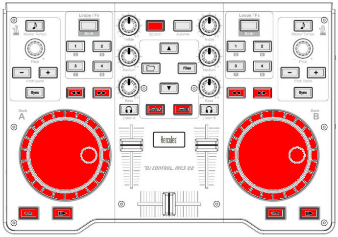

Hercules DJControl MP3 e2 / MP3 LE / Glow
=========================================

The Hercules DJ Control MP3 e2, MP3 LE, and Glow are USB controllers that have identical controls and share the same mapping.
These controllers do not have a built in sound card, so a :ref:`splitter cable <hardware-splitter-cables>` or :ref:`separate audio interface <hardware-audio-interfaces>` is recommended for use with it.

.. versionadded:: 1.11
.. versionchanged:: 2.4

.. note::
   These controllers are not class compliant :term:`MIDI` devices.
   On Linux, older versions of Mixxx required using a custom Hercules kernel module.
   This is neither necessary not recommended anymore.
   Some people report problems with this controller on Linux, so `if your controller is recognized, but not working <https://github.com/mixxxdj/mixxx/issues/11810>`__, it's recommended to use the controller with USB hub.

   Hercules DJControl MP3 e2 (schematic view)

Mapping description (by function)
---------------------------------

The mapping allows you to manipulate 4 decks, 2 at a time, switching Deck A (left) between Channel 1 and 3 and Deck B (right) between Channel 2 and 4.

Shift / Supershift
^^^^^^^^^^^^^^^^^^

+-----------------------+-----------------------+-----------------------+
| Function              | Control               | number                |
+=======================+=======================+=======================+
| Shift button to       | Automix               | 9                     |
| obtain more controls  |                       |                       |
| than those provided   |                       |                       |
| by Hercules.          |                       |                       |
| Press & Hold automix, |                       |                       |
| then press            |                       |                       |
| corresponding button  |                       |                       |
| to obtain shifted     |                       |                       |
| behavior.             |                       |                       |
+-----------------------+-----------------------+-----------------------+
| Supershift button to  | **Shift** + Scratch   | 7                     |
| obtain a third level  |                       |                       |
| of controls.          |                       |                       |
| Press & Hold Automix, |                       |                       |
| then press & Hold     |                       |                       |
| Scratch, then press   |                       |                       |
| corresponding button  |                       |                       |
| to obtain             |                       |                       |
| supershifted          |                       |                       |
| behavior.             |                       |                       |
+-----------------------+-----------------------+-----------------------+
| Switch deck A (left)  | **Supershift** +      | 18                    |
| between Channel1 and  | Load A                |                       |
| Channel3 (also apply  |                       |                       |
| to Sampler1 and       |                       |                       |
| Sampler3)             |                       |                       |
+-----------------------+-----------------------+-----------------------+
| Switch deck B (right) | **Supershift** +      | 18                    |
| between Channel2 and  | Load B                |                       |
| Channel4 (also apply  |                       |                       |
| to Sampler2 and       |                       |                       |
| Sampler4)             |                       |                       |
+-----------------------+-----------------------+-----------------------+

Library
^^^^^^^

+-----------------------------+-----------------------------+--------+
| Function                    | Control                     | number |
+=============================+=============================+========+
| Select prev/next playlist   | **Supershift** + Deck A Jog | 16     |
|                             | Wheel                       |        |
+-----------------------------+-----------------------------+--------+
| Toggles (expands/collapses) | Folder                      | 6      |
| the currently selected      |                             |        |
| library sidebar item        |                             |        |
+-----------------------------+-----------------------------+--------+
| Go one track down           | Up arrow                    | 8      |
+-----------------------------+-----------------------------+--------+
| Go one track up             | **Shift** + Up arrow        | 8      |
+-----------------------------+-----------------------------+--------+
| Select prev/next track      | **Supershift** + Deck B Jog | 16     |
|                             | Wheel                       |        |
+-----------------------------+-----------------------------+--------+
| Loads the currently         | Load A/B                    | 18     |
| highlighted track into the  |                             |        |
| corresponding deck (A or B) |                             |        |
+-----------------------------+-----------------------------+--------+
| Loads the current           | **Shift** + Load A/B        | 18     |
| highlighted track into the  |                             |        |
| corresponding sampler (1 or |                             |        |
| 2)                          |                             |        |
+-----------------------------+-----------------------------+--------+

Master/Headphones/Microphone
^^^^^^^^^^^^^^^^^^^^^^^^^^^^

+-----------------------------+---------------------------+--------+
| Function                    | Control                   | number |
+=============================+===========================+========+
| Microphone TalkOver         | Down Arrow                | 8      |
+-----------------------------+---------------------------+--------+
| Fades between left (channel | Crossfader                | 19     |
| 1 & 3) and right (channel 2 |                           |        |
| & 4) deck                   |                           |        |
+-----------------------------+---------------------------+--------+
| Headphone volume            | **Shift** + Deck A pitch  | 3      |
|                             | knob                      |        |
+-----------------------------+---------------------------+--------+
| Adjust the cue/main mix in  | **Shift** + Deck B pitch  | 3      |
| the headphone output        | knob                      |        |
+-----------------------------+---------------------------+--------+
| Toggles deck output to the  | Headphone monitor         | 20     |
| headphones monitor on/off   |                           |        |
+-----------------------------+---------------------------+--------+

Sampler
^^^^^^^

+-------------------------------------+---------------------+--------+
| Function                            | Control             | number |
+=====================================+=====================+========+
| Loads the current highlighted track | **Shift** + Load    | 18     |
| into the corresponding sampler (1   | A/B                 |        |
| or 2)                               |                     |        |
+-------------------------------------+---------------------+--------+
| Goto start & Play sampler 1/3       | **Shift** + Folder  | 6      |
+-------------------------------------+---------------------+--------+
| Stop sampler 1/3                    | **Supershift** +    | 6      |
|                                     | Folder              |        |
+-------------------------------------+---------------------+--------+
| Goto start & Play sampler 2/4       | **Shift** + Files   | 10     |
+-------------------------------------+---------------------+--------+
| Stop sampler 2/4                    | **Supershift** +    | 10     |
|                                     | Files               |        |
+-------------------------------------+---------------------+--------+

Decks / Channels
^^^^^^^^^^^^^^^^

Playing
'''''''

+-----------------------+-----------------------+-----------------------+
| Function              | Control               | number                |
+=======================+=======================+=======================+
| Loads the currently   | Load A/B              | 18                    |
| highlighted track     |                       |                       |
| into the              |                       |                       |
| corresponding deck (A |                       |                       |
| or B)                 |                       |                       |
+-----------------------+-----------------------+-----------------------+
| Starts or stop a      | Play                  | 14                    |
| loaded track          |                       |                       |
+-----------------------+-----------------------+-----------------------+
| Backward Play         | **Shift** + Play      | 14                    |
+-----------------------+-----------------------+-----------------------+
| Toggle Repeat         | **Supershift** + Play | 14                    |
+-----------------------+-----------------------+-----------------------+
| Sets the cue point if | Cue                   | 15                    |
| a track is stopped    |                       |                       |
| and not at the        |                       |                       |
| current cue point.    |                       |                       |
| Stops track and       |                       |                       |
| returns to the        |                       |                       |
| current cue point if  |                       |                       |
| a track is playing.   |                       |                       |
| Plays preview if a    |                       |                       |
| track is stopped at   |                       |                       |
| the cue point for as  |                       |                       |
| long as it's held     |                       |                       |
| down                  |                       |                       |
+-----------------------+-----------------------+-----------------------+
| Move Forward/Backward | Forward / Backward    | 12                    |
| in track              |                       |                       |
+-----------------------+-----------------------+-----------------------+
| Enable or disable the | Scratch               | 7                     |
| scratch mode on all   |                       |                       |
| four decks            |                       |                       |
+-----------------------+-----------------------+-----------------------+
| Seeks forwards and    | Jog wheel             | 16                    |
| backwards in a        |                       |                       |
| stopped track.        |                       |                       |
| Temporarily changes   |                       |                       |
| the playback speed    |                       |                       |
| for playing tracks.   |                       |                       |
| Absolute sync of the  |                       |                       |
| track speed to the    |                       |                       |
| jog wheel if scratch  |                       |                       |
| mode enabled          |                       |                       |
+-----------------------+-----------------------+-----------------------+

Volume / Equalizer / Effects
''''''''''''''''''''''''''''

+-----------------------------+-----------------------------+--------+
| Function                    | Control                     | number |
+=============================+=============================+========+
| Controls the deck output    | Deck volume slider          | 17     |
| volume, with soft takeover  |                             |        |
| on deck switch.             |                             |        |
+-----------------------------+-----------------------------+--------+
| Adjusts the gain of the     | Equalizer knobs             | 5      |
| low/medium/high equalizer   |                             |        |
| filter. No soft takeover.   |                             |        |
+-----------------------------+-----------------------------+--------+
| Filter Low Kill             | **Supershift** +            | 1      |
|                             | Pitchbend -                 |        |
+-----------------------------+-----------------------------+--------+
| Filter Mid Kill             | **Supershift** + Sync       | 13     |
+-----------------------------+-----------------------------+--------+
| Filter High Kill            | **Supershift** +            | 1      |
|                             | Pitchbend +                 |        |
+-----------------------------+-----------------------------+--------+
| Adjust pregain              | **Shift** + Forward /       | 12     |
|                             | Backward                    |        |
+-----------------------------+-----------------------------+--------+
| Quick Filter knob           | **Supershift** + Pitch knobs| 3      |
+-----------------------------+-----------------------------+--------+
| Brake Effect                | **Supershift** + Forward    | 12     |
|                             | (stops on release)          |        |
+-----------------------------+-----------------------------+--------+
| Spinback Effect             | **Supershift** + Backward   | 12     |
|                             | (stops on release)          |        |
+-----------------------------+-----------------------------+--------+

Hotcues
'''''''

*Need to be in Hotcue mode (button Loop/Fx (4) lit up). If not, press
Loop/Fx button to switch to hotcue mode.*

+-----------------------------+-------------------------+--------+
| Function                    | Control                 | number |
+=============================+=========================+========+
| If hotcue X is set, seeks   | 1/2/3/4 buttons         | 11     |
| the player to hotcue X's    |                         |        |
| position. If hotcue X is    |                         |        |
| not set, sets hotcue X to   |                         |        |
| the current play position.  |                         |        |
+-----------------------------+-------------------------+--------+
| If hotcue X is set, clears  | **Shift** + 1/2/3/4     | 11     |
| its hotcue status.          | buttons                 |        |
+-----------------------------+-------------------------+--------+

Loops
'''''

*Need to be in Loop mode (button Loop/Fx (4) turned off). If not, press
Loop/Fx button to switch to Loop mode.*

============================== ========================= ======
Function                       Control                   number
============================== ========================= ======
loop-in                        Button 1                  11
loop-out                       Button 2                  11
Toggles current loop On or Off Button 3                  11
Clear Loop                     **Supershift** + Button 1 11
loop 1/8                       **Supershift** + Button 2 11
loop 1/4                       **Shift** + Button 1      11
loop 1/2                       **Shift** + Button 2      11
loop 1                         **Shift** + Button 3      11
loop 2                         **Shift** + Button 4      11
loop 4                         Button 4                  11
loop 8                         **Supershift** + Button 3 11
loop 16                        **Supershift** + Button 4 11
Double loop                    **Shift** + Pitchbend +   1
Half loop                      **Shift** + Pitchbend -   1
============================== ========================= ======

Pitch / Syncing
'''''''''''''''

+-----------------------+-----------------------+-----------------------+
| Function              | Control               | number                |
+=======================+=======================+=======================+
| Temporary Holds the   | Pitchbend +/-         | 1                     |
| pitch 4% higher while |                       |                       |
| pressed               |                       |                       |
+-----------------------+-----------------------+-----------------------+
| Set deck as master    | Master tempo (MP3 e2) | 2                     |
| clock.                | / Pitch reset (MP3 LE |                       |
| Led blink: master     | & Glow)               |                       |
| Fixed led: Follower   |                       |                       |
| Led off: none         |                       |                       |
+-----------------------+-----------------------+-----------------------+
| Adjust playback pitch | Pitch knobs           | 3                     |
| / speed               |                       |                       |
+-----------------------+-----------------------+-----------------------+
| Automatically sets    | Sync                  | 13                    |
| pitch so the BPM of   |                       |                       |
| the other deck is     |                       |                       |
| matched               |                       |                       |
+-----------------------+-----------------------+-----------------------+
| Enable key-lock for   | **Shift** + Master    | 2                     |
| the specified deck    | tempo                 |                       |
| (rate changes only    |                       |                       |
| affect tempo, not     |                       |                       |
| key)                  |                       |                       |
+-----------------------+-----------------------+-----------------------+
| Magnet (all cues,     | **Supershift** +      | 2                     |
| hotcues, loops, and   | Master tempo          |                       |
| beatloops will be     |                       |                       |
| automatically         |                       |                       |
| quantized so that     |                       |                       |
| they begin on a       |                       |                       |
| beat.)                |                       |                       |
+-----------------------+-----------------------+-----------------------+
| Adjust beatgrid       | **Shift** + Sync      | 13                    |
+-----------------------+-----------------------+-----------------------+
| Enable or disable the | Scratch               | 7                     |
| scratch mode on all   |                       |                       |
| four decks            |                       |                       |
+-----------------------+-----------------------+-----------------------+
| Seeks forwards and    | Jog wheel             | 16                    |
| backwards in a        |                       |                       |
| stopped track.        |                       |                       |
| Temporarily changes   |                       |                       |
| the playback speed    |                       |                       |
| for playing tracks.   |                       |                       |
| Absolute sync of the  |                       |                       |
| track speed to the    |                       |                       |
| jog wheel if scratch  |                       |                       |
| mode enabled          |                       |                       |
+-----------------------+-----------------------+-----------------------+

Mapping description (by knob/button)
------------------------------------

.. figure:: ../../_static/controllers/hercules_mappa.png

Global controls
^^^^^^^^^^^^^^^

+-------------+-------------+-------------+--------------+--------------+
| Number      | Control     | Function    | Shifted      | Supershifted |
+=============+=============+=============+==============+==============+
| 8           | Arrow       | Up : goes   | Up : Goes    | Nothing      |
|             | up/down     | one track   | one track    |              |
|             |             | down        | up           |              |
|             |             |             |              |              |
|             |             | Down :      | Down :       |              |
|             |             | Microphone  | Nothing      |              |
|             |             | TalkOver    |              |              |
+-------------+-------------+-------------+--------------+--------------+
| 6           | Folder      | Toggles     | Play         | Stop         |
|             |             | (expands    | / Stutter    | sampler 1/3  |
|             |             | /collapses) | sampler 1/3  |              |
|             |             | the         |              |              |
|             |             | currently   |              |              |
|             |             | selected    |              |              |
|             |             | library     |              |              |
|             |             | sidebar     |              |              |
|             |             | item        |              |              |
+-------------+-------------+-------------+--------------+--------------+
| 10          | Files       | Toggles     | Play         | Stop         |
|             |             | (expands    | / Stutter    | sampler 2/4  |
|             |             | /collapses) | sampler 2/4  |              |
|             |             | the         |              |              |
|             |             | currently   |              |              |
|             |             | selected    |              |              |
|             |             | library     |              |              |
|             |             | sidebar     |              |              |
|             |             | item        |              |              |
+-------------+-------------+-------------+--------------+--------------+
| 18          | Load A/B    | Loads the   | Loads the    | Switch       |
|             |             | currently   | current      | deck A       |
|             |             | highlighted | highlighted  | between      |
|             |             | track into  | track into   | Channel 1 &  |
|             |             | the         | the          | 3 and deck B |
|             |             | corresp.    | corresp.     | between 2    |
|             |             | deck (A or  | sampler (1   | & 4          |
|             |             | B)          | or 2)        |              |
|             |             |             |              |              |
+-------------+-------------+-------------+--------------+--------------+
| 19          | Crossfader  | Fades       |              |              |
|             |             | between     |              |              |
|             |             | left        |              |              |
|             |             | (channel 1  |              |              |
|             |             | & 3) and    |              |              |
|             |             | right       |              |              |
|             |             | (channel 2  |              |              |
|             |             | & 4) deck   |              |              |
+-------------+-------------+-------------+--------------+--------------+
| 9           | Automix     | Used as a   |              |              |
|             |             | master      |              |              |
|             |             | shift       |              |              |
|             |             | button to   |              |              |
|             |             | obtain more |              |              |
|             |             | controls    |              |              |
|             |             | than those  |              |              |
|             |             | provided by |              |              |
|             |             | Hercules.   |              |              |
|             |             | Press &     |              |              |
|             |             | Hold        |              |              |
|             |             | automix,    |              |              |
|             |             | then press  |              |              |
|             |             | corresp.    |              |              |
|             |             | button to   |              |              |
|             |             | obtain      |              |              |
|             |             | shifted     |              |              |
|             |             | behavior.   |              |              |
+-------------+-------------+-------------+--------------+--------------+
| 7           | Scratch     | Enable or   | Used as a    |              |
|             |             | disable the | master       |              |
|             |             | scratch     | supershift   |              |
|             |             | mode on     | button to    |              |
|             |             | both decks  | obtain a     |              |
|             |             |             | third level  |              |
|             |             |             | of           |              |
|             |             |             | controls.    |              |
|             |             |             | Press &      |              |
|             |             |             | Hold         |              |
|             |             |             | Automix,     |              |
|             |             |             | then press   |              |
|             |             |             | & Hold       |              |
|             |             |             | Scratch,     |              |
|             |             |             | then press   |              |
|             |             |             | corresp.     |              |
|             |             |             | button to    |              |
|             |             |             | obtain       |              |
|             |             |             | supershifted |              |
|             |             |             | behavior     |              |
+-------------+-------------+-------------+--------------+--------------+

Deck / Channel specific controls
^^^^^^^^^^^^^^^^^^^^^^^^^^^^^^^^

+-------------+-------------+-------------+-------------+--------------+
| Number      | Control     | Simple      | Shifted     | Supershifted |
|             |             | function    | function    | function     |
+=============+=============+=============+=============+==============+
| 1           | Pitchbend   | Temporary   | (+) double  | (+) Filter   |
|             | +/-         | Holds the   | loop        | High Kill    |
|             |             | pitch 4%    |             |              |
|             |             | higher      | (-) half    | (-) Filter   |
|             |             | while       | loop        | Low Kill     |
|             |             | pressed     |             |              |
+-------------+-------------+-------------+-------------+--------------+
| 2           | Master      | Syncs the   | Enable      | Quantize     |
|             | Tempo       | BPM and     | key-lock    | (Magnet)     |
|             |             | phase to    | for the     |              |
|             |             | that of the | specified   |              |
|             |             | other track | deck (rate  |              |
|             |             | (if BPM is  | changes     |              |
|             |             | detected on | only affect |              |
|             |             | both).      | tempo, not  |              |
|             |             |             | key)        |              |
|             |             | Led blink:  |             |              |
|             |             | master      |             |              |
|             |             |             |             |              |
|             |             | Fixed led:  |             |              |
|             |             | follower    |             |              |
|             |             |             |             |              |
|             |             | Led off:    |             |              |
|             |             | none        |             |              |
+-------------+-------------+-------------+-------------+--------------+
| 3           | Pitch knobs | Adjusts     | Deck A:     | Quick        |
|             |             | playback    | adjust the  | Filter knob  |
|             |             | pitch/speed | headphone   |              |
|             |             |             | volume      |              |
|             |             |             |             |              |
|             |             |             | Deck B:     |              |
|             |             |             | adjust the  |              |
|             |             |             | cue/main    |              |
|             |             |             | mix in the  |              |
|             |             |             | headphone   |              |
|             |             |             | output      |              |
+-------------+-------------+-------------+-------------+--------------+
| 4           | Loop/Fx     | Toggle the  |             |              |
|             |             | Loop/Hotcue |             |              |
|             |             | mode for    |             |              |
|             |             | the keys    |             |              |
|             |             | buttons.    |             |              |
|             |             | When the    |             |              |
|             |             | button is   |             |              |
|             |             | not lit up  |             |              |
|             |             | the loop    |             |              |
|             |             | buttons are |             |              |
|             |             | enabled,    |             |              |
|             |             | when the    |             |              |
|             |             | button is   |             |              |
|             |             | lit up the  |             |              |
|             |             | hotcue's    |             |              |
|             |             | buttons are |             |              |
|             |             | enabled     |             |              |
+-------------+-------------+-------------+-------------+--------------+
| 5           | Equalizer   | Adjusts the |             |              |
|             | knobs       | gain of the |             |              |
|             |             | low /       |             |              |
|             |             | / medium /  |             |              |
|             |             | high        |             |              |
|             |             | equalizer   |             |              |
|             |             | filter      |             |              |
+-------------+-------------+-------------+-------------+--------------+
| 11          | 1/2/3/4     | Loop mode:  | Loop mode:  | Loop mode:   |
|             | buttons     |             |             |              |
|             |             | 1 - loop-in | 1 - Loop    | 1 - Clear    |
|             |             |             | 1/4         | loop         |
|             |             | 2 -         |             |              |
|             |             | loop-out    | 2 - Loop    | 2 - Loop     |
|             |             |             | 1/2         | 1/8          |
|             |             | 3 - Toggles |             |              |
|             |             | current     | 3 - Loop 1  | 3 - Loop 8   |
|             |             | loop On or  |             |              |
|             |             | Off         | 4 - Loop 2  | 4 - Loop 16  |
|             |             |             |             |              |
|             |             |             | Hotcue      | Hotcue       |
|             |             | 4 - Loop 4  | mode:       | mode:        |
|             |             |             |             |              |
|             |             | Hotcue      | If hotcue X | Nothing      |
|             |             | mode:       | is set,     |              |
|             |             |             | clears its  |              |
|             |             | 1, 2, 3 and | hotcue      |              |
|             |             | 4: If       | status.     |              |
|             |             | hotcue X is |             |              |
|             |             | set, seeks  |             |              |
|             |             | the player  |             |              |
|             |             | to hotcue   |             |              |
|             |             | X's         |             |              |
|             |             | position.   |             |              |
|             |             | If hotcue X |             |              |
|             |             | is not set, |             |              |
|             |             | sets hotcue |             |              |
|             |             | X to the    |             |              |
|             |             | current     |             |              |
|             |             | play        |             |              |
|             |             | position.   |             |              |
+-------------+-------------+-------------+-------------+--------------+
| 12          | Forward /   | Fast        | Adjust      | Forward:     |
|             | Backward    | forward     | pregain     | brake        |
|             |             | / backward  |             | effect       |
|             |             |             |             | (stay        |
|             |             |             |             | pushed)      |
|             |             |             |             |              |
|             |             |             |             | Backward:    |
|             |             |             |             | spinback     |
|             |             |             |             | effect       |
|             |             |             |             | (stay        |
|             |             |             |             | pushed)      |
+-------------+-------------+-------------+-------------+--------------+
| 13          | Sync        | Sets pitch  | Adjust      | Kill Mid     |
|             |             | so the BPM  | BeatGrid    |              |
|             |             | of the      |             |              |
|             |             | other deck  |             |              |
|             |             | is matched  |             |              |
+-------------+-------------+-------------+-------------+--------------+
| 14          | Play        | Starts or   | Backward    | Repeat       |
|             |             | stop a      | Play        |              |
|             |             | loaded      |             |              |
|             |             | track       |             |              |
+-------------+-------------+-------------+-------------+--------------+
| 15          | Cue         | Sets the    |             |              |
|             |             | cue point   |             |              |
|             |             | if a track  |             |              |
|             |             | is stoped   |             |              |
|             |             | and not at  |             |              |
|             |             | the current |             |              |
|             |             | cue point   |             |              |
|             |             | Stops track |             |              |
|             |             | and returns |             |              |
|             |             | to the      |             |              |
|             |             | current cue |             |              |
|             |             | point if a  |             |              |
|             |             | track is    |             |              |
|             |             | playing.    |             |              |
|             |             | Plays       |             |              |
|             |             | preview if  |             |              |
|             |             | a track is  |             |              |
|             |             | stopped at  |             |              |
|             |             | the cue     |             |              |
|             |             | point for   |             |              |
|             |             | as long as  |             |              |
|             |             | it's held   |             |              |
|             |             | down        |             |              |
+-------------+-------------+-------------+-------------+--------------+
| 16          | Jog wheel   | Seeks       |             | Deck A:      |
|             |             | forwards    |             | Select       |
|             |             | and         |             | prev/next    |
|             |             | backwards   |             | playlist     |
|             |             | in a        |             |              |
|             |             | stopped     |             | Deck B:      |
|             |             | track.      |             | select       |
|             |             | Temporarily |             | prev/next    |
|             |             | changes the |             | track        |
|             |             | playback    |             |              |
|             |             | speed for   |             |              |
|             |             | playing     |             |              |
|             |             | tracks      |             |              |
|             |             | Absolute    |             |              |
|             |             | sync of the |             |              |
|             |             | track speed |             |              |
|             |             | to the jog  |             |              |
|             |             | wheel if    |             |              |
|             |             | the scratch |             |              |
|             |             | mode is     |             |              |
|             |             | enabled     |             |              |
+-------------+-------------+-------------+-------------+--------------+
| 17          | Deck volume | Controls    |             |              |
|             | slider      | the deck    |             |              |
|             |             | output      |             |              |
|             |             | volume.     |             |              |
|             |             | There is    |             |              |
|             |             | soft        |             |              |
|             |             | takeover    |             |              |
|             |             | after deck  |             |              |
|             |             | switch (1/3 |             |              |
|             |             | or 2/4) to  |             |              |
|             |             | prevent     |             |              |
|             |             | wide        |             |              |
|             |             | parameter   |             |              |
|             |             | changes     |             |              |
|             |             | when the    |             |              |
|             |             | on-screen   |             |              |
|             |             | control     |             |              |
|             |             | diverges    |             |              |
|             |             | from the    |             |              |
|             |             | hardware    |             |              |
|             |             | control.    |             |              |
|             |             | Moving      |             |              |
|             |             | the control |             |              |
|             |             | on the      |             |              |
|             |             | hardware    |             |              |
|             |             | will have   |             |              |
|             |             | no effect   |             |              |
|             |             | until the   |             |              |
|             |             | position of |             |              |
|             |             | the         |             |              |
|             |             | hardware    |             |              |
|             |             | control is  |             |              |
|             |             | close to    |             |              |
|             |             | that of the |             |              |
|             |             | software,   |             |              |
|             |             | at which    |             |              |
|             |             | point it    |             |              |
|             |             | will take   |             |              |
|             |             | over and    |             |              |
|             |             | operate as  |             |              |
|             |             | usual.      |             |              |
+-------------+-------------+-------------+-------------+--------------+
| 20          | Headphone   | Toggles     |             |              |
|             | monitor     | this deck   |             |              |
|             |             | output to   |             |              |
|             |             | the         |             |              |
|             |             | headphones  |             |              |
|             |             | monitor     |             |              |
|             |             | on/off      |             |              |
+-------------+-------------+-------------+-------------+--------------+

Troubleshooting
---------------

Jog wheels not working or controller not responding
^^^^^^^^^^^^^^^^^^^^^^^^^^^^^^^^^^^^^^^^^^^^^^^^^^^

If your jog wheels doesn’t work, or nothing works on the controller even when you have carefully read all other resources, you should be aware that this controller stores at least two configuration
options in the controller:

-  Enable/disable Jog Wheels
-  MIDI channel to use

and maybe a third one: Jog wheel sensitivity

With factory default settings, the jog wheels are enabled and the MIDI channel used is channel 1. The mapping is made for channel 1 only. If your controller is configured for another channel, nothing
will work and if you launch Mixxx with :literal:`-``-controllerDebug` parameter, you will have lines like this one showing in the logs when you press a button on the controller :

.. code-block::

   Debug [Controller]: "DJ Control MP3 e2 : 3 bytes: B3 38 38 "

note the B3 here. it’s B<MIDI Channel # - 1>. So this controller is configured on channel 4. controller configured on channel 1 will show B0, which is correct.

To change these parameters, you have to use the configuration tool that comes with the Hercules driver on on `the Hercules support
page <http://ts.hercules.com/eng/index.php?pg=view_files&gid=17&fid=61&pid=241&cid=1>`__. Unfortunately, the configuration tool is only available for Windows and Mac OS X. We are not aware of any
solution for Linux. So if you normally use Linux, you will have to find a computer with Windows or Mac OS X, install the Hercules driver, plug-in the controller and change configuration. You will only
need to do this once, then the controller should work with Linux.

Controller not recognized as bulk controller
^^^^^^^^^^^^^^^^^^^^^^^^^^^^^^^^^^^^^^^^^^^^

It has been reported that when the Hercules drivers are installed on a Windows, the driver takes over the bulk communication with the controller so it cannot be recognized by Mixxx as a bulk
controller. Uninstall the Hercules driver and use it as a USB bulk controller.
