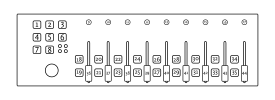

Icon iControls
==============

`Manufacturer's product page <https://iconproaudio.com/product/icontrols/>`_ ·
`Forum thread <https://mixxx.discourse.group/t/icon-pro-audio-icontrols/31593>`_

.. versionadded:: 2.5.1

Overview
--------

The iControls has 9 faders and rotary encoders, a set of 8 transport buttons,
and 2 buttons per fader.
There is also a joystick on the left side of the controller that acts as a
mouse.

.. note:: The iControls technically supports 4 layers, but only layer 1 is
   distinguishable from the other layers in the default configuration, so only
   layer 1 is currently mapped.

Rotary Encoders
---------------

.. csv-table::
   :header: "Control", "Name", "Function"
   :widths: 5 25 70

   "9–12", ":hwlabel:`e1`–:hwlabel:`e4`", "Deck pregain"
   "13–16", ":hwlabel:`e5`–:hwlabel:`e8`", "Effect super knob"
   "17", ":hwlabel:`e9`", "Main gain"

Faders
------

.. csv-table::
   :header: "Control", "Name", "Function"
   :widths: 5 25 70

   "36–39", ":hwlabel:`f1`–:hwlabel:`f4`", "Deck volume"
   "40–43", ":hwlabel:`f5`–:hwlabel:`f8`", "Deck tempo"
   "44", ":hwlabel:`f9`", "Cross fader"
   "18", "—", "Deck 3 Slip Mode"
   "19", "—", "Deck 3 PFL"
   "20", "—", "Deck 1 Slip Mode"
   "21", "—", "Deck 1 PFL"
   "22", "—", "Deck 2 Slip Mode"
   "23", "—", "Deck 2 PFL"
   "24", "—", "Deck 4 Slip Mode"
   "25", "—", "Deck 4 PFL"
   "26", "—", "Deck 3 Quick Effect Enabled"
   "27", "—", "Deck 3 Quick Effect Select"
   "28", "—", "Deck 1 Quick Effect Enabled"
   "29", "—", "Deck 1 Quick Effect Select"
   "30", "—", "Deck 2 Quick Effect Enabled"
   "31", "—", "Deck 2 Quick Effect Select"
   "32", "—", "Deck 4 Quick Effect Enabled"
   "33", "—", "Deck 4 Quick Effect Select"
   "34", "—", "Select deck 1"
   "34 (long press)", "—", "Select deck 3"
   "35", "—", "Select deck 2"
   "35 (long press)", "—", "Select deck 4"

Transports
----------

The transport buttons currently only affect deck 1 due to limitations in the
default controller layout.

.. csv-table::
   :header: "Control", "Name", "Function"
   :widths: 5 25 70

   "1", ":hwlabel:`⏪`", "Beatjump backwards"
   "2", ":hwlabel:`⏵`", "Play/pause playback"
   "3", ":hwlabel:`⏩`", "Beatjump forwards"
   "4", ":hwlabel:`🔁`", "Toggle a beat loop"
   "5", ":hwlabel:`⏹`", "If track is playing: stops the track and resets position to the main cue point

   If playback is stopped: sets the main cue point"
   "5", ":hwlabel:`⏹` (hold)", "Play the track from main cue point, release to stop playback and return to the main cue point. Playback must be initially stopped on the main cue point."
   "6", ":hwlabel:`⏺`", "Toggle recording the mix"
   "7", ":hwlabel:`-`", "Hardware layer select (not used by Mixxx)"
   "8", ":hwlabel:`+`", "Hardware layer select (not used by Mixxx)"

.. hint::
   The actual behavior of CUE and Play/Pause buttons depends on Mixxx settings. See :ref:`interface-cue-modes` for more info.
