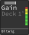

Icon P1-Nano
============

`Manufacturer's product page <https://iconproaudio.com/product/p1-nano/>`_ ·
`Forum thread <https://mixxx.discourse.group/t/icon-pro-audio-p1-nano/31630>`_

.. versionadded:: 2.5.3

Overview
--------

The P1-Nano by Icon Pro Audio is similar to their larger controllers, but the 8
available faders have been combined into virtual faders that operate a single
motorized physical fader.

.. note:: Device support was tested with the Icon P1-Nano, but may also work
   with the larger Icon P1-X/P1-M, or any device that supports the Mackie
   Control Protocol, but this has not been tested.

Parameter Knobs and Screens
---------------------------

The P1-Nano has 8 rotary encoders, each of which is mapped to a different
parameter.
The name, channel, and value of each parameter is shown on the screen below the
encoders.

The top of the screen contains a value bar with a center indicator that will
turn blue if the bar is centered, followed by the parameter being adjusted.
Under that is the deck that the parameter will be applied to.
Turning one of the rotary encoders toggles the on-device screen to show the
parameter being adjusted.

To the right hand side of each screen is a vumeter for the deck associated with
the screen.

Mixxx also supports using the external
`D-5 <https://iconproaudio.com/product/d5/>`_ extension screens and displays
additional information such as each decks beats per minute when they are used.
If the D-5 is installed, the value of each parameter is shown on the screen
above the encoder that controls that parameter (in addition to the on-device
screen just as when the D-5 is not installed).

The text at the bottom of the screen is the selected
:term:`Digital Audio Workstation` (DAW).
The default DAW is Bitwig and the name cannot be changed without using Icon's
proprietary configuration tool, however Mixxx will work fine with the default
Bitwig configuration.

The following parameters are available and may be changed by activating the
shift functionality by pressing the :hwlabel:`Flip` button and then turning the
encoder to the desired parameter. Pressing the knob always resets the parameter
to default (normally centered).

- Pregain
- EQ High
- EQ Mid
- EQ Low
- Quick Effect Super Knob

Timecode Display
----------------

Underneath the rotary encoders is a timecode display comprising 10 individual
7-segment displays.

This displays the time elapsed, time remaining, or (with lesser resolution) both
the elapsed and remaining time of the currently selected deck.
The value displayed cannot be changed on the controller itself, but mirrors the
time remaining display in the main Mixxx user interface which can be changed by
clicking on it to cycle through the various modes.

The display does not mirror the format used by Mixxx and always uses MM.SS.ss
format (minutes, seconds, and milliseconds separated by a dot) or MM.SS if both
the elapsed and remaining times are visible at once.

DAW Buttons
-----------

The :term:`DAW` selection buttons to the right of the timecode display are
labeled :hwlabel:`1`, :hwlabel:`2`, and :hwlabel:`3` and select a pre-loaded
configuration.
The default value for DAW 1 is Bitwig, and this is the configuration that should
be selected for use with Mixxx.

Below this is a large group of buttons for DAW control including Read, Write,
Touch, latch, Trim, Off, and a collection of touch screen buttons.
It is possible to configure these for use with Mixxx using Icon's proprietary
software, but because the defaults aren't broadly useful and there is no way for
Mixxx to reconfigure them, they are unmapped.

Faders
------

The P1-Nano has 9 virtual faders that are mapped to a single physical fader on
the left side of the controller.
The first 8 virtual faders may be selected with the :hwlabel:`|<` :hwlabel:`>|`
buttons.
The 9th is a special fader that controls the main output. It can be selected
with the :hwlabel:`Master` button.
The other 4 virtual faders are currently unused.

.. csv-table::
   :header: "Fader", "Flip", "Channel", "Control"
   :widths: 5, 5, 25, 25

   "F1", "Off", "Deck 3", "Volume"
   "F2", "Off", "Deck 1", "Volume"
   "F3", "Off", "Deck 2", "Volume"
   "F4", "Off", "Deck 4", "Volume"
   "F1", "On", "Deck 3", "Tempo [#]_"
   "F2", "On", "Deck 1", "Tempo"
   "F3", "On", "Deck 2", "Tempo"
   "F4", "On", "Deck 4", "Tempo"
   "Master", "–", "Master", "Gain [#]_"

.. [#] The zero value of the tempo faders is in the middle of the controller.
.. [#] Because the master fader controls gain and not volume, the zero value is
   not at the bottom of the fader, instead it corresponds to the marked zero
   value on the side of the fader at about 75% of the way up the track. This
   value represents 0dB and going above it is not recommended.

Deck Buttons
------------

The buttons in two columns to the right of the fader control the active deck and
parameter screens.

.. csv-table::
   :header: "Function", "Name", "Description"
   :widths: 5, 25, 70

   "Up", ":hwlabel:`🢑`", "Show previous screen"
   "Down", ":hwlabel:`🢓`", "Show next screen"
   "Mute", ":hwlabel:`M`", "Mute the active deck"
   "Solo", ":hwlabel:`S`", "Move beatgrid to current position"
   "Record Arm", ":hwlabel:`⏺`", "BPM tap"
   "Shift", ":hwlabel:`Flip`", "Toggle shift mode for all controls"
   "Main", ":hwlabel:`Master (PT-Ctrl)`", "Toggle the screen and fader to the

   main channel gain/vumeter."
   "Circles", "–", "The circle buttons are not mappable and control the touch

   screen controls."
   "Lock", ":hwlabel:`🔓`", "Lock/unlock the fader"
   "<<8", ":hwlabel:`<<8`", "Unused"
   "8>>", ":hwlabel:`8>>`", "Unused"
   "Prev. Channel", ":hwlabel:`|<`", "Select the previous channel"
   "Next. Channel", ":hwlabel:`>|`", "Select the next channel"

Transports
----------

The transport buttons along the bottom affect only the currently selected deck,
with the exception of "record" which toggles recording of the mix.

.. csv-table::
   :header: "Function", "Name", "Description"
   :widths: 5 25 70

   "Rewind", ":hwlabel:`⏪`", "Beatjump backwards"
   "Fastforward", ":hwlabel:`⏩`", "Beatjump forwards"
   "Loop", ":hwlabel:`↩`", "Toggle the beatloop"
   "Cue", ":hwlabel:`⏹`", "If track is playing: stops the track and resets position to the main cue point

   If playback is stopped: sets the main cue point"
   "Cue", ":hwlabel:`⏹` (hold)", "Play the track from main cue point, release to stop playback and return to the main cue point. Playback must be initially stopped on the main cue point."
   "Play/Pause", ":hwlabel:`⏵`", "Play/pause playback"
   "Record", ":hwlabel:`⏺`", "Toggle recording the mix"

.. hint::
   The actual behavior of CUE and Play/Pause buttons depends on Mixxx settings. See :ref:`interface-cue-modes` for more info.

Navigation
----------

Below the transport buttons is a jog wheel and various navigation buttons.

.. note:: Currently Mixxx must be focused for the library navigation buttons to
   have any effect. This is an open issue that will be addressed in a future
   version of Mixxx.

.. csv-table::
   :header: "Function", "Name", "Function"
   :widths: 30 10 60

   "Jog Wheel (deck playing)", "–", "Speed up / slow down the track"
   "Jog Wheel (deck paused)", "–", "Seek in the track"
   "Jog Wheel (push)", "–", "Select item (load track, expand selected menu, etc.)"
   "Move", ":hwlabel:`🢑🢓`", "Change the jog wheel to scroll up and down

   in the focused view."
   "Shuffle", ":hwlabel:`🢐🢒`", "Change the jog wheel to move left and

   right in the focused view."
   "Navi (illuminated)", ":hwlabel:`Navi`", "Change the jog wheel to send a keyboard

   left/right arrow press and release signal."
   "Navi (blinking)", ":hwlabel:`Navi`", "Change the active fader (same as the

   :hwlabel:`|<` and :hwlabel:`>|` buttons)."
   "Focus", ":hwlabel:`Focus`", "Change the jog wheel to send a mouse wheel

   scroll signal."
   "Zoom Left/Right", ":hwlabel:`🢐🢒`", "Change the jog wheel to move the cross fader."
   "Zoom Up/Down", ":hwlabel:`🢑🢓`", "Change the jog wheel to select the focused

   library pane."

Mapping options
---------------

Settings can be edited in the preference windows, under :guilabel:`Preferences`
> :guilabel:`Controllers` > :guilabel:`iCON P1-Nano ...`.

.. csv-table::
   :header: "Setting", "Description"
   :widths: 30 70

   "Disable VuMeters", "Disables the on-screen volume meters."
   "Disable Timecode Display", "Disable the 7-segment timecode display."
   "Blink record arm button on beat", "Blinks the BPM tap button on the beat."
