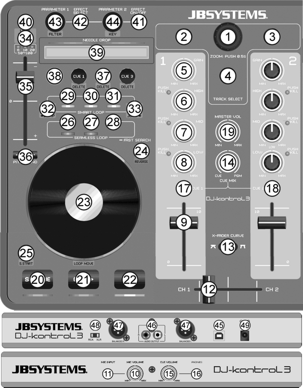

# JB Systems dj-kontrol 3

  - [Manufacturer's product page](https://jb-systems.eu/de/dj-kontrol-3)
  - [Forum thread (Mapping
    Download)](https://www.mixxx.org/forums/viewtopic.php?f=7&t=9281)

This DJ controller includes a 2 channel sound card with balanced XLR
outputs (+ unbalanced RCA) and a microphone input. This controller works
with USB cable connected only, but for better stability, it's recommend
to use the external 5V 1A Poweradapter as well.

## Usage

Download the Mapping .zip file from the Forum Thread (above), unzip it
and copy the two files (.js / .xml) to your Mixxx controllers folder.

  - Linux: \~/.mixxx/controllers
  - Windows: %USERPROFILE%\\Local Settings\\Application
    Data\\Mixxx\\controllers
  - Mac OS X: \~/Library/Application Support/Mixxx/controllers

Start Mixxx

  - On some Linux systems, Pulseaudio blocks the driver for Mixxx, so
    you have to start Mixxx via Terminal with:
  - pasuspender mixxx

In Mixxx goto:

1.  Options-\>Preferences-\>Sound Hardware:

<!-- end list -->

  - Sound API: ALSA
  - Sample Rate: 48000Hz
  - Output / Master / JB Systems DJ-Kontrol 3: USB Audio / Channels 3 -
    4
  - Output / Headphones / JB Systems DJ-Kontrol 3: USB Audio / Channels
    1 - 2

<!-- end list -->

1.  Options-\>Preferences-\>Controllers:

<!-- end list -->

  - check: Enabled
  - Load Preset for this controller

Now the controller should work with Mixxx\!

## Mapping

1.  Select Knop
2.  Load to Deck 1
3.  Load to Deck 2
4.  Back
5.  Deck Gain
6.  EQ High
7.  EQ Mid
8.  EQ Low
9.  Deck Volume Fader
10. Mic Volume
11. Mic Input
12. Crossfader
13. Crossfader Curve Select
14. CUE Mix
15. CUE Volume
16. Headphones Output
17. CUE Pre-fader listening (Pfl) Deck 1
18. CUE Pre-fader listening (Pfl) Deck 2
19. Master (Output) Volume
20. Set Cue
21. Cue
22. Play/Pause
23. Jogwheel
24. Scratch
25. SYNC
26. Loop In
27. Loop Out (Exit)
28. Reloop
29. 2-Beat Loop
30. 4-Beat Loop
31. 8-Beat Loop
32. Halve Loop
33. Double Loop
34. Pitch range
35. Speed-/Pitch Fader
36. Pitch Bend +/-
37. Hot-Cue, delete on shift mode
38. Shift Mode
39. Needle Drop Sensor
40. Key
41. Effect on/off
42. Effect select
43. Effect Parameter 1
44. Effect Parameter 2
45. USB Port
46. RCA unbalanced output
47. XLR balanced output
48. Switch between XLR/RCA
49. external Power-plug port

-----

### Jogwheel functions

  - Scratch Mode On: touched on top scratch
  - Scratch Mode On: touched on side pitchbend
  - Scratch Mode Off: always pitchbend
  - Shift Mode On: Loop Move

### Special features

  - Parameter 1 Knob is mapped to dry/wet
  - Parameter 1 Shift Knob (Filter) is mapped as Super Knob
  - Parameter 2 Knob is mapped to the first setting of the selected
    effect
  - Pitch Fader are inverted (up = + , down = -)
  - Shift Btn is mapped as toggle (press to activate, press again to
    deactivate)
  - Shift + Set Cue = SpinBack
  - Shift + 2 / 4 / 8 = Play Sampler 1 / 2 / 3

