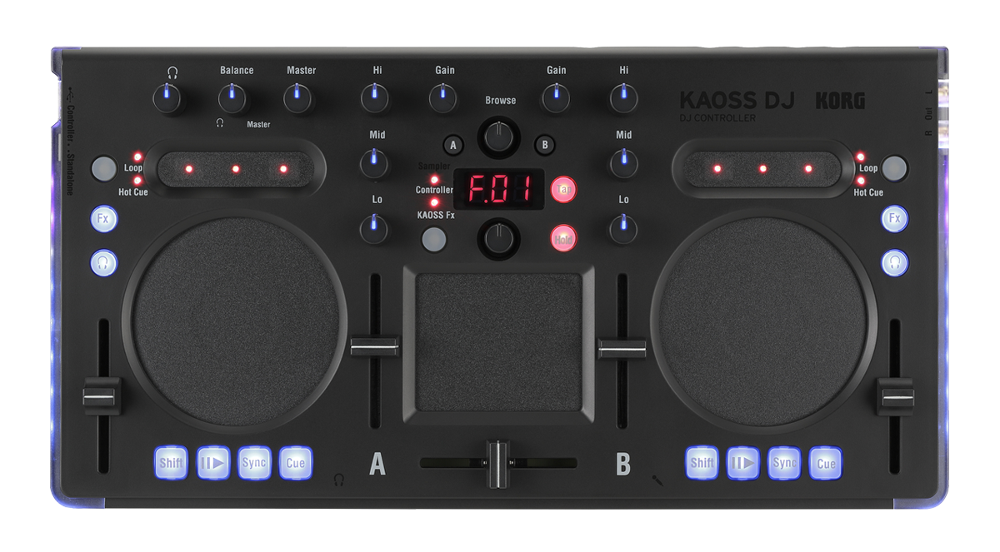

Korg Kaoss DJ controller
========================

2-deck controller with touch controlled jogwheels, built-in 4-channel soundcard and a Korg Kaoss Pad as built-in effect section (can be switched off for using software effects).

-  `Manufacturer’s product page <http://www.korg.com/uk/products/dj/kaoss_dj/>`__
-  `Forum thread <https://mixxx.discourse.group/t/korg-kaoss-dj-midi-mapping-help/16093>`__
-  `Pull request on Github <https://github.com/mixxxdj/mixxx/pull/1509>`__

macOS: Please note that the Korg Kaoss DJ is only supported until `macOS Monterey <https://www.korg.com/download/global/support/os/pdf/mac_compatibilitychart_KORG_en.pdf>`__

.. versionadded:: 2.1

Mapping
-------

   Korg Kaoss DJ (schematic view)

+-----+------------------------------+------------------------------------------------------------+---------------------------------------------+
| No. | Name                         | Function                                                   | Shifted Operation                           |
+=====+==============================+============================================================+=============================================+
| 1   | Headphone knob               | Adjusts the headphone level                                |                                             |
+-----+------------------------------+------------------------------------------------------------+---------------------------------------------+
| 2   | Balance knob                 | Adjusts the balance between the master level               |                                             |
|     |                              | and the headphone monitor level                            |                                             |
+-----+------------------------------+------------------------------------------------------------+---------------------------------------------+
| 3   | Master knob                  | Adjust the master volume level                             |                                             |
+-----+------------------------------+------------------------------------------------------------+---------------------------------------------+
| 4   | Browse knob                  | Selects a song from the library                            | Moves between levels (TODO)                 |
+-----+------------------------------+------------------------------------------------------------+---------------------------------------------+
| 5   | Display                      | Indicates the effect number or parameter                   | Indicates the key or scale                  |
+-----+------------------------------+------------------------------------------------------------+---------------------------------------------+
| 6   | Touchpad Mode Button         | Switches the touchpad between the Controller,              |                                             |
|     |                              | KAOSS Effect, and Sampler modes (long press for blue LED)  |                                             |
+-----+------------------------------+------------------------------------------------------------+---------------------------------------------+
| 7   | Program/Value Knob           | Selects an effect                                          | Selects a key, selects a scale              |
+-----+------------------------------+------------------------------------------------------------+---------------------------------------------+
| 8   | Tap Button                   | | Sets the tempo                                           | Key setting mode                            |
|     |                              | | Long-press this button to access the auto BPM function   |                                             |
+-----+------------------------------+------------------------------------------------------------+---------------------------------------------+
| 9   | Hold Button                  | Enables/disables the touchpad’s hold function              | Scale setting mode                          |
+-----+------------------------------+------------------------------------------------------------+---------------------------------------------+
| 10  | Touchpad (controller mode)   | | Controls the effects of the DJ software.                 | Adjusts the Beats Multiplier (TODO)         |
|     |                              | | The vertical axis controls the mix (dry/wet) knob.       |                                             |
|     |                              | | The horizontal axis controls the super knob.             |                                             |
+-----+------------------------------+------------------------------------------------------------+---------------------------------------------+
|     | Touchpad (Kaoss Effect mode) | Controls the KAOSS effect                                  | Adjusts the depth of the KAOSS Effect       |
+-----+------------------------------+------------------------------------------------------------+---------------------------------------------+
|     | Touchpad (sampler mode)      | Controls the sampler function of the DJ software           |                                             |
+-----+------------------------------+------------------------------------------------------------+---------------------------------------------+
| 11  | Crossfader                   | Adjusts the balance between Decks A and B                  |                                             |
+-----+------------------------------+------------------------------------------------------------+---------------------------------------------+
| 12  | Touch Slider mode button     | Switches between the three touch slider mode               |                                             |
+-----+------------------------------+------------------------------------------------------------+---------------------------------------------+
| 13  | Touch Slider (Normal mode)   | | Left Side: Nudges (pitch -)                              | Moves to the specified position in the song |
|     |                              | | Center: Enables the touch wheel's Scratch mode           | (slider)                                    |
|     |                              | | Right Side: Nudges (pitch +)                             |                                             |
+-----+------------------------------+------------------------------------------------------------+---------------------------------------------+
|     | Touch Slider (Hot Cue mode)  | | Left Side: Sets Hot Cue 1, and moves to Hot Cue 1        | | Deletes Hot Cue 1                         |
|     |                              | | Center: Sets Hot Cue 2, and moves to Hot Cue 2           | | Deletes Hot Cue 2                         |
|     |                              | | Right Side: Sets Hot Cue 3, and moves to Hot Cue 3       | | Deletes Hot Cue 3                         |
+-----+------------------------------+------------------------------------------------------------+---------------------------------------------+
|     | Touch Slider (Loop mode)     | | Left Side: Auto Loop × 1/2                               | | Sets the Loop In point                    |
|     |                              | | Center: Loop on/off                                      | | Auto Loop × 1                             |
|     |                              | | Right Side: Auto Loop × 2                                | | Sets the Loop Out point                   |
+-----+------------------------------+------------------------------------------------------------+---------------------------------------------+
| 14  | EQ                           | | Boosts or Cuts the Hi EQ                                 |                                             |
|     |                              | | Boosts or Cuts the Mid EQ                                |                                             |
|     |                              | | Boosts or Cuts the Lo EQ                                 |                                             |
+-----+------------------------------+------------------------------------------------------------+---------------------------------------------+
| 15  | Gain knob                    | Adjusts the gain                                           |                                             |
+-----+------------------------------+------------------------------------------------------------+---------------------------------------------+
| 16  | Load button                  | Loads the song into the selected deck                      |                                             |
+-----+------------------------------+------------------------------------------------------------+---------------------------------------------+
| 17  | Fx button                    | | Left: FX1 rack mix knob can be manipulated when enabled  |                                             |
|     |                              | | Right: FX2 rack mix knob can be manipulated when enabled |                                             |
+-----+------------------------------+------------------------------------------------------------+---------------------------------------------+
| 18  | Headphone cue button         | Turns the headphone monitor on/off                         | Switches the function of the level meter    |
|     |                              |                                                            | between Deck A/B and the Master level       |
+-----+------------------------------+------------------------------------------------------------+---------------------------------------------+
| 19  | Touch wheel                  | Scratches (in scratch mode) or adjusts the                 | Search function (in scratch mode) or moves  |
|     |                              | pitch                                                      | beatgrid                                    |
+-----+------------------------------+------------------------------------------------------------+---------------------------------------------+
| 20  | Pitch fader                  | Adjusts the pitch                                          |                                             |
+-----+------------------------------+------------------------------------------------------------+---------------------------------------------+
| 21  | Level meter                  | Indicates the input level to deck A/B or the master level  |                                             |
+-----+------------------------------+------------------------------------------------------------+---------------------------------------------+
| 22  | Shift button                 | Holding this button provides access to the                 |                                             |
|     |                              | controllers SHIFT functions                                |                                             |
+-----+------------------------------+------------------------------------------------------------+---------------------------------------------+
| 23  | Play / pause button          | Starts/pauses the song                                     | Key Lock On/Off                             |
+-----+------------------------------+------------------------------------------------------------+---------------------------------------------+
| 24  | Sync button                  | Synchronizes the tempo of Deck A and Deck B                | Cancels tempo synchronization               |
+-----+------------------------------+------------------------------------------------------------+---------------------------------------------+
| 25  | Cue button                   | Sets the cue point or moves to the cue point               | Returns to the beginning of the song.       |
+-----+------------------------------+------------------------------------------------------------+---------------------------------------------+
| 26  | Level fader                  | Adjusts the level of deck A/B                              |                                             |
+-----+------------------------------+------------------------------------------------------------+---------------------------------------------+
