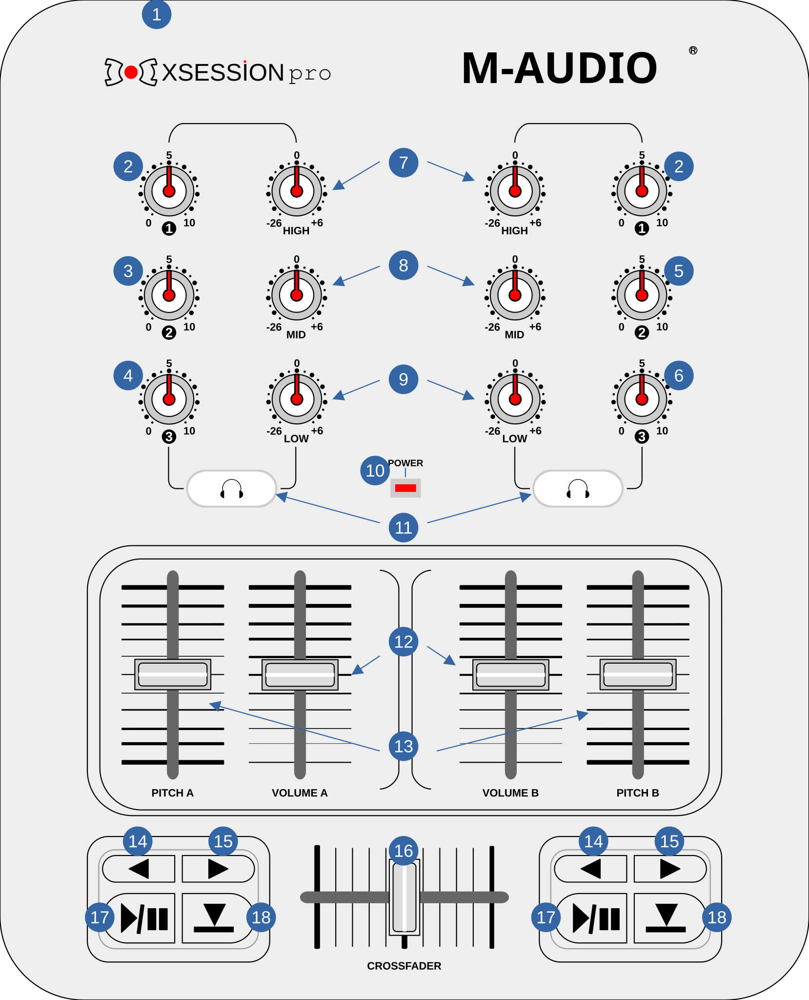

# M-Audio X-Session Pro

The **M-Audio XSession Pro** is a versatile USB [MIDI](https://manual.mixxx.org/2.5/en/glossary#term-MIDI) controller that offers a layout similar to a mixer while also allowing for some transport control.

There aren't many DJ MIDI controllers that offer an independent mixer control layout, and the M-Audio XSession Pro stands out as one of the few that can both be used as a standalone 2-channel mixer with beatmatching and transport controls, or be mapped as a 4-channel mixer to be fit in a modular setup (in conjunction with more controllers).

- The X-Session Pro controller offers the following controls:
  - 12 knobs (6 with midpoint detent)
  - 4 vertical faders
  - 1 horizontal fader
  - 10 buttons

The M-Audio XSession Pro is a USB MIDI Class compliant device and works with Linux, macOS, and Windows.


:::{note}
This manual page shows how this controller works as it is currently mapped as a 2x Channel (ch1 & ch2) controller in [Mixxx](https://mixxx.org/download/). but it can be remapped by using the **Learning Wizard** in **Options** -> **Preferences** -> **Controllers** -> select **USB X-Session MIDI 1**.
:::

## Controller Layout

```{list-table}
:header-rows: 1
:align: center

* - Number
  - Control
  - Function
* - **1**
  - {hwlabel}`USB-B`
  - A USB Type B port, for power and data connection, and a power switch.
* - **2**
  - {hwlabel}`GAIN`
  - Gain control knobs for each Deck.
* - **3**
  - {hwlabel}`Headphone Mix`
  - Crossfades the Headphone Output between the Main Output and the Pre-Fader Listening(PFL).
* - **4**
  - {hwlabel}`Headphone Gain`
  - Adjusts the Headphone Output gain.
* - **5**
  - {hwlabel}`BALANCE`
  - Adjusts the left/right channel balance of the Main Output.
* - **6**
  - {hwlabel}`MAIN GAIN`
  - Adjusts the Main Output Gain.
* - **7**
  - {hwlabel}`HIGH EQ`
  - Controls the High Equalization Band for each channel.
* - **8**
  - {hwlabel}`MID EQ`
  - Controls the Middle Equalization Band for each channel.
* - **9**
  - {hwlabel}`LOW EQ`
  - Controls the Low Equalization Band for each channel.
* - **10**
  - {hwlabel}`POWER LED`
  - Lights up when the USB cable is connected and the power switch in ON.
```



```{list-table}
:header-rows: 1
:align: center

* - Number
  - Control
  - Function

* - **11**
  - {hwlabel}`Headphone`
  - Sends the channel's audio to the headphone output.
* - **12**
  - {hwlabel}`VOLUME CONTROL`
  - Adjusts the Volume of each channel.
* - **13**
  - {hwlabel}`SPEED CONTROL`
  - Adjusts the track's playback speed on each channel.
* - **14**
  - {hwlabel}`FAST REWIND`
  - While pressed, plays the track in reverse at a fast speed on each channel.
* - **15**
  - {hwlabel}`FAST FORWARD`
  - While pressed, plays the track at a fast speed on each channel.
* - **16**
  - {hwlabel}`CROSSFADER`
  - Determines the main output by fading between the left and the right channel.
* - **17**
  - {hwlabel}`PLAY/PAUSE`
  - Plays or Pauses the track on each channel.
* - **18**
  - {hwlabel}`CUE`
  - Sets the cue point or moves to the main cue point and stops. See options at **Preferences** > **Deck** > **Cue mode**.
```

:::{note}
This device has been discontinued. M-Audio discontinued its DJ products after the company was bought by inMusic in 2012.
:::
:::{versionadded} 1.6
:::
