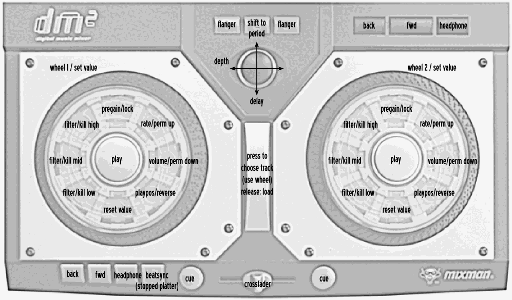

# Mixman DM2


-  [Manufacturer’s product page](https://web.archive.org/web/20070811232655/http://www.mixman.com/products/dm2.html) (archived)

:::{versionadded} 1.7
:::
```{figure-md}
:align: center




Mixman DM2 (schematic view)
```
:::{note}
Unfortunately a detailed description of this controller mapping is still missing.
If you own this controller, please consider
[contributing one](https://github.com/mixxxdj/mixxx/wiki/Contributing-Mappings#user-content-documenting-the-mapping).
:::
