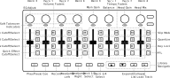

M-Vave SMC-Mixer
================

`Manufacturer's product page <https://www.cuvave.com/productinfo/1106102.html>`_ ·
`Forum thread <https://mixxx.discourse.group/t/m-wave-sinco-smc-mixer-radio-broadcast-mapping/30366>`_

.. versionadded:: 2.5.1

Overview
--------

See the tables below for controls descriptions.

.. note:: The mixer can be connected over Bluetooth, USB-C, or both. For use with Mixxx it is recommended to disable Bluetooth and connect only via USB-C.

Deck and EQ
-----------

On the left side of the controller each set of a fader, rotary encoder, and
buttons affect a single deck starting with 3 on the left, then 1, 2, and finally
deck 4.

..

.. csv-table::
   :header: "Control", "Name", "Function"
   :widths: 5 25 70

   "Knob", "(rotate)", "Adjust selected function (defaults to channel gain)"
   "Treble", ":hwlabel:`M` (press)", "Toggle high filter cutoff"
   "Treble", ":hwlabel:`M` (long press)", "Toggle knob between gain and high filter"
   "Mid", ":hwlabel:`S` (press)", "Toggle mid filter cutoff"
   "Mid", ":hwlabel:`S` (long press)", "Toggle knob between gain and mid filter"
   "Bass", ":hwlabel:`R` (press)", "Toggle low filter cutoff"
   "Bass", ":hwlabel:`R` (long press)", "Toggle knob between gain and low filter"
   "Quick Effect", ":hwlabel:`□` (press)", "Toggle quick effect rack"
   "Quick Effect", ":hwlabel:`□` (long press)", "Toggle knob between gain and quick effect"
   "LEDs", "", "Blinks when the hardware control does not match the software control and soft takeover is enabled"
   "Faders", "", "Adjust volume level"

Beat Grid
---------

The right hand side of the controller is mapped to controls relating to the
tempo and beat grid.
Each set of controls is mapped to one deck and follows the same order (3, 1, 2,
4) as the left side controls.
The only exception is the rotary encoders, which are mapped separately as
described below.

.. csv-table::
   :header: "Control", "Name", "Function"
   :widths: 5 25 70

   "Slip", ":hwlabel:`M`", "Toggle slip mode"
   "Quantize", ":hwlabel:`S`", "Toggle quantize mode"
   "Key Lock", ":hwlabel:`R`", "Toggle the key lock"
   "Cue", ":hwlabel:`□`", ":term:`Headphone button` / PFL. Toggle sending channel to the cue (headphone) channel"
   "LEDs", "", "Blinks when the hardware control does not match the software control and soft takeover is enabled"
   "Faders", "", "Adjust track tempo"

Transports
----------

The transport buttons along the bottom affect only the currently selected deck,
with the exception of "record" which toggles recording of the mix and the
navigation buttons which always affect the library view.

.. note:: Currently Mixxx must be focused for the library navigation buttons to
   have any effect. This is an open issue that will be addressed in a future
   version of Mixxx.

.. csv-table::
   :header: "Function", "Name", "Function"
   :widths: 5 25 70

   "Play/Pause", ":hwlabel:`⏵`", "Play/pause playback"
   "Cue", ":hwlabel:`⏸`", "If track is playing: stops the track and resets position to the main cue point

   If playback is stopped: sets the main cue point"
   "Cue", ":hwlabel:`⏸` (hold)", "Play the track from main cue point, release to stop playback and return to the main cue point. Playback must be initially stopped on the main cue point."
   "Record", ":hwlabel:`⏺`", "Toggle recording the mix"
   "Rewind", ":hwlabel:`⏪`", "Beatjump backwards"
   "Fastforward", ":hwlabel:`⏩`", "Beatjump forwards"
   "Deck 1",  ":hwlabel:`«`", "Select deck 1"
   "Deck 3",  ":hwlabel:`«` (hold)", "Select deck 3"
   "Deck 2",  ":hwlabel:`»`", "Select deck 2"
   "Deck 4",  ":hwlabel:`»` (hold)", "Select deck 4"
   "Up",  ":hwlabel:`▲`", "Navigate up in selected library pane"
   "Down",  ":hwlabel:`▼`", "Navigate down in selected library pane"
   "Left", ":hwlabel:`◀` (tracks pane focused)", "Navigate to library sidebar"
   "Left", ":hwlabel:`◀` (sidebar focused)", "Expand/collapse selected list"
   "Right", ":hwlabel:`▶` (sidebar focused)", "Navigate to library tracks view"
   "Right", ":hwlabel:`▶` (tracks pane focused)", "Load track to first available deck"

.. hint::
   The actual behavior of CUE and Play/Pause buttons depends on Mixxx settings. See :ref:`interface-cue-modes` for more info.

Knobs
-----

The four right most rotary encoders are not mapped to individual decks.
Instead they control global mixer values.

.. csv-table::
   :header: "Control", "Name", "Function"
   :widths: 5 25 70

   "Main Gain",  "", "Adjust the volume level of :term:`master output`."
   "Balance",  "", "Adjust the output balance"
   "Cue Gain",  "", "Adjust the headphone volume"
   "Cue Mix",  "", ":term:`Head/mix knob<Head/mix button>`. Adjust the dry/wet output to the headphones, mixing between the cue output and the main mix output"
