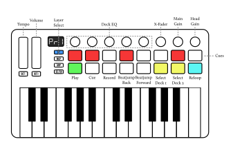

M-Vave SMK-25 II
================

`Manufacturer's product page <https://www.cuvave.com/productinfo/1106099.html>`_ ·
`Forum thread <https://mixxx.discourse.group/t/sinco-m-vave-smk-25-ii/31350>`_

.. versionadded:: 2.5.1

Overview
--------

.. note:: The controller can be connected over Bluetooth, USB-C, or both. For
   use with Mixxx it is recommended to disable Bluetooth and connect only via
   USB-C [#]_.

The M-Vave SMK-25 II is mapped for Mixxx use as a 2-deck controller with two
distinct layers for playing samples and for controlling the deck.
On both layers, the touch strips and rotary encoders are mapped as follows:

.. csv-table::
   :header: "#", "Name", "Function"
   :widths: 5 25 70

   "MCP", ":hwlabel:`MCP`", "Switch between layers"
   "Left Strip", "", "Change the tempo of the selected deck (will return to normal on release)"
   "Right Strip", "", "Change the tempo volume of the selected deck"
   "Knob 1", ":hwlabel:`MODE`", "Set selected deck gain"
   "Knob 2", ":hwlabel:`OCT`", "Selected deck high filter"
   "Knob 3", ":hwlabel:`LATCH`", "Selected deck mid filter"
   "Knob 4", ":hwlabel:`GATE`", "Selected deck low filter"
   "Knob 5", ":hwlabel:`SWING`", "Selected deck quick effect"
   "Knob 6", ":hwlabel:`TEMPO`", "Crossfader"
   "Knob 7", ":hwlabel:`RATE`", "Main gain"
   "Knob 8", ":hwlabel:`TRANSPOSE`", "Cue (headphone) gain"

Sampler Layer
-------------

The first layer (MCP button unlit, pads lit teal and pink) maps the drum pads to
Samples 1–16.

.. figure:: ../../_static/controllers/mvave-smk-25-ii_layer1.svg
   :align: center
   :width: 100%
   :figwidth: 100%
   :alt: M-Vave SMC-Mixer Layer 1
   :figclass: pretty-figures

Deck Layer
----------

The second layer (MCP button lit, left and right pads lit in yellow and undo pad
lit in teal) maps the top row of drum pads to cues 1—8 and the bottom row to
transport controls and deck switching, as follows:

.. csv-table::
   :header: "Action", "Name", "Function"
   :widths: 15 10 70

   "Play", ":hwlabel:`⏵`", "Play/pause playback"
   "Pause", ":hwlabel:`⏸`", "If track is playing: stops the track and resets position to the main cue point

   If playback is stopped: sets the main cue point"
   "Pause", ":hwlabel:`⏸` (hold)", "Play the track from main cue point, release to stop playback and return to the main cue point. Playback must be initially stopped on the main cue point."
   "Record", ":hwlabel:`⏺`", "Toggle recording the mix"
   "Rewind", ":hwlabel:`⏪`", "Beatjump backwards"
   "Fastforward", ":hwlabel:`⏩`", "Beatjump forwards"
   "Deck 1",  ":hwlabel:`◀`", "Select deck 1"
   "Deck 2",  ":hwlabel:`▶`", "Select deck 2"
   "Reloop",  ":hwlabel:`UNDO`", "Activate/deactivate the previously active loop"

.. [#] Bluetooth is not as reliable as a wired connection for live
   performances, and may result in less smooth fader operation and higher
   latencies.
